# Ambiente Kong API Gateway

Ambiente de execucao do Kong API Gateway usando ferramenta docker-compose

## Ferramentas necessarias
* docker
* docker-compose
* editor *.yaml


## Ferramentas que serao provisionadas usando o docker-compose
* Fluent-Bit
* Kibana
* ElasticSearch
* Jaeger
* Grafana
* Prometheus
* Prometheus Node Exporter

### Arquivos de configuracao fluent-bit

Na pasta [fluent-bit](compose/fluent-bit) contem os arquivos necessarios para configuracao da ferramenta, o docker-compose utilizara esta pasta para montar as configuracoes


### Arquivos de configuracao prometheus

Na pasta [prom-conf](compose/prom-conf) contem os arquivos necessarios para configuracao do prometheus, inclusive a configuracao de _scraping_ das metricas do Kong API Gateway


## Rodando

Na pasta raiz do projeto voce pode executar

```shell
docker-compose -f compose/kong_compose.yml up -d
```

# Class Notes

# Conceitos Basicos
## APIs
API é um conjunto de operaçoes bem definidas com objetivo deoferecer aos seus consumidores um serviço, produto ou uma integraçao

Na pratica o consumidor de uma API utiliza o serviço sem a necessidade de entender os detalhes de implementaçao, essa é uma caracteristica que deve ser presevada 

API ẽ uma camada de abstraçao

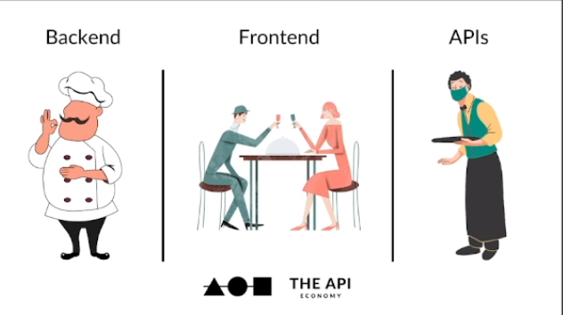

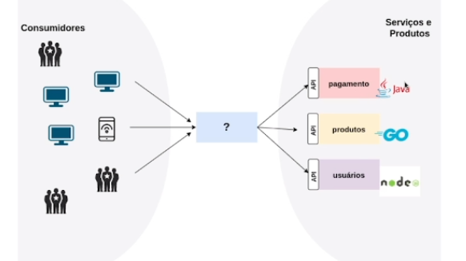


API proposrciona um crescimento exponencial para empresas! Documentaçao garante integraçao entre sistemas.

Qunto maior a facilidade de adesao, mais sucesso, mais dinheiro, mais negocios

API Rest
Durante esse modulo usaremos o modelo de arquitetura de API REST

A implementaçao mais comum encontrada no mercado é a utilizaçao do modelo aqrquitetura REST + JSON para trafego de dados

Criaçao -> Post, Status COde etc

Devem ser faceis de consumidadas por devs.


## O que éAPI Gateway
API Gateway Pattern: Em um modelo que implementa uma padrao de arquitetura de microsserviços, como os clientes vao poder identificar o serviço que contém as informaçoes que ele necessita? Em geral a granularidade das informaçcoes do microsserviço é diferente da qual gostariamos de expor para o cliente.


Seriços de pagamento e usuãrios podem ser agrupados para fazer um produto maior.

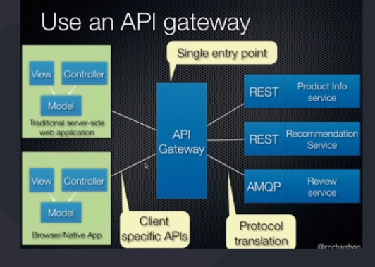

Ele é o ponto unico de entrada e encaminha para os microsserviços

Tradução de protocolos AMQP --> HTTP, por exemplo.

O unico ponto de entrada deve ser escalável para garantir resiliencia.

É uma ferramenta de gerenciamenro geralmente adicionada entre o cliente e um gruo de sistemas de um determinado contexto, atuando como ponto unico de entrada das APIs.

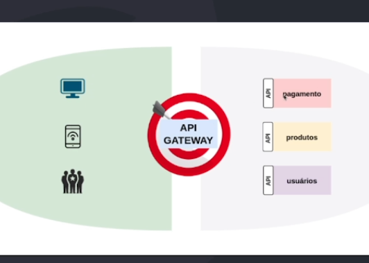

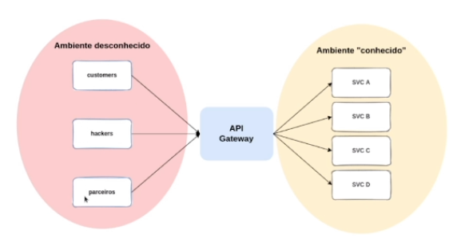

Geralmente o API Gateway atua na camada de rede, provendo funcionalidades ortogonais, asque nao necessariamente sao responsabilidades das aplicaçoes.

FUncionalidades como logs de sistemas, seguranças, podem ser normalizados entre microsserviços para aumentar a governança.

Funcionalidades:
Controle de abuso (rate limit)
Autenticaçcao / Autorizaçao de maneira padronizada
Controle de Logs
Gerenciamento de APIs (routing)
Metricas padronizadas (ops team)
Tracing Distribuido (cada ponto da rede repassa headers paraidentificar caminhos da request)


## Tipos de API Gateway
Enterpise Gateway: O foco deste tipo de soluçao é ma grande maioria das vezes realizar exposiçao e gerenciameto de deployment de APIs voltadas ao negocio, em geral ele também permite controlar o ciclo de vida de uma API.

Em geral é uma oferta de algum vendor , com elementos estrategicos comerciais suportando a soluçao. Este tmbé, tende a direcionar a aplicaao da soluçao e implicar no design dos seus serviços. 

Nao é bom as vezes pq pode drecionar o design do serviço e fica dificil a migraçao.

Proposito Pricipal: Exposiçao, composiçao e gerenciamento de APIs externas/Internas

Manutençcao de APIs: Time de APIs em geral faz adiministraçao via Poral do API Gateway

Suporte a ambientes: Suporta multiplos ambientes DEV, QA e Prod.

Pode ser utilizada para uma modernizaçao de arquiteutura aplicando padroes como FAÇADE ou Strangler Application (deve ser o meio, e nao o fina da soluçao)

Disponibilidade vs Consistencia (dependencias externas)

CUidado com a utilizaçao de "policies" da propria ferramenta (vendor lock-in)


Em geralm enterpise gateway precisam de dependencias externas, como banco de dados, caches, entre outros, CUIDADO isso pode aumentar suas chances de ter indisponibilidade.

A mobilidade de deployment é bem baixa enterprise gateways sao EDGE na maioria dos casos (vendor lock-in)

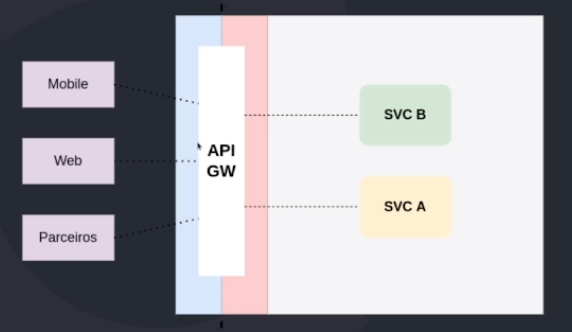


MICRO/MICROSERVICES GATEWAY

Tipicamente essa classe de GATEWAYS TEM a capacidade de rotear trafego de entrada para APIs ou serviços. Em geral nao oferecem supote ao ciclo de vida das PIs e as equipes tem que faze-lo via processo separado. Maioria open-source.

Geralmente nao possuem dependecias externas e sao componentes standalone, oque faz com que a plataforma (k8s) gerencie o estado necessário para a execuçao da aplicaçao.

Proposito Principal: Exposiçao, observabilidade e monitoramento de serviços (APIs)

Manitençao das APIs: Time de API ou time de criaçao/manutençao do serviço via configuraçao declarativa fazem atualiçoes, esta tarefa faz parte do deployment dos serviços

Suporte a ambientes: A instancia conrola um unico ambiente, possui suporte a riteamento mais dinamico como por exemplo, Canary para facilitar o debugging.

Reduza o numero de instancias para ganhar experiencia na gestao do ambiente para escalar para toda companhia

Use a flexibilidade do deployment para "particionar" suas APIs (use Bounded Context do DDD)

Tente ser Stateless o máximo possivel. Isso vai aumentar muito a facilidade escalabilidade/Disponibilidade.

Numeros de instancias pode ser um problema em equipes sem expertise em monitoramento/observabilidade

Granularidade fina demais, pode complicar a manutençao das APIs. Agrupar APIs por grupos é sepre bom

Automaçao deve ser pensada desde o inicio da jornada.

Enterprise vs micro
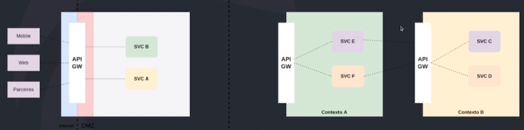


## Papel API Gateway na Arquitetura de Microsservices
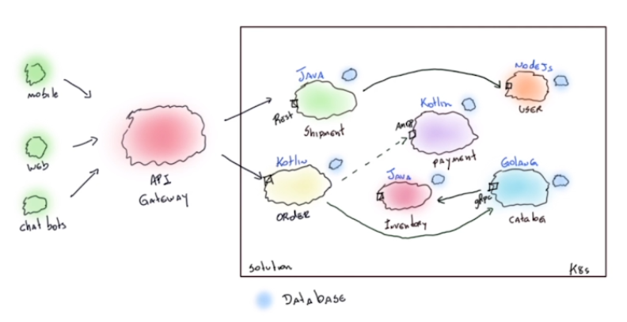

Há muitas conexoes entre microserviços com caractericas diferentes.
Hyperconnectivity mess!


Duas maneiras sugeridas:
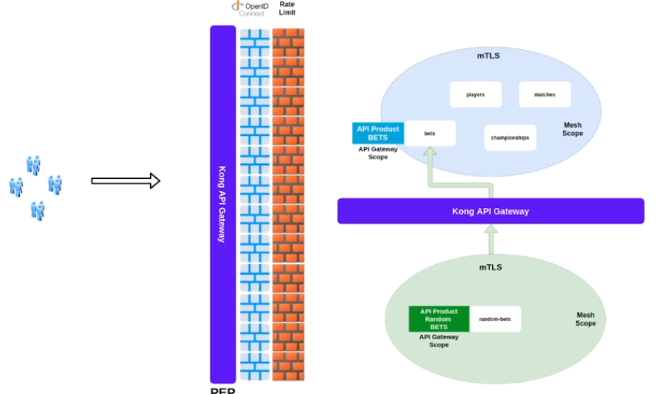


1a: API gateway autuando no edge. Policy Reinforce

Outra maneira é separando um contexto de produtos.Dois escopos de produtos. Isso previne o Hyperconectivity mess e fica mais facil de governar e gerenciar as APIs utilizando os paadroes.


## Vantagens e Desvantagens de um API Gateway
Fluxo do request
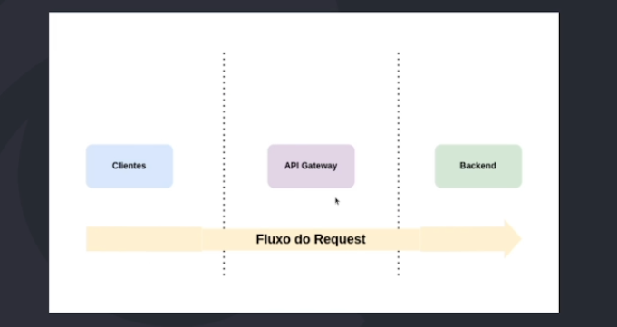

Sempe vair ficar entre o cliente e o backend.

Vantagens:
Padronizaçoes de algumas fetures ortogonais (logging, segurança)
Ajuda na governança de rede da companhia
Ponto unico de entrada na rede, facilita gerenciamento
Ferramenta essenciaç para adoçao de uma estrategia de APIs

Desvantagens: 
Adicioan aguma complexidade na sua arquitetura
Precisa de um cuidado extra devido a disponibilidade
Ferramenta que precisa de manutençao/atualizaçao

MINIMO DE 3 INSTANCIAS PARA GARANTIR DISPONIBILIDADE!


## Como escolher API Gateway

Entreprise vs microgateway

Considere o desenho das equipes da sua companhia na escolha

Se tiver silos, agrupados por db, ui etc, talvez o Enterpris pode ser ineteressante, pq tem um time inteiro voltado para isso. Modelo centralizado e dependente do time de API.

Se o desenho de equipe trabalham juntos, especialistas em cada equipe, processo de automaçao fullcycle, micro api gateway é bom pq trabalham com automaçao prevendo detalhes de governançca, politicas de segurança, exposiçcao de metricas no pipeline da companhia.
(Equipes multipdisicplinares + plaataformas de APIs)

DEFINIA UM PLANO PARA AS APIs E INCLUA A ESCOLHA DO API GATEWAY DE ACORDO COM A ESTRATEGIA

Modernizaçao da Arquiterua
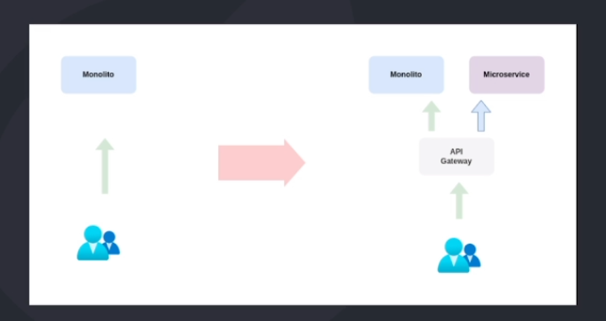

API gateay pode ser um ponto de manobra para depreciar monolitos.

EVOLUA PASSO A PASSO NA IMPLEMENTAÇAO DAS PRATICAS DE API E CONSIDERE FUNCIONALIDADES DE UM API GATEWAY NESSE PLANO!

AUTOMATIZE, AUTOMATIXE AUTOMATIZE!!!

Receitas de API e configuraçoes de API Gateways. METODO!


# Kong API Gateway

API gateway OpenSource
Caracteristicas Micro Gateway(nao gerencia ciclo de vida automaticamente)
Deployment flexivel
Pronto para k8s
Extensivel via plugins


## Arquitetura
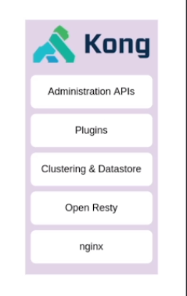

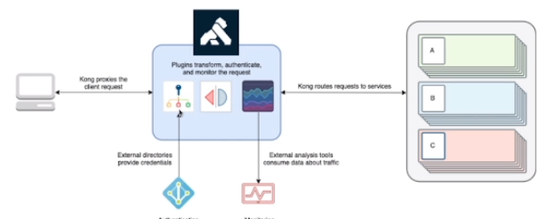

Podemos extender o kong via plugins de auth etc.

KONG éo proxy com a capacidade de ser expansivel utilizando plugins Lua

## Subscripions
A label enterplise plus no kong significa que só podem ser usados se forem pagos. Outros sao usáveis sem nenhum problema na versao c mmunity. O RateLimit é opensource, por exemplo.

A mairoia das empresas no Brasil usam a subscription free, via comunidade e instalaçao gerenciada on-premise pelapropria empresa.

## Modelos de Deployment
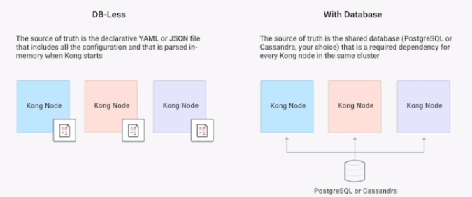

O kong pode ser executado sem banco de dados via arquivos yaml ou json com a declaraçao do kong. Esse modelo nao tem dependencia externa e fica na memoria uma vez que eh lida. Nao tem uma dependencia externa e é bom para arquitetura distribuida. Mais facil de ser gerenciado mas apontando os arquivos de configuraçao.

Através do modelo com banco de dados, o kong se conecta com o postgres (recomendado) le os arquivos de configuraçao. 

Quando se usa o modelo de banco de dados, apesar de ter uma dependencia externa. A escrita e a leitira no db é reduzida (bom) pq se usa o modelo de control plane


Um dos kongs recebe as configuraçoes (rotas, plugins e serviços)


Deployment Distribuido:
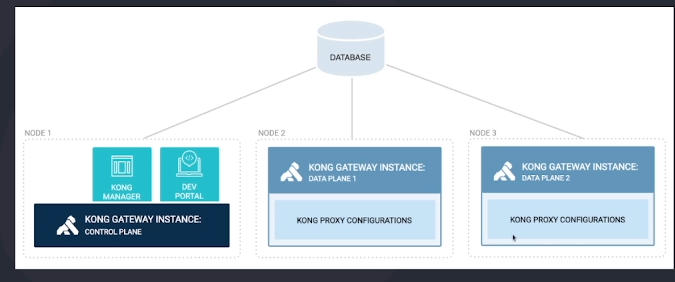

Uma instancia chamada de Contro Plane (api adminstrativa exposta onde se reaaliza as configuraçoes e a conexao com o banco de dados) e os outros nós onde vao estar a runtime onde vamos estar nossas apis, data planes, ele sobe as configuraçoes e de tempos em tempos fazem o refresh dessas informaçoes. 

Deployment Hibrido:
image.pn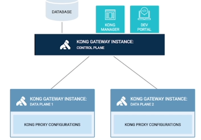

Usando a ideia de control plane e data plane. O Control plane apenas acessa o banco de dados, e os dataplanes acessam o control plane para obter as informaçoes.

Dessa forma, o banco de dados pode ser bem menor pq tem menos acesso no geral. Nao temos apenas uma unica instancia do control plane mas precisamos de mais que um control plane.

## Docker Compose
Configuraçao do kong com db

kong migrate bootstrap -> plugins adicionados com conf no database

## Konga
Interface admin para KOng API Gateway
Visualizaçao de métricas das instancias
Controle de Usuários
Gerencia mais de um kong.

Vamos executar o docker compose 

```bash
docker compose -f kong_compose.yaml up
``` 

E  acessar a porta http://localhost:1337

E entao fazer o login na plataforma.

A primeira coisa é colcoar uma credencial para gerenciar uma api administativa para ambientes de produçao.

A url de api administrativa do kong devem rodar em um ambiente protegido em vpn para proteger e nao devem ser expostas!
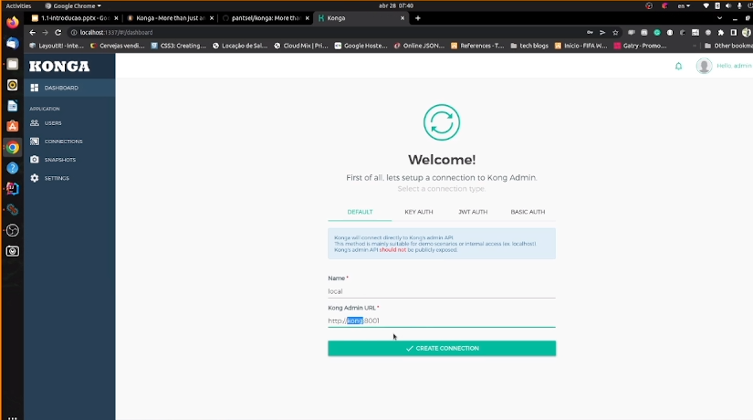

E entao a pagina a seguir vai ser disponibilizada
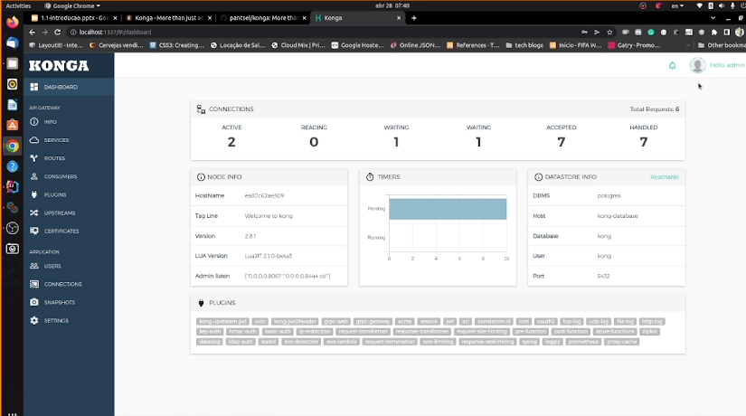

É bem simples administrar o kong via konga! 

Vamos fazer dessa forma e depois fazer via api rest para favorecer tecicas de gitops

## Serviços
Um Serviço é uma parte que representa uma API ou microsserviço upstream - por exemplo, um microsserviço de transformaçao de dados ou uma API de cobrança. (backend)

Vamos configurar o Proxy para fazer o caminho de upstream na rede.

Vamos fazer a exposiçao da API de bets usando o nome do container como service do upstream na porta 9999

Em Service:
Name: bets
Description: Serviço de apostas
Tags: time-bets
Url: http://bets:9999
Timeout: 2000ms para connect, write, read

Pronto! Agora fizemos a informaçao do serviço de upstream!

## Rotas
"Camiho" de url que permite que um serviço seja acessado pelo KOng API Gateway. Cadastrar nao sinifica que está servindo no Proxy!

o KOnga, nao se pode cadastrar uma rota sem que se tenha o upstream associado. Para isso, em Services, existe um menu chamado Routes e vamos falar o caminho para o upstream.

Name: criacao_aposta
Tags: time-bets
Hosts: bets-app.com.br
Paths: /api/bets
// Headers: version-v1
Https redirect status code: 426
Path Handling: v1
Method: Post
Strip Path: No (remover o /api/bets apõs o entendimento do API Gateway)
Preserve Host: NO
Protocol: http/https

Submete e cria a rota.

Vamos testar: POST
http://localhost:80/api/bets


O Header host é necessário pq foi configurado para isso e éumdosatributos para interpretar e enviar para o upstream!
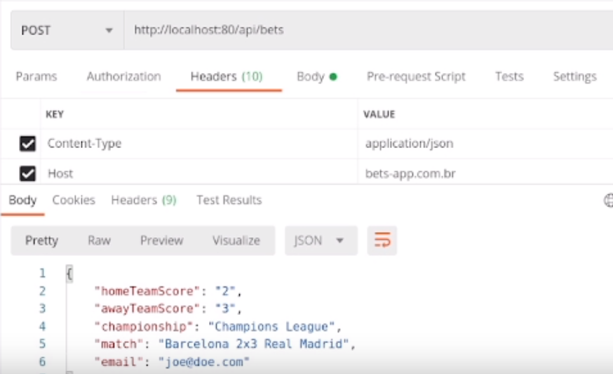

Criamos a primeira rota no API Gateway!

Se quisermos alterar alguma coisa, basta atualizar no konga.

## Plugins
UM pedaço de código que pode ser executado dentro de um ciclo de vida de uma requisiçao HTTP, tanto na fase de request como na fase de response.

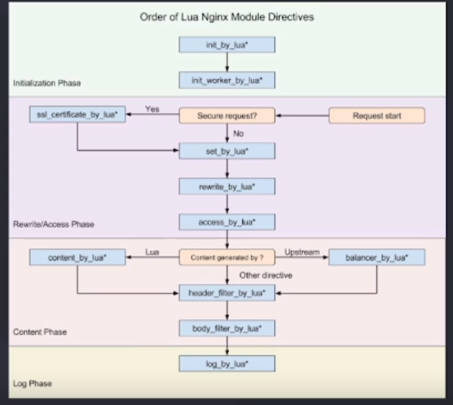

Fases de um plugin:
Inicialização, Rewrtite, COnteudo, Log


Existe uma ordem de execuçao dos plugins.

Podem ser configurados nas Rotas, Serviços, Consumers e Globalmente, atante-se a precedencia das configuraçoes.

https://docs.konghq.com/gateway/latest/admin-api/#plugin-object

Pode ser que queremos colocar autenticaçao em uma rota apenas, para isso, podemos aplicar em uma rota.

Quanto às metricas, podemos colocar em relaçao a nivel de serviços ou ainda logs globalmente. Ou ainda autenticaçao para os Consumidores.

Podemos criar o plugin utilizando a linguagem lua, javascript e golang.

Kong API Gateway possui alguns plugins da comunidade que podem ser instalados na versao community

Com suporte bem maior para lua.

## Correlation ID
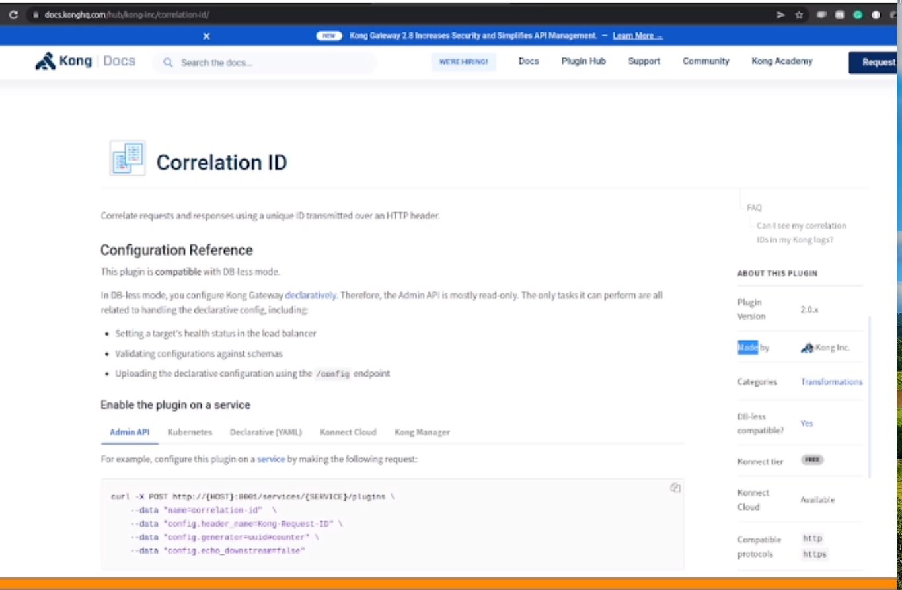

Esse plgin coloca um identificador unico em requests e responses.

NO konga, Vamos em PLugins.

Nesse caso, gostariamos que todas as requests que passassem pelo kong tivessem um correlationId. Para isso, vamos configura-lo como GLobal. o Plugin de CorrelationId está na fae de transformation, portanto, clicar na aba Transformation e Add CorrelationId. 

Consumer:
HeaderName: Request ID
Generated: uuid
Echo Downstream: Yes (correlation ID seja enviado para quem está chamando)

Prnto! O plugin foi configurado com sucesso e, na requisição, Obtivemos no header Request ID um novo UUID!

Isso é uma espécie de opentracing, devolvendo tb ao cliente como um ID da requisição.

E esse rquest ID é importante repassarmos para todos os serviços do sistema para termos uma especie de log.

## Rate Limiting

Imaginemos um numero de requisiçoes por minuto e, apos isso, asrequisiçoes nao cheguem no backend para proteçao dele.

Vamos usar a versao opensource.
file:///home/rogerio/Pictures/Screenshots/Screenshot%20from%202024-02-12%2022-02-59.png

NO konga, Vamos em Services, para configirar uma taxa de requisiçoes para um serviço pois nao faz sentido colocar globalmente. Em geral, se faz um rate limiting por service.

Services -> bets -> Add Plugin -> TRaffic COntrol -> Rate Limiting
minute: 5
Smit by: ip
policy: local (esse numero de requisiçao será tratado por cada instancia do kong. Isto é, esse rate limiting nao é distribuido. Se tivermos 10 instancias do kong, cada uma delas vai permitir 5 requests/minuto) 50req/min ao todo.

Em um controle mais rigido, aplicando em todo o kng, podemos aplicar via cluster Entao seriam 5 reqs/min no cluster

Outra policy é utiliando um modelo redis. Se quisermos que seja distribuido, mas nao usando o modelo cluster, que utiliza o banco de dados do kong, podemos utilizar o redis para fazer esse rate limit distibuido. E ai acontece com a mesma maneira do cluster. 5 reqs/min

Se usarmos local pode ser que nao tenhamos consistencia, o que pode nao ser um problema se sabermos que isso vai acontecer.

Entretanto, quando temos mais consistencia, utilizando o redis, por exemplo, o kong vai fazer uma operaão externa e voltar, gerando menor disponibilidade.

Consistencia vs disponibilidade dependenddo do caso de uso.

Fault TOlerant: No (significa que vai bloquear se falhar por algum motivo); Yes (se falhar por algum motivo, deixa passar) 

Hide CLients Headers: O kong vai colocar alguns headers, indicando quantas reqs faltam para chegar no limite de reqs para o cliente. Recomendado Yes. Isso ẽ utilizado para fazer ataques. Ele usam API e ficam batendo de tempos em tempos. Se informarmos essa questao, vai deixar mais obvio que o rate limit está proximo. 

Pronto!

Vamos testar as reqs!

Quando chegamos no limite das requisiçoes recebemos a informaçao de 429 oo Many Requests pq passamos o rate limiting

É sempre recomendado esconder headers de informaçoes de segurança para o client.


## Request / Response Transformer
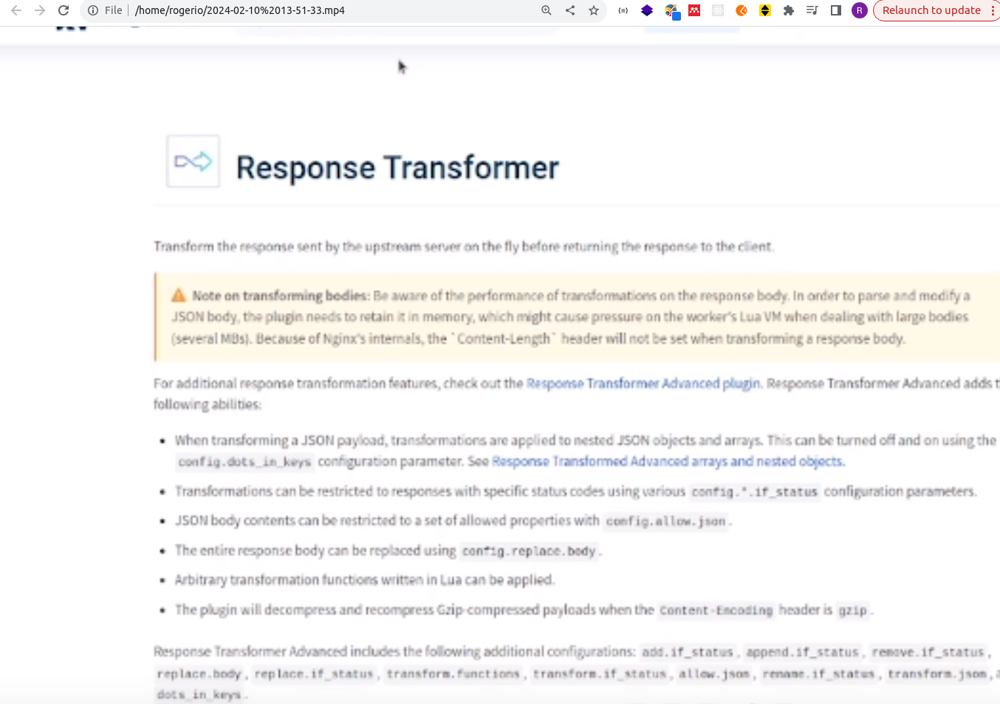

COmo fazer modificaçoes de header e de body.

O KOng suporta, basicamente, dois modelos de transformação:
1. Antes de enviar para o upstream no header do request
2. Ao chegar do upsreams como um header/tansformaçao especifica de response 

Basicamente, conseguimos fazer as mesmas opeações tanto no reuqest como no response.

No exemplo, vamos fazer uma transformação no Response do Serviço bets.

No konga -> Services -> bets -> Add Plugin --> Transformation -> Response Transformation

Vamos adicioanr um header e tb uma chave no json. Em gerall, manipular requisições hattp é um pouco complicado para o API gateway, principalmente em Tranformaçao de body.

Transformaçoes pesadas nao sao recomendadas quando se utiliza micro api gateway e vale muito a pena ficar esperto com isso para nao ser um problema.

add: 
headers: api: bets
json: proxied by kong

Adicionando o plugin, vaoms fazer a requisição!

O jsn funcionou o header tb funcionou de forma bem simples!

As transformaçoes devem ser simples e relacionadas a infraestrutura e nao ao negocio.

## Consumers
Representa um consumidor que pode se usuário ou um serviço. Esse pode ser utilizado para aplicaçao de plugins de segurança.

No painel admin do konga, existe a parte de Consumer. Vamos criar dois consumidores: Uma para o usuário final e o outro para a nossa aplicaçao.

username: rogerio
tag: user

username: app-bets
tag: app

Apõs a criação dos consumers, podemos clicar no user para realizar uma configuração de password!

Basic Auth para user
username: rogerio
password: admin

API key para app-bets

Em alguns casos é interessante que se tenha um app de senhas central como o OPenId, mas se a empresa nao tem esse db central, o kong fornece esse suporte inicial. Em geral isso pode nao ser uma boa pratica, mas isso em momentos iniciais.


## Basic Auth
PLugin que utilizamos o header `basic: user:password `no envio http

Apesar de ser um modelo bem inicial, já é um nivel de segurança

Ele vai olhar os consumidores do kong api gw e vai fazer um match com as credenciais que estamos enviando no header http.

Para isso, vamos em Services, clicar no serviço de bets para adicionar a autenticaçao do usuario.

Services -> bets -> add plugin -> authentication -> basic auth -> add plugin
Nao é necessario informar parametros, basta adicionar o plugin que ele já vai utilizar o banco de dados do kong

Se fizermos o request e nao enviarmos a autenticação, vai retornar 401, not authorized.
Lembrando que deve ser informado usuario:senha em base 64. Por isso, esse modelo nao é muito seguro, pq ele expoe todas as senhas.

Para enviar o header, basta selecionar Authorization: Basic USER:PASSWORD_B64

E foi! Recebemos 201 como created. E o Kong entendeu que esse é um usuario invalido e nao autoriza.

Esse basic auth nao é mais uma boa pratica. Atualmente se utiliza OAuth ou OpenIdConnect, justamente pq se envia um token

## Key Authentication
Esse modelo solicita que  cliente envie uma chave de autenticaçao API Key.
E entao o Kong verifica se está autorizado ou nao.

Geralmente essa api é utilizada por serviços. Por exemplo, a API de apostas tem uma credencial api key nao para o usuario final, mas para o serviço
Adicionar o plugin API Key Auth
keynames: apikey
key in header: yes
key in query: no
key in body: no

Pronto! Vamos verificar na request, adicionando apikey no header com a chave criada pelo kong

E funcionou! O kong idenificou a api de consumidor no banco de dados e autorizou a chamada.

Vale a pena lembrar que esse tb é um metodo primario de segurança, mas pode ser um inicio voltado para clientes e serviços da api. O ideal é utilizar OAuth ou OpenId. 


# Decisoes na escolha do API Gateway
## Caracteristicas nao funcionais

O primeiro modelo de deployment que funciona bem em grandes empresas com muitos microsserviços (e dependendo do tamanho da companhia pq muitas instancias).

O modelo de deployment recomendado pode ser o API Gateway de Borda/Edge. O kong atua na borda com alguns plugins para protegermos o ecossistema de serviços e fazemos controles de abusos e identificaçao do usuario. É padrao e bastante tradicional.

Outra forma, o kong pode atuar como listas para chegar nos serviços em geral. Todos que quiserem acessar esses serviços devem passar pelo API gateway de maneira interna. Isso ajuda muito o efeito de que os serviços chamas serviços e fica dificil de entender.

Dessa forma, temos um kong API Gateway no Edge para autenticaçao e Rate Limit e um interno para contextos denegocios/produtos e isso é muito bom.

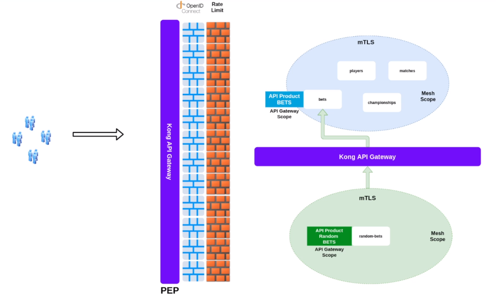


Outra coisa é escolher qual modelo devemos utilizar; via configuraçao de arquivo ou com banco de dados.

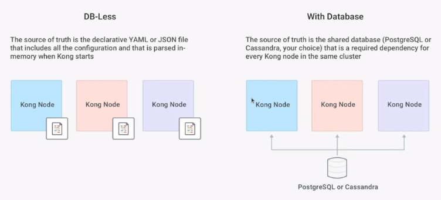

Na conf de arquivo, precisamos ter um filesystem atribuido ente os nós do Kong para ganharmos disponibilidade. Nesse modelo, o arquivo de config deve estar em um filesystem distribuido para que as outras instancias do Kong possam ter acesso a esse filesystem. É importante lembrar que nesse caso, é recomendado que a api administrativa seja bloqueada para a utilizaçao para nao fazer config em apenas em um kong e nao replique. Eventualmente, pode se fazer uma automaçao em um pipeline para atualizar os arquivos no filesystem distribuido e todos os kongs consigam interpretar anova versao do aquivo para usar essa nova api. Isso aumenta a disponibilidade por nao ter que lidar com banco de dados externo, mas diminui a consistencia pq terá que manter a consistencia dos arquivos entre todos os nodes.

No modelo de banco de dados (hibrido) todos os nós vao estar conectados ao banco de dados e os data planes vao acessar os control planes e os control planes acessam o banco de dados. 

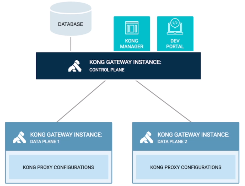


Como temos um elemento externo 'a infra no api gateway a disponibilida fica prejudica uma vez que o db pode cair. Mas se configurarmos uma nova api e o db nao estiver ligado, as configuraçoes nao serao aplicadas. Nesse ponto, podemos fazer automaçoes que configuram o Kong via api, como o deck e entao as instancias de kong nao precisam ter o arquivo de configuraçao. Podemos fazer a configuraçao chamando uma api do control plane e entao ele faça o push das modificaços para o data plane. E entao nao dependemos de um arquivo de configuraçao. É importante que se faça o pipeline que mantenha o estado dessas configuraçoes, mesmo que se tenha algum repositorio com o estado de api com o conceito de GitOps, subindo uma nova instancia e configurar o estado. Geralmente essas configs podem ser realizadas via deck, chamando os artefatos (plugins, rotas e serviços) e realizando a configuraçao.

Mais consistencia, menos disponibilidade.

Levar em consideraçao que alguns plugins como o OAuth2 funcionam parcialmente com dbless.

POr isso, a escolha dos modelos de deployment pode depender dos plugins.


## Desenho equipes
Considere o desenho das equipes da companhiana escolha do API gateway

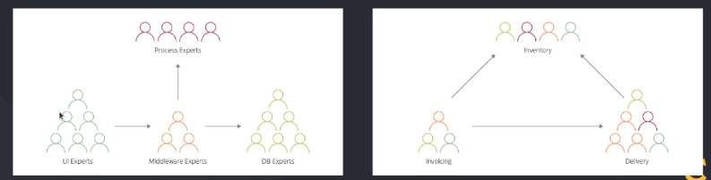

Te tiver um time unico e central responsavel pela padronizaçao das APIs, que aprovam e atuam no API Gateway para fazer o deployment, existem torres de especialidade. Nesse caso, é recomendado que se tenha menos instancias e deployments de api gateways. Fica dificil todo o time atuar em nas APIs Gateways de borda e interno. Nesse desenho, pode ser aplicado um API gateway no edge da infra com os consumidores e nao com os serviços, senao os serviços internos podem sofrer um gargalo. Quanto menos instancias, melhor e mais saudavel no ambiente.

Por outro lado, se os times forem segregados por tipos de negocios e se tem varias especialidades dentro do time, é bem interessante dar mais autonomia e via pipeline de automaçao, possa realizar atualizaçoes nas API Gateways internas e ficar responsavel pela instancia que protege os serviços que eles desenvolveram em termos de monitoramento e deployment, distribuindo as responsabilidades entre os times, potencialmente nao tendo mais gargalos. Dessa forma, é importante de um pipeline e uma plataforma para viabilizar o deployment das novas api com regras gerais e da forma mais automatizada possivel de forma automatizada e distribuida.


# Observabilidade
## Monitoramento
Métricas: É o primeiro ponto de troubleshooting para identificar os problemas para começar a se aprofundar e logging e tracing distribuidos.

O kong suporta a config de plugins para metricas no formato Prometheos, amplamente utilizado no mercado.

No docker compose, a primeira ferramenta, é o grafana, para ver as partes visuais das metricas. O node-exporter para coletaralgumas metricas do sistema e tb o prometheos com as portas e os arquivos de configuração para buscar as metricas no kong. De tempos em tempos o prometheus vai fazer requisiçoes ao kong para buscar as metricas. 

No kong, vamos habilitar o Plugin de forma global acessando o painel de admin -> plugins -> Add Global Plugin -> Analytics & Monitoring -> Prometheus -> Add Plugin

Vamos verificar o dashboard oficial do kong para o grafana
https://grafana.com/grafana/dashboards/7424-kong-official/

Ao acessar o grafana e verificar a Request Rate. podemos visualizar que a stack está fazendo a coleta de uma chamada por segundo do kong, por rotas, serviços por status code etc. 

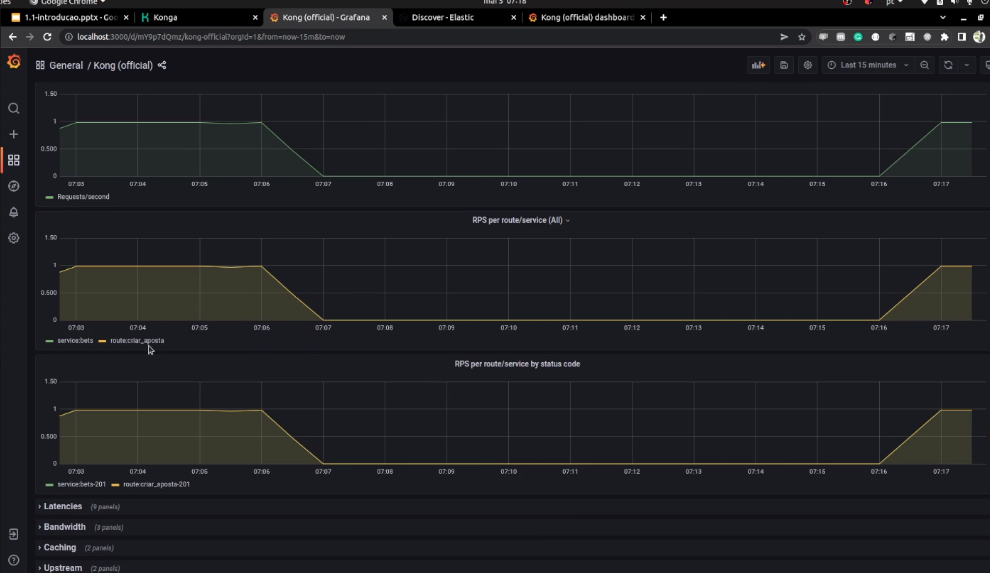


Em Latencies, temos os tempos de latecnias do KOng, do Proxy PLugins, POr todos os serviços, por serviços e por rota. 

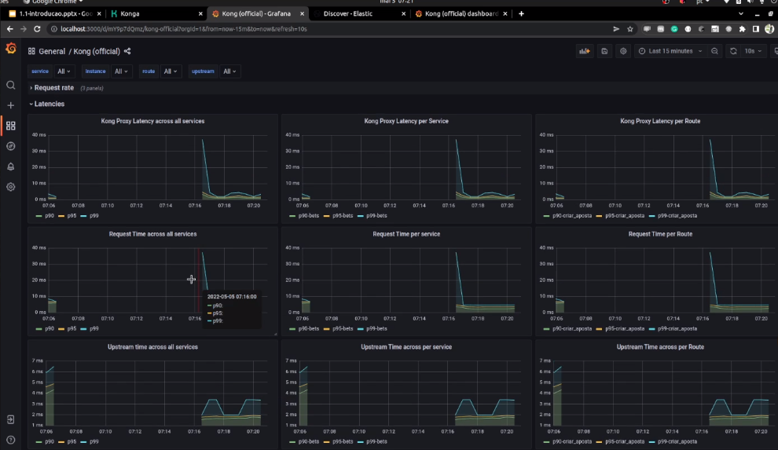

Bem como metricas de consumo de banda e caching!

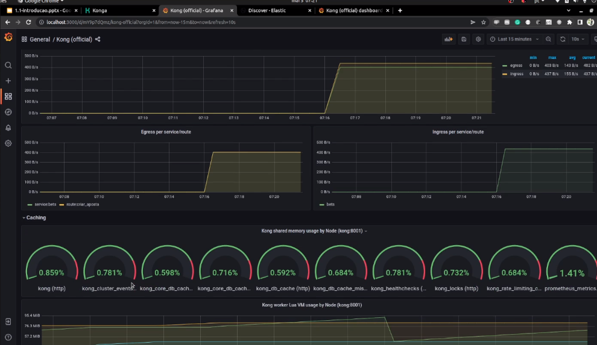

Como umasimples configuração global já temos uma serie de metricas importantes para entendermos o comportamento!

Atraves do prometheus podemos fazer alertas baseados nas metricas e evoluir isso para um moitoramento ativo em um ambiente produtivo.


## Logging
COmo o kong exporta o logging dos requests para fazer agregações.
No docker compose, usamos o fluent-bit, que é uma ferramenta que netrega logs, recebendo de algum lugar e enviando para outro lugar. Além disso, o elastic search, que é o banco de dados dos logs para fazer buscas muito interessantes e tb o kibana, que é uma ferramenta que vai mostrar visualmente para trabalharmos na coleta de logs. (Coletor, db, visual). O fluent-bits utiliza a porta 5170 para realizar a exposiçao de logs via tcp. Isso é um detalhe importante que na porta 5170 podemosenviar logs via tcp. Da mesma maneira, os arquivos de configuraçoes mostra a porta e os formatos que vamos utilizar para receber os dados no INPUT e o OUTPU no elastic search na porta 9200.

No konga, vamos habilitar por serviço, um plugin de coleta de logs;
Services -> bets -> LOgging -. tcp logging:
host: fluent-bit
port: 5170
Add Plugin

Isso é tudo o que precisamos!

Vamos visualizar o kibana (http://localhost:5601) e selecionar Analitics -> Discover para analisarmos o que aconteceu com aqueles logs.

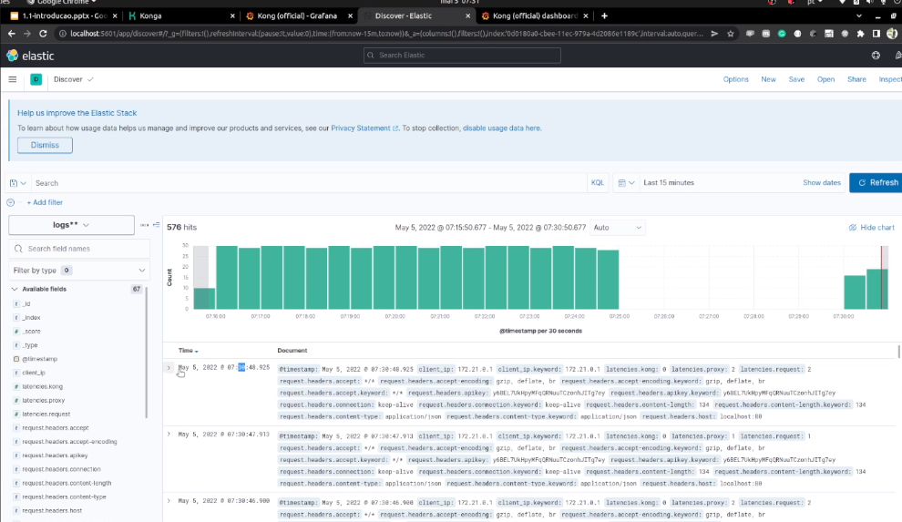

Aqui vemos que já temos uma série de entradas de logs com index, tempo de latencia, headers, método, size, url da chamada, ip do cliente etc. E podemos trabalhar para ver quantos requests foram enviados para uma determinada API key para fazer agregaçoes de dados!

Por padrao,nenhum log do API gateway registra o body deuma requisiçao pq, em geral, pode trazer problemas de performance para analizar e realizar o parse para enviar para o plugin de loggin. Nenhum plugin open source do kong faz isso tb pq podem ter informações sensiveis por conta da lgpd. Apenas request e response headers.


## Tracing Distribuido

No docker compose, jaeger -> Ferramenta de coleta de tracing distribuido com o padrao OpenTelemetry. a imagem all-in-one do jaeger tem colector, query e viewer. COmo estamos utilizando como aprendizado, usamos o all in one para armazenar localmente e esse armazenamento é didatico, nao para produção. A porta mais importante do jaeger é a 9411. E ele suporta o formato zipkin para trace. O KOng tem o plugin para enviar os tracings no formato zipkin, assim como o jaeger.

 kong recebe a requisiçao e cria os headers do formato zipkin usando o padrao openTree e realizar o envio dessa informação para o jaeger, no endereço dessa ferramenta.

 No konga, vamos configurar a parte de ratio. Para isso, Service -> bets -> Plugins -> Annalytics & Monitoring -> Zipikin:
 http endpoint: http://jaeger:9411/api/v2/spans
 sample ratio: 1.0 siginifica que toda a requisiçao que passar pelo kong vai reportar para o zipikin
 0.001: Poucas coletas para nao prejudicar performance. Em caso de prblemas, podemos aumentar o envio para termos mais informaçoes para tracing distriuido. 
 local service name: kong
 Header type: preserve
default header type: b3
Add plugin

Ao fazer algumas chamadas na API, acessamos o jaeger (http://localhost:16686).

Em service, já apareceu o serviço do kong que configuramos o zipikin, selecionamos todas as operaçoes e os ultimos 20 resultados.

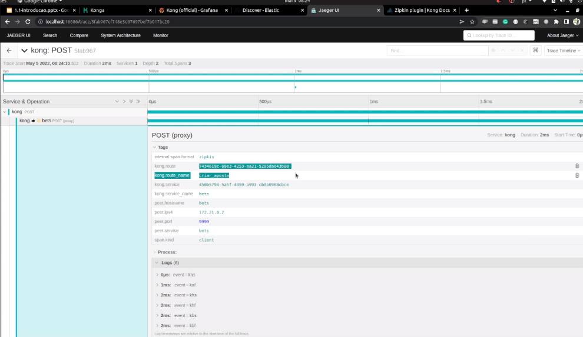

Entao, já conseguimos ver o inicio de um tracing distribuido de Post paa a page bets, rota, nome da rota, serviçco, qual a Ip, porta etc, LoadBalancer etc. O serviço do bets nao envia diretamente para o jaeger, mas ele pega apenas do kongnesse caso.

Se tivermos um serviço de Service Mesh, nao precisariamos instrumentar a aplicação mas apenas passar os headers e está tudo certo!

Lembrando que é importantissimos repassarmos as informações de nossas aplciaços via OpenTelemetry, por exemplo.

Portanto, agora temos um ambiente controlado por metricas, logging e tracing distribuido! ISSO É EXTREMAMENTE IMPORTANTE PARA UM AMBIENTE DE PRODUÇÃO E É VITAL PARAQUE O NSOSO ECOSSISTEMA DE API SEJA MANTIDO E TENHAMOS VISAO DO QUE REALMENTE ESTA ACONTECENDO!

## Day two
O dia 2 significa como vamos operar, manter e evoluir determinado elemento que colocamos em nossa infraestrutura (Api Gateway)

1o passo:
Monitoramento (Qual APi está sendo mais utilizanda, qual é a mais importante, como conseguir entender o comportamento da ferramenta e o engajamento com a API -> Prometheus)
Logs (O kong produz logs que ajudam a identificar comportamentos na utilização da API. oletar logs, armazenando e visualizando para entender o API Gateway e as APIs)
Tracing DIstribuido (endpoint começa a propagar os tracings e podemos fazer isso de maneira gradativa)

Usar o kong para acessar as APIs do monolito via API Gateway e, aos poucos, vamos roteando as chamadas de algumas APIs para a nova arquiteura de microsserviços que estamos apresentando. Vamos commissionando as novas arquiteturas com uma ferramenta de manobra de migração e roteament =o e ver metricas e o estrangulamento da arquitetura que estamos fazendo.

AUTOMATIZAR! Desde a instalaçao do kong, até o pipeline de construir o monitoramento e o deployment de APIs. Sempre que pudermos, automatize para que os devs façam o deployment das aplicações de maneira organizada, estruturada e padronizada. Facilita a adoção da API Gateway e seja uma soluçao e nao um problema.


OBSERVABILIDADE, MODERNIZAÇÃO DA ARQUITETURA E AUTOMAÇÃO FAZEM PARTE DO DIA 2 DO KONG API GATEWAY!


