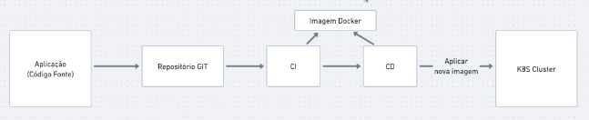
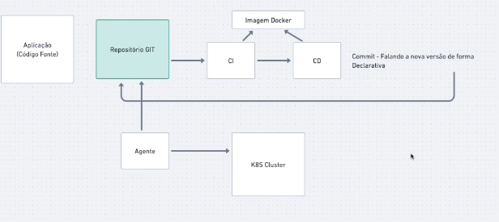
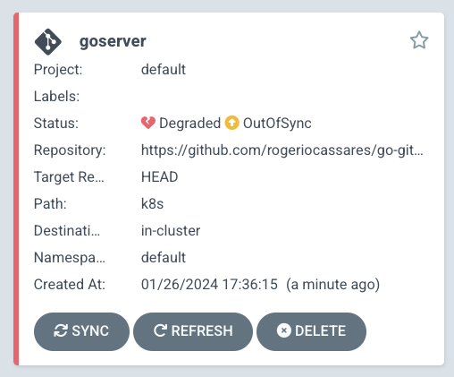
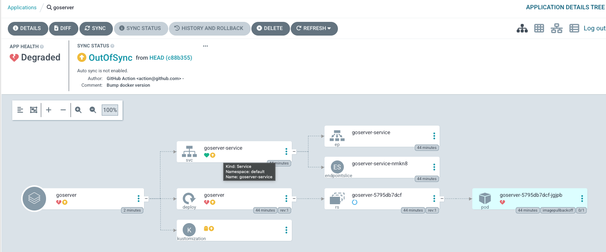
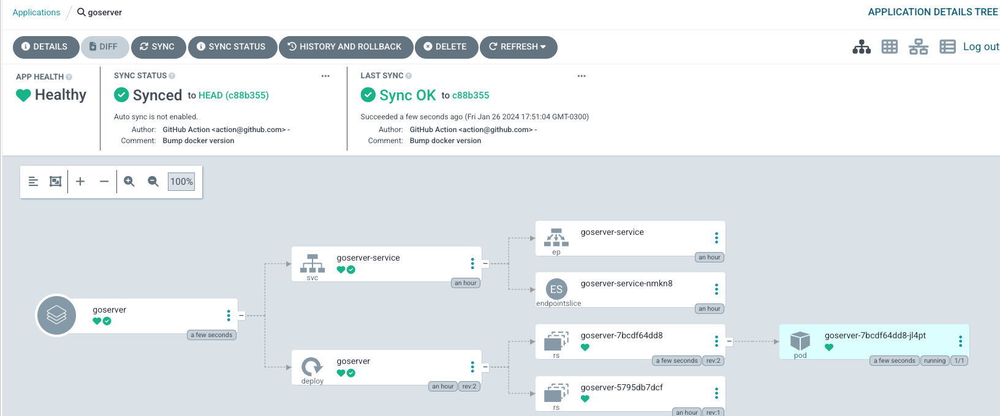

# GitOps

Garantir mais resiliencvia e tranquilidade com processo muito mais fluido, principalmente quando se usa o k8s.

## Relembrando o Fluxo Tradicional
Este é o Fluxo tradicional:


Mas como sabemos a versao do que estamos rodando? Temos que colcoar uma nova version no k8s. Como sabemos e garantimos o que esta no k8s é o que está no git? Nao podemos partir do pricipio que o que esta na Main é o que esta no k8s.

Isso gera alguns problemas se sabe se foi aplicvado ou nao e muito dependendo do CI. Como deixar tudo mais fluido? GitOps!

Tudo o que fizemnos ali, o Git é apenas um repositorio, nao um porotagonista, O que tem no k8s rodando, de uma firma geral nao tem correlaçao com o Git. 

Se alguem chegar e applicar uma nova imagem ou um manifesto no k8s de uma outra imagem Docker, há um isolamento muito claro do cluster para o repositorio. Como deixar todo esse ambiente realmente integrado e garantir o que esta no cluster é a versao do que está no Git?

O GitOps usa tecnicas de Iac e sistemas com infra declarativa para fazer com que todo o fluxo faça parte de uma coisa só.

## Como o GitOps funciona?
O GitOps é uma pratica partindo do proncipio de que trabalhamos com sistemas declarativos.

Partindo disso, vamos tirar proveito para conseguirmos trabahar.

Vamos pegar o nosso repositorio Git e ele é o centro das atençoes para garantir o que está rodando ali é o que estará em produçao. Como conseguimos gerar essa relaçao? Como integrar o Git com o Cluster?

Existe um Agente. A aplicaçao segue o processo de CI e CD normalmente, mas quando esse processo acontecer vamos rodar um commit. O processo de CD não fala mais com o Cluster. Simplesmente damos um commit falando a nova versao de forma declarativa. Quando isso acontecer, esse commit vai falar que a versao de produçao mudou. A partir daí, o agente fica de tempos em temos consultando a versdao atual dada pelo commit. Quando ele soubver a versao atual, ele aplica essa mudança no cluster. Nesse momento, a fonte unica da verdade do que esta no cluster é o que está no Git. 



tRABALHAR COM gIToPS É GARANTOIR UMA FONTE UNICA DA VERDADE DE FORMA DECLARATIVA. O uq eestá rodando é o que está em produçao. A ferramenta de CD nao tem mais acesso ao cluster, mas trabalha de forma independente.


# Na prática

## O que vamos fazer
Webserver com Hello word e todas as vezes que fizermos um processo de CD, o k8s verifique que  tem uma mudança no repoist;orio Git e aplique.

1. Programa
2. Gitflow
3. Cluster k8s
4. Agente k8s vs Git -> ArgoCD

## Criando WebServer
Vamos criar um módulo go
```bash
❯ cd Docs/DevOps/GitOps/go-gitops
❯ go mod init go-gitops
go: creating new go.mod: module go-gitops
go: to add module requirements and sums:
        go mod tidy
```

Criar o aqruivo local main.go de webserver
```go
package main

import "net/http"

func main() {
	http.HandleFunc("/", func(w http.ResponseWriter, r *http.Request) {
		w.Write([]byte("<h1>Hello Full Cycle</h1>"))
	})
	http.ListenAndServe(":8080", nil)
}
```
Executá-lo:
```bash
go run main.go
```
E acessar http://localhost:8080

Pronto. Está tudo ok.


## Criando a Imagem Docker
Vamos criar o Dockerfile com multisttage build
```Dockerfile
FROM golang:1.21 as build
WORKDIR /app
COPY . .
RUN CGO_ENABLED=0 GOOS=linux GOARCH=amd64 go build -o server

FROM scratch
WORKDIR /app
COPY --from=build /app/server .
ENTRYPOINT ["./server"]
```
E vamos buildar com a nossa tag
```bash
❯ docker build -t rogeriocassares/go-gitops:latest .
```

E entao vamos executar:
```bash
❯ docker run --rm -p 8080:8080 rogeriocassares/go-gitops:latest  
```

E acessar http://localhost:8080

Pronto. Está tudo ok!

Vamos jogar para o Docker Hub
```bash
❯ docker push rogeriocassares/go-gitops:latest                 
```

## Criando o fluxo de Geraçao de Imagem

Vamos baixar o projeto e fazer o build e subir a imgem para o docker hub. 
Vamos criar um arquivo .github/workflows/cd.yaml

Toda vez que dermos um push no branch main, queremos executar algumas tarefas.
A primeira é o build. que vai rodar em um ubuntu-latest. Os passos a seguir são o checkout do git e baixar para a máquina do ubuntu. Depois de baixar o codigo vamos fazer o build da imagem e subir a imagem para o Dockerhub. A 2a tarefa é buildar e push. Para isso precisdamos passar informaçoes secretas como username e password. 

```yaml
name: CDGitops

on: 
  push:
    branches: [main]

jobs:
  build:
    name: Build
    runs-on: ubuntu-latest

    steps:
    - name: Checkout code
      uses: actions/checkout@v2

    - name: Build and push image to Dockerhub
      uses: docker/build-push-action@v1.1.0
      with:
        username: ${{ secrets.DOCKER_USERNAME }}
        password: ${{ secrets.DOCKER_PASSWORD }}
        repository: ${{ secrets.DOCKER_USERNAME }}/go-gitops
        tags: ${{ github.sha }}, latest
```

Vamos criar um novo repositorio para trabalharmos. 
rogeriocassares/go-gitops

Vamos em Settings -> Secrets --> Actions --> nEWrEPOSITORYsECRET
NEW SECRET: 
DOCKER_USERNAME: rogeriocassares
DOCKER_PASSWORD: Dockerhub -> Account Setings --> Security --> New AccessToken --> go-gitops --> GitHub --> go-gitops --> Settings --> Secrets --> Actions --> NewRepositoryTOKEN

Vamos subir no Reposit;orio:
```bash
git init
git add .
git commit -m "first commit"
git branch -M main
git remote add origin https://github.com/rogeriocassares/go-gitops.git
git push origin main
```

Ao fazermos isso, o código vai ter que subir e uma Action deve ser acionada. Github --> Actions

E foi!
https://hub.docker.com/r/rogeriocassares/go-gitops


## Criando manifesto kubernetes
O CI está completo e poderia até rodar os testes para validar o codigo. Agora vamos fazer o fluxo de CD no k8s. E para isso precisamos criar  os manifestos do k8s. 

A primiera coisa, é utilizarmos o k8s local para subir o kind.

```bash
❯ kind create cluster --name=gitops
Creating cluster "gitops" ...
 ✓ Ensuring node image (kindest/node:v1.27.3) 🖼 
 ✓ Preparing nodes 📦  
 ✓ Writing configuration 📜 
 ✓ Starting control-plane 🕹️ 
 ✓ Installing CNI 🔌 
 ✓ Installing StorageClass 💾 
Set kubectl context to "kind-gitops"
You can now use your cluster with:

kubectl cluster-info --context kind-gitops
```

Vamos aplicar o conteto desse cluster ao kubectl
```bash
❯ kubectl cluster-info --context kind-gitops

Kubernetes control plane is running at https://127.0.0.1:52059
CoreDNS is running at https://127.0.0.1:52059/api/v1/namespaces/kube-system/services/kube-dns:dns/proxy

To further debug and diagnose cluster problems, use 'kubectl cluster-info dump'.
```

E vamos criar uma pasta k8s comn deployment e service
deployment:
```yaml
apiVersion: apps/v1
kind: Deployment
metadata:
  name: goserver
spec:
  selector:
    matchLabels:
      app: goserver
  template:
    metadata:
      labels:
        app: goserver
    spec:
      containers:
      - name: goserver
        image: goserver
        ports:
        - containerPort: 8080
```

service
```yaml
apiVersion: v1
kind: Service
metadata:
  name: goserver-service
spec:
  selector:
    app: goserver
  ports:
  - port: 8080
    targetPort: 8080
```

## Iniciando com Kustomize

Toda a vez que mudarmos a versao da nossa imagem docker, o agente vai ter que conseguir reaplicar. Para isso, o github precisa estar com a versao correta, bem como o manifesto inteiro. Como mudar a versao no manifesto? Nao da para ficarmos alterando manualmwente. Por conta disso, temos duas possibilidades. Trabalhar com helm e alterar os pacotes no helm, ou ter que alterar os deployments. Como mudar o deployment?

Por conta disso, vamos usar uma ferramenta do k8s que se chama kustomize. Ele nos ajuda a passar algumas coisas no arquivo dele e quando ele aplicar ele gera o resultado da mudança nos manifestos.

Vamos instalar o kustomize
https://kubectl.docs.kubernetes.io/installation/kustomize/
```bash
brew install kustomize
```

Vamos ter um arquivo do kustomization
```yaml
apiVersion: kustomize.config.k8s.io/v1beta1
kind: Kustomization

resources:
- deployment.yaml
- service.yaml

images:
- name: goserver
  newName: rogeriocassares/go-gitops
  newTag: newtag
```

Agora, os resources, significa que quando formos kustomizar alguma coisa, ele vai ler os arquivos do resource. 

Agora, quando aplicarmos o comando do kustomize, ele adiciona essas customizaçoes nos resources!

Vamos mudar a nossa imagem com a versao nova dela toda vez que aplicarmos o kustomize.

Nossa ideia no CD é alterar a tag pelo sha do github. Depois vamos daar um commit e mudar apenas esse arquivo! O agente vai ficar olhando o kustomize e olhar se a versao foi alterada.

AS mudanças NA IMAGEM SERÃO A PARTIR DO KUSTOMIZE

## Criando o Fluxo de CD
O kustomize vai nos ajudar a fazer alteraçao de versdao. Mas para fazer isso vamos utilizar o nosso github. Vamos gerar uma imagem e com essa imagem gerada vamos efitar o arquivo e colcoar a versao nova e colcoar um commit novamente. O nosso processo de CD nao acessa o cluster k8s, mas um commit no próprio ou outro repositorio (recomendado).

Vamos alterar o arquivo cd.yaml
```yaml
name: CDGitops

on: 
  push:
    branches: [main]

jobs:
  build:
    name: Build
    runs-on: ubuntu-latest

    steps:
    - name: Checkout code
      uses: actions/checkout@v2

    - name: Build and push image to Dockerhub
      uses: docker/build-push-action@v1.1.0
      with:
        username: ${{ secrets.DOCKER_USERNAME }}
        password: ${{ secrets.DOCKER_PASSWORD }}
        repository: ${{ secrets.DOCKER_USERNAME }}/go-gitops
        tags: ${{ github.sha }}, latest

    - name: Setup Kustomize
      uses: imranismail/setup-kustomize@v1
      with: 
        kustomize-version: "3.6.1"

    - name: Update Kubernetes resources
      env:
        DOCKER_USERNAME: ${{ secrets.DOCKER_USERNAME }}
      run: |
        cd k8s
        kustomize edit set image goserver=$DOCKER_USERNAME/go-gitops:$GITHUB_SHA

    - name: Commit
      run: |
        git config --local user.email "action@github.com"
        git config --local user.name "GitHub Action"
        git commit -am "Bump docker version"

    - name: Push
      uses: ad-m/github-push-action@master
      with:
        github_token: ${{ secrets.GITHUB_TOKEN }}
        repository: rogeriocassares/go-gitops
```

NOTA:
```
To ensure your GitHub Actions workflows function correctly, it's important to configure the GITHUB_TOKEN with the appropriate access rights for each repository.

Follow these steps to set up the necessary permissions:

Navigate to your repository on GitHub.
Click on Settings located in the repository toolbar.
In the left sidebar, click on Actions.
Under the Actions settings, find and click on General.
Scroll down to the Workflow permissions section.
You will see the default permission setting for the GITHUB_TOKEN. Click on the option for Read and write permissions.
With this setting, your workflow will have the ability to read the contents of the repository and push back changes, which is required for using this GitHub Action.
```

Depois de instalar o kustomize, vamos alterar a newTag
 PS: run : | permite trabal;har com multiline

Quando aplicarmos `kustomize edit set image goserver=$DOCKER_USERNAME/go-gitops:$GITHUB_SHA`, ele já vai alterar o arquivo para a nova tag!

Entao o agente percebe a alteraçao no kustomize a aplica!

2 objetivos: fazer o push da imagem e alterar o arquivo kustomize com o commit

Vamos subir paras o github!
```bash
git add .
git commit -m "update cd.yaml"
git push origin main
```
E deu certo em Actions!!!

Se olharmos no historico de commits do main, vemos que o ultimo commit foi a action do github
`actions-user Bump docker version` e ao verificar no dockerhub e no github, sao estamente a mesma versao do commit no kustomize ` 56d109444477838df53d63cd244cab2b0f6b8f39`. 


E aaplicar os arquivos no k8s!
```bash
kubectl apply -f k8s
```

E verificar 
```bash
❯ kubectl get po
NAME                        READY   STATUS             RESTARTS   AGE
goserver-5795db7dcf-jgjpb   0/1     ImagePullBackOff   0          18s
```
```bash
❯ kubectl get svc
NAME               TYPE        CLUSTER-IP     EXTERNAL-IP   PORT(S)    AGE
goserver-service   ClusterIP   10.96.211.10   <none>        8080/TCP   57s
kubernetes         ClusterIP   10.96.0.1      <none>        443/TCP    37m
```

Toda vez que formos trabalhar, o agente tem que estar de pé olhando para o arquivo do kustomize.


Vamos instalar o ArgoCD no cluset k8s!

## Intalando ArgoCD

Se dermos o gitpull, vamos ver a tag ficar mudando. Por isso, É BEM RECOMENDADO que na empresa tenhamos um repositorio git com todos os manifestos do k8s. Tudo fica em um repositorio só. E quando trabalhamos com o GitOps, fazemos um processo de cd no repositorio do k8s onde tem todos os manifestos! SEPARAR SEMRPE O CODIGO DO MANIFESTO!

Vamos instalar o argo
https://argoproj.github.io/cd/


Basicamente ele ;e uma ferramenta que fica lendo o repositorio e se tiver uma mudança ele aplica no cluster. Pode ser dfado para o dev utilizar e ele mesmo consegue fazer o rollback. 

A instalaçao do argo é criar um namespce e ele faz tudo para nós. 

vamos instalar o argo no cluster

```bash
kubectl create namespace argocd
kubectl apply -n argocd -f https://raw.githubusercontent.com/argoproj/argo-cd/stable/manifests/install.yaml
```

Legal! Vamos verificar.

```bash
kubectl get all -n argocd
```

Além disso, podemos configurar o argo como Load Balancer ou Port Forward

Para fazer o login, basta copiar  o comando abaixo: 
```bash
kubectl -n argocd get secret argocd-initial-admin-secret -o jsonpath="{.data.password}" | base64 -d; echo
L70wYJ3YOJaFYEp3
```

E vamos rodar o argo para subir em port-forward no k8s.
```bash
kubectl port-forward svc/argocd-server -n argocd 8080:443

Forwarding from 127.0.0.1:8080 -> 8080
Forwarding from [::1]:8080 -> 8080
```

Vamos acesssar o Argocd!
http://localhost:8080
admin/L70wYJ3YOJaFYEp3


E foi! 

## Fazendo deploy com ArgoCD
Podemos cadastrar outros cluster k8s no proprio argo e ele gerencia varios clusters!

Para criar uma aplicação, vamos clicar em ArgoDC --> CreateApplciation

ApplicationName goserver
ProjectName default
Sync policy 
--> Manual apenas avisa que tem diferença
--> Automatico

nORMALMENTE RODAMOS MANUAL PARA VERIFICAR O DEPLOY.


Repository URL: https://github.com/rogeriocassares/go-gitops/
Revision HEAD
Path k8s
Cluster https://kubernetes.default.svc
namespace default

E entao CREATE!



O goserver já percebeu que a aplicaçao esta degradada (nao funcionando no k8s) e out of sync (o que esta no git nao eh o que esta no cluster)




Basicamente ele ve a aplicação, os svc que estao conectados a ela, alem disso, o deployment que gera um resplicaset que gera um pod que nao esta funcionando.

De cara, ele fala outofsync pq o que esta no repositorio (fonte unica da verdade). Vamos sicronizar!

E foi!




Vamos fazer uma modificaçao na mai.go de `Full Cycle` para `Argo`!

E entao subir para o github
```bash
git add .
❯ git commit -m "Change to Argo"
git push origin main
```
 
Agora, o Github vai iniciar o processo nas Action e vai fazer o push e mudar o arquivo do kustomize com a linha da nova versao. O github actions nem sabe que existe um cluster de k8s. 

O mais legal é que as vezes queremos ter varios cluuster rodando, homoologaçao, desenvolvimento, produçao. E entao esses clusters, através de um argo ficam oohando e se atualizam!

O build funcionou no Github, 
deu push na imagem parqa o Dockerhub, 
gravou a nova tag para o arquivo do kustomization.yaml no github 

E isso nao tem nada a ver com o k8s. 

E de tempos em tempos 5 min, o argo vai acessar o repositorio git e ve se tem a alteraçao.

Vamos dar um refresh no argo e ele mostrou que está out of sync. Isso pq a versao que está rodando atualmente é diferente da mais atual.

Vamos syncronizar e pronto!

fOI!

## Fazendo RollBacks e Visualizando Apps

Argo é uma ferramenta fantatica principalemte em maos de desenvolvesores. Isso pq eles nao precisam ficar mexendo em manifestos!

Os devs fazem acesso ao argo e eles verificam

Coisas interessantes. 
Voltar versoes. O comando para voltar com o kubectl, o proprio dev pode ver o histórico das versoes e fazer o rollback de maneira gráfica! Vai ficar out of sync, mas é bem possivel fazer um rollback!

Se clicarmos no Pod, consegumos ver no manifesto e o manifesto está online!

As vezes precisamos ver os logs, podemos ver os logs dos eventos e dos pods do k8s!

Outra coisa, há aplciaçoes grandes que usam discos, configmap, discos, replicaSet, e há outros momentos que desejamos ver outtras aplicaçoes, ver o fluxo de todas elas, lista de todos os objetos,

EXTREMAMENTE IMPORTANTE: App-diff. Conseguimos ver a diferença do que esta no ar com o que esta conosco. 

## Algumas dicas

CONFIGURAR O S REPOSITORIOS NO ARGO!
Provavelmente vamos usar um repo privado e vamos fazer a conexao do repositorio ou utilizando a auth do github ou com a chave ssh. A chave ssh permite que tenhamos acesso a todos os nossos repositorios. 

Na parte de clusters, as vezes queremos administar mais de um cluster.


