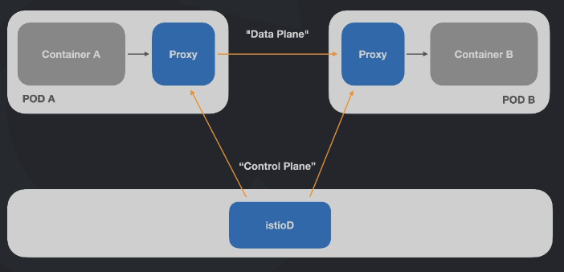

# Service Mesh

# Introdução
Criaiar regras claras de trafego  como as aplicaçaocoes vao ser comunicadas e monitoradas. Como malha  de serviços podem ser monitorados, e mudados o seu comportamento com requisitos de alto nivel. Ante, todas as vezes de trocas requisitos de recursos, era na mao e no codigo. Observabilidade. Coletar logs, metricas, rastreabilidade para entenderemos onde esta o problema na sitrua'çao para resolver problemas o mais rapido possivel.

Todas essas infos de comunicaçoes entre sistemas podem ser monitoradas e modificar o comportamento da omunicaçao de acordo com os requisitos do negocio. Vamos rodar o istio em cima do k8s. eLE CAI COMO UMA LUVA EM CIMA DO K8S PARA TIRAR RESULTADOS AINDA MAIS FANTASTICOS. IMPORTASNTE: da mesma forma que o k8s, sao sistemas etremamente complexos e consegue ir muito a fundo, a ideia aqui é dar uma base para saber e entender principalmente os comportamento que os devs trabalham.

Principais caracteristicas para aplicaçoes distribuidas. Muitos microserviços e aplicaçoes. Ai que vem o poder computacional do istio. 

## O mundo distribuido
Ha empresas que possuem até 10000 microsserrviços que se comunicam para gerar o resultado final e se comunicando. Ms sao sistemas pequenos com responsabilidade muito bem definidas que se comunicam poara gerar um resultado final para o cliente que atenda os requisitos de negocio. Podemos ter ateh apis externas e sistmas de terceiros. Um MS chama o outro agindo rapidademnte pq precisam de resultados de forma muito rapida! Nao pode ter latencia! 

E ventualmente eles começam a ter todo um ecossistema que todos falem com todos. Isso as vezes faz com que ese tenha diversos tipos de requisitos. Vamos imaginar qure O MS D tem que se comuynicar com o C que recupera dados do usuário e se demorar mais 1que 1 seg, o cliente vai ter uma pessima experiencia. Ou o Pix, tem que ser instantaneo e devem cumprir requisitos. Esse banco tem até um limite x para respoinder. Por isso precisamos defnir metricas e regras de tempo. Se nao atender, a aplicaçao não pode nem continuar.

Outra, O MSA A, chama o B e chama o B. Mas isso pode requisitar tanta demanda em um C ficar lendo, o outro fica lento e demora para responder para o A, gerando efeito em cascata e receber um monte de solicitaçao e gerar inumeras pendencia, fazendo com que alguem caia. Percebemos que com sistemas distribuidos eventos acontecem em cascata e contaminal os outros. Como fazer para que tudo volte ao normal e ter respostas para evitar problemas?

Outra, o MS G chama o B, mas como o G nao é tao prioritário, quando ele se conectar com o B, responder 200 reqs/s, se passar disso pode dar um gateway timout e cria-se a necessidade de interferir nesse ponto. Implementar timeout, ratelimit. isolamento, etc. E durante essas comunicaçoes, alguem se infiltra e pega no meio do caminho (man in the middle) as coisas precisam ser encriptadas. Timeout com API externa. Como garantir segurança da rede?

Trabalhar com sertificado etc. Nao da para programar tudo isso na mao. Outro ponto, o dev apenas conhece o seu proiprio MS. Ele sabe quantas vezes tem que dar o retry antes de parar. Qual a regra? De onde vem tudo isso? As vezes isso é tao variavel que temos que pensar de outra forma a nivel de negocio.

E isso é muito mais complexo. 

Se esta tudo funcionando, como conseguimos fazer um teste de falha. Se matarmos um MS, como pode escalar isso na rede ou fazer um teste de comportamento? As vezes precisamos colocar erro no proprio sistema para sebermos como o ecossistema vai se comportar.


Por isso precisamos de ferramentas para gerar flexibilidade e observabilidade parea resolver problemas!

## Service mesh vs Istio

Service Mesh: Resiliencia, mudando o comportamento sem mudar o programa nem a linguagem. 

Service Mesh ou Malha de Serviços é uma camada extra adicionada junto ao seu cluster
visando monitorar e modificar em tempo real o tráfego das aplicações, bem como elevar o nível de segurança e confiabilidade de todo ecossistema.

Istio é um projeto open-source que implementa service mesh visando diminuir a complexidade no gerenciamento de aplicações distribuidas independente de qual linguagem ou tecnologia as elas foram desenvolvidas.

Colocada em cima do cluster. 


## Principais Recursos
Gerenciamento de tráfego
  Gateways (entrada e saida)
  Load Balancing
  • Timeout
  • Políticas de retry
  • Circuit Breaker
  • Fault Iniection
• Observabilidade
  • Métricas
  • Traces distribuidos
  • Logs
Segurança
  Man-in-the-middle
  mTLS
  AAA (authentication, authorization e audit)

## Arquitetura do istio

Dinamica e SideCar Proxy

Para o A falar com B, existe uma solicitaçao via rede, exemplo um pagamento, mas o B está ocupado. Se tivermos algum problema, vamos retry 3 vezes. Como controlar isso sem por a mao no código? Com servicemesh, SideCarProxy!

Dentro do Pod A, temos dois container no Pod, um da aplicaçao e outro injetado trabaalhando como Proxy,

O A manda a solicitaçao para o Proxy e no proxy existe a regra. De Proxy para Proxy. Se nao deu certo isso é abstraido para o proxu, por onde passsam as regras de comuncaçao. oURA, IMAGINA UM LIMITE DE REQS/S. Na hora que mandar a 101, nao vai bater no Container B, mas via Proxy. Nao é a aplicaçao que executa as regras de comunicaçao, sim os proxis.

Com ServiceMesh temos uma camada que chama de istioD. Tudo o que configuramos ele confgura para todos os proxies. Tudo o que é dado, sempre é de Proxy para Proxy. Por conta disso, o ServiceMesh usa métricas para saber tudo o que esta acontecendo nas cmunicaçoes. Proxy-2-Proxy, DataPlane. Quem controla o DataPlane é o Control-Plane onde está o istioD. 




oUTRO PONBTO BEM IMPORTANTE É O COMO O ISTIO FUNCIONA DE FORMA GERAL.


Pilot controla formatos de conf
Citaldel Autenticaçao e Identidade
Galley, Traduz as confs do Istio na linguagem istiod

## Monitoramento em Tempo Real 

Conseguimos ver o fluxo da info e a taxa de erro que esta acontecendo. Uma das ferramentas ;e o kiali. Mapa em tempo Real de tudo o que esta acontecendo com essa aplicaçao. 


Enquanto acontece a v1, as v2 e v3 estao com erros. Mapas de serviços para tomada de decisões.


# Código Fonte
https://github.com/rogeriocassares/fc2-istio

# Instalação
## Instalando o k3d
https://k3d.io/v5.6.0/
curl -s https://raw.githubusercontent.com/k3d-io/k3d/main/install.sh | bash

❯ k3d
Usage:
  k3d [flags]
  k3d [command]

Available Commands:
  cluster      Manage cluster(s)
  completion   Generate completion scripts for [bash, zsh, fish, powershell | psh]
  config       Work with config file(s)
  help         Help about any command
  image        Handle container images.
  kubeconfig   Manage kubeconfig(s)
  node         Manage node(s)
  registry     Manage registry/registries
  version      Show k3d and default k3s version

Flags:
  -h, --help         help for k3d
      --timestamps   Enable Log timestamps
      --trace        Enable super verbose output (trace logging)
      --verbose      Enable verbose output (debug logging)
      --version      Show k3d and default k3s version

Use "k3d [command] --help" for more information about a command.

## Criando cluster
A partir da porta 8000:30000 chama o serviço de dentro do cluster.
```bash
k3d cluster create -p "8000:30000@loadbalancer" --agents 2

INFO[0000] portmapping '8000:30000' targets the loadbalancer: defaulting to [servers:*:proxy agents:*:proxy] 
INFO[0000] Prep: Network                                
INFO[0000] Created network 'k3d-k3s-default'            
INFO[0000] Created image volume k3d-k3s-default-images  
INFO[0000] Starting new tools node...                   
INFO[0000] Starting Node 'k3d-k3s-default-tools'        
INFO[0001] Creating node 'k3d-k3s-default-server-0'     
INFO[0001] Creating node 'k3d-k3s-default-agent-0'      
INFO[0001] Creating node 'k3d-k3s-default-agent-1'      
INFO[0001] Creating LoadBalancer 'k3d-k3s-default-serverlb' 
INFO[0001] Using the k3d-tools node to gather environment information 
INFO[0001] Starting new tools node...                   
INFO[0001] Starting Node 'k3d-k3s-default-tools'        
INFO[0002] Starting cluster 'k3s-default'               
INFO[0002] Starting servers...                          
INFO[0002] Starting Node 'k3d-k3s-default-server-0'     
INFO[0006] Starting agents...                           
INFO[0006] Starting Node 'k3d-k3s-default-agent-0'      
INFO[0006] Starting Node 'k3d-k3s-default-agent-1'      
INFO[0013] Starting helpers...                          
INFO[0013] Starting Node 'k3d-k3s-default-serverlb'     
INFO[0019] Injecting records for hostAliases (incl. host.k3d.internal) and for 5 network members into CoreDNS configmap... 
INFO[0021] Cluster 'k3s-default' created successfully!  
INFO[0021] You can now use it like this:                
kubectl cluster-info
```

E mudamos o kubectl para o contexto do cluster atual
```bash
❯ kubectl config use-context k3d-k3s-default

Switched to context "k3d-k3s-default".
```
E verificar os nodes:
```bash
❯ kubectl get no
NAME                       STATUS   ROLES                  AGE     VERSION
k3d-k3s-default-agent-1    Ready    <none>                 2m59s   v1.26.4+k3s1
k3d-k3s-default-agent-0    Ready    <none>                 2m59s   v1.26.4+k3s1
k3d-k3s-default-server-0   Ready    control-plane,master   3m5s    v1.26.4+k3s1
```

## Instalando o istio no cluster
https://istio.io/

Istio tem uma especie de traduçao de manifestos para k8s, para facilitar a vida, existe um client do issue para isso. istio-ctl
```bash
cd ~/Git/SmartCampusMaua/Docs/DevOps/ServiceMesh-Istio
curl -L https://istio.io/downloadIstio | sh -
```

Vamos mover a pasta bin para mover para a pasta /opt e colcoar na pasta PATh do sistema para rodar isttio-ctl de qualquer lugar do computador.

```bash
sudo mv ~/Git/SmartCampusMaua/Docs/DevOps/ServiceMesh-Istio/istio-1.20.2 /opt
```
Configure env:


Profiles: vamnos usar a default. Raramente usamos o Egress.

Recursos são add-ons e podem ser instalados posteriormente.

Com o comando abaixo, vamos instalar o istio0 defaul no cluster kubernets que está no contexto do comando kubectl
```bash
❯ istioctl install

This will install the Istio 1.20.2 "default" profile (with components: Istio core, Istiod, and Ingress gateways) into the cluster. Proceed? (y/N) y
✔ Istio core Installed                                                                                             
✔ Istiod installed                                                                                                 
✔ Ingress gateways installed                                                                                       
✔ Installation complete                                                                                            Made this installation the default for injection and validation.
```

Vamos verificar os pods no namesapace default
```bash

```
Vamos ver os namespaces 
```bash
❯ kubectl get ns
NAME              STATUS   AGE
default           Active   40m
kube-system       Active   40m
kube-public       Active   40m
kube-node-lease   Active   40m
istio-system      Active   2m32s
```

E entao os pods no namespace dop istio
```bash
❯ kubectl get po -n istio-system
NAME                                    READY   STATUS    RESTARTS   AGE
istiod-86b6b995b8-f85p4                 1/1     Running   0          3m5s
istio-ingressgateway-6b49d7f885-twttn   1/1     Running   0          2m37s
```

E os services no namespace do istio
```bash
❯ kubectl get svc -n istio-system
NAME                   TYPE           CLUSTER-IP      EXTERNAL-IP   PORT(S)                                      AGE
istiod                 ClusterIP      10.43.155.90    <none>        15010/TCP,15012/TCP,443/TCP,15014/TCP        4m8s
istio-ingressgateway   LoadBalancer   10.43.153.247   <pending>     15021:31354/TCP,80:30332/TCP,443:30372/TCP   3m40s
```

Os services do Istio tem por padrao a 80 e a 443 tcp, 15021 para o grpc, e a 30332 como mnodePort do Istio


## Injetando sidecar proxy
Vamos criar um simples deployment e injetar o proxy
deplyment.yaml
```yaml
apiVersion: apps/v1
kind: Deployment
metadata:
  name: nginx
spec:
  selector:
    matchLabels:
      app: nginx
  template:
    metadata:
      labels:
        app: nginx
    spec:
      containers:
      - name: nginx
        image: nginx
        resources:
          limits:
            memory: "128Mi"
            cpu: "500m"
        ports:
        - containerPort: 80
```

Vamos rodar
```bash
kubectl apply -f deployment.yaml

deployment.apps/nginx created
```

Vamos verificar os Pods
```bash
❯ kubectl get po                
NAME                     READY   STATUS    RESTARTS      AGE
nginx-765cb4ff6b-q9qjn   1/1     Running   1 (51s ago)   16h
```

Pronto!

Quando trabalhamos com Istio, precisamos de um outro container aplicado ao Pod com as regras de proxy aplicadas.
Como instalar? O k8s trabalha utilizando labels e o  istio tb! uMA DAS FUNÇOES DAS LABELS É SABER QUAL NAMESPACE QUEREMOS QUE ELE INJETE UM SIDE CAR PROXY!

Vamos criar uma label que o istio vai utilizar e para cada Deployment que subir ele vai ver que tem a label e sobe o sidecarproxy junto.

```bash
kubectl label namespace default istio-injection=enabled

namespace/default labeled
```

Legal! Nesse ponto, o kubectl criou a label istio-injection no k8s

Vamos deletar o deployment e criar novamente para que seja aplicada a label a todo o Deployment que esteja no namespace default.

```bash
❯ kubectl delete deploy nginx
deployment.apps "nginx" deleted
```

```bash
❯ kubectl apply -f deployment.yaml

deployment.apps/nginx created
```

Vamos verificar os Pods no namespace default:
```bash
❯ kubectl get po
NAME                     READY   STATUS    RESTARTS   AGE
nginx-765cb4ff6b-kjpxp   2/2     Running   0          38s
```

Existem dois containers rodadnso dentro do Pod! Um é o nginx e o outro é o envoy, que o istio utiliza para proxy.

Vamos descrever o Pod
```bash
❯ kubectl describe pod nginx-765cb4ff6b-kjpxp
Name:             nginx-765cb4ff6b-kjpxp
Namespace:        default
Priority:         0
Service Account:  default
Node:             k3d-k3s-default-server-0/172.21.0.3
Start Time:       Tue, 30 Jan 2024 11:00:45 -0300
Labels:           app=nginx
                  pod-template-hash=765cb4ff6b
                  security.istio.io/tlsMode=istio
                  service.istio.io/canonical-name=nginx
                  service.istio.io/canonical-revision=latest
Annotations:      istio.io/rev: default
                  kubectl.kubernetes.io/default-container: nginx
                  kubectl.kubernetes.io/default-logs-container: nginx
                  prometheus.io/path: /stats/prometheus
                  prometheus.io/port: 15020
                  prometheus.io/scrape: true
                  sidecar.istio.io/status:
                    {"initContainers":["istio-init"],"containers":["istio-proxy"],"volumes":["workload-socket","credential-socket","workload-certs","istio-env...
Status:           Running
IP:               10.42.0.13
IPs:
  IP:           10.42.0.13
Controlled By:  ReplicaSet/nginx-765cb4ff6b
Init Containers:
  istio-init:
    Container ID:  containerd://a8f6efbd7129f6e4eae3a53726a94870f908d8697e049ae799b2e4b869e75af2
    Image:         docker.io/istio/proxyv2:1.20.2
    Image ID:      docker.io/istio/proxyv2@sha256:5786e72bf56c4cdf58e88dad39579a24875d05e213aa9a7bba3c59206f84ab6c
    Port:          <none>
    Host Port:     <none>
    Args:
      istio-iptables
      -p
      15001
      -z
      15006
      -u
      1337
      -m
      REDIRECT
      -i
      *
      -x
      
      -b
      *
      -d
      15090,15021,15020
      --log_output_level=default:info
    State:          Terminated
      Reason:       Completed
      Exit Code:    0
      Started:      Tue, 30 Jan 2024 11:01:18 -0300
      Finished:     Tue, 30 Jan 2024 11:01:18 -0300
    Ready:          True
    Restart Count:  0
    Limits:
      cpu:     2
      memory:  1Gi
    Requests:
      cpu:        100m
      memory:     128Mi
    Environment:  <none>
    Mounts:
      /var/run/secrets/kubernetes.io/serviceaccount from kube-api-access-wjdlx (ro)
Containers:
  nginx:
    Container ID:   containerd://58608c6329e786d2b468ae0d81bb57f8b5795fbea85528bb60600115e68d86f4
    Image:          nginx
    Image ID:       docker.io/library/nginx@sha256:4c0fdaa8b6341bfdeca5f18f7837462c80cff90527ee35ef185571e1c327beac
    Port:           80/TCP
    Host Port:      0/TCP
    State:          Running
      Started:      Tue, 30 Jan 2024 11:01:20 -0300
    Ready:          True
    Restart Count:  0
    Limits:
      cpu:     500m
      memory:  128Mi
    Requests:
      cpu:        500m
      memory:     128Mi
    Environment:  <none>
    Mounts:
      /var/run/secrets/kubernetes.io/serviceaccount from kube-api-access-wjdlx (ro)
  istio-proxy:
    Container ID:  containerd://ae8df4ee6e70f8f22b0a87e51cc0f48b49ae163114e8bea432928f1d58e535da
    Image:         docker.io/istio/proxyv2:1.20.2
    Image ID:      docker.io/istio/proxyv2@sha256:5786e72bf56c4cdf58e88dad39579a24875d05e213aa9a7bba3c59206f84ab6c
    Port:          15090/TCP
    Host Port:     0/TCP
    Args:
      proxy
      sidecar
      --domain
      $(POD_NAMESPACE).svc.cluster.local
      --proxyLogLevel=warning
      --proxyComponentLogLevel=misc:error
      --log_output_level=default:info
    State:          Running
      Started:      Tue, 30 Jan 2024 11:01:20 -0300
    Ready:          True
    Restart Count:  0
    Limits:
      cpu:     2
      memory:  1Gi
    Requests:
      cpu:      100m
      memory:   128Mi
    Readiness:  http-get http://:15021/healthz/ready delay=0s timeout=3s period=15s #success=1 #failure=4
    Startup:    http-get http://:15021/healthz/ready delay=0s timeout=3s period=1s #success=1 #failure=600
    Environment:
      JWT_POLICY:                    third-party-jwt
      PILOT_CERT_PROVIDER:           istiod
      CA_ADDR:                       istiod.istio-system.svc:15012
      POD_NAME:                      nginx-765cb4ff6b-kjpxp (v1:metadata.name)
      POD_NAMESPACE:                 default (v1:metadata.namespace)
      INSTANCE_IP:                    (v1:status.podIP)
      SERVICE_ACCOUNT:                (v1:spec.serviceAccountName)
      HOST_IP:                        (v1:status.hostIP)
      ISTIO_CPU_LIMIT:               2 (limits.cpu)
      PROXY_CONFIG:                  {}
                                     
      ISTIO_META_POD_PORTS:          [
                                         {"containerPort":80,"protocol":"TCP"}
                                     ]
      ISTIO_META_APP_CONTAINERS:     nginx
      GOMEMLIMIT:                    1073741824 (limits.memory)
      GOMAXPROCS:                    2 (limits.cpu)
      ISTIO_META_CLUSTER_ID:         Kubernetes
      ISTIO_META_NODE_NAME:           (v1:spec.nodeName)
      ISTIO_META_INTERCEPTION_MODE:  REDIRECT
      ISTIO_META_WORKLOAD_NAME:      nginx
      ISTIO_META_OWNER:              kubernetes://apis/apps/v1/namespaces/default/deployments/nginx
      ISTIO_META_MESH_ID:            cluster.local
      TRUST_DOMAIN:                  cluster.local
    Mounts:
      /etc/istio/pod from istio-podinfo (rw)
      /etc/istio/proxy from istio-envoy (rw)
      /var/lib/istio/data from istio-data (rw)
      /var/run/secrets/credential-uds from credential-socket (rw)
      /var/run/secrets/istio from istiod-ca-cert (rw)
      /var/run/secrets/kubernetes.io/serviceaccount from kube-api-access-wjdlx (ro)
      /var/run/secrets/tokens from istio-token (rw)
      /var/run/secrets/workload-spiffe-credentials from workload-certs (rw)
      /var/run/secrets/workload-spiffe-uds from workload-socket (rw)
Conditions:
  Type              Status
  Initialized       True 
  Ready             True 
  ContainersReady   True 
  PodScheduled      True 
Volumes:
  workload-socket:
    Type:       EmptyDir (a temporary directory that shares a pod's lifetime)
    Medium:     
    SizeLimit:  <unset>
  credential-socket:
    Type:       EmptyDir (a temporary directory that shares a pod's lifetime)
    Medium:     
    SizeLimit:  <unset>
  workload-certs:
    Type:       EmptyDir (a temporary directory that shares a pod's lifetime)
    Medium:     
    SizeLimit:  <unset>
  istio-envoy:
    Type:       EmptyDir (a temporary directory that shares a pod's lifetime)
    Medium:     Memory
    SizeLimit:  <unset>
  istio-data:
    Type:       EmptyDir (a temporary directory that shares a pod's lifetime)
    Medium:     
    SizeLimit:  <unset>
  istio-podinfo:
    Type:  DownwardAPI (a volume populated by information about the pod)
    Items:
      metadata.labels -> labels
      metadata.annotations -> annotations
  istio-token:
    Type:                    Projected (a volume that contains injected data from multiple sources)
    TokenExpirationSeconds:  43200
  istiod-ca-cert:
    Type:      ConfigMap (a volume populated by a ConfigMap)
    Name:      istio-ca-root-cert
    Optional:  false
  kube-api-access-wjdlx:
    Type:                    Projected (a volume that contains injected data from multiple sources)
    TokenExpirationSeconds:  3607
    ConfigMapName:           kube-root-ca.crt
    ConfigMapOptional:       <nil>
    DownwardAPI:             true
QoS Class:                   Burstable
Node-Selectors:              <none>
Tolerations:                 node.kubernetes.io/not-ready:NoExecute op=Exists for 300s
                             node.kubernetes.io/unreachable:NoExecute op=Exists for 300s
Events:
  Type    Reason     Age   From               Message
  ----    ------     ----  ----               -------
  Normal  Scheduled  2m4s  default-scheduler  Successfully assigned default/nginx-765cb4ff6b-kjpxp to k3d-k3s-default-server-0
  Normal  Pulling    2m5s  kubelet            Pulling image "docker.io/istio/proxyv2:1.20.2"
  Normal  Pulled     92s   kubelet            Successfully pulled image "docker.io/istio/proxyv2:1.20.2" in 32.341313682s (32.341329515s including waiting)
  Normal  Created    92s   kubelet            Created container istio-init
  Normal  Started    92s   kubelet            Started container istio-init
  Normal  Pulling    91s   kubelet            Pulling image "nginx"
  Normal  Pulled     90s   kubelet            Successfully pulled image "nginx" in 1.153849709s (1.153866751s including waiting)
  Normal  Created    90s   kubelet            Created container nginx
  Normal  Started    90s   kubelet            Started container nginx
  Normal  Pulled     90s   kubelet            Container image "docker.io/istio/proxyv2:1.20.2" already present on machine
  Normal  Created    90s   kubelet            Created container istio-proxy
  Normal  Started    90s   kubelet            Started container istio-proxy
```

É do container istio=proxy que precisamos e tudo o que acontecer para o nginx vai passar por esse container.


## Configurando addons
Vamos aumentar o nivel de observabilidade com oistio com o kiali. Ver regras de rede e como cada um esta se comunicando.

Kiali, grafana, jaeger etc. 

https://istio.io/latest/docs/ops/integrations/

Vamos instalar o addon do prometeus primeiro.
```bash
❯ kubectl apply -f https://raw.githubusercontent.com/istio/istio/release-1.20/samples/addons/prometheus.yaml
serviceaccount/prometheus created
configmap/prometheus created
clusterrole.rbac.authorization.k8s.io/prometheus created
clusterrolebinding.rbac.authorization.k8s.io/prometheus created
service/prometheus created
deployment.apps/prometheus created
```

kiali
```bash
❯ kubectl apply -f https://raw.githubusercontent.com/istio/istio/release-1.20/samples/addons/kiali.yaml
serviceaccount/kiali created
configmap/kiali created
clusterrole.rbac.authorization.k8s.io/kiali-viewer created
clusterrole.rbac.authorization.k8s.io/kiali created
clusterrolebinding.rbac.authorization.k8s.io/kiali created
role.rbac.authorization.k8s.io/kiali-controlplane created
rolebinding.rbac.authorization.k8s.io/kiali-controlplane created
service/kiali created
deployment.apps/kiali created
```


jaeger
```bash
❯ kubectl apply -f https://raw.githubusercontent.com/istio/istio/release-1.20/samples/addons/jaeger.yaml

deployment.apps/jaeger created
service/tracing created
service/zipkin created
service/jaeger-collector created
```


grafana
```bash
❯ kubectl apply -f https://raw.githubusercontent.com/istio/istio/release-1.20/samples/addons/grafana.yaml

serviceaccount/grafana created
configmap/grafana created
service/grafana created
deployment.apps/grafana created
configmap/istio-grafana-dashboards created
configmap/istio-services-grafana-dashboards created
```

Todos esses addons foram instalados debaixo do namespace itstio-system
```bash
❯ kubectl get po -n istio-system
NAME                                    READY   STATUS    RESTARTS      AGE
istiod-86b6b995b8-f85p4                 1/1     Running   1 (25m ago)   17h
istio-ingressgateway-6b49d7f885-twttn   1/1     Running   1 (25m ago)   17h
prometheus-67f6764db9-264tp             2/2     Running   0             3m59s
kiali-55bfd5c754-gzmfj                  1/1     Running   0             2m27s
jaeger-78756f7d48-nxrhz                 1/1     Running   0             2m4s
grafana-7bd5db55c4-6vsmx                1/1     Running   0             71s
```

Vamos acessar o Dahsboard de forma autenticada
```bash
❯ istioctl dashboard kiali

http://localhost:20001/kiali
```

E ele já abriu uma página na web!


Em Graph -> Namespace Default -> Display idle nodes


Triangulo -> SService
Quadrado -> Deployment


# Gerenciamento de Tráfego
## Falando sobre gerenciamento de tráfego
Quando trabalhamos com k8s, quando batemos no servi;co, o istio faz o balancemaneto de carga. Mas agora temos o side car proxy onde todas as comunicaçoes sao realizadas atraves dele. O istio control plane grencia e configura todos esse proxies para conseguirmos mudar comportamento de como as coisas vao acontecer no cluster k8s.

Como fazer essas mudanças e as pricipais funcionalidades pronto para uso para tirar o maximo do k8s e ao mesmo tempo trazer mais valor para a aplicaçao, trazendo outras opçoes de entrega e deploy da aplicaçao.

## Conceitos básicos
Funcionamento Padrao odo k8s

E se quiséssemos que o Pod 1 recebesse 50% do trafego para testar uma versao diferente? Com Service Mesh conseguimos criar decisoes estratégicas para lidar com balanceamento dos serviços pela rede e nao através da aplicaçao em si.

Tráfego com Istio
Ingress Gw (camada 4 a 6) De forma geral, trabalha com liberaçao de portas e certificados para que o trafego entre. Como gerenciar e rotear o trafego para dentro da aplicaçao? -> VIRTUAL SERVICE!

NAO CONFUNDIR SERVICE DO K8S COM VIRTUAL SERVICE DO ISTIO. SAO COMPLEMENTARES. O VS DO ISTRIO É UMA ESPECIE DE ROTEADOR. QUando ele recebe uma requ do IngressGateway, o vs vai tomar algumas decisóes de rotramento desse trafego e enviar para um destino.

O IG libera a entrada do trafego, o VS faz o roteamento do trafego e utiliza o srvice do k8s para fazer esse encaminhamento.


Vamos imaginar que temos algumas decisoes. Sistemas com 3 versoes diferentes. No k8s, cria 3 pods e balanceia. Mas no VS consegue trazer recursos a mais. 
Match url (dominio, formato). O VS sempre aponta para um destino.
Retries (3 vezes automatico nao via software)
Fault Injection (comportamento injetando erro)
Timeout
Subsets (categorias de destino. DestinationRule. Processos de deploy com pesos de prioridade)

## Resumindo conceitos
Gateway: Gerencia a entrada e saída do tráfego. Trabalha nos layers 4-6, garantindo o gerenciamento de portas, host, e TLS. É conectado diretamente a um Virtual
Service que será responsável pelo roteamento.

Virtual Service: Um Virtual Service permite você configurar como as requisições serão roteadas para um serviço. Ela possui uma série de regras que quando aplicadas farão com que a requisição seja direcionada ao destino correto. Roteamento de Tráfego, Retries, Fault Injection, Subsets 

Destination Rules: "Você pode pensar nos virtual services como uma forma que você tem para rotear o tráfego para um destino, e então você usa as destination rules para configurar o que acontece com o tráfego quando ele chega naquele destino"
https://istio.o/latest/docs/concepts/traffic-management/#destination-rules

## Criando versões de deployments
Vamos fazer uma pequena modificaçao no arquivo de Deployment
```yaml
apiVersion: apps/v1
kind: Deployment
metadata:
  name: nginx
spec:
  selector:
    matchLabels:
      app: nginx
  template:
    metadata:
      labels:
        app: nginx
    spec:
      containers:
      - name: nginx
        image: wesleywillians/nginx-ab
        resources:
          limits:
            memory: "128Mi"
            cpu: "500m"
        ports:
        - containerPort: 80
```

`rogeriocassares/nginx-ab` significa que criamos uma imagem do nginx e está escrito Fullcycle-A. E se colcoarmos a tag rogeriocassares/nginx-ab:b, vai aparecer a tag B para termos uma distinçao entre as versoes.

Vamos duplicar esse deploy e mudar o nome do deployment para nginx-b com a imagem com a tag b. Isso significa que temos dois deployments, um nginx e outro nginx-b.

Apesar de os Pods serem gerenciados por deployments diferentes, possuem o mesmo match label.. Isso significa que se criarmos um serviço, vamos configurar para ele pegar todos os Pods que tenham app: nginx, isto é, todos os Pods do Deployment B e A. Vamos usar a porta 8000 do Service para a porta 80 do Pod e a Porta 30000 do nodePort. 

```yaml
apiVersion: apps/v1
kind: Deployment
metadata:
  name: nginx
spec:
  replicas: 1
  selector:
    matchLabels:
      app: nginx
  template:
    metadata:
      labels:
        app: nginx
    spec:
      containers:
      - name: nginx
        image: wesleywillians/nginx-ab
        ports:
        - containerPort: 80

---

apiVersion: apps/v1
kind: Deployment
metadata:
  name: nginx-b
spec:
  replicas: 1
  selector:
    matchLabels:
      app: nginx
  template:
    metadata:
      labels:
        app: nginx
    spec:
      containers:
      - name: nginx
        image: wesleywillians/nginx-ab:b
        ports:
        - containerPort: 80

---

apiVersion: v1
kind: Service
metadata:
  name: nginx-service
spec:
  type: LoadBalancer
  selector:
    app: nginx
  ports:
  - port: 8000
    targetPort: 80
    nodePort: 30000
```

Vamos aplicar esse arquivo
```bash
❯ kubectl apply -f deployment.yaml 
deployment.apps/nginx configured
deployment.apps/nginx-b created
service/nginx-service created
```

```bash
❯ kubectl get po
NAME                      READY   STATUS    RESTARTS   AGE
nginx-b-b9c457c57-k8xt4   2/2     Running   0          41s
nginx-675445865f-dcz42    2/2     Running   0          41s
```

```bash
❯ kubectl get svc                 
NAME            TYPE           CLUSTER-IP     EXTERNAL-IP                        PORT(S)          AGE
kubernetes      ClusterIP      10.43.0.1      <none>                             443/TCP          2d17h
nginx-service   LoadBalancer   10.43.171.37   172.21.0.3,172.21.0.4,172.21.0.5   8000:30000/TCP   3m47s
```

Isso significa que se acessarmos http://localhost:8000, verificamos no navegador a mensagem `Full Cycle A`.


Para ficar mais facil para ver se ambos os services estao funcionado,
```bash
while true;do curl http://localhost:8000; sleep 0.5; done;
```

E entao vamos ver cada hora acessando um Pod!

Se agora formos verificar o kiali, vemos que o tráfego vem de um lugar desconhecido, bate no serviço nginx e é direcionado para os apps.


Agora, como conseguimos saber qual deles é qual versdao? Por padrao, o istio consegue advinhar o nginx-service e os Pods pq rlr parte do proncipio de que estamos usando a Tag chamada app. E por conta disso ele consegue reconhecer os WorkLoads e etc. Além disso, ele consegue tb reconhecer a versao em labels. Vamos aplicar a label de version no deployment:

```yaml
apiVersion: apps/v1
kind: Deployment
metadata:
  name: nginx
spec:
  replicas: 1
  selector:
    matchLabels:
      app: nginx
  template:
    metadata:
      labels:
        app: nginx
        version: A
    spec:
      containers:
      - name: nginx
        image: wesleywillians/nginx-ab
        ports:
        - containerPort: 80

---

apiVersion: apps/v1
kind: Deployment
metadata:
  name: nginx-b
spec:
  replicas: 1
  selector:
    matchLabels:
      app: nginx
  template:
    metadata:
      labels:
        app: nginx
        version: B
    spec:
      containers:
      - name: nginx
        image: wesleywillians/nginx-ab:b
        ports:
        - containerPort: 80

---

apiVersion: v1
kind: Service
metadata:
  name: nginx-service
spec:
  type: LoadBalancer
  selector:
    app: nginx
  ports:
  - port: 8000
    targetPort: 80
    nodePort: 30000
```

Vamos aplicar:


E verificar com o curl
```bash
while true;do curl http://localhost:8000; sleep 0.5; done;
```


E agora ele mostra as verões!

## Criando deploy canário manualmente
Vamos imaginar que A é o software que está rodando e B é um experimento que queremos ver como ele se comporta. Existe um tipo de deployment que se chama Canary Deployment. Ele faz um split das versoes para controlar a quantidade de trafego que mandaremos para cada versao. O k8s nao tem muita ferramenta para fazer isso. 

Em um cenário em que o A tenha 8 réplicas e o B 2, ao todo teremos 10 Pods.

```yaml
apiVersion: apps/v1
kind: Deployment
metadata:
  name: nginx
spec:
  replicas: 8
  selector:
    matchLabels:
      app: nginx
  template:
    metadata:
      labels:
        app: nginx
        version: A
    spec:
      containers:
      - name: nginx
        image: wesleywillians/nginx-ab
        ports:
        - containerPort: 80

---

apiVersion: apps/v1
kind: Deployment
metadata:
  name: nginx-b
spec:
  replicas: 2
  selector:
    matchLabels:
      app: nginx
  template:
    metadata:
      labels:
        app: nginx
        version: B
    spec:
      containers:
      - name: nginx
        image: wesleywillians/nginx-ab:b
        ports:
        - containerPort: 80

---

apiVersion: v1
kind: Service
metadata:
  name: nginx-service
spec:
  type: LoadBalancer
  selector:
    app: nginx
  ports:
  - port: 8000
    targetPort: 80
    nodePort: 30000
```

E vamos aplicar
```bash
❯ kubectl apply -f deployment.yaml

deployment.apps/nginx configured
deployment.apps/nginx-b configured
service/nginx-service unchanged
```

```bash
❯ kubectl get po
NAME                       READY   STATUS    RESTARTS   AGE
nginx-b-7494cd778f-8tb96   2/2     Running   0          15m
nginx-5c9577968b-zwm6w     2/2     Running   0          15m
nginx-5c9577968b-pcb9d     2/2     Running   0          6m18s
nginx-5c9577968b-qt2wt     2/2     Running   0          6m18s
nginx-5c9577968b-tdljp     2/2     Running   0          6m18s
nginx-5c9577968b-hlw9j     2/2     Running   0          6m18s
nginx-b-7494cd778f-b576m   2/2     Running   0          6m18s
nginx-5c9577968b-6xlpw     2/2     Running   0          6m18s
nginx-5c9577968b-95qcj     2/2     Running   0          6m18s
nginx-5c9577968b-xng7d     2/2     Running   0          6m18s
```
Pronto. cOMO PODE SER VISTO, HÁ 2 pODS NA VERSAO b E 8 NA VERSAO a


Vamos fazer o curl
```bash
while true;do curl http://localhost:8000; sleep 0.5; done;
```


Somente de fazer isso, conseguimos ver a distribuiçao em  uma espécie de deploy canary e testar o comportamento dele de vez em vez até que tudo seja implementado ok! Dessa forma nao fazemos nada com o Istio, mas apenas com o k8s.

No istio, há um recurso especifico para controle de tráfego com o Virtual Service e uma destinatio Rule.


## Criando deploy canário em segundos com istio e kiali
Vamos trabalhar com istio com VirtualService e DestinationRule
Vamos deixar uma replica de cada um no deployment
```yaml
apiVersion: apps/v1
kind: Deployment
metadata:
  name: nginx
spec:
  replicas: 1
  selector:
    matchLabels:
      app: nginx
  template:
    metadata:
      labels:
        app: nginx
        version: A
    spec:
      containers:
      - name: nginx
        image: wesleywillians/nginx-ab
        ports:
        - containerPort: 80

---

apiVersion: apps/v1
kind: Deployment
metadata:
  name: nginx-b
spec:
  replicas: 1
  selector:
    matchLabels:
      app: nginx
  template:
    metadata:
      labels:
        app: nginx
        version: B
    spec:
      containers:
      - name: nginx
        image: wesleywillians/nginx-ab:b
        ports:
        - containerPort: 80

---

apiVersion: v1
kind: Service
metadata:
  name: nginx-service
spec:
  type: LoadBalancer
  selector:
    app: nginx
  ports:
  - port: 8000
    targetPort: 80
    nodePort: 30000
```

E aplicar:
```bash
❯ kubectl apply -f deployment.yaml
deployment.apps/nginx configured
deployment.apps/nginx-b configured
service/nginx-service unchanged
```

```bash
❯ kubectl get po                  
NAME                       READY   STATUS    RESTARTS   AGE
nginx-b-7494cd778f-8tb96   2/2     Running   0          20m
nginx-5c9577968b-zwm6w     2/2     Running   0          20m
```

E o tráfego volta ao normal 50% 50% com a mesma quantidade de Pods.


Vamos utilizar o istio para fazer o controle de trafego primeiramewnte de uma forma mais basica:
Ao Clicarmos com o botao dirteito na figura do triangulo do nginx-service e entao em Details, Actions, Traffic Shifting, e entao selecionar o peso do trafego para cada Destination Workload. sE CONFIGURARMOS 75% DE ACESSO PARA O nginx, o nginx-b terá 25%. E entao selecione Create!

A partir de agora, se olharmos nos nossos graficos, existe um icone diferente mostyrando que há configuraçoes especificas realizadas no kiali.

Para enviarmos mais quantidades de mensagens, vamos enviar os comandos de request de uma forma diferente com o fortio. Vamos copiar a url e apliça-la
```bash
❯ kubectl apply -f https://raw.githubusercontent.com/istio/istio/release-1.20/samples/httpbin/sample-client/fortio-deploy.yaml
service/fortio created
deployment.apps/fortio-deploy created
```

Isso criopu um service e um deployment do fortio.
```bash
❯ kubectl get po
NAME                            READY   STATUS    RESTARTS      AGE
nginx-b-7494cd778f-8tb96        2/2     Running   2 (17m ago)   4d22h
nginx-5c9577968b-zwm6w          2/2     Running   2 (17m ago)   4d22h
fortio-deploy-956754996-fnbp5   2/2     Running   0             45s
```

Outra coisa que facilita, é exportar os comandos do fortio como variavel de ambiente
```bash
export FORTIO_POD=$(kubectl get pods -l app=fortio -o 'jsonpath={.items[0].metadata.name}')
```

```bash
❯ echo $FORTIO_POD
fortio-deploy-956754996-fnbp5
```

Vamos execurar o container fortio que está dentro do Pod chamado FORTIO_POD. Temos dois contaiuners rodando, sebndo um o proxy, por isso que temos que definir com a variavel -c
```bash
kubectl exec "$FORTIO_POD" -c fortio -- /usr/bin/fortio load -c 2 -qps 0 -t 200s -loglevel Warning http://nginx-service:8000
```

Entao durante 200 segundos ele vai mandar o trafego para os serviços.

Vamos acessar o kiali e verificar os gráficcos!


Os Pods estão sendo distribuidos exatamente como programamos! O nosso proxy que está trabalhando em cima disso!

Vamos mudar o Traffic shiffiting para 20% e 80%


E deu certo!

Olha como podemos gerencviar independente da quantidade de Pods para cada uma das nossas versoes.

Se formos agora em Services, vemos que há duas configuraçoes do Istio! Virtual Service e DestinationRule associadas ao nginx-service e clicando em cada um conseguimos visualizar o arquivo yaml de cada um!

No proximo video, vamos apagar tudo o que fizemos e e vamoso aplicar os deployments via código!


## Criando virtual service e destination rule
Vamos deletar as actions nos istio config pelo painel do kiali

E o servi';co passa de novo para 50 50.

Vamos criar um arquivo vs.yaml que será o virtual service como mainidesto
```yaml
apiVersion: networking.istio.io/v1alpha3
kind: VirtualService
metadata:
  name: nginx-vs
spec:
  hosts: 
  - nginx-service
  http:
    - route:  
      - destination:
          host: nginx-service
          subset: v1
        weight: 90
      - destination:
          host: nginx-service
          subset: v2
        weight: 10
```

E um arquivo de destination rule
```yaml
apiVersion: networking.istio.io/v1alpha3
kind: DestinationRule
metadata:
  name: nginx-dr
spec:
  host: nginx-service
  subsets:
    - name: v1
      labels:
        version: A
    - name: v2
      labels:
        version: B
```

E vamos aplicar
```bash
❯ cd DevOps/ServiceMesh-Istio
❯ kubectl apply -f .         

deployment.apps/nginx unchanged
deployment.apps/nginx-b unchanged
service/nginx-service unchanged
destinationrule.networking.istio.io/nginx-dr created
virtualservice.networking.istio.io/nginx-vs created
```

Vamos rodar com o fortio
```bash
❯ kubectl exec "$FORTIO_POD" -c fortio -- /usr/bin/fortio load -c 2 -qps 0 -t 200s -loglevel Warning http://nginx-service:8000
```

E verificar no kiali se o trafego está 90% 10%


E foi!

A partir de agora podemos implementar outros recursos!

## Tipos de load balancer

Vamos colcoar um novo comportamento de distribuiçao de trafego. 

Na versao A, podemos colcoar 8 replicar e na versaoo B, 18. Essas replicas sao os Pods que vamos trabalhar. A destination Rule escolhe qual Pod o trafego sera enviado. Na versao 1, associada ao A e na v2 entre os 18 da versao B.
deployment.yaml
```yaml
apiVersion: apps/v1
kind: Deployment
metadata:
  name: nginx
spec:
  replicas: 8
  selector:
    matchLabels:
      app: nginx
  template:
    metadata:
      labels:
        app: nginx
        version: A
    spec:
      containers:
      - name: nginx
        image: wesleywillians/nginx-ab
        ports:
        - containerPort: 80

---

apiVersion: apps/v1
kind: Deployment
metadata:
  name: nginx-b
spec:
  replicas: 18
  selector:
    matchLabels:
      app: nginx
  template:
    metadata:
      labels:
        app: nginx
        version: B
    spec:
      containers:
      - name: nginx
        image: wesleywillians/nginx-ab:b
        ports:
        - containerPort: 80

---

apiVersion: v1
kind: Service
metadata:
  name: nginx-service
spec:
  type: LoadBalancer
  selector:
    app: nginx
  ports:
  - port: 8000
    targetPort: 80
    nodePort: 30000
```

A distribuicao e escolha de quais dos Pods é feita através de um LoadBalancer! A questao é qual a regra que esta sendo implementada para LoadBalancer? O padrao é RoundRobin, distribuiçao igualitaria. Mas tb tem o randim, leasd requested, etc. O mais bacana é que temos a opçao de escolher isso depois que o Virtual Service roteou para a Destination Rule.

Em dr.yaml
```yaml
apiVersion: networking.istio.io/v1alpha3
kind: DestinationRule
metadata:
  name: nginx-dr
spec:
  host: nginx-service
  trafficPolicy:
    loadBalancer: 
      simple: ROUND_ROBIN
  subsets:
    - name: v1
      labels:
        version: A
    - name: v2
      labels:
        version: B
```

Esse é o que acontece com o padrao. Mas podemos escolher o LoadBalancer de acordo com o subset em que estamos:
dr.yaml
```yaml
apiVersion: networking.istio.io/v1alpha3
kind: DestinationRule
metadata:
  name: nginx-dr
spec:
  host: nginx-service
  trafficPolicy:
    loadBalancer: 
      simple: ROUND_ROBIN
  subsets:
    - name: v1
      labels:
        version: A
      trafficPolicy:
        loadBalancer: 
          simple: LEAST_CONN 
    - name: v2
      labels:
        version: B
```

E vamos ap;icar:
```bash
❯ kubectl apply -f .

deployment.apps/nginx unchanged
deployment.apps/nginx-b unchanged
service/nginx-service unchanged
destinationrule.networking.istio.io/nginx-dr configured
virtualservice.networking.istio.io/nginx-vs unchanged
```
E vamos testar com o fortio
```bash
❯ kubectl exec "$FORTIO_POD" -c fortio -- /usr/bin/fortio load -c 2 -qps 0 -t 200s -loglevel Warning http://nginx-service:8000
```

E vamos verificar o workoad graphj no kiali


O nivel de granularidade, é de criar subsets e ainda escolher como cada subset vai se comportar. Se acessou de uma versao iPHone, mnanda para um Pod, se acessou diferente, envia para outra versao etc.

Nota: Dependendo do numero de Pods com recursos definidos a maquina pode nao ter suporte para tanto!

Podemos tb colcoar a nossa destination rule geral como random e aplicar novamente o kubectl
```yaml
apiVersion: networking.istio.io/v1alpha3
kind: DestinationRule
metadata:
  name: nginx-dr
spec:
  host: nginx-service
  trafficPolicy:
    loadBalancer: 
      simple: RANDOM
  subsets:
    - name: v1
      labels:
        version: A
      trafficPolicy:
        loadBalancer: 
          simple: LEAST_CONN 
    - name: v2
      labels:
        version: B
```

```bash
❯ kubectl apply -f .

deployment.apps/nginx unchanged
deployment.apps/nginx-b unchanged
service/nginx-service unchanged
destinationrule.networking.istio.io/nginx-dr configured
virtualservice.networking.istio.io/nginx-vs unchanged
```

```bash
❯ kubectl exec "$FORTIO_POD" -c fortio -- /usr/bin/fortio load -c 2 -qps 0 -t 200s -loglevel Warning http://nginx-service:8000
```

E entao o DestinarionRule começa a entregar para as versoes de forma aleatoria.


## Stick session e consistent hash

Imaginando que temos duas versoes com logos com cores diferentes. Quando acessamos a aplicaçao aparece uma cor e depois acessamos e vai para outro serviço com o Logo trocando de cor o tempo inteiro. O sticky significa que o usuário, quando acessar uma versao, nao vai ser redirecionado para outra versao. Ela fica grudada no LoaD bALANCER PARA SABER PARA QUAL VERSAO VAI ENVIAR DE ACORDO COM OS ACESSOS ANTERIORES.

## Dinâmica do consistent hash
Como fazer sticky, com o consitent hash!

Uma vez que ele manda um usuário para a versao A, ele sempre vai enviá-lo para a Versao A. Imagina que na hora da requisiçao colocamos um cookie. Quando informarmos o istio que o consisten hash vai ser baseado em um cookie chamado user, toda vez que o istio encontrar um cookie com user ele vai gerar um hash.

Da proxima vez que acontecer do mesmo user, ele vai gerar o mesmo hash, e como ele sabe que foi para a verso A, ele encaminha as seguuintes.


Mas nao ';e apenas com cookies que o istio trabalho. Pode ser tb baseado no IP do usuário


Se todo mundo de uma emmpresa com determinado IP acessar de dentro da empresa, todos ppodem ser redirecionados para a mesma versao.

DISCLAIMER IMPORTANTE: Existe uma issue do github. Esse conceito de consistent has funciona se nao trabalharmos necessariamente com pesos do Virtual Service. Ainda nao funcionava no momento da aula. É necessário verificar, O ponto é que o Virtual Service poderá ter apenas um subset e na destination rule vai ter apenas um subset tb.

Existem alguns tipos de consistent hash:
httpsHeaderName
httpCookie
UseSourceIp
httpQueryParameterName

## Consistent hash na prática
Vamos criar um arquivo chamado de consistent-hash.yaml e copiar o vs.yaml para dentro dele assim como a dr.yaml

Isso porque vamos modificar algumas coisas pq o istio ainda nao estava preparado para trabalhar com o weight e o consistent-hash. Vamos retirar um destination e colocar o subet como all.

Em destinationRule vamos tirar o subset 2, remover a TrafficPollicy e mudar a labem de version para app. Com isso ele vai pegar todos os Pods com a a label nginx, isto é, as duas versoes.

Alem disso adionaremos a politica baseada na httpHeaderName:
```yaml
apiVersion: networking.istio.io/v1alpha3
kind: VirtualService
metadata:
  name: nginx-vs
spec:
  hosts: 
  - nginx-service
  http:
    - route:  
      - destination:
          host: nginx-service
          subset: all

---

apiVersion: networking.istio.io/v1alpha3
kind: DestinationRule
metadata:
  name: nginx-dr
spec:
  host: nginx-service
  trafficPolicy:
    loadBalancer:
      consistentHash:
        httpHeaderName: "x-user"
  subsets:
    - name: all
      labels:
        app: nginx
```
Vamos aplicar 
```bash
❯ kubectl apply -f consistent-hash.yaml 

virtualservice.networking.istio.io/nginx-vs configured
destinationrule.networking.istio.io/nginx-dr configured
```

E como saber se isso funciona?
Vamos entrar em um Pod e fazer a chamada com curl de dentro de um deles:
```bash
❯ kubectl get po
NAME                            READY   STATUS    RESTARTS      AGE
fortio-deploy-956754996-fnbp5   2/2     Running   2 (54m ago)   24h
nginx-b-7494cd778f-8tb96        2/2     Running   4 (55m ago)   5d23h
nginx-5c9577968b-zwm6w          2/2     Running   4 (55m ago)   5d23h
nginx-5c9577968b-47jq8          2/2     Running   0             38m
nginx-b-7494cd778f-26f2h        2/2     Running   0             38m
nginx-b-7494cd778f-qf2m6        2/2     Running   0             38m
nginx-b-7494cd778f-66rcw        2/2     Running   0             38m
nginx-5c9577968b-hgssb          2/2     Running   0             38m
nginx-5c9577968b-g9tzf          2/2     Running   0             38m
nginx-b-7494cd778f-b9t67        2/2     Running   0             38m
nginx-b-7494cd778f-6jzql        2/2     Running   0             38m
nginx-5c9577968b-mkh6v          2/2     Running   0             38m
nginx-b-7494cd778f-t5lxt        2/2     Running   0             38m
nginx-b-7494cd778f-dp9g9        2/2     Running   0             38m
nginx-b-7494cd778f-hlxhv        2/2     Running   0             38m
nginx-b-7494cd778f-t22mk        2/2     Running   0             38m
nginx-b-7494cd778f-8nn74        2/2     Running   0             38m
nginx-b-7494cd778f-qkzxn        2/2     Running   0             38m
nginx-5c9577968b-fq4xn          2/2     Running   0             38m
nginx-b-7494cd778f-t7td9        2/2     Running   0             38m
nginx-b-7494cd778f-tdqbh        2/2     Running   0             38m
nginx-b-7494cd778f-kz9fb        2/2     Running   0             38m
nginx-b-7494cd778f-hptgt        2/2     Running   0             38m
nginx-b-7494cd778f-lvdvz        2/2     Running   0             38m
nginx-5c9577968b-wzx7m          2/2     Running   0             38m
nginx-5c9577968b-kqvtz          2/2     Running   0             38m
nginx-b-7494cd778f-nkt4t        2/2     Running   0             38m
```

```bash
❯ kubectl exec -it nginx-b-7494cd778f-nkt4t -- bash
root@nginx-b-7494cd778f-nkt4t:/# 
```
E vamos rodar o curl
```bash
root@nginx-b-7494cd778f-nkt4t:/# curl http://nginx-service:8000
Full Cycle B
root@nginx-b-7494cd778f-nkt4t:/# curl http://nginx-service:8000
Full Cycle A
root@nginx-b-7494cd778f-nkt4t:/# curl http://nginx-service:8000
Full Cycle B
root@nginx-b-7494cd778f-nkt4t:/# curl http://nginx-service:8000
Full Cycle B
root@nginx-b-7494cd778f-nkt4t:/# curl http://nginx-service:8000
Full Cycle B
root@nginx-b-7494cd778f-nkt4t:/# curl http://nginx-service:8000
Full Cycle B
root@nginx-b-7494cd778f-nkt4t:/# curl http://nginx-service:8000
Full Cycle A
root@nginx-b-7494cd778f-nkt4t:/# curl http://nginx-service:8000
Full Cycle A
root@nginx-b-7494cd778f-nkt4t:/# curl http://nginx-service:8000
Full Cycle B
root@nginx-b-7494cd778f-nkt4t:/# curl http://nginx-service:8000
```

Como estar o consisten-hah? Vamos utilizar os headers!
```bash
root@nginx-b-7494cd778f-nkt4t:/# curl --header "x-user: testUser" http://nginx-service
:8000
Full Cycle A
root@nginx-b-7494cd778f-nkt4t:/# curl --header "x-user: testUser" http://n:8000service:
Full Cycle A
root@nginx-b-7494cd778f-nkt4t:/# curl --header "x-user: testUser" http://n:8000service:
Full Cycle A
root@nginx-b-7494cd778f-nkt4t:/# curl --header "x-user: testUser" http://n:8000service:
Full Cycle A
root@nginx-b-7494cd778f-nkt4t:/# curl --header "x-user: testUser" http://n:8000service:
Full Cycle A
root@nginx-b-7494cd778f-nkt4t:/# curl --header "x-user: testUser" http://n:8000service:
Full Cycle A
root@nginx-b-7494cd778f-nkt4t:/# curl --header "x-user: testUser" http://n:8000service:
Full Cycle A
root@nginx-b-7494cd778f-nkt4t:/# curl --header "x-user: testUser" http://n:8000service:
Full Cycle A
root@nginx-b-7494cd778f-nkt4t:/# curl --header "x-user: testUser" http://n:8000service:
Full Cycle A
root@nginx-b-7494cd778f-nkt4t:/# curl --header "x-user: testUser" http://n:8000service:
Full Cycle A
root@nginx-b-7494cd778f-nkt4t:/# 
```
Todos cairam no A!

Vamos alterar o user do header para ver se cai em outro e consiste:
```bash
root@nginx-b-7494cd778f-nkt4t:/# curl --header "x-user: testUser-2" http://nginx-servi
ce:8000
Full Cycle B
root@nginx-b-7494cd778f-nkt4t:/# curl --header "x-user: testUser-2" http://nginx-servi
ce:8000
Full Cycle B
root@nginx-b-7494cd778f-nkt4t:/# curl --header "x-user: testUser-2" http://nginx-servi
ce:8000
Full Cycle B
root@nginx-b-7494cd778f-nkt4t:/# curl --header "x-user: testUser-2" http://nginx-servi
ce:8000
Full Cycle B
root@nginx-b-7494cd778f-nkt4t:/# curl --header "x-user: testUser-2" http://nginx-servi
ce:8000
Full Cycle B
root@nginx-b-7494cd778f-nkt4t:/# curl --header "x-user: testUser-2" http://nginx-servi
ce:8000
Full Cycle B
root@nginx-b-7494cd778f-nkt4t:/# curl --header "x-user: testUser-2" http://nginx-servi
ce:8000
Full Cycle B
root@nginx-b-7494cd778f-nkt4t:/# curl --header "x-user: testUser-2" http://nginx-servi
ce:8000
Full Cycle B
root@nginx-b-7494cd778f-nkt4t:/# curl --header "x-user: testUser-2" http://nginx-servi
ce:8000
Full Cycle B
root@nginx-b-7494cd778f-nkt4t:/# curl --header "x-user: testUser-2" http://nginx-servi
ce:8000
```

E caiu tudo no B e a conexao persistiu! Duncionou!


## Fault injection na prática
Muitas vezes a lentidao é pior que a falta do serviço. Por mais que façamos milhares de testes de politicas de fallback, O que precisamos eh conseguir verficar se as regras que colocamos estao sendo eficientes. Como que o sisema se cura o reage e como conseguimos testar de forma pontal e controlada paa verificarmos como o sistema está se comportando. O istio tem o recurso de injeçao de falha no sistema para simular esse tipo de sistema. 

Para simular uma falha sem estar em um service Mesh terismod wur mexer nos microsserviços. No istio, basicamente, configuramos os Proxies para injetar a fakha conforme o necessário.


Modificando o deployment com 1 replica de cada versao
```yaml
apiVersion: apps/v1
kind: Deployment
metadata:
  name: nginx
spec:
  replicas: 1
  selector:
    matchLabels:
      app: nginx
  template:
    metadata:
      labels:
        app: nginx
        version: A
    spec:
      containers:
      - name: nginx
        image: wesleywillians/nginx-ab
        ports:
        - containerPort: 80

---

apiVersion: apps/v1
kind: Deployment
metadata:
  name: nginx-b
spec:
  replicas: 1
  selector:
    matchLabels:
      app: nginx
  template:
    metadata:
      labels:
        app: nginx
        version: B
    spec:
      containers:
      - name: nginx
        image: wesleywillians/nginx-ab:b
        ports:
        - containerPort: 80

---

apiVersion: v1
kind: Service
metadata:
  name: nginx-service
spec:
  type: LoadBalancer
  selector:
    app: nginx
  ports:
  - port: 8000
    targetPort: 80
    nodePort: 30000
```

```bash
❯ kubectl apply -f deployment.yaml                 

deployment.apps/nginx configured
deployment.apps/nginx-b configured
service/nginx-service unchanged
```

Vamos duplicar o arquivo de consisten-hash.yaml para fault-injection.yaml r sdivionar configuraçoes de pontos de falha antes de ela ir para um determinado destino com delay fixo de 10 segundos.

```yaml
apiVersion: networking.istio.io/v1alpha3
kind: VirtualService
metadata:
  name: nginx-vs
spec:
  hosts: 
  - nginx-service
  http:
    - fault:
        delay:
          fixedDelay: 10s
          percentage:
            value: 100
      route:  
      - destination:
          host: nginx-service
          subset: all

---

apiVersion: networking.istio.io/v1alpha3
kind: DestinationRule
metadata:
  name: nginx-dr
spec:
  host: nginx-service
  trafficPolicy:
    loadBalancer:
      consistentHash:
        httpHeaderName: "x-user"
  subsets:
    - name: all
      labels:
        app: nginx
```
E aplicar: 
```bash
❯ kubectl apply -f fault-injection.yaml 

virtualservice.networking.istio.io/nginx-vs configured
destinationrule.networking.istio.io/nginx-dr unchanged
```

E vamos testar com o fortio em um teste de 200s
```bash
❯ kubectl exec "$FORTIO_POD" -c fortio -- /usr/bin/fortio load -c 2 -qps 0 -t 200s -loglevel Warning --timeout 11s http://nginx-service:8000
```

A demora está entre o fortio e o nginx-service e nao entre o nginx-service e o Pod/ 

Se formos rm Service, conseguimos verificar as requisiçoes por segundo., tempo de duração das requisiçoes etc.


Outra coisa que podemos verificar após o comando do fortio, é verificar as requisiçoes na resposta do comando ao final 
```bash
Starting at max qps with 2 thread(s) [gomax 10] for 3m20s
Ended after 3m20.145837257s : 40 calls. qps=0.19985
Aggregated Function Time : count 40 avg 10.007039 +/- 0.006918 min 10.001410005 max 10.046917045 sum 400.281555
# range, mid point, percentile, count
>= 10.0014 <= 10.0469 , 10.0242 , 100.00, 40
# target 50% 10.0236
# target 75% 10.0352
# target 90% 10.0422
# target 99% 10.0465
# target 99.9% 10.0469
```

Se mudarmos o valor da porcentagem de 100 para zero
```yaml
apiVersion: networking.istio.io/v1alpha3
kind: VirtualService
metadata:
  name: nginx-vs
spec:
  hosts: 
  - nginx-service
  http:
    - fault:
        delay:
          fixedDelay: 10s
          percentage:
            value: 0
      route:  
      - destination:
          host: nginx-service
          subset: all

---

apiVersion: networking.istio.io/v1alpha3
kind: DestinationRule
metadata:
  name: nginx-dr
spec:
  host: nginx-service
  trafficPolicy:
    loadBalancer:
      consistentHash:
        httpHeaderName: "x-user"
  subsets:
    - name: all
      labels:
        app: nginx
```

Aplicarmos:
```bash
❯ kubectl apply -f fault-injection.yaml

virtualservice.networking.istio.io/nginx-vs configured
destinationrule.networking.istio.io/nginx-dr unchanged
```

E rodarmos o fortio:
```bash
❯ kubectl exec "$FORTIO_POD" -c fortio -- /usr/bin/fortio load -c 2 -qps 0 -t 20s -loglevel Warning --timeout 11s http://nginx-service:8000 

{"ts":1707402515.522120,"level":"info","r":1,"file":"logger.go","line":254,"msg":"Log level is now 3 Warning (was 2 Info)"}
Fortio 1.60.3 running at 0 queries per second, 10->10 procs, for 20s: http://nginx-service:8000
Starting at max qps with 2 thread(s) [gomax 10] for 20s
Ended after 20.000083426s : 94815 calls. qps=4740.7
Aggregated Function Time : count 94815 avg 0.0004216331 +/- 0.000105 min 0.000249459 max 0.010687667 sum 39.9771427
# range, mid point, percentile, count
>= 0.000249459 <= 0.001 , 0.00062473 , 99.73, 94560
> 0.001 <= 0.002 , 0.0015 , 99.94, 199
> 0.002 <= 0.003 , 0.0025 , 99.98, 41
> 0.003 <= 0.004 , 0.0035 , 99.99, 9
> 0.004 <= 0.005 , 0.0045 , 99.99, 1
> 0.005 <= 0.006 , 0.0055 , 100.00, 1
> 0.007 <= 0.008 , 0.0075 , 100.00, 2
> 0.01 <= 0.0106877 , 0.0103438 , 100.00, 2
# target 50% 0.000625738
# target 75% 0.000813881
# target 90% 0.000926767
# target 99% 0.000994498
# target 99.9% 0.00180495
Error cases : no data
# Socket and IP used for each connection:
[0]   1 socket used, resolved to 10.43.171.37:8000, connection timing : count 1 avg 0.000151459 +/- 0 min 0.000151459 max 0.000151459 sum 0.000151459
[1]   1 socket used, resolved to 10.43.171.37:8000, connection timing : count 1 avg 0.000191959 +/- 0 min 0.000191959 max 0.000191959 sum 0.000191959
Connection time (s) : count 2 avg 0.000171709 +/- 2.025e-05 min 0.000151459 max 0.000191959 sum 0.000343418
Sockets used: 2 (for perfect keepalive, would be 2)
Uniform: false, Jitter: false, Catchup allowed: true
IP addresses distribution:
10.43.171.37:8000: 2
Code 200 : 94815 (100.0 %)
Response Header Sizes : count 94815 avg 238 +/- 0 min 238 max 238 sum 22565970
Response Body/Total Sizes : count 94815 avg 250 +/- 0 min 250 max 250 sum 23703750
All done 94815 calls (plus 2 warmup) 0.422 ms avg, 4740.7 qps
```

Percebemos que o fortio demorou menois de um segundo pq zeramos. 

Se fossemos fazer 50%, 
```yaml
apiVersion: networking.istio.io/v1alpha3
kind: VirtualService
metadata:
  name: nginx-vs
spec:
  hosts: 
  - nginx-service
  http:
    - fault:
        delay:
          fixedDelay: 10s
          percentage:
            value: 50
      route:  
      - destination:
          host: nginx-service
          subset: all

---

apiVersion: networking.istio.io/v1alpha3
kind: DestinationRule
metadata:
  name: nginx-dr
spec:
  host: nginx-service
  trafficPolicy:
    loadBalancer:
      consistentHash:
        httpHeaderName: "x-user"
  subsets:
    - name: all
      labels:
        app: nginx
```

```bash
❯ kubectl apply -f fault-injection.yaml

virtualservice.networking.istio.io/nginx-vs configured
destinationrule.networking.istio.io/nginx-dr unchanged
```

Isso significa que 50% das vezes demorou 0 segundos e o restante demorou 10 segundos. Olha que interessante essa distribyuiçao. 

Mas e se qusessemos falar que o serviço está com o problema ao invés do delay? Temos o abort!
O abort significa que a requisçao é abortadfda.
```yaml
apiVersion: networking.istio.io/v1alpha3
kind: VirtualService
metadata:
  name: nginx-vs
spec:
  hosts: 
  - nginx-service
  http:
    - fault:
        # delay:
        #   fixedDelay: 10s
        #   percentage:
        #     value: 50
        abort:
          httpStatus: 500
          percentage:
            value: 100
      route:  
      - destination:
          host: nginx-service
          subset: all

---

apiVersion: networking.istio.io/v1alpha3
kind: DestinationRule
metadata:
  name: nginx-dr
spec:
  host: nginx-service
  trafficPolicy:
    loadBalancer:
      consistentHash:
        httpHeaderName: "x-user"
  subsets:
    - name: all
      labels:
        app: nginx
```

```bash
❯ kubectl apply -f fault-injection.yaml

virtualservice.networking.istio.io/nginx-vs configured
destinationrule.networking.istio.io/nginx-dr unchanged
```

```bash
❯ kubectl exec "$FORTIO_POD" -c fortio -- /usr/bin/fortio load -c 2 -qps 0 -t 20s -loglevel Warning --timeout 11s http://nginx-service:8000

{"ts":1707402937.540567,"level":"info","r":1,"file":"logger.go","line":254,"msg":"Log level is now 3 Warning (was 2 Info)"}
Fortio 1.60.3 running at 0 queries per second, 10->10 procs, for 20s: http://nginx-service:8000
{"ts":1707402937.545207,"level":"warn","r":39,"file":"http_client.go","line":1104,"msg":"Non ok http code","code":500,"status":"HTTP/1.1 500","thread":0,"run":0}
{"ts":1707402937.545268,"level":"warn","r":40,"file":"http_client.go","line":1104,"msg":"Non ok http code","code":500,"status":"HTTP/1.1 500","thread":1,"run":0}
Aborting because of error 500 for http://nginx-service:8000 (154 bytes)
command terminated with exit code 1
```

De cara já recebeu o erro 500! 

Uma coisa bem interessante é no kiali, em Graphs, nginx-service, details. istio config, remover o virtual service. Novamente nos detalhes do nginx-service, temos a oppçao de Fault Injection. Vamos deletar todas as Traffic Routing e quando clicamos em actions, fault injections, aparece duas opçoes: add http delay, add http abort.


Vamos criar e o kiali colocou isso para funcionar. De forma geral não é legal utilizar o kiali para utiliazr essas coisas para nao perdermos o controle dos manifestos. Mas se isso está afetando a empresa inteira, é melhor fazer isso direto na ui por cauda da urgencia.

Sempre considere essas metricas antes de subir um sistema orientado a microsserviços.

## Circuit breaker

Para garantior resiliencia e evitar efeito dominó quando tivermos usando microsserviços.
Imaginamos 3 microsservi';cos

A -> B -> C

Por outro lado, o C pode estar lento, fazendo com que entre A e B a conexao fique presa. Um lento pode deixar todos os outros lentos! E uma hora o C desiste e fica fora do ar. Na hora que isso acontece o B e o A tem respostas de falhas e tb ficam fora do ar e os 3 caem.

Vamos imaginar que o C está com esse problema mas existe uma "parede" quando o C ficar lento e ela surge anunciando o erro 500 mas o B tem o resultado na hora para o A. É melhor retornar o erro 500 do que manter uma conexao presa e implemntar politicas de fallback

Quando esses prnblemas acontecem, o C pode retornar após 10 segundos, por exemplo e se recuperar do volume do trafego que ele ainda precisa responder.

Depois disso, o C passa novamente a receber as requisiçoes e se ficar lento novamente, fica 20s e vai dobrando cada vez mais para tempo do microsserviço se curar (self-healing), sobe mais Pods, e ele para de retornar 500 e volta ao normal.

Essa "parede" é como um fusível/disjuntor e por isso se chama circuit breaker! O circuito abre para evitar mais danos.


Uma coisa importante. Como podemos resolver? Antigamente havia mecanismos dentro do proprio app para resolver esses tipos de problemas de circuit breaker.

E se cada microsserviço com divcversas linguagens tiverem essas necessidades?

Com o Istio e sistemas em mesh, temos o Proxy  em cada Proxu. Isso significa que nao precisamos implementar o circuit breaker em nossas aplicaçoes! Nós organizamos tudo isso em nossa mesh! 


## Preparando ambiente para circuit breaker
Vamos fazer algumas simulaçoes de circuit breaker

Ba pasta de circuit-breaker, temos uma pasta de sercex. E uum progrma simples em golang que roda na porta 8000. Se tiver uma variavelk de abiente error=yes, ele vai aguardar 5 segundos e retorna um timeout. Se  nao tiver nenhum erro ele retorna um ok.

Com isso conseguimos simular um mucroserviço com erro e um que nao esta com o erro.

O dockerfile que foi gerado já está compilado. A partir dai foi criado um deployment com app servicex e version 200. Outro serviço é o servicex-0-error com version 504 com variavel de ambiente error=yes. Ambos tem a mesma label e a diferença é que umm retorna 200 e outro 504.

Tambem foi criando um service para esse deplyment como clusterIp pq nao precisamos ver de fora, O selector signifiuca que ele vai pegar todos os Pods com a app servicex, fazendo um balanceamento nas versoes.

Vamos deletar o deplyment que estavamos usando para os testes anteriores e subir esse novo:

```bash
❯ kubectl delete -f deployment.yaml
deployment.apps "nginx" deleted
deployment.apps "nginx-b" deleted
service "nginx-service" deleted
```

E aplicar o novo deployment da pasta do circuit breaker
```bash
❯ kubectl apply -f circuit-breaker/k8s/deployment.yaml 
deployment.apps/servicex created
deployment.apps/servicex-error created
service/servicex-service created
```

Verificar os Pods
```bash
❯ kubectl get po
NAME                              READY   STATUS    RESTARTS       AGE
fortio-deploy-956754996-fnbp5     2/2     Running   8 (111m ago)   2d1h
servicex-error-778cfcc455-dppc2   2/2     Running   0              53s
servicex-5cf697c8c8-zr5zc         2/2     Running   0              53s
```

E fazer 20 requisiçoes e nao mais por tempo.
```bash
❯ kubectl exec "$FORTIO_POD" -c fortio -- /usr/bin/fortio load -c 2 -qps 0 -n 20 -loglevel Warning http://servicex-service   

{"ts":1707405725.030552,"level":"info","r":1,"file":"logger.go","line":254,"msg":"Log level is now 3 Warning (was 2 Info)"}
Fortio 1.60.3 running at 0 queries per second, 10->10 procs, for 20 calls: http://servicex-service
Starting at max qps with 2 thread(s) [gomax 10] for exactly 20 calls (10 per thread + 0)
{"ts":1707405726.077048,"level":"warn","r":23,"file":"http_client.go","line":1104,"msg":"Non ok http code","code":504,"status":"HTTP/1.1 504","thread":0,"run":0}
{"ts":1707405727.080297,"level":"warn","r":24,"file":"http_client.go","line":1104,"msg":"Non ok http code","code":504,"status":"HTTP/1.1 504","thread":1,"run":0}
{"ts":1707405729.091979,"level":"warn","r":24,"file":"http_client.go","line":1104,"msg":"Non ok http code","code":504,"status":"HTTP/1.1 504","thread":1,"run":0}
{"ts":1707405732.097795,"level":"err","r":24,"file":"http_client.go","line":1084,"msg":"Read error","err":"read tcp 10.42.1.87:47220->10.43.151.123:80: i/o timeout","size":0,"dest":"10.43.151.123:80","url":"http://servicex-service","thread":1,"run":0}
{"ts":1707405733.110695,"level":"warn","r":24,"file":"http_client.go","line":1104,"msg":"Non ok http code","code":504,"status":"HTTP/1.1 504","thread":1,"run":0}
Ended after 8.078379962s : 20 calls. qps=2.4757
Aggregated Function Time : count 20 avg 0.45684021 +/- 0.8667 min 0.000514959 max 3.00583346 sum 9.1368043
# range, mid point, percentile, count
>= 0.000514959 <= 0.001 , 0.000757479 , 40.00, 8
> 0.001 <= 0.002 , 0.0015 , 55.00, 3
> 0.002 <= 0.003 , 0.0025 , 60.00, 1
> 0.006 <= 0.007 , 0.0065 , 65.00, 1
> 0.007 <= 0.008 , 0.0075 , 70.00, 1
> 0.035 <= 0.04 , 0.0375 , 75.00, 1
> 1 <= 2 , 1.5 , 85.00, 2
> 2 <= 3 , 2.5 , 95.00, 2
> 3 <= 3.00583 , 3.00292 , 100.00, 1
# target 50% 0.00166667
# target 75% 0.04
# target 90% 2.5
# target 99% 3.00467
# target 99.9% 3.00572
Error cases : count 5 avg 1.8142333 +/- 0.7401 min 1.006515376 max 3.00583346 sum 9.07116667
# range, mid point, percentile, count
>= 1.00652 <= 2 , 1.50326 , 40.00, 2
> 2 <= 3 , 2.5 , 80.00, 2
> 3 <= 3.00583 , 3.00292 , 100.00, 1
# target 50% 2.25
# target 75% 2.875
# target 90% 3.00292
# target 99% 3.00554
# target 99.9% 3.0058
# Socket and IP used for each connection:
[0]   2 socket used, resolved to 10.43.151.123:80, connection timing : count 2 avg 0.0001845215 +/- 1.656e-05 min 0.000167959 max 0.000201084 sum 0.000369043
[1]   4 socket used, resolved to 10.43.151.123:80, connection timing : count 4 avg 0.0002738435 +/- 0.0001156 min 0.000163583 max 0.000434833 sum 0.001095374
Connection time (s) : count 6 avg 0.0002440695 +/- 0.0001038 min 0.000163583 max 0.000434833 sum 0.001464417
Sockets used: 6 (for perfect keepalive, would be 2)
Uniform: false, Jitter: false, Catchup allowed: true
IP addresses distribution:
10.43.151.123:80: 6
Code  -1 : 1 (5.0 %)
Code 200 : 15 (75.0 %)
Code 504 : 4 (20.0 %)
Response Header Sizes : count 20 avg 123.8 +/- 71.48 min 0 max 166 sum 2476
Response Body/Total Sizes : count 20 avg 153.3 +/- 36.78 min 0 max 168 sum 3066
All done 20 calls (plus 0 warmup) 456.840 ms avg, 2.5 qps
```

Vimos que metade das requiçoes foram erros 504 e o restante 200

Quanto maior a amostragem, mas precisa é o Load Balancer.

E se formos colocar isso 200 vezes? Isso significa que em 100 vezes, vamos precisar agurdar 5 segundos por conexao! Isto é, 100 conexoes paradas por pelo menos 5 segundos para falar que está dando timeout. E se fosse 30 segundos? É muito complicado e pode gerar um efeito catastrofico!


Quando percebemos que está com problema, esperamos que ele se cure e até lá enviamos a informaçao para quem está saudável.

## Circuit breaker na prática
Como fazer que o circuito se abra?

É inadimissivel que a situacao sem o circuit breaker esteja rodando.

No arquivo circuitbreaker.yaml, foi configurado, basicamente, uma destinarionRule.

E nesse caso, nao precisamos nem de virtual service. o vs escolhe para onde vai rotear, mas o dr é aplicado quando a requisiçao chega a um determinado destino. Nesse caso, a destination rule vai definir  qual Pod vai ser encaminhado o trafego. Nesse caso nao queremos encaminhar trafego para o pod que esta com problema.

Foi criada uma destinarionrule cgamada circuit breaker-servicex. `servicex-service.default.svc.cluster.local` é o host de um service dentro do cluster k8s. Se colocarmos apenas `servicex-service` tb funciona pq vai encontrar no namespace esse servicex.


Em ocasioes anteriores já trabalhamos com algumas politicas de trafego como fault-injection, loadbalancer e aqui vamos trabalhar com a outlienr detector que é o crcuit breaker. 

Um ponto importante. Parametros interessantes,. Consecutive5xxErrors, esse circuito vai se abrir caso aconteça 20 erros consecutivos no intervalo de 10 segundos e vamos ejetar durante 30 segundos em 100% dos Pods, e se isso se repetir o tempo de ejeçao vai dobrando de tempo até estar novamente saudavel.

5xx serve para qualquer tipo de erro
500 Internal Server error

Geralmente qundo o server erstá lento que pode derrubar o sistema, ele retorna o 503 Service Unavailable e o 504 Gw Timeout ou 502.

Além disso, pode ser retornado no Header um cabeçalho retry-after

O parametro consecutive5xx error fala com todos os erros, incclusive erro de aplicaçao 500 e nao de lentidao. Para lentidao, o parametro consecutiveGatewayErrors é o mais adequado!

Se temos um serviço que retorna muitos erros 500. 

Vamos aplicar o arquivo do circuit-breaker.yaml para 5 tentativas consecutivaas em um intervalo de 20 segundos.
```yaml
apiVersion: networking.istio.io/v1alpha3
kind: DestinationRule
metadata:
  name: circuit-breaker-servicex
spec:
  host: servicex-service.default.svc.cluster.local
  trafficPolicy:
    outlierDetection:
      # consecutive5xxErrors: 20
      consecutiveGatewayErrors: 5
      interval: 20s
      baseEjectionTime: 30s
      maxEjectionPercent: 100
```

```bash
❯ kubectl apply -f circuit-breaker/k8s/circuit-breaker.yaml 
destinationrule.networking.istio.io/circuit-breaker-servicex created
```

Depois de ter criado a destination rule, vamos colocar para rodar o fortio
```bash
❯ kubectl exec "$FORTIO_POD" -c fortio -- /usr/bin/fortio load -c 2 -qps 0 -n 200 -loglevel Warning http://servicex-service

{"ts":1707485534.620104,"level":"info","r":1,"file":"logger.go","line":254,"msg":"Log level is now 3 Warning (was 2 Info)"}
Fortio 1.60.3 running at 0 queries per second, 10->10 procs, for 200 calls: http://servicex-service
Starting at max qps with 2 thread(s) [gomax 10] for exactly 200 calls (100 per thread + 0)
{"ts":1707485534.628151,"level":"warn","r":18,"file":"http_client.go","line":1104,"msg":"Non ok http code","code":504,"status":"HTTP/1.1 504","thread":0,"run":0}
{"ts":1707485534.629156,"level":"warn","r":19,"file":"http_client.go","line":1104,"msg":"Non ok http code","code":504,"status":"HTTP/1.1 504","thread":1,"run":0}
{"ts":1707485535.631918,"level":"warn","r":19,"file":"http_client.go","line":1104,"msg":"Non ok http code","code":504,"status":"HTTP/1.1 504","thread":1,"run":0}
{"ts":1707485537.642840,"level":"warn","r":19,"file":"http_client.go","line":1104,"msg":"Non ok http code","code":504,"status":"HTTP/1.1 504","thread":1,"run":0}
{"ts":1707485538.646687,"level":"warn","r":18,"file":"http_client.go","line":1104,"msg":"Non ok http code","code":504,"status":"HTTP/1.1 504","thread":0,"run":0}
Ended after 6.101835253s : 200 calls. qps=32.777
Aggregated Function Time : count 200 avg 0.051060692 +/- 0.3434 min 0.000438416 max 3.00892446 sum 10.2121383
# range, mid point, percentile, count
>= 0.000438416 <= 0.001 , 0.000719208 , 79.00, 158
> 0.001 <= 0.002 , 0.0015 , 87.50, 17
> 0.002 <= 0.003 , 0.0025 , 95.00, 15
> 0.003 <= 0.004 , 0.0035 , 96.50, 3
> 0.006 <= 0.007 , 0.0065 , 97.50, 2
> 1 <= 2 , 1.5 , 98.50, 2
> 2 <= 3 , 2.5 , 99.00, 1
> 3 <= 3.00892 , 3.00446 , 100.00, 2
# target 50% 0.000792536
# target 75% 0.000971384
# target 90% 0.00233333
# target 99% 3
# target 99.9% 3.00803
Error cases : count 5 avg 0.80504966 +/- 0.7476 min 0.0036865 max 2.002428668 sum 4.02524829
# range, mid point, percentile, count
>= 0.0036865 <= 0.004 , 0.00384325 , 20.00, 1
> 0.006 <= 0.007 , 0.0065 , 40.00, 1
> 1 <= 2 , 1.5 , 80.00, 2
> 2 <= 2.00243 , 2.00121 , 100.00, 1
# target 50% 1.25
# target 75% 1.875
# target 90% 2.00121
# target 99% 2.00231
# target 99.9% 2.00242
# Socket and IP used for each connection:
[0]   4 socket used, resolved to 10.43.151.123:80, connection timing : count 4 avg 0.0001544895 +/- 6.768e-05 min 0.000107792 max 0.000271083 sum 0.000617958
[1]   5 socket used, resolved to 10.43.151.123:80, connection timing : count 5 avg 0.000195225 +/- 0.0001184 min 8.2625e-05 max 0.000374625 sum 0.000976125
Connection time (s) : count 9 avg 0.00017712033 +/- 0.0001011 min 8.2625e-05 max 0.000374625 sum 0.001594083
Sockets used: 9 (for perfect keepalive, would be 2)
Uniform: false, Jitter: false, Catchup allowed: true
IP addresses distribution:
10.43.151.123:80: 9
Code 200 : 195 (97.5 %)
Code 504 : 5 (2.5 %)
Response Header Sizes : count 200 avg 160.875 +/- 25.76 min 0 max 165 sum 32175
Response Body/Total Sizes : count 200 avg 166.295 +/- 4.409 min 137 max 167 sum 33259
All done 200 calls (plus 0 warmup) 51.061 ms avg, 32.8 qps
```
O fortio deu 195 chamadas com o código 200 e 5 com o código 504.

Isso aconteceu pq o circuito abriu. E quando e;e abre ele para de mandar trafego,

Vamos colocar 10 erros consecutivos e deletar a destination rule.

```yaml
apiVersion: networking.istio.io/v1alpha3
kind: DestinationRule
metadata:
  name: circuit-breaker-servicex
spec:
  host: servicex-service.default.svc.cluster.local
  trafficPolicy:
    outlierDetection:
      # consecutive5xxErrors: 20
      consecutiveGatewayErrors: 10
      interval: 20s
      baseEjectionTime: 30s
      maxEjectionPercent: 100
```

E remover a destination rule por enquanto
```bash
❯ kubectl delete dr circuit-breaker-servicex
destinationrule.networking.istio.io "circuit-breaker-servicex" deleted
```

Vamos rodar o fortio e agora devemos receber o erro 100 vezes. de cada
```bash
❯ kubectl exec "$FORTIO_POD" -c fortio -- /usr/bin/fortio load -c 2 -qps 0 -n 200 -loglevel Warning http://servicex-service
```

E vamos verificar no kiali


E enquanto ele roda as tentativas, vamos aplicar o arquivo do ciruit breaker
```bash
❯ kubectl apply -f circuit-breaker/k8s/circuit-breaker.yaml 
destinationrule.networking.istio.io/circuit-breaker-servicex created
```
E o fortio terminou logo em seguida! Deu 10 erros e abriu o circuito!
```bash
❯ kubectl exec "$FORTIO_POD" -c fortio -- /usr/bin/fortio load -c 2 -qps 0 -n 200 -loglevel Warning http://servicex-service
...
IP addresses distribution:
10.43.151.123:80: 53
Code  -1 : 6 (3.0 %)
Code 200 : 159 (79.5 %)
Code 504 : 35 (17.5 %)
```

E se rodarmos o fortio novamente:
```bash
❯ kubectl exec "$FORTIO_POD" -c fortio -- /usr/bin/fortio load -c 2 -qps 0 -n 200 -loglevel Warning http://servicex-service

...
IP addresses distribution:
10.43.151.123:80: 2
Code 200 : 200 (100.0 %)
Response Header Sizes : count 200 avg 165.01 +/- 0.0995 min 165 max 166 sum 33002
Response Body/Total Sizes : count 200 avg 167.01 +/- 0.0995 min 167 max 168 sum 33402
All done 200 calls (plus 0 warmup) 0.779 ms avg, 2550.6 qps
```

Vemos que todo o trafego (100%) foi direcionado ao serviço 200 pois o serviço 504 está com o circuito aberto por 30 segundos!

Utilizar esse niel de ferramenta é extremamente importante, pq é a partir dela que consegumos perceber que faz toda a diferença utilizar esse tipo de recurso pq nao deixaremos ssa aplicaçao na mao


No kiali, toda a aplicaçao que esta rodando com o raio esta usando o circuit breaker

## Iniciando com gateways
Quando estamos trabalhando com istio, cluster, nuvem, podemos ter alguns comportamentos estranhos e pq isso acontece e o que fazemos para evitar esse tipo de comportamento,

Vamos parar as aplicaçoes de circuit breaker
```bash
❯ kubectl get deploy
NAME             READY   UP-TO-DATE   AVAILABLE   AGE
fortio-deploy    1/1     1            1           3d
servicex-error   1/1     1            1           22h
servicex         1/1     1            1           22h
```
```bash
❯ kubectl delete deploy servicex      
deployment.apps "servicex" deleted
```

```bash
❯ kubectl delete deploy servicex-error     
deployment.apps "servicex-error" deleted
```

```bash
❯ kubectl delete dr circuit-breaker-servicex
destinationrule.networking.istio.io "circuit-breaker-servicex" deleted
```

No arquivo vs.yaml, vamos modificar o peso do subset v1 A para 0 e do subset v1 para 100
Entao quando alguem for acessar o serviço tem que ficar vendo 100% o subset v1 (A)

Aplicando o deployment.yaml, dos Pods iniciais:
```bash
❯ kubectl apply -f deployment.yaml

deployment.apps/nginx created
deployment.apps/nginx-b created
service/nginx-service created
```
E tb o vs.yaml
```bash
❯ kubectl apply -f vs.yaml        

virtualservice.networking.istio.io/nginx-vs created
```

E tb o dr.yaml
```bash
❯ kubectl apply -f dr.yaml        

virtualservice.networking.istio.io/nginx-dr created
```

E entao vamos acessar um container nging dento de um dos nossos Pods
```bash
❯ kubectl exec -it nginx-5c9577968b-72qx2 -c nginx -- bash
root@nginx-5c9577968b-72qx2:/#
```

Dentro do container, vamos todar o comando para acessarmos o serviço
```bash
❯ kubectl exec -it nginx-5c9577968b-72qx2 -c nginx -- bash
root@nginx-5c9577968b-72qx2:/# curl nginx-service:8000
Full Cycle Aroot@nginx-5c9577968b-72qx2:/# curl nginx-service:8000
Full Cycle Aroot@nginx-5c9577968b-72qx2:/# curl nginx-service:8000
Full Cycle Aroot@nginx-5c9577968b-72qx2:/# curl nginx-service:8000
Full Cycle Aroot@nginx-5c9577968b-72qx2:/# curl nginx-service:8000
```

Quando fizemos a configuraçao do k3s para instalar o istio, pedimos para fazer o seguinte mapeamento de porta para que toda a vez que acessássemos a porta 8000 de nossa máquina, ele iria bater na porta 30000 do cluster e entao vai para o nginx-service. Isso pq estamos utilizando o k3d com o docker.
```bash
❯ kubectl get svc
NAME            TYPE           CLUSTER-IP     EXTERNAL-IP                        PORT(S)          AGE
kubernetes      ClusterIP      10.43.0.1      <none>                             443/TCP          10d
fortio          ClusterIP      10.43.203.92   <none>                             8080/TCP         3d1h
nginx-service   LoadBalancer   10.43.54.248   172.21.0.3,172.21.0.4,172.21.0.5   8000:30000/TCP   36m
```
E entao, se estivermos no termianl de nossa máquina, e conectarmos no localhost na porta 8000,
```bash
❯ curl localhost:8000
Full Cycle A% 
❯ curl localhost:8000
Full Cycle B% 
❯ curl localhost:8000
Full Cycle A% 
❯ curl localhost:8000
Full Cycle A% 
```

Veja que quando acessamos de nossa máquina, nao parece que o vs.yaml fez algum efeito!

Isso se chama Proxy GATEWAY!

Todas as vezes em que nos comunciamos com um svc do k8s, essa comunicaçao vem atraves de um outro serviço ou Pod. 

Essas regras que colocamos no vs se aplicam através dos proxies. Por isso temos um Proxy em cada Pod.

O grande ponto é que no acesso direto, nao estamos acessando o serviço atravs de um Pod que tenha um proxy, mas estamos acessando isso diretamente na Porta 30000.

NAO ESTAMOS PASSANDO POR NENHUM PROXY NESSE MOMENTO!

A CHAMADA DO SERVIÇO QUE CHAMAMOS NAO VEM ATRAVÉS DE UM pROXY, E POR ISSO, TODAS AQUELAS REGRAS QUE COLOCAMOS DE VS E DR NAO SE APLICAM. A MESMA COISA ACONTECE COM O CICUIT BREAKER. SEMPRE QUE ACESSAMOS DE FORA, PARECE QUE O ISTIO NEM EXISTE.


## Configurando ingress gateway
O gateway do istio é uma porta de entrada. Todos entram no cluster atrav;és do Gateway, que tem um Proxy dentro do mesmo Pod.
```bash
❯ kubectl get po -n istio-system         
NAME                                    READY   STATUS    RESTARTS        AGE
prometheus-67f6764db9-264tp             2/2     Running   16 (124m ago)   10d
grafana-7bd5db55c4-6vsmx                1/1     Running   8 (124m ago)    10d
kiali-55bfd5c754-gzmfj                  1/1     Running   8 (124m ago)    10d
istio-ingressgateway-6b49d7f885-twttn   1/1     Running   9 (124m ago)    10d
jaeger-78756f7d48-nxrhz                 1/1     Running   8 (124m ago)    10d
istiod-86b6b995b8-f85p4                 1/1     Running   9 (124m ago)    10d
```

O ingress gw é este Pod: `istio-ingressgateway-6b49d7f885-twttn`

Quando vamos acessar a aplicaçao externamente, é ele quem define ass regrasjunto com os demais Proxies!

Vamos fazer um arquivo chamado gateway.yaml com as configuraçoes do virtual service + a destinationRule
```yaml
apiVersion: networking.istio.io/v1alpha3
kind: VirtualService
metadata:
  name: nginx-vs
spec:
  hosts: 
  - nginx-service
  http:
    - route:  
      - destination:
          host: nginx-service
          subset: v1
        weight: 100
      - destination:
          host: nginx-service
          subset: v2
        weight: 0

```

Toda a vez que acessarem o dominio na porta 80 com o dominio, o istio vai  direcionar dentro.

Vamos verificar os serviços do namespace do istio
```bash
❯ kubectl get svc -n istio-system
NAME                   TYPE           CLUSTER-IP      EXTERNAL-IP   PORT(S)                                          AGE
istiod                 ClusterIP      10.43.155.90    <none>        15010/TCP,15012/TCP,443/TCP,15014/TCP            10d
istio-ingressgateway   LoadBalancer   10.43.153.247   <pending>     15021:31354/TCP,80:30332/TCP,443:30372/TCP       10d
prometheus             ClusterIP      10.43.133.75    <none>        9090/TCP                                         10d
kiali                  ClusterIP      10.43.3.146     <none>        20001/TCP,9090/TCP                               10d
tracing                ClusterIP      10.43.156.73    <none>        80/TCP,16685/TCP                                 10d
zipkin                 ClusterIP      10.43.208.198   <none>        9411/TCP                                         10d
jaeger-collector       ClusterIP      10.43.192.250   <none>        14268/TCP,14250/TCP,9411/TCP,4317/TCP,4318/TCP   10d
grafana                ClusterIP      10.43.206.95    <none>        3000/TCP
```

O serviço istio-ingressgateway é do tipo LoadBalancer e expoe uma das portas 80 e está sendo mapeada para a porta 30332 do Node.

Se acessarmos o node do nosso cluster por esta porta, vamos bater no Ingress gateway na porta 80. E entao um problema. Como conseguimos acessar essa porta de nossa maquina sendo que ele esta rodando dentro de um container?

Toda vez que acessássemos a porta 8000 de nossa maquina, deviamos subir na porta 30332 do nosso cluster. Mas já definimos o cluster. :/

Vamos fazer o seguinte. Ao inves de o serviço do deployment, vamos colocar para acessar a porta 30001
```yaml
apiVersion: apps/v1
kind: Deployment
metadata:
  name: nginx
spec:
  replicas: 1
  selector:
    matchLabels:
      app: nginx
  template:
    metadata:
      labels:
        app: nginx
        version: A
    spec:
      containers:
      - name: nginx
        image: wesleywillians/nginx-ab
        ports:
        - containerPort: 80

---

apiVersion: apps/v1
kind: Deployment
metadata:
  name: nginx-b
spec:
  replicas: 1
  selector:
    matchLabels:
      app: nginx
  template:
    metadata:
      labels:
        app: nginx
        version: B
    spec:
      containers:
      - name: nginx
        image: wesleywillians/nginx-ab:b
        ports:
        - containerPort: 80

---

apiVersion: v1
kind: Service
metadata:
  name: nginx-service
spec:
  type: LoadBalancer
  selector:
    app: nginx
  ports:
  - port: 8000
    targetPort: 80
    nodePort: 30001
```
Aplicando o deployment.yaml
```bash
❯ kubectl apply -f deployment.yaml

deployment.apps/nginx unchanged
deployment.apps/nginx-b unchanged
service/nginx-service configured
```

Vamos verificar os nossos serviços
```bash
❯ kubectl get svc                 
NAME            TYPE           CLUSTER-IP     EXTERNAL-IP                        PORT(S)          AGE
kubernetes      ClusterIP      10.43.0.1      <none>                             443/TCP          10d
fortio          ClusterIP      10.43.203.92   <none>                             8080/TCP         3d1h
nginx-service   LoadBalancer   10.43.54.248   172.21.0.3,172.21.0.4,172.21.0.5   8000:30001/TCP   80m
```

Se acessarmos a nossa maquina na porta 8000, nada funciona, pq no cluster nao tem nada rodando na porta 30000. Vamos fazer esses testes sem precisar subir um  cluster na nuvem. Na cloud nao teria problema pq poderiamos acessar a porta diretamente

Se estivcessemos na nuvem, acessariamos o IP que está Pending e nesse IP colocariamos a porta 30332 que representa a porta 80, ou acess';ariamos o IP na porta 80 e daria na mesma.

No local, quando acessarmos a porta 30000, ele cai no Ingress gateway. Entao, queremos mudar a porta padrao 30000 que ele deu para o gateway.

sE EDITARMOS OS SERCI;CO O ISTIO-INGRESS_GATEWAY, CONSEGUIMOS FAZER IOSSO!

Vamos editar o svc!
```bash
❯ kubectl edit svc istio-ingressgateway -n istio-system
service/istio-ingressgateway edited
```
Na porta onde esta a http2, esta a porta 30332, entao vamos editar para 30000. SÓ FAZENDO ISSO PQ ESTAMOS RODADNO LOCAL! NO CLOUD PROVIDER ESTAMOS ACESSANDO PELO EXTERNAL IP.

Vamos verificar os services
```bash
❯ kubectl get svc -n istio-system
NAME                   TYPE           CLUSTER-IP      EXTERNAL-IP   PORT(S)                                          AGE
istiod                 ClusterIP      10.43.155.90    <none>        15010/TCP,15012/TCP,443/TCP,15014/TCP            10d
prometheus             ClusterIP      10.43.133.75    <none>        9090/TCP                                         10d
kiali                  ClusterIP      10.43.3.146     <none>        20001/TCP,9090/TCP                               10d
tracing                ClusterIP      10.43.156.73    <none>        80/TCP,16685/TCP                                 10d
zipkin                 ClusterIP      10.43.208.198   <none>        9411/TCP                                         10d
jaeger-collector       ClusterIP      10.43.192.250   <none>        14268/TCP,14250/TCP,9411/TCP,4317/TCP,4318/TCP   10d
grafana                ClusterIP      10.43.206.95    <none>        3000/TCP                                         10d
istio-ingressgateway   LoadBalancer   10.43.153.247   <pending>     15021:31354/TCP,80:30000/TCP,443:30372/TCP       10d
```

E olha só! O loadbalancer do istio vai ser mapeado da porta 80 paara a porte 30000 do cluster!

Vamos aplicar o nosso gateway.yaml
```bash
❯ kubectl apply -f gateway.yaml 
gateway.networking.istio.io/ingress-gateway-k3d created
virtualservice.networking.istio.io/nginx-vs unchanged
destinationrule.networking.istio.io/nginx-dr unchanged
```

E acessar via navegador 
http://localhost:8000/

Aparentemente, parece que nao funcionou, mas ESPERAVAMOS SIM O ERRO 404! 

8000 Navegador -> 30000 Cluster -> 80 ingress Gateway

No gateway,yaml configuramos uma entrada na poort 80 de um serviço externo! Mas o ingress gateway nao sabe para quyem ele vai mandar. Por conta disso, vamos configurar para que todos que entrem atraves do ingress gateway, utilizem o virtual service e consiga fazer o roteamento normal da aplicaçao.

## Reconfigurando virtual service
Fazer a configuraçao significa quando o usuario entrar no cluster pelo ingress gateway, bata no prxy e tudo vai ser rastreado e as regras do istio vaio ser aplicadas.

O ingress permite apenas a entrada do trafego mas nao regras de url, ele apenas envia a requisiçao para um determinado virtual service.

Precisamos vincular o ingress gateway com o virtual service e entao fazer todo o roteamento. Por enquanto nao ha relaçao.

No virtual service, onde temos os hosts, vamos colocar um "*". o host e o Vs devem ser iguais para dar matrch.

No virtual service, temos que vincular qual ingress gateway ele deve ficar observando.

```yaml
apiVersion: networking.istio.io/v1alpha3
kind: Gateway
metadata:
  name: ingress-gateway-k3d
spec:
  selector:
    istio: ingressgateway
  servers:
    - port:
        number: 80
        name: http
        protocol: http2
      hosts:
      - "*"

---

apiVersion: networking.istio.io/v1alpha3
kind: VirtualService
metadata:
  name: nginx-vs
spec:
  hosts: 
  - "*"
  gateways:
  - ingress-gateway-k3d
  http:
    - route:  
      - destination:
          host: nginx-service
          subset: v1
        weight: 100
      - destination:
          host: nginx-service
          subset: v2
        weight: 0

---

apiVersion: networking.istio.io/v1alpha3
kind: DestinationRule
metadata:
  name: nginx-dr
spec:
  host: nginx-service
  trafficPolicy:
    loadBalancer: 
      simple: RANDOM
  subsets:
    - name: v1
      labels:
        version: A
      trafficPolicy:
        loadBalancer: 
          simple: LEAST_CONN 
    - name: v2
      labels:
        version: B
```

Vamos aplicar: 
```bash
❯ kubectl apply -f gateway.yaml 
gateway.networking.istio.io/ingress-gateway-k3d unchanged
virtualservice.networking.istio.io/nginx-vs configured
destinationrule.networking.istio.io/nginx-dr unchanged
```

Agora, toda a vezez que acessarmos o ingress deve ir para o vs do nginx-service.
http://localhost:8000

E funcionou! Agora, ele esta passando pelo proxy e aplicando as regras do istio!

## Trabalhando com prefixos

Muitas vezes termos uma loja virtual e queremos cair no catalogo em subpath /catalogo /ajuda /suporte. eNTAO PARA CADA PREFIXO DEVERIA IR PARA UM LUGAR DIFERENTE NO K8S!

Por conta disso, o istio gera uma dinamica muito interessante!

No virtual secrvice, podemos trabalhar com match por prefixo.

```yaml
apiVersion: networking.istio.io/v1alpha3
kind: Gateway
metadata:
  name: ingress-gateway-k3d
spec:
  selector:
    istio: ingressgateway
  servers:
    - port:
        number: 80
        name: http
        protocol: http2
      hosts:
      - "*"
---
apiVersion: networking.istio.io/v1alpha3
kind: VirtualService
metadata:
  name: nginx-vs
spec:
  hosts: 
  - "*"
  gateways:
  - ingress-gateway-k3d
  http:
    - match:
      - uri:
          prefix: "/b"
      route:  
      - destination:
          host: nginx-service
          subset: v2
    - match:
      - uri:
          prefix: "/"
      route:  
      - destination:
          host: nginx-service
          subset: v1

---

apiVersion: networking.istio.io/v1alpha3
kind: DestinationRule
metadata:
  name: nginx-dr
spec:
  host: nginx-service
  trafficPolicy:
    loadBalancer: 
      simple: RANDOM
  subsets:
    - name: v1
      labels:
        version: A
      trafficPolicy:
        loadBalancer: 
          simple: LEAST_CONN 
    - name: v2
      labels:
        version: B
```

Como nao foi implementado no ngnx para receber uma pagina /b, vamos encontrar uma pagina 404 do nginx!

Vamos aplicar
```bash
❯ kubectl apply -f gateway.yaml
gateway.networking.istio.io/ingress-gateway-k3d unchanged
virtualservice.networking.istio.io/nginx-vs configured
destinationrule.networking.istio.io/nginx-dr unchanged
```

http://localhost:8000
http://localhost:8000/b

E funcionou! Agora em um unico dominio conseguimos enviar para diversos de microsserviços dependendo do prefixo. 


## Configurando domínios
Agora, vamos trabalhar com subdominios! Quando acessarmos a.fullcycle na v1 e b.fullcycle na v2.

Como nao estamos trabalhando com publico, vamnos adicionar esses dominios no final de /etc/hosts
```bash
127.0.0.1 a.fullcycle b.fullcycle
```

Verificando os hosts:
```bash
❯ ping a.fullcycle
PING a.fullcycle (127.0.0.1): 56 data bytes
64 bytes from 127.0.0.1: icmp_seq=0 ttl=64 time=0.066 ms
64 bytes from 127.0.0.1: icmp_seq=1 ttl=64 time=0.103 ms
^C
--- a.fullcycle ping statistics ---
2 packets transmitted, 2 packets received, 0.0% packet loss
round-trip min/avg/max/stddev = 0.066/0.084/0.103/0.019 ms
```

```bash
❯ ping b.fullcycle
PING a.fullcycle (127.0.0.1): 56 data bytes
64 bytes from 127.0.0.1: icmp_seq=0 ttl=64 time=0.106 ms
64 bytes from 127.0.0.1: icmp_seq=1 ttl=64 time=0.167 ms
^C
--- a.fullcycle ping statistics ---
2 packets transmitted, 2 packets received, 0.0% packet loss
round-trip min/avg/max/stddev = 0.106/0.137/0.167/0.031 ms
```

Vamos duplicar o arquivo gateway.yaml para gateway-domains.yaml. Em hosts no ingresshosts vamos filtrar por *.fullcycle qualkquer coisa diferente disso vai ser ignorado. No vs, em hosts, será a.fullcycle. E vamos criar um outro vs para quem acessar o b, acessar o subset v2
em Gateway.yaml:
```yaml
apiVersion: networking.istio.io/v1alpha3
kind: Gateway
metadata:
  name: ingress-gateway-k3d
spec:
  selector:
    istio: ingressgateway
  servers:
    - port:
        number: 80
        name: http
        protocol: http2
      hosts:
      - "*.fullcycle"
---
apiVersion: networking.istio.io/v1alpha3
kind: VirtualService
metadata:
  name: nginx-vs
spec:
  hosts: 
  - "a.fullcycle"
  gateways:
  - ingress-gateway-k3d
  http:
    - route:  
      - destination:
          host: nginx-service
          subset: v1
---
apiVersion: networking.istio.io/v1alpha3
kind: VirtualService
metadata:
  name: nginx-vs-b
spec:
  hosts: 
  - "b.fullcycle"
  gateways:
  - ingress-gateway-k3d
  http:
    - route:  
      - destination:
          host: nginx-service
          subset: v2
```

Vamos aplicar:
```bash
❯ kubectl apply -f gateway-domains.yaml 
gateway.networking.istio.io/ingress-gateway-k3d configured
virtualservice.networking.istio.io/nginx-vs configured
virtualservice.networking.istio.io/nginx-vs configured 
```

Vamos acessar 

http://a.fullcycle:8000
http://b.fullcycle:8000

E funcionouuu!

Se dermos http://localhost:8000 nao encontro nada pq nao há nada configurado no k8s!

Podemos trabalhar dessa maneira ou criar outros gateways com varios hosts diferentes apontando para outros virtual services. De forma geral, o gateway apenas já resolve tudo e de acordo com o vs já resolve o problema de roteamento. 


