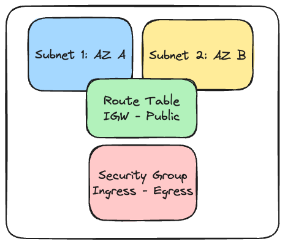

# Terraform

# Conceitos básicos na prática 
IaC - InfraAsCode

Apesar de conseguir provisionar, de forma geral nao faz tao bem tudo isso.

É uma ferramenta open-souce criada pela HashiCorp

O que ele faz de melhoir eh provisionar a infra. Oegar todoso os componentes da infra e fazer com que eles seam criados em Clous, paas, etc

Componwntwa bainxo nivelkl como vpc, securury, Internet gateway, configraçao total inclusicve como regras e normas de segurança.

Procviders eh uma camada de aplicaçao, como Aws Provider, ao mesmo tempo de pORVIDER do Goolge, K8S, etc

Por outrol lado, um dos conceitos mais importantes eh o de indepotencia
indepotemcia e imperatividade e declaratividade

## Indepotencia
Vamos imaginar que entre no escritorio e acenda a luz. Se novamente entrarmos e tentarmos lifar a luz, vemos que ja vai estar apertando e nao vai dar pra apertar novamente. Nao realizar uma esma tarefa mais de uma vez de forma duplicada.

Subir um server na AWS com o terrafor, se fazer a alteracao de um detalhe ou subir uma vpc e rodar de novo o manifesto. Nao pode ser gerado toda a vez coisas novas quando rodamos novamente.

Se houve uma alteraçao, alterar apenas o que foi modificado.

Em paralelo, conceito com imperativo ou declarativo

Ao desenvolver um programa, estruturada, faça isso e isso. Se execitar o comando, vai realizar novamente. Nao queremos isso. Queremos o resultado final

Declarativa, explicitam,os como deve ser feito o resultado final e o sistem,a deve se organnizar para gerar o resultado final. Compara o que temos com o que esperamos, momnta um plano e executa se estivemos de acordo. Se o que eu tenho eh o que eu quero ele nao vai fazer absolutamente nada

iMPERATIVA, executar passo a passo independente.


Terraform com esse conceito muito forte mais priciplamente como subir infra. 
Processos de insta;açao e configuraçao de servidores nao fazem taaaaao bem, por isso temos o ansible.

## Terraform vs Ansible

Sao concorrentes? Qual a diferença?

1o, o terraform faz de melhor eh provisionar infra
Anssimble. Gerenciamento e automaçao de configuraçoes.

Cada um com o seu proposito maius forte.

Da para fazer cluster k8s com cada um, overlap, mas o que poercebemos eh que o que podemos fazer combinando as duas coisas. E isso acontece muito as ferramentas em conjunto!

Imaginamos que 50 maquinas para instalar nginx e configurar arquivos de cada um e etc

No ansible, pegamos o IP e ele instala tudo de forma automatizada. 
No terraform, esses servidores no VPC com essas configuraçoes.


## Gerenciamento de estado
Quando provisionamos uma infra com tf, tudo o que ele faz ele anota o estado.
E quando ha necessidade de alteraçao ele compara com o que tem com o que deve ser feito
Mas as vezes para alterar o estado de algo deve ser destruido e novamente criado. Plano de açao 

Ao subir uma ec2, ele anota tudo em um arquivo. Para fazer alteraçao ele compara. Se nao temos o estado atual do que ele vai fazer e nao sabe da existencia da infra, ele vai querer criar tudo do zero.
Esse arquivo eh uma das coisas mais importantes parqa conseguirmos trabalhar. Se nao tiver ele começa a fazer tudo do zero. EH O AQUITOVO MAIS IMPORTNTE QUE DESCREVE TUDO E O ESTADO ATUAL!

Se for trabalhar em equipe, devemos trabalhar com esse aqruivo de forma online. No buckets3, por exemplo. Esse aquitovo sempre mantem a ultima versao das coisas que se estao fazendo. Sem o state nao da para fazer nada!

Se criar uma infra enorme e perder o state nao vai dar para saber o estado atual.


# Conceitos basicos na pratica

## Tour pello terraform,.io
Write, Plan, Apply!
dEPENDE DOS PROVIDERS PARA FAZER AS AÇOES

Registry traz exatamente todos os provideres e modulos!
Principais providers. AWS, Azure, K8S, oracle, Alibaba. Mas nao eh cloudprivder,

Todos eles sao marcados com tags. 

Provider aws -> Versao, quantidade de instalaçoes, navegar pelas versoes, DOCUMENTAÇAAO!!!

Imagina que se deseja fazer configuraçao de maquina EC2 na AWS. Resources sao recursos para alterar conf de maquinas.

Exemplos de utiliza;çao, como nome da tag e como ele vai taggear.

Precisamos juntar os pedçoes para colocarmos a aplicaçao no ar.

Super importante. Saber o que queremos antes de utilizarmos o terraform. Precisamos saber passo a passo o que queremos para o Plano de Açao.,

Recusros de modulos, por exemplo, possibilita que executamos diversas açoes de uma só vez.


## Instalando o terraform
https://developer.hashicorp.com/terraform/install?product_intent=terraform
Tente utilizar o package manager! Por outrol lado, o terraform eh feito em go e eh apenas um binario de acordo com o sistema operacional.  Se baixar o binario, deve salvar uma pasta no pc e depois configurar o path apontando para a pasta que colocamos o executavel.

O package manager faz isso de forma automatica. 
Vantagem com o package manager, mais facil de alterar a versao.


# Executando o Terraform pela primeira vez

HCL e como o terraform utiliza. Hashicorp config language. Impoertante tb instalar a exetensao do terrafrom para o VSCode.

nano local.tf

Resource = bloco
Local = provider
File = tipo do Provider
Example = Nome do Recurso

resource "local_file" "example" {
  filename = "examplo.txt"
  content = "Fullcycle"
}

Como o resource localfile, pode-se criar um arquivo local no computador!

Toda vez que trabalhamos com o terraform, temos que pedir para ele ionicializar. Olhar tudo o que temos e começamos o projeto

```bash
❯ terraform init

Initializing the backend...

Initializing provider plugins...
- Finding latest version of hashicorp/local...
- Installing hashicorp/local v2.4.1...
- Installed hashicorp/local v2.4.1 (signed by HashiCorp)

Terraform has created a lock file .terraform.lock.hcl to record the provider
selections it made above. Include this file in your version control repository
so that Terraform can guarantee to make the same selections by default when
you run "terraform init" in the future.

Terraform has been successfully initialized!

You may now begin working with Terraform. Try running "terraform plan" to see
any changes that are required for your infrastructure. All Terraform commands
should now work.

If you ever set or change modules or backend configuration for Terraform,
rerun this command to reinitialize your working directory. If you forget, other
commands will detect it and remind you to do so if necessary.
```
Inicializa os providers e por padrao ele instala já o provider local do registry.

Uma vez instalado, ele que vai gerar os arquivos de state!

O arquivo do terraform.lock tem o regstro dos providers e verseos. A pasta .terraform baixou o local provider

Para criar um plano de açao para chegar no resultado desejado:
```bash
❯ terraform plan

Terraform used the selected providers to generate the following execution plan. Resource actions are
indicated with the following symbols:
  + create

Terraform will perform the following actions:

  # local_file.example will be created
  + resource "local_file" "example" {
      + content              = "Fullcycle"
      + content_base64sha256 = (known after apply)
      + content_base64sha512 = (known after apply)
      + content_md5          = (known after apply)
      + content_sha1         = (known after apply)
      + content_sha256       = (known after apply)
      + content_sha512       = (known after apply)
      + directory_permission = "0777"
      + file_permission      = "0777"
      + filename             = "examplo.txt"
      + id                   = (known after apply)
    }

Plan: 1 to add, 0 to change, 0 to destroy.

─────────────────────────────────────────────────────────────────────────────────────────────────────────────

Note: You didn't use the -out option to save this plan, so Terraform can't guarantee to take exactly these
actions if you run "terraform apply" now.
```
Tudo que tem + cvai criar o recurso, - destroi.

Agora, para executasr o plano, vamos aplicar o aqruivo e ele vai mostrar novamente o plano que ele vai fazer. Digitar yes para aceitar e a aplicaçao pode ser concluida. 

```bash
❯ terraform apply 

Terraform used the selected providers to generate the following execution plan. Resource actions are
indicated with the following symbols:
  + create

Terraform will perform the following actions:

  # local_file.example will be created
  + resource "local_file" "example" {
      + content              = "Fullcycle"
      + content_base64sha256 = (known after apply)
      + content_base64sha512 = (known after apply)
      + content_md5          = (known after apply)
      + content_sha1         = (known after apply)
      + content_sha256       = (known after apply)
      + content_sha512       = (known after apply)
      + directory_permission = "0777"
      + file_permission      = "0777"
      + filename             = "examplo.txt"
      + id                   = (known after apply)
    }

Plan: 1 to add, 0 to change, 0 to destroy.

Do you want to perform these actions?
  Terraform will perform the actions described above.
  Only 'yes' will be accepted to approve.

  Enter a value: yes

local_file.example: Creating...
local_file.example: Creation complete after 0s [id=1436730d85706bbc9bcbcf350188d9754c647f1e]

Apply complete! Resources: 1 added, 0 changed, 0 destroyed.
```

Assim, a aplica';cao foi concluida adicionando um recurso e o id do arquivo pode ser visto na resposta do termnal. e o arquivo example.txt foi criado!

```bash
❯ ls
README.md         examplo.txt       local.tf          terraform.tfstate
```

Se nao mudarmos nada e planejarmos novamente o arquivo de configuraçao:
```bash
❯ terraform plan
local_file.example: Refreshing state... [id=1436730d85706bbc9bcbcf350188d9754c647f1e]

No changes. Your infrastructure matches the configuration.

Terraform has compared your real infrastructure against your configuration and found no differences, so no
changes are needed.
```

Nenhuma mudança vai acontecer. E como ele consegue saber a diferença? Indepotencia. O aquivo do terraform .tfstate É O MAIS IMPORTANTE POIS MOSTRA O ESTADO ATUAL DA INFRAESTRUTURA!!!

```tfstate
{
  "version": 4,
  "terraform_version": "1.6.6",
  "serial": 1,
  "lineage": "1f58e078-9cb3-b4a6-f118-dfd150a23634",
  "outputs": {},
  "resources": [
    {
      "mode": "managed",
      "type": "local_file",
      "name": "example",
      "provider": "provider[\"registry.terraform.io/hashicorp/local\"]",
      "instances": [
        {
          "schema_version": 0,
          "attributes": {
            "content": "Fullcycle",
            "content_base64": null,
            "content_base64sha256": "/31EEwjGFPgJeKhqWlDtjo9qrAV4NDoIOPKB6B3ywUY=",
            "content_base64sha512": "qqJgBJ0TRs7eF7y3I20lXaQbMR037j6aNQJZ3q9A9W8Fb/GMfgZI62CqtIEL0+7dqf6O3YId78Tm09zRFkpqrA==",
            "content_md5": "0385676d164f46d90b9f2d7f3ea098e1",
            "content_sha1": "1436730d85706bbc9bcbcf350188d9754c647f1e",
            "content_sha256": "ff7d441308c614f80978a86a5a50ed8e8f6aac0578343a0838f281e81df2c146",
            "content_sha512": "aaa260049d1346cede17bcb7236d255da41b311d37ee3e9a350259deaf40f56f056ff18c7e0648eb60aab4810bd3eedda9fe8edd821defc4e6d3dcd1164a6aac",
            "directory_permission": "0777",
            "file_permission": "0777",
            "filename": "examplo.txt",
            "id": "1436730d85706bbc9bcbcf350188d9754c647f1e",
            "sensitive_content": null,
            "source": null
          },
          "sensitive_attributes": []
        }
      ]
    }
  ],
  "check_results": null
}

```

E se mudarmos o conteudo para colocar um espaço entre as palavras?
```tf
resource "local_file" "example" {
  filename = "examplo.txt"
  content = "Full Cycle"
}
```
Vamos aplicar esse aquivo de configuraçao
```bash
❯ terraform apply
local_file.example: Refreshing state... [id=1436730d85706bbc9bcbcf350188d9754c647f1e]

Terraform used the selected providers to generate the following execution plan. Resource actions are
indicated with the following symbols:
-/+ destroy and then create replacement

Terraform will perform the following actions:

  # local_file.example must be replaced
-/+ resource "local_file" "example" {
      ~ content              = "Fullcycle" -> "Full Cycle" # forces replacement
      ~ content_base64sha256 = "/31EEwjGFPgJeKhqWlDtjo9qrAV4NDoIOPKB6B3ywUY=" -> (known after apply)
      ~ content_base64sha512 = "qqJgBJ0TRs7eF7y3I20lXaQbMR037j6aNQJZ3q9A9W8Fb/GMfgZI62CqtIEL0+7dqf6O3YId78Tm09zRFkpqrA==" -> (known after apply)
      ~ content_md5          = "0385676d164f46d90b9f2d7f3ea098e1" -> (known after apply)
      ~ content_sha1         = "1436730d85706bbc9bcbcf350188d9754c647f1e" -> (known after apply)
      ~ content_sha256       = "ff7d441308c614f80978a86a5a50ed8e8f6aac0578343a0838f281e81df2c146" -> (known after apply)
      ~ content_sha512       = "aaa260049d1346cede17bcb7236d255da41b311d37ee3e9a350259deaf40f56f056ff18c7e0648eb60aab4810bd3eedda9fe8edd821defc4e6d3dcd1164a6aac" -> (known after apply)
      ~ id                   = "1436730d85706bbc9bcbcf350188d9754c647f1e" -> (known after apply)
        # (3 unchanged attributes hidden)
    }

Plan: 1 to add, 0 to change, 1 to destroy.

Do you want to perform these actions?
  Terraform will perform the actions described above.
  Only 'yes' will be accepted to approve.

  Enter a value: yes

local_file.example: Destroying... [id=1436730d85706bbc9bcbcf350188d9754c647f1e]
local_file.example: Destruction complete after 0s
local_file.example: Creating...
local_file.example: Creation complete after 0s [id=5030f5a1c32cc3fa29ad77aefd16fa3a8ed3c666]

Apply complete! Resources: 1 added, 0 changed, 1 destroyed.
```
O interessante é que ele detectou que o local_file deve ser substituido e o arquivo será destruido. Esse resource nao altera o arquivo, mas ele destroi e adiciona um novo. Além disso, mudou o id do arquivo para um novo ID.

Toda vez que precisar de uma alteraçao, compara com o arqu, destroi e criar um novo arquivo.
 E verificarmos a mudança no arquivo .txt.

No tfstate atualizado, possui a versao mais nova e ao mesmo tempo gerou uma copia de segurança .tfstate.backup!

O conceito será exatamente o mesmo independente do tamanho da infra!

## Trabalhando com variáveis

Para deixar algumas coisas dinamicas para evitar o hard-coded.

Para isso, basta declarar a vairiavel abaixo do resource

```tf
resource "local_file" "example" {
  filename = "examplo.txt"
  content = var.content
}

variable "content" {
  
}
```

Dessa forma, quando o arquivo é aplicado, ele pede o valor a ser inputado via terminal:
```bash
❯ terraform apply
var.content
  Enter a value: Value from a variable

local_file.example: Refreshing state... [id=5030f5a1c32cc3fa29ad77aefd16fa3a8ed3c666]

Terraform used the selected providers to generate the following execution plan. Resource actions are
indicated with the following symbols:
-/+ destroy and then create replacement

Terraform will perform the following actions:

  # local_file.example must be replaced
-/+ resource "local_file" "example" {
      ~ content              = "Full Cycle" -> "Value from a variable" # forces replacement
      ~ content_base64sha256 = "SScLDvHzWCLtrrdwsfyJmZlYuCWHKFA4+aIq6e6wjl0=" -> (known after apply)
      ~ content_base64sha512 = "BbNkfjO2XAg/XzuYJ6zbZZZN7m1aJ6paOEnq8hc2FSF3Y+9q0bP+mfs3jpAvaYSqucR2yvPGxCb3Vw7w/b2n/Q==" -> (known after apply)
      ~ content_md5          = "aedaa642186adcd4fbb3a8310aa56060" -> (known after apply)
      ~ content_sha1         = "5030f5a1c32cc3fa29ad77aefd16fa3a8ed3c666" -> (known after apply)
      ~ content_sha256       = "49270b0ef1f35822edaeb770b1fc89999958b82587285038f9a22ae9eeb08e5d" -> (known after apply)
      ~ content_sha512       = "05b3647e33b65c083f5f3b9827acdb65964dee6d5a27aa5a3849eaf2173615217763ef6ad1b3fe99fb378e902f6984aab9c476caf3c6c426f7570ef0fdbda7fd" -> (known after apply)
      ~ id                   = "5030f5a1c32cc3fa29ad77aefd16fa3a8ed3c666" -> (known after apply)
        # (3 unchanged attributes hidden)
    }

Plan: 1 to add, 0 to change, 1 to destroy.

Do you want to perform these actions?
  Terraform will perform the actions described above.
  Only 'yes' will be accepted to approve.

  Enter a value: yes

local_file.example: Destroying... [id=5030f5a1c32cc3fa29ad77aefd16fa3a8ed3c666]
local_file.example: Destruction complete after 0s
local_file.example: Creating...
local_file.example: Creation complete after 0s [id=9d31dc1f712adcef2420fa219bada1043c47725a]

Apply complete! Resources: 1 added, 0 changed, 1 destroyed.
```

Ao verificar o valor no arquivo .txt, o valor do conteudo é o valor inserido na variável!

Entretanto, nao é necessário passar sempre via terminal. Pode ser criado um arquivo `terraform.tfvars` que vai ser lido automaticamente pelo terraform e teremos aqui o valor de nossas variaveis.
```tfvars
content = "test from terraform.tfvars"
```
Aplicando o arquivo:
```bash
❯ terraform apply
local_file.example: Refreshing state... [id=9d31dc1f712adcef2420fa219bada1043c47725a]

Terraform used the selected providers to generate the following execution plan. Resource actions are
indicated with the following symbols:
-/+ destroy and then create replacement

Terraform will perform the following actions:

  # local_file.example must be replaced
-/+ resource "local_file" "example" {
      ~ content              = "Value from a variable" -> "test from terraform.tfvars" # forces replacement
      ~ content_base64sha256 = "ig7Tlt+qLVCQkjyiTZXMVrMclC06IeHvYwAoLzBxRR0=" -> (known after apply)
      ~ content_base64sha512 = "PlAyXh0qo2cnmixkXUU3XEMtfANJ/N1V6854GWa3juomZJlYfvtnZAkdQa1A+prxkAdTW3+yiCJUi+e0kZaFKg==" -> (known after apply)
      ~ content_md5          = "8394a6041b9b0f064e2f99b53397f2ac" -> (known after apply)
      ~ content_sha1         = "9d31dc1f712adcef2420fa219bada1043c47725a" -> (known after apply)
      ~ content_sha256       = "8a0ed396dfaa2d5090923ca24d95cc56b31c942d3a21e1ef6300282f3071451d" -> (known after apply)
      ~ content_sha512       = "3e50325e1d2aa367279a2c645d45375c432d7c0349fcdd55ebce781966b78eea266499587efb6764091d41ad40fa9af19007535b7fb28822548be7b49196852a" -> (known after apply)
      ~ id                   = "9d31dc1f712adcef2420fa219bada1043c47725a" -> (known after apply)
        # (3 unchanged attributes hidden)
    }

Plan: 1 to add, 0 to change, 1 to destroy.

Do you want to perform these actions?
  Terraform will perform the actions described above.
  Only 'yes' will be accepted to approve.

  Enter a value: yes

local_file.example: Destroying... [id=9d31dc1f712adcef2420fa219bada1043c47725a]
local_file.example: Destruction complete after 0s
local_file.example: Creating...
local_file.example: Creation complete after 0s [id=5676ab69900e00e5a2ee1a2eaa69d94d4daafbf6]

Apply complete! Resources: 1 added, 0 changed, 1 destroyed.
```

Ok! O terraform leu diretamente o arquivo de configuração das variáveis sem pedir em um prompt!

Podemos ter um arquivo de configuraçao com todas as nossas variáveis! 

Se nao quisermos trabalhar como o arquivo de tfvars, podemos querer passar isso por linha dew comando. 

O ponto intewressante eh que as variaveis tem tipos! Consultar as docs em vars.

No arquivo de conf princial:
```tf
resource "local_file" "example" {
  filename = "examplo.txt"
  content = var.content
}

variable "content" {
  type = string
  default = "Default Value!"
}
```

E removemos o arquivo de tfvars, e damos um apply
```bash
❯ terraform apply
local_file.example: Refreshing state... [id=5676ab69900e00e5a2ee1a2eaa69d94d4daafbf6]

Terraform used the selected providers to generate the following execution plan. Resource actions are
indicated with the following symbols:
-/+ destroy and then create replacement

Terraform will perform the following actions:

  # local_file.example must be replaced
-/+ resource "local_file" "example" {
      ~ content              = "test from terraform.tfvars" -> "Default Value!" # forces replacement
      ~ content_base64sha256 = "wiLJuwkJcSD6ZqkpQ28TrlOv5xS+aZGinETfSL17cE0=" -> (known after apply)
      ~ content_base64sha512 = "wPaz6ntFadB6oL56Oi5GRXN6K7LRFVfYtpm361g/qBuO+zl7sZdgUyH/GLtV4s5yJ7xw4NxqMp8P3f5YzvTvnQ==" -> (known after apply)
      ~ content_md5          = "4064fb0a97d778c3b8ca6c1098e80fdb" -> (known after apply)
      ~ content_sha1         = "5676ab69900e00e5a2ee1a2eaa69d94d4daafbf6" -> (known after apply)
      ~ content_sha256       = "c222c9bb09097120fa66a929436f13ae53afe714be6991a29c44df48bd7b704d" -> (known after apply)
      ~ content_sha512       = "c0f6b3ea7b4569d07aa0be7a3a2e4645737a2bb2d11557d8b699b7eb583fa81b8efb397bb197605321ff18bb55e2ce7227bc70e0dc6a329f0fddfe58cef4ef9d" -> (known after apply)
      ~ id                   = "5676ab69900e00e5a2ee1a2eaa69d94d4daafbf6" -> (known after apply)
        # (3 unchanged attributes hidden)
    }

Plan: 1 to add, 0 to change, 1 to destroy.

Do you want to perform these actions?
  Terraform will perform the actions described above.
  Only 'yes' will be accepted to approve.

  Enter a value: yes

local_file.example: Destroying... [id=5676ab69900e00e5a2ee1a2eaa69d94d4daafbf6]
local_file.example: Destruction complete after 0s
local_file.example: Creating...
local_file.example: Creation complete after 0s [id=c918f29249a40e2cd79fb6aab0e74f2287bb4f71]

Apply complete! Resources: 1 added, 0 changed, 1 destroyed.
```

E o novo valor foi o Defaul Value no arquivo examplo.txt

Se quisermos deicar o default value em branco, podemos passar o valor das variaveis, alem de utilizar o fvars, por linha de comando e variaveis de ambiente!

```bash
❯ export TF_VAR_content="It came from environment"  
rogeriocassares in rogeriocasssares/FullCycle/fullcycle-terraform 
❯ terraform apply
local_file.example: Refreshing state... [id=c918f29249a40e2cd79fb6aab0e74f2287bb4f71]

Terraform used the selected providers to generate the following execution plan. Resource actions are
indicated with the following symbols:
-/+ destroy and then create replacement

Terraform will perform the following actions:

  # local_file.example must be replaced
-/+ resource "local_file" "example" {
      ~ content              = "Default Value!" -> "It came from environment" # forces replacement
      ~ content_base64sha256 = "r5KyU9oHwtIG9a7lIJwa9rUQ8W3/ZKZddZRpeOzCvGQ=" -> (known after apply)
      ~ content_base64sha512 = "4waZU3Qb5QAZbDbFa8G/rkJvGtrMsEN5/aG9GFhPEy7JNjyeR32zP63X/0mv6adBWuFkHR1lSgiG72atuIRz2Q==" -> (known after apply)
      ~ content_md5          = "b7f4c195788bbd8d8df2ca6fa787cf27" -> (known after apply)
      ~ content_sha1         = "c918f29249a40e2cd79fb6aab0e74f2287bb4f71" -> (known after apply)
      ~ content_sha256       = "af92b253da07c2d206f5aee5209c1af6b510f16dff64a65d75946978ecc2bc64" -> (known after apply)
      ~ content_sha512       = "e3069953741be500196c36c56bc1bfae426f1adaccb04379fda1bd18584f132ec9363c9e477db33fadd7ff49afe9a7415ae1641d1d654a0886ef66adb88473d9" -> (known after apply)
      ~ id                   = "c918f29249a40e2cd79fb6aab0e74f2287bb4f71" -> (known after apply)
        # (3 unchanged attributes hidden)
    }

Plan: 1 to add, 0 to change, 1 to destroy.

Do you want to perform these actions?
  Terraform will perform the actions described above.
  Only 'yes' will be accepted to approve.

  Enter a value: yes

local_file.example: Destroying... [id=c918f29249a40e2cd79fb6aab0e74f2287bb4f71]
local_file.example: Destruction complete after 0s
local_file.example: Creating...
local_file.example: Creation complete after 0s [id=529a33b9a6b4cc91da3052d75c5b7ff70bd99d5d]

Apply complete! Resources: 1 added, 0 changed, 1 destroyed.
```

Funcionou! Agora o conteudo esta vindo da variavel de ambiente!

Al;em de ler variaveis de ambiente, podemos passar o nome da variavel quando formos dar o apply

```bash
❯ terraform apply -var "content=it came from terraform apply -var cli"
local_file.example: Refreshing state... [id=529a33b9a6b4cc91da3052d75c5b7ff70bd99d5d]

Terraform used the selected providers to generate the following execution plan. Resource actions are indicated with
the following symbols:
-/+ destroy and then create replacement

Terraform will perform the following actions:

  # local_file.example must be replaced
-/+ resource "local_file" "example" {
      ~ content              = "It came from environment" -> "it came from terraform apply -var cli" # forces replacement
      ~ content_base64sha256 = "iBpqTibHxM1oFD/Agw1GBvNvt9KCrMz8hVkjkfwiIs4=" -> (known after apply)
      ~ content_base64sha512 = "LkbQmxHxVXq1nOEK5okSi8aIdbiuGujcmthxYhv7FiBINShgAkjjf2EGTYLmev1J/VbLbkIYAeNtoffsvNNJqw==" -> (known after apply)
      ~ content_md5          = "e25963b517e7a6acd650310922880214" -> (known after apply)
      ~ content_sha1         = "529a33b9a6b4cc91da3052d75c5b7ff70bd99d5d" -> (known after apply)
      ~ content_sha256       = "881a6a4e26c7c4cd68143fc0830d4606f36fb7d282acccfc85592391fc2222ce" -> (known after apply)
      ~ content_sha512       = "2e46d09b11f1557ab59ce10ae689128bc68875b8ae1ae8dc9ad871621bfb1620483528600248e37f61064d82e67afd49fd56cb6e421801e36da1f7ecbcd349ab" -> (known after apply)
      ~ id                   = "529a33b9a6b4cc91da3052d75c5b7ff70bd99d5d" -> (known after apply)
        # (3 unchanged attributes hidden)
    }

Plan: 1 to add, 0 to change, 1 to destroy.

Do you want to perform these actions?
  Terraform will perform the actions described above.
  Only 'yes' will be accepted to approve.

  Enter a value: yes

local_file.example: Destroying... [id=529a33b9a6b4cc91da3052d75c5b7ff70bd99d5d]
local_file.example: Destruction complete after 0s
local_file.example: Creating...
local_file.example: Creation complete after 0s [id=3ea935c8ea1a746403b6aa0d6a0c92ba01e4691e]

Apply complete! Resources: 1 added, 0 changed, 1 destroyed.
```
 Funcionou! Substituiu a variavel de ambiente pela -var do terminal

Sempre quando o nome do arquivo for terraform.tfvars, o terraform vai ler por padrao. 

Entretanto, se mudarmos o nome do arquivo, ele nao vai ler automaticamente. Por conta disso há o -var file. Para especificar o aqruivo como parametro de leitura para o terraform apply.

specificVars.tfvars:
```tfvars
content = "specificVars.tfvars file"
```

Entao:
```bash
❯ terraform apply -var-file specificVars.tfvars                       

local_file.example: Refreshing state... [id=3ea935c8ea1a746403b6aa0d6a0c92ba01e4691e]

Terraform used the selected providers to generate the following execution plan. Resource actions are indicated with
the following symbols:
-/+ destroy and then create replacement

Terraform will perform the following actions:

  # local_file.example must be replaced
-/+ resource "local_file" "example" {
      ~ content              = "it came from terraform apply -var cli" -> "terraform.tfvars file" # forces replacement
      ~ content_base64sha256 = "XwirKK7vO0Pg98PtAwZLE4zu23K7IOUkQnn6Z85FISk=" -> (known after apply)
      ~ content_base64sha512 = "FGLwOEzxqEMH7hT0qrVhYyQ/JLuxyNZmO3HOCyJ0d27BKSUdABGS2vf8mqTcyahnuBKl2OAZPjlOhbAb8Db9tQ==" -> (known after apply)
      ~ content_md5          = "9cfcec953b80f394705775c1ed34f6a3" -> (known after apply)
      ~ content_sha1         = "3ea935c8ea1a746403b6aa0d6a0c92ba01e4691e" -> (known after apply)
      ~ content_sha256       = "5f08ab28aeef3b43e0f7c3ed03064b138ceedb72bb20e5244279fa67ce452129" -> (known after apply)
      ~ content_sha512       = "1462f0384cf1a84307ee14f4aab56163243f24bbb1c8d6663b71ce0b2274776ec129251d001192daf7fc9aa4dcc9a867b812a5d8e0193e394e85b01bf036fdb5" -> (known after apply)
      ~ id                   = "3ea935c8ea1a746403b6aa0d6a0c92ba01e4691e" -> (known after apply)
        # (3 unchanged attributes hidden)
    }

Plan: 1 to add, 0 to change, 1 to destroy.

Do you want to perform these actions?
  Terraform will perform the actions described above.
  Only 'yes' will be accepted to approve.

  Enter a value: yes

local_file.example: Destroying... [id=3ea935c8ea1a746403b6aa0d6a0c92ba01e4691e]
local_file.example: Destruction complete after 0s
local_file.example: Creating...
local_file.example: Creation complete after 0s [id=a0d139d81e28adf0493a471dcfe342aa0b92e837]

Apply complete! Resources: 1 added, 0 changed, 1 destroyed.
rogeriocassares in rogeriocasssares/FullCycle/fullcycle-terraform 
❯ terraform apply -var-file specificVars.tfvars

local_file.example: Refreshing state... [id=a0d139d81e28adf0493a471dcfe342aa0b92e837]

Terraform used the selected providers to generate the following execution plan. Resource actions are indicated with
the following symbols:
-/+ destroy and then create replacement

Terraform will perform the following actions:

  # local_file.example must be replaced
-/+ resource "local_file" "example" {
      ~ content              = "terraform.tfvars file" -> "specificVars.tfvars file" # forces replacement
      ~ content_base64sha256 = "B+MwsluOndXjlNYjVS1ZlNWFGUVpivzKCSE4sP8QCC0=" -> (known after apply)
      ~ content_base64sha512 = "jufqI6ZcBA4mxObSFyQng8RiAsrBYUWE2mfsPVpr3bsxw7NBQFPLmW3S++J2L8wjHD8Tze4duc2R0LsOby+vqQ==" -> (known after apply)
      ~ content_md5          = "902331b43e5af8284c73cbb79fdee867" -> (known after apply)
      ~ content_sha1         = "a0d139d81e28adf0493a471dcfe342aa0b92e837" -> (known after apply)
      ~ content_sha256       = "07e330b25b8e9dd5e394d623552d5994d5851945698afcca092138b0ff10082d" -> (known after apply)
      ~ content_sha512       = "8ee7ea23a65c040e26c4e6d217242783c46202cac1614584da67ec3d5a6bddbb31c3b3414053cb996dd2fbe2762fcc231c3f13cdee1db9cd91d0bb0e6f2fafa9" -> (known after apply)
      ~ id                   = "a0d139d81e28adf0493a471dcfe342aa0b92e837" -> (known after apply)
        # (3 unchanged attributes hidden)
    }

Plan: 1 to add, 0 to change, 1 to destroy.

Do you want to perform these actions?
  Terraform will perform the actions described above.
  Only 'yes' will be accepted to approve.

  Enter a value: yes

local_file.example: Destroying... [id=a0d139d81e28adf0493a471dcfe342aa0b92e837]
local_file.example: Destruction complete after 0s
local_file.example: Creating...
local_file.example: Creation complete after 0s [id=acc67ec18121d089511410b16da60293d425f907]

Apply complete! Resources: 1 added, 0 changed, 1 destroyed.
```

Funcionou! Isso nos ajuda demais no dia a adia para criar arquivos desacoplados,m flexiveis e modularizados para facilitar.


## Outputs

Depois que aplicamos alguns aequivos de cconfigraçao, precisamos de unfos imporn=tantes de prpvisionamento, por exemplo, acabamos de instanciar um servidor, queremos o IP, a regial,m oo id, a imagem, etc.

Trabalhar com outputs é muto importante!

Toda vez que fazemos uma alteraçao no arquivo, ele cria o arquivo novamente. E toda vez que ele gera um novo arquivo ele gera um ID desse nosso arquivo

Vamos renomear o arquivo de variavis para terraform.tfvars para facilitar.
```tfvars
content = "output value"
```

E aplicamos
```bash
❯ terraform apply                                                     
local_file.example: Refreshing state... [id=acc67ec18121d089511410b16da60293d425f907]

Terraform used the selected providers to generate the following execution plan. Resource actions are indicated with
the following symbols:
-/+ destroy and then create replacement

Terraform will perform the following actions:

  # local_file.example must be replaced
-/+ resource "local_file" "example" {
      ~ content              = "specificVars.tfvars file" -> "output value" # forces replacement
      ~ content_base64sha256 = "v9VdRJXIt5Vm3Ru3G4q1oek+7e9ZfAI9Tf+imVU74Ck=" -> (known after apply)
      ~ content_base64sha512 = "cE8g3sq4fLcYnhNr3J+cnrIkZ7NNBLbO1STODMT9fN/G/Rki6lkNizgpZPFEpJPPg4cJaK7OOXNPy0puGDVaHg==" -> (known after apply)
      ~ content_md5          = "09cfbc13f81431525b2c373dee5d1d8c" -> (known after apply)
      ~ content_sha1         = "acc67ec18121d089511410b16da60293d425f907" -> (known after apply)
      ~ content_sha256       = "bfd55d4495c8b79566dd1bb71b8ab5a1e93eedef597c023d4dffa299553be029" -> (known after apply)
      ~ content_sha512       = "704f20decab87cb7189e136bdc9f9c9eb22467b34d04b6ced524ce0cc4fd7cdfc6fd1922ea590d8b382964f144a493cf83870968aece39734fcb4a6e18355a1e" -> (known after apply)
      ~ id                   = "acc67ec18121d089511410b16da60293d425f907" -> (known after apply)
        # (3 unchanged attributes hidden)
    }

Plan: 1 to add, 0 to change, 1 to destroy.

Do you want to perform these actions?
  Terraform will perform the actions described above.
  Only 'yes' will be accepted to approve.

  Enter a value: yes

local_file.example: Destroying... [id=acc67ec18121d089511410b16da60293d425f907]
local_file.example: Destruction complete after 0s
local_file.example: Creating...
local_file.example: Creation complete after 0s [id=❯ terraform apply                                                     
local_file.example: Refreshing state... [id=acc67ec18121d089511410b16da60293d425f907]

Terraform used the selected providers to generate the following execution plan. Resource actions are indicated with
the following symbols:
-/+ destroy and then create replacement

Terraform will perform the following actions:

  # local_file.example must be replaced
-/+ resource "local_file" "example" {
      ~ content              = "specificVars.tfvars file" -> "output value" # forces replacement
      ~ content_base64sha256 = "v9VdRJXIt5Vm3Ru3G4q1oek+7e9ZfAI9Tf+imVU74Ck=" -> (known after apply)
      ~ content_base64sha512 = "cE8g3sq4fLcYnhNr3J+cnrIkZ7NNBLbO1STODMT9fN/G/Rki6lkNizgpZPFEpJPPg4cJaK7OOXNPy0puGDVaHg==" -> (known after apply)
      ~ content_md5          = "09cfbc13f81431525b2c373dee5d1d8c" -> (known after apply)
      ~ content_sha1         = "acc67ec18121d089511410b16da60293d425f907" -> (known after apply)
      ~ content_sha256       = "bfd55d4495c8b79566dd1bb71b8ab5a1e93eedef597c023d4dffa299553be029" -> (known after apply)
      ~ content_sha512       = "704f20decab87cb7189e136bdc9f9c9eb22467b34d04b6ced524ce0cc4fd7cdfc6fd1922ea590d8b382964f144a493cf83870968aece39734fcb4a6e18355a1e" -> (known after apply)
      ~ id                   = "acc67ec18121d089511410b16da60293d425f907" -> (known after apply)
        # (3 unchanged attributes hidden)
    }

Plan: 1 to add, 0 to change, 1 to destroy.

Do you want to perform these actions?
  Terraform will perform the actions described above.
  Only 'yes' will be accepted to approve.

  Enter a value: yes

local_file.example: Destroying... [id=acc67ec18121d089511410b16da60293d425f907]
local_file.example: Destruction complete after 0s
local_file.example: Creating...
local_file.example: Creation complete after 0s [id=5d39dcd5d51c113fc09522ea4db0a1934c6bbcba]

Apply complete! Resources: 1 added, 0 changed, 1 destroyed.]

Apply complete! Resources: 1 added, 0 changed, 1 destroyed.
```

E vemos que o ID do arquivo criado é `5d39dcd5d51c113fc09522ea4db0a1934c6bbcba`.

Se for importante termos o valor do ID, por exemplo, devemos trabalhar com o conceito de Output.

No final das contas, e;e pega um valor de algo que trabalhamos e retorna um output.

no arquivo local.tf
```tf
resource "local_file" "example" {
  filename = "examplo.txt"
  content = var.content
}

variable "content" {
  type = string
  default = "Default Value!"
}

output "file-id" {
  value = resource.local_file.example.id
}
```

E aplicamos o arquivo:

```bash
❯ terraform apply -var-file specificVars.tfvars

local_file.example: Refreshing state... [id=a0d139d81e28adf0493a471dcfe342aa0b92e837]

Terraform used the selected providers to generate the following execution plan. Resource actions are indicated with
the following symbols:
-/+ destroy and then create replacement

Terraform will perform the following actions:

  # local_file.example must be replaced
-/+ resource "local_file" "example" {
      ~ content              = "terraform.tfvars file" -> "specificVars.tfvars file" # forces replacement
      ~ content_base64sha256 = "B+MwsluOndXjlNYjVS1ZlNWFGUVpivzKCSE4sP8QCC0=" -> (known after apply)
      ~ content_base64sha512 = "jufqI6ZcBA4mxObSFyQng8RiAsrBYUWE2mfsPVpr3bsxw7NBQFPLmW3S++J2L8wjHD8Tze4duc2R0LsOby+vqQ==" -> (known after apply)
      ~ content_md5          = "902331b43e5af8284c73cbb79fdee867" -> (known after apply)
      ~ content_sha1         = "a0d139d81e28adf0493a471dcfe342aa0b92e837" -> (known after apply)
      ~ content_sha256       = "07e330b25b8e9dd5e394d623552d5994d5851945698afcca092138b0ff10082d" -> (known after apply)
      ~ content_sha512       = "8ee7ea23a65c040e26c4e6d217242783c46202cac1614584da67ec3d5a6bddbb31c3b3414053cb996dd2fbe2762fcc231c3f13cdee1db9cd91d0bb0e6f2fafa9" -> (known after apply)
      ~ id                   = "a0d139d81e28adf0493a471dcfe342aa0b92e837" -> (known after apply)
        # (3 unchanged attributes hidden)
    }

Plan: 1 to add, 0 to change, 1 to destroy.

Do you want to perform these actions?
  Terraform will perform the actions described above.
  Only 'yes' will be accepted to approve.

  Enter a value: yes

local_file.example: Destroying... [id=a0d139d81e28adf0493a471dcfe342aa0b92e837]
local_file.example: Destruction complete after 0s
local_file.example: Creating...
local_file.example: Creation complete after 0s [id=acc67ec18121d089511410b16da60293d425f907]

Apply complete! Resources: 1 added, 0 changed, 1 destroyed.
rogeriocassares in rogeriocasssares/FullCycle/fullcycle-terraform took 2.3s 
❯ terraform apply                                                     
local_file.example: Refreshing state... [id=acc67ec18121d089511410b16da60293d425f907]

Terraform used the selected providers to generate the following execution plan. Resource actions are indicated with
the following symbols:
-/+ destroy and then create replacement

Terraform will perform the following actions:

  # local_file.example must be replaced
-/+ resource "local_file" "example" {
      ~ content              = "specificVars.tfvars file" -> "output value" # forces replacement
      ~ content_base64sha256 = "v9VdRJXIt5Vm3Ru3G4q1oek+7e9ZfAI9Tf+imVU74Ck=" -> (known after apply)
      ~ content_base64sha512 = "cE8g3sq4fLcYnhNr3J+cnrIkZ7NNBLbO1STODMT9fN/G/Rki6lkNizgpZPFEpJPPg4cJaK7OOXNPy0puGDVaHg==" -> (known after apply)
      ~ content_md5          = "09cfbc13f81431525b2c373dee5d1d8c" -> (known after apply)
      ~ content_sha1         = "acc67ec18121d089511410b16da60293d425f907" -> (known after apply)
      ~ content_sha256       = "bfd55d4495c8b79566dd1bb71b8ab5a1e93eedef597c023d4dffa299553be029" -> (known after apply)
      ~ content_sha512       = "704f20decab87cb7189e136bdc9f9c9eb22467b34d04b6ced524ce0cc4fd7cdfc6fd1922ea590d8b382964f144a493cf83870968aece39734fcb4a6e18355a1e" -> (known after apply)
      ~ id                   = "acc67ec18121d089511410b16da60293d425f907" -> (known after apply)
        # (3 unchanged attributes hidden)
    }

Plan: 1 to add, 0 to change, 1 to destroy.

Do you want to perform these actions?
  Terraform will perform the actions described above.
  Only 'yes' will be accepted to approve.

  Enter a value: yes

local_file.example: Destroying... [id=acc67ec18121d089511410b16da60293d425f907]
local_file.example: Destruction complete after 0s
local_file.example: Creating...
local_file.example: Creation complete after 0s [id=5d39dcd5d51c113fc09522ea4db0a1934c6bbcba]

Apply complete! Resources: 1 added, 0 changed, 1 destroyed.
rogeriocassares in rogeriocasssares/FullCycle/fullcycle-terraform took 2.2s 
❯ 
rogeriocassares in rogeriocasssares/FullCycle/fullcycle-terraform 
❯ terraform apply
local_file.example: Refreshing state... [id=5d39dcd5d51c113fc09522ea4db0a1934c6bbcba]

Changes to Outputs:
  + file-id = "5d39dcd5d51c113fc09522ea4db0a1934c6bbcba"

You can apply this plan to save these new output values to the Terraform state, without changing any real
infrastructure.

Do you want to perform these actions?
  Terraform will perform the actions described above.
  Only 'yes' will be accepted to approve.

  Enter a value: yes


Apply complete! Resources: 0 added, 0 changed, 0 destroyed.

Outputs:

file-id = "5d39dcd5d51c113fc09522ea4db0a1934c6bbcba"
```

Funcionou! Gerou uma output explicito na saida! E podemos pegar outros valores que quisermos como o valor o conteudo!

local.tf:
```tf
resource "local_file" "example" {
  filename = "examplo.txt"
  content = var.content
}

variable "content" {
  type = string
  default = "Default Value!"
}

output "file-id" {
  value = resource.local_file.example.id
}

output "content" {
  value = var.content
}
```

E aplicamos novamente
```bash
❯ terraform apply
local_file.example: Refreshing state... [id=5d39dcd5d51c113fc09522ea4db0a1934c6bbcba]

Changes to Outputs:
  + content = "output value"

You can apply this plan to save these new output values to the Terraform state, without changing any real
infrastructure.

Do you want to perform these actions?
  Terraform will perform the actions described above.
  Only 'yes' will be accepted to approve.

  Enter a value: yes


Apply complete! Resources: 0 added, 0 changed, 0 destroyed.

Outputs:

content = "output value"
file-id = "5d39dcd5d51c113fc09522ea4db0a1934c6bbcba"
```

Pronto!

Elas sao imoprtantes pq muitas vezes quando estamos criando uma infra muito grande sao muitos valores e precisamos desses valores para trabalhar. Por conta disso, os proprios modulos e resource que utilizamos tb porecisam de outputs.

Exemplo, um provider da AWS tem uma ECU que cria um volume e a partir de agora as entradas sao outputs de processos.

Com,o pegar o IP das 50 maquinas geradas? Usando outputs!

Podem ser utilizadas outputs forçadas e criadas regras. 

Tamb;em conseguimos trabalhar com listas e tuplas!


## Data Sources
Muitas vezes o elemento/informaçao que queremos pegar para provisionar a nossa infra ja existe. Entao como poderemos pegar essa informaçao. Consultar a inffra que ja tenmos para poder reutilizar?

Basicamente todo provider disponibiliza ou nao um data source e podemos pegar essa informaçao e utilizar da forma que quisermos.

Exemplo: provider local
Resource é o que vai nos ajudar a criar 
O data source eh quem le essa informaqçao

Toda vez que queremos trabalhar com datasource vamos utilizar o `data`
Uma vez que pegamos essa informaçao, ele nnos retornará um content ou um content em b64

local.tf
```bash
resource "local_file" "example" {
  filename = "examplo.txt"
  content = var.content
}

data "local_file" "content-examplo" {
  filename = examplo.txt
}

variable "content" {
  type = string
  default = "Default Value!"
}

output "file-id" {
  value = resource.local_file.example.id
}

output "content" {
  value = var.content
}
```

E vamos aplicar a configuraçao:
```bash
❯ terraform apply
data.local_file.content-examplo: Reading...
local_file.example: Refreshing state... [id=5d39dcd5d51c113fc09522ea4db0a1934c6bbcba]
data.local_file.content-examplo: Read complete after 0s [id=5d39dcd5d51c113fc09522ea4db0a1934c6bbcba]

No changes. Your infrastructure matches the configuration.

Terraform has compared your real infrastructure against your configuration and found no differences, so no changes are
needed.

Apply complete! Resources: 0 added, 0 changed, 0 destroyed.

Outputs:

content = "output value"
file-id = "5d39dcd5d51c113fc09522ea4db0a1934c6bbcba"
```

Perceba que nesse momento aqui ele rodou, nao mudamos nada e ele trouxe apenas o resultado.

Agorea, olha que interessante. Vamos colocar esse valor em um output novo `data-source-resource` e nesse output vamos colocar o value `data.local_file.content-examplo.content`
```tf
resource "local_file" "example" {
  filename = "examplo.txt"
  content = var.content
}

data "local_file" "content-examplo" {
  filename = "examplo.txt"
}

output "data-source-result" {
  value = data.local_file.content-examplo.content
}

variable "content" {
  type = string
  default = "Default Value!"
}

output "file-id" {
  value = resource.local_file.example.id
}

output "content" {
  value = var.content
}
```

Aplicando o arquivo:
```bash
❯ terraform apply
local_file.example: Refreshing state... [id=5d39dcd5d51c113fc09522ea4db0a1934c6bbcba]
data.local_file.content-examplo: Reading...
data.local_file.content-examplo: Read complete after 0s [id=5d39dcd5d51c113fc09522ea4db0a1934c6bbcba]

Changes to Outputs:
  + data-source-result = "output value"

You can apply this plan to save these new output values to the Terraform state, without changing any real
infrastructure.

Do you want to perform these actions?
  Terraform will perform the actions described above.
  Only 'yes' will be accepted to approve.

  Enter a value: yes


Apply complete! Resources: 0 added, 0 changed, 0 destroyed.

Outputs:

content = "output value"
data-source-result = "output value"
file-id = "5d39dcd5d51c113fc09522ea4db0a1934c6bbcba"
```

Ele trouxe `data-source-result = "output value"`! Portanto, o data source serve para ler algo que já existe! E se olharmos no exported, podemos colocar ainda como b64:
```tf
resource "local_file" "example" {
  filename = "examplo.txt"
  content = var.content
}

data "local_file" "content-examplo" {
  filename = "examplo.txt"
}

output "data-source-result" {
  value = data.local_file.content-examplo.content_base64
}

variable "content" {
  type = string
  default = "Default Value!"
}

output "file-id" {
  value = resource.local_file.example.id
}

output "content" {
  value = var.content
}
```

Aplicando o arquivo:
```bash
❯ terraform apply
data.local_file.content-examplo: Reading...
local_file.example: Refreshing state... [id=5d39dcd5d51c113fc09522ea4db0a1934c6bbcba]
data.local_file.content-examplo: Read complete after 0s [id=5d39dcd5d51c113fc09522ea4db0a1934c6bbcba]

Changes to Outputs:
  ~ data-source-result = "output value" -> "b3V0cHV0IHZhbHVl"

You can apply this plan to save these new output values to the Terraform state, without changing any real
infrastructure.

Do you want to perform these actions?
  Terraform will perform the actions described above.
  Only 'yes' will be accepted to approve.

  Enter a value: yes


Apply complete! Resources: 0 added, 0 changed, 0 destroyed.

Outputs:

content = "output value"
data-source-result = "b3V0cHV0IHZhbHVl"
file-id = "5d39dcd5d51c113fc09522ea4db0a1934c6bbcba"
```

Ele trouxe em b64 o valor do output.

Portanto, toda vez que queremos utilizar algo que já exista, vamos em data-source. Quando se quer realizar ??? vamos utilizar o resource, a variavel deixa tudo mais flexivel e o output exibe o que estamos precisando.

Essa é a base do terraform e como ele funciona.

Se formos num provider da AWS, EC3, temos resource e data-source. Se formos em dat-source e selecionarmos ebs-volume, ele vai falar que que pegar o volume mais recente da aws ebs volume, porem filtrando onde o tipo do volume é gp2 e filtrando quem tenha a tag com o valor Example. Entao conseguimos filtrar esses dados, ir na aws, pegar o volume mais recente com essas informaçoes e a partir desse volume podemos utilizar a informaçao que quisermos. Isso ai faz muita diferença pq, eventualmente, vamos precisar pegar dados que já existem e para isso nada melhor do que utilizar o data-source utilizado o nosso querido trraform. 


# Criandp cluster k8s

## Conceitos de VPC na AWS



Nao apenas configurar, mas desde os primeiros fundamentos para depois colocar para rodar em cima disso! Do zero!

Uma das coisas mais comum na aws, cria maquina, cria cluster mas nao se precocupa com fundamentos de se criar uma rede.

Uma vpc eh uma virtual private cloud. Eh uma rede que ninguem consegue entrar. Somente nós temos o acesso.
Nao se pode utilizar uma vpc padrao. Eh boa pratica utilizar aws com vpc.

Imagina que temos uma rede e uma coisa interessante na vpc eh que ela eh uma rede e dentro da rede vamos configurar subredes.

E essas subredes podemos colocar em zonas de disponibilidade diferentes.

Vamos utilizar a subnets, que é a rede onde vamos trabalhar. Isso pq dentro de uma vpc temos liberdade de criar classes de ips e com subnets conseguimos dividir melhor os ips em categorias que sao as subredes. Essas subredes podem ser configuradas focadas em se comunicar com outras, ter acesso à Internet, etc.

Subnet1, AvailabilityZone (AZ). Imaginamos que se tenha um datacenter na aws. Esse datacenter ele eh separado por zonas de disponibilidade. 
Entao, em um datacenter em sao paulo e duas zonas de disponiblidade. Se um cair temos outro local para trabalhar: AZ A e AZ B. Locais fisicamente diferentes.

Podemos deixa-los privados. Entao isso significa que, da Internet, nao será possível acessar essas redes/servidor, a noa ser que criemos uma VPN. No nosso caso vamos criar um cluster k8s que estará disponível para a Internet. Entao temos que deixar esse az publico.

Para deixarmos ele publicom quando temos uma vpc na aws, temos o conceito de route table. É uma tabela de roteamento que criamos para essa vpc e falamos quais subnetes estao associadas a essa RouteTable. O mais interessante eh que nessa Routetable podemos attachar allgo que chamamos de IGT, Internet Gateway. uMA VEZ QUE COLOCAMOS ISSO PERMITIMOS O ACESSO PUBLICO DA iNTERNET AOS AZs. 

Alem disso, temos que tb criar algo que chamamos de SG ou Security Group. Nesse SG ele vai agir como se fosse um firewall e ele nao vai deixar requisióes baterem no nosso cluster, na nossa rede, etc. Nesse caso, vamos ter que ter politicas de Ingress e Egress. Ingress eh quando alguem tenta acessar nossa vpc. O eGRESS FAZ COM QUE QUAIS RECURSOS DAS MAQUINAS DAS NOSSAS REDES POSSAM ACESSAR REDES EXTERNAS, IE, A iNTERNET, NAO IR PARA FORA, O ACESSAR A PORTA 80 DA INTERNET.

Uma vez criadas essas regras, ai sim vamos criar as máquinas. E quando criamos as máquinas vamos falar se faz parte da subnet 1 ou 2. E o mais legal de tudo eh que podemos falar que o cluster pode fazer parte tanto da subnet 1 quanto da subnet 2. Por exemplo, se uma maquina e a az cai totalmente, temos o outro datacenter que estamos em funcionamento.

Sem isso, qualquer coisas que formos criar usando a conf padrao nao tem como sabermos se aguem ou alguma outra rede que esta na propria aws pode acessar etc. Eh sempre recomendado semre criar a propia vpc.

Imaginando que o subnet 1 seja publico e o subnet 2 privado. Entao colocamos uma maquina que eh um server web e ele precisa acessar uma banco de dados que nao esta publico. Entao deixamos o banco em uma subnet provada e a nossa aplicaçao consegue acessar a subnet provada e ninguem mais conseguiria acessar, apenas nós/ E isso eh muito importante. Todas as subntes padrao da aws ja sao publicas.

Por isso, queremos deixar apenas como publico o que realmente precisamos.


## Entendendo Conceitos NO CONSOLE DA aws
pAINEL aws -> VPC 
Vemos as VPCs criadas.

A maioria das pessoas usam o us-east-1
E entao temos divesas regioes com cada lugar.

Ima vpc eh criada por padrao na aws e qualquer maquina que criarmos será criada na vpc padrao. O problema eh que nao sabemos nada sobre a vpc a nao ser o sider block, range de ips e mascaras e se clicarmos ha algumas infos interessantes como route table, se vai ter internet ou nao etc.  E entao as subredes sao criadas automaicamente, como 6 subnets. Nessa regiao, eles tem 6 az. 

E se olharmos, a route table esta em uma az e eles criaram uma vpc e dentro dela, criaram uma subrede para cada zona de disponibilidade. O grande ponto eh que quando ja eh pore criado, no final das contas nao sabemos as politicas de segurança que foiram realmente aplicas. 

Sider Blocks ->  Se olharmos, temos o endereçamento ip da rede que começa cp, 172.31.0.0/16. Isso significa que temos um octeto 0.0 e eles vao ser usados como host e vao determinar a rede. 254 eh para broadcast e entao vamos ter ate 65534 endereços de Ips.

E se quisermos dividir essas redes maiores em subntes? Colcamos a mascaras /20 e dividimos em possibilidades menores de Ip.

/20 -> 4094 Ips com até 16 subnets. 172.31.0.0, 172.31.16.0, 172.31.32.0, 172.31.48.0 ...


Quando criar conf de subnets, automaticamente ele atribui a uma route table que elaq abrange toda a vpc rede local, porem tem um destination 0.0.0.0/0 com acesso a qualquer destino e com intenrnet gateway atachado, que da acesso a qualquer recurso conectado na Internet!

Isso significa que as maquinas estao expostas à Internet!

E se olharmos temos subnets associations, Qua subnetet esta associaada à route table? 

Quando nao temos nada explicito, ele vai pegar todas as subnetes que saoi implicitas. Todas elas conseguem ser acessadas atraves da route table!

Security Groups tabmen vem como padrao a serem atachados nos recursos. Inbound/OUTBOUND rules padrao indica que todo mundo ALL TRAFFIC pode acessar.

Por isso que devemos ter consentimento e ciencia do que estamos fazxendo.

Vamos criar tudo isso na aws e com k8s utilizando o TERRAFORM!!!


## Criando user admin na AWS

Toda vez que criamos uma conta na AWS temos uma conta root com acesso a tudo. Nao eh legal trablahar com essa conta. Eh interessante criar uma outra conta (ateh como admin), mas pelo menos não estamos deixando a conta route exposta.

Vamos criar uma conta na aws.
Se estamos criando qualquer coisa na aws devemos apagar tudo para nao deeixar como acidente. Vamos usar o Free-Tier. Fazendo o login no aws console, vamos digitar IAM, que é o gerenciamento de acesso da AWS. Nesse gerenciamento de acesso vamos criar o primeiro usuário, grupos, papeis e policies

Group > Roles > Policies

Vamos clicar em users na barra lateral e criarmos um username admin. Podemos escolher duas coisas. Programmatic Access. SDK, API, CLI e o Acesso ao console da aws. Vamos dar o acesso ao IAM e escolher uma senha personalizada.

aO AVANÇARMOS, PODEMOS ADICIONAR O USUARIO A UM GRUPO, COPIAR PERMISSOES DE UM USUARIO EXISTENTE OU ATACHAR POLITICAS DIRETAMENTE PARA O USUARIO SEM QUE ELES ESTEJA NO GRUPO. Vamos ficar com essa ultima opçao e liberar todo o acesso para fins didaticos. 

Vamos para o Review e entao Create.

AGORA, Percebe-se que ele vai nos dar uma url para fazermos o login como admin. Vamos copiar esssa url para o vscode. credentials.txt, copiar a url e a ACCESS KEY e a SECRET KEY tb. 
Podemos tb fazer o download do csv

Com essas credencias conseguiremos utilizar o terraform trabalhando com eles. 

Vamos acessar o endereço copiado atraves do link e quando formos acessar o endere'ço, colcoamos o usuario e o admin, seguir os passos para mudar a senha e pronto! 

Somos adimn user e nao root user e eh com esse usuario que iremos configurar a aws. 

Vamos realizar a realizaçao do cli

Ainda em IAM -> Credenciais de SEGURANÇA -> cHAVES DE ACESSO -> CLI

## Configurando AWS CLI

Download aws cli

Quando instalar, devemos configurá-lo

```bash
aws configure
```

Após a configuraçao, podemos ver o arquivo em:
```bash
cat ~/.aws/config
--------
[default]
region = us-east-1
```
```bash
cat ~/.aws/credentials
--------
[default]
```

Basicamente, o que vai acontecer com o terraform. ele vai conseguir ler essas variaveis e vai conseguir executar em nosso ambiente na aws o que passarmos em nossos maifestos do terraform.

## Criando VPC
Para mexermos nas configuraçoes terraform + aws vamos criar um novo repositório
fullcycle-terraform-aws


Vamos no registry do terraform e procurar o Provider da AWS

https://registry.terraform.io/providers/hashicorp/aws/latest
https://registry.terraform.io/providers/hashicorp/local/latest

No momento em que estamos mexendo agora eh a 5.31.0.

Nossa versao do terraform eh a 1.6.6, mas vam,os colocar a versao required de 0.13.1

Vamos criar um arquivo providers.tf
```tf
terraform {
  required_version = ">=0.13.1"
  required_providers {
    aws = ">=3.54.0"
    local = ">=2.1.0"
  }
}

provider "aws" {
  region = "us-east-1"
}
```

Com isso, ja temos o basico para rodarmos o terraform e podemos executar o comando de init.

```bash
❯ terraform init

Initializing the backend...

Initializing provider plugins...
- Finding hashicorp/aws versions matching ">= 3.54.0"...
- Finding hashicorp/local versions matching ">= 2.1.0"...
- Installing hashicorp/aws v5.31.0...
- Installed hashicorp/aws v5.31.0 (signed by HashiCorp)
- Installing hashicorp/local v2.4.1...
- Installed hashicorp/local v2.4.1 (signed by HashiCorp)

Terraform has created a lock file .terraform.lock.hcl to record the provider
selections it made above. Include this file in your version control repository
so that Terraform can guarantee to make the same selections by default when
you run "terraform init" in the future.

Terraform has been successfully initialized!

You may now begin working with Terraform. Try running "terraform plan" to see
any changes that are required for your infrastructure. All Terraform commands
should now work.

If you ever set or change modules or backend configuration for Terraform,
rerun this command to reinitialize your working directory. If you forget, other
commands will detect it and remind you to do so if necessary.
```

Para lembrarmos, temos o .terraform onde temos o s providers instalados, o lock garante a versao

Vamos criar um arquivo de vpc.tf, para separarmos e estrutrurarmos. Quando o terraform executa o comando, ele consegue identificar todos os arquivos compara e coloca tudo para funcionar.
Registry -> AWS-> Documentaçao -> vpc
https://registry.terraform.io/providers/hashicorp/aws/latest/docs/resources/vpc
```tf
resource "aws_vpc" "new-vpc" {
  cidr_block = "10.0.0.0/16"
  tags = {
    Name = "fullcycle-vpc"
  }
}
```

Com isso, temos o nosso primiero recurso!

Vamos fazer um teste:
```bash
❯ terraform plan

Terraform used the selected providers to generate the following execution plan. Resource actions are indicated with
the following symbols:
  + create

Terraform will perform the following actions:

  # aws_vpc.new-vpc will be created
  + resource "aws_vpc" "new-vpc" {
      + arn                                  = (known after apply)
      + cidr_block                           = "10.0.0.0/16"
      + default_network_acl_id               = (known after apply)
      + default_route_table_id               = (known after apply)
      + default_security_group_id            = (known after apply)
      + dhcp_options_id                      = (known after apply)
      + enable_dns_hostnames                 = (known after apply)
      + enable_dns_support                   = true
      + enable_network_address_usage_metrics = (known after apply)
      + id                                   = (known after apply)
      + instance_tenancy                     = "default"
      + ipv6_association_id                  = (known after apply)
      + ipv6_cidr_block                      = (known after apply)
      + ipv6_cidr_block_network_border_group = (known after apply)
      + main_route_table_id                  = (known after apply)
      + owner_id                             = (known after apply)
      + tags                                 = {
          + "Name" = "fullcycle-vpc"
        }
      + tags_all                             = {
          + "Name" = "fullcycle-vpc"
        }
    }

Plan: 1 to add, 0 to change, 0 to destroy.

──────────────────────────────────────────────────────────────────────────────────────────────────────────────────────

Note: You didn't use the -out option to save this plan, so Terraform can't guarantee to take exactly these actions if
you run "terraform apply" now.
```

E o terraform mostra o plano de execuçao.

Vamos aplicar:
```bash
❯ terraform apply

Terraform used the selected providers to generate the following execution plan. Resource actions are indicated with
the following symbols:
  + create

Terraform will perform the following actions:

  # aws_vpc.new-vpc will be created
  + resource "aws_vpc" "new-vpc" {
      + arn                                  = (known after apply)
      + cidr_block                           = "10.0.0.0/16"
      + default_network_acl_id               = (known after apply)
      + default_route_table_id               = (known after apply)
      + default_security_group_id            = (known after apply)
      + dhcp_options_id                      = (known after apply)
      + enable_dns_hostnames                 = (known after apply)
      + enable_dns_support                   = true
      + enable_network_address_usage_metrics = (known after apply)
      + id                                   = (known after apply)
      + instance_tenancy                     = "default"
      + ipv6_association_id                  = (known after apply)
      + ipv6_cidr_block                      = (known after apply)
      + ipv6_cidr_block_network_border_group = (known after apply)
      + main_route_table_id                  = (known after apply)
      + owner_id                             = (known after apply)
      + tags                                 = {
          + "Name" = "fullcycle-vpc"
        }
      + tags_all                             = {
          + "Name" = "fullcycle-vpc"
        }
    }

Plan: 1 to add, 0 to change, 0 to destroy.

Do you want to perform these actions?
  Terraform will perform the actions described above.
  Only 'yes' will be accepted to approve.

  Enter a value: yes

aws_vpc.new-vpc: Creating...
aws_vpc.new-vpc: Creation complete after 3s [id=vpc-008b6f24f735f3f13]

Apply complete! Resources: 1 added, 0 changed, 0 destroyed.
```

E a vpc foi criada! Vamos ver se funcionou no aws console -> vpc

E foi criada!

fullcycle-vpc
vpc-008b6f24f735f3f13	Available	10.0.0.0/16	–	dopt-0c824a871bc167c23	rtb-0b7edd6663957994b	acl-0d848362705e0b073	Default	Não	000143974429


## Criando subnets
Vamos verificar os nomes das nossas zonas de disponibilidade
em vpc.tf:
```tf
resource "aws_vpc" "new-vpc" {
  cidr_block = "10.0.0.0/16"
  tags = {
    Name = "fullcycle-vpc"
  }
}

data "aws_availability_zones" "available" {}
output "az" {
  value = "${data.aws_availability_zones.available.names}"
}
```

Aplicando o arquivo sem a necessidade de digitar o yes:
```bash
❯ terraform apply --auto-approve
data.aws_availability_zones.available: Reading...
aws_vpc.new-vpc: Refreshing state... [id=vpc-008b6f24f735f3f13]
data.aws_availability_zones.available: Read complete after 1s [id=us-east-1]

Changes to Outputs:
  + az = [
      + "us-east-1a",
      + "us-east-1b",
      + "us-east-1c",
      + "us-east-1d",
      + "us-east-1e",
      + "us-east-1f",
    ]

You can apply this plan to save these new output values to the Terraform state, without changing any real
infrastructure.

Apply complete! Resources: 0 added, 0 changed, 0 destroyed.

Outputs:

az = tolist([
  "us-east-1a",
  "us-east-1b",
  "us-east-1c",
  "us-east-1d",
  "us-east-1e",
  "us-east-1f",
])
```

Olha só que legal! Ele nos trouxe as zonas de disponiblidade.

Vamos pegar uma AZ e passar para a subnet:
```tf
resource "aws_vpc" "new-vpc" {
  cidr_block = "10.0.0.0/16"
  tags = {
    Name = "fullcycle-vpc"
  }
}

data "aws_availability_zones" "available" {}

resource "aws_subnet" "new-subnet-1" {
  availability_zone = "us-east-1a"
  vpc_id = aws_vpc.new-vpc.id
  cidr_block = "10.0.0.0/24"
  tags = {
    Name = "fullcycle-subnet-1"
  }
}
```

Vamos criar a nossa primeira subnet!
```bash
❯ terraform apply --auto-approve
data.aws_availability_zones.available: Reading...
aws_vpc.new-vpc: Refreshing state... [id=vpc-008b6f24f735f3f13]
data.aws_availability_zones.available: Read complete after 1s [id=us-east-1]

Terraform used the selected providers to generate the following execution plan. Resource actions are indicated with
the following symbols:
  + create

Terraform will perform the following actions:

  # aws_subnet.new-subnet-1 will be created
  + resource "aws_subnet" "new-subnet-1" {
      + arn                                            = (known after apply)
      + assign_ipv6_address_on_creation                = false
      + availability_zone                              = "us-east-1a"
      + availability_zone_id                           = (known after apply)
      + cidr_block                                     = "10.0.0.0/24"
      + enable_dns64                                   = false
      + enable_resource_name_dns_a_record_on_launch    = false
      + enable_resource_name_dns_aaaa_record_on_launch = false
      + id                                             = (known after apply)
      + ipv6_cidr_block_association_id                 = (known after apply)
      + ipv6_native                                    = false
      + map_public_ip_on_launch                        = false
      + owner_id                                       = (known after apply)
      + private_dns_hostname_type_on_launch            = (known after apply)
      + tags                                           = {
          + "Name" = "fullcycle-subnet-1"
        }
      + tags_all                                       = {
          + "Name" = "fullcycle-subnet-1"
        }
      + vpc_id                                         = "vpc-008b6f24f735f3f13"
    }

Plan: 1 to add, 0 to change, 0 to destroy.

Changes to Outputs:
  - az = [
      - "us-east-1a",
      - "us-east-1b",
      - "us-east-1c",
      - "us-east-1d",
      - "us-east-1e",
      - "us-east-1f",
    ] -> null
aws_subnet.new-subnet-1: Creating...
aws_subnet.new-subnet-1: Creation complete after 1s [id=subnet-04aec33ae710058cc]

Apply complete! Resources: 1 added, 0 changed, 0 destroyed.
```

Criada a nossa primeira subnet, vamos verificar no console -> vpc=> subnetes
fullcycle-subnet-1
subnet-04aec33ae710058cc	Available	vpc-008b6f24f735f3f13 | fullcycle-vpc	10.0.0.0/24	–	251

Criada! Temos aqui ainda 251 IPs

Para criar uma nova subnet, basta colocarmos na AZ b com o cidr_block no proximo range
```tf
resource "aws_vpc" "new-vpc" {
  cidr_block = "10.0.0.0/16"
  tags = {
    Name = "fullcycle-vpc"
  }
}

data "aws_availability_zones" "available" {}

resource "aws_subnet" "new-subnet-1" {
  availability_zone = "us-east-1a"
  vpc_id = aws_vpc.new-vpc.id
  cidr_block = "10.0.0.0/24"
  tags = {
    Name = "fullcycle-subnet-1"
  }
}

resource "aws_subnet" "new-subnet-2" {
  availability_zone = "us-east-1a"
  vpc_id = aws_vpc.new-vpc.id
  cidr_block = "10.0.1.0/24"
  tags = {
    Name = "fullcycle-subnet-2"
  }
}
```

E vamos aplicar:
```bash
❯ terraform apply --auto-approve
data.aws_availability_zones.available: Reading...
aws_vpc.new-vpc: Refreshing state... [id=vpc-008b6f24f735f3f13]
data.aws_availability_zones.available: Read complete after 1s [id=us-east-1]
aws_subnet.new-subnet-1: Refreshing state... [id=subnet-04aec33ae710058cc]

Terraform used the selected providers to generate the following execution plan. Resource actions are indicated with
the following symbols:
  + create

Terraform will perform the following actions:

  # aws_subnet.new-subnet-2 will be created
  + resource "aws_subnet" "new-subnet-2" {
      + arn                                            = (known after apply)
      + assign_ipv6_address_on_creation                = false
      + availability_zone                              = "us-east-1a"
      + availability_zone_id                           = (known after apply)
      + cidr_block                                     = "10.0.1.0/24"
      + enable_dns64                                   = false
      + enable_resource_name_dns_a_record_on_launch    = false
      + enable_resource_name_dns_aaaa_record_on_launch = false
      + id                                             = (known after apply)
      + ipv6_cidr_block_association_id                 = (known after apply)
      + ipv6_native                                    = false
      + map_public_ip_on_launch                        = false
      + owner_id                                       = (known after apply)
      + private_dns_hostname_type_on_launch            = (known after apply)
      + tags                                           = {
          + "Name" = "fullcycle-subnet-2"
        }
      + tags_all                                       = {
          + "Name" = "fullcycle-subnet-2"
        }
      + vpc_id                                         = "vpc-008b6f24f735f3f13"
    }

Plan: 1 to add, 0 to change, 0 to destroy.
aws_subnet.new-subnet-2: Creating...
aws_subnet.new-subnet-2: Creation complete after 1s [id=subnet-055979dccb8c1b425]

Apply complete! Resources: 1 added, 0 changed, 0 destroyed.
```
fullcycle-subnet-1
subnet-04aec33ae710058cc	Available	vpc-008b6f24f735f3f13 | fullcycle-vpc	10.0.0.0/24	–	251	us-east-1a	use1-az1	us-east-1	rtb-0b7edd6663957994b	acl-0d848362705e0b073	Não	Não	Não	-	Não	000143974429
fullcycle-subnet-2
subnet-055979dccb8c1b425	Available	vpc-008b6f24f735f3f13 | fullcycle-vpc	10.0.1.0/24	–	251

Está feito!

Para nao deixarmos tao hard-coded vamos dar uma refatorada no nosso código

## Refatorando subnets

Vamos deixar o codigo mais flexivel

Criar um arquivo variables.tf, que eh o lugar das variaveis.
```tf
variable "prefix" {}
```
e os nomes dos prefixos em terraform.tfvars
```tfvars
prefix = "fullcycle"
``` 

Em vpc.tf 
-> ${var.prefix}
-> usar a variavel count para replicar as subnets
-> deixar a AZ flexivel DE ACORDO COM O INDEX DO ARRAY
```tf
resource "aws_vpc" "new-vpc" {
  cidr_block = "10.0.0.0/16"
  tags = {
    Name = "${var.prefix}-vpc"
  }
}

data "aws_availability_zones" "available" {}

resource "aws_subnet" "subnets" {
  count = 2
  availability_zone = data.aws_availability_zones.available.names[count.index]
  vpc_id = aws_vpc.new-vpc.id
  cidr_block = "10.0.${count.index}.0/24"
  map_public_ip_on_launch = true
  tags = {
    Name = "${var.prefix}-subnet-${count.index}"
  }
}

# resource "aws_subnet" "new-subnet-1" {
#   availability_zone = "us-east-1a"
#   vpc_id = aws_vpc.new-vpc.id
#   cidr_block = "10.0.0.0/24"
#   tags = {
#     Name = "${var.prefix}-subnet-1"
#   }
# }

# resource "aws_subnet" "new-subnet-2" {
#   availability_zone = "us-east-1a"
#   vpc_id = aws_vpc.new-vpc.id
#   cidr_block = "10.0.1.0/24"
#   tags = {
#     Name = "${var.prefix}-subnet-2"
#   }
# }
```

E vamos aplicar:
```bash
❯ terraform apply --auto-approve
data.aws_availability_zones.available: Reading...
aws_vpc.new-vpc: Refreshing state... [id=vpc-008b6f24f735f3f13]
aws_subnet.new-subnet-1: Refreshing state... [id=subnet-04aec33ae710058cc]
aws_subnet.new-subnet-2: Refreshing state... [id=subnet-055979dccb8c1b425]
data.aws_availability_zones.available: Read complete after 0s [id=us-east-1]

Terraform used the selected providers to generate the following execution plan. Resource actions are indicated
with the following symbols:
  + create
  - destroy

Terraform will perform the following actions:

  # aws_subnet.new-subnet-1 will be destroyed
  # (because aws_subnet.new-subnet-1 is not in configuration)
  - resource "aws_subnet" "new-subnet-1" {
      - arn                                            = "arn:aws:ec2:us-east-1:000143974429:subnet/subnet-04aec33ae710058cc" -> null
      - assign_ipv6_address_on_creation                = false -> null
      - availability_zone                              = "us-east-1a" -> null
      - availability_zone_id                           = "use1-az1" -> null
      - cidr_block                                     = "10.0.0.0/24" -> null
      - enable_dns64                                   = false -> null
      - enable_lni_at_device_index                     = 0 -> null
      - enable_resource_name_dns_a_record_on_launch    = false -> null
      - enable_resource_name_dns_aaaa_record_on_launch = false -> null
      - id                                             = "subnet-04aec33ae710058cc" -> null
      - ipv6_native                                    = false -> null
      - map_customer_owned_ip_on_launch                = false -> null
      - map_public_ip_on_launch                        = false -> null
      - owner_id                                       = "000143974429" -> null
      - private_dns_hostname_type_on_launch            = "ip-name" -> null
      - tags                                           = {
          - "Name" = "fullcycle-subnet-1"
        } -> null
      - tags_all                                       = {
          - "Name" = "fullcycle-subnet-1"
        } -> null
      - vpc_id                                         = "vpc-008b6f24f735f3f13" -> null
    }

  # aws_subnet.new-subnet-2 will be destroyed
  # (because aws_subnet.new-subnet-2 is not in configuration)
  - resource "aws_subnet" "new-subnet-2" {
      - arn                                            = "arn:aws:ec2:us-east-1:000143974429:subnet/subnet-055979dccb8c1b425" -> null
      - assign_ipv6_address_on_creation                = false -> null
      - availability_zone                              = "us-east-1a" -> null
      - availability_zone_id                           = "use1-az1" -> null
      - cidr_block                                     = "10.0.1.0/24" -> null
      - enable_dns64                                   = false -> null
      - enable_lni_at_device_index                     = 0 -> null
      - enable_resource_name_dns_a_record_on_launch    = false -> null
      - enable_resource_name_dns_aaaa_record_on_launch = false -> null
      - id                                             = "subnet-055979dccb8c1b425" -> null
      - ipv6_native                                    = false -> null
      - map_customer_owned_ip_on_launch                = false -> null
      - map_public_ip_on_launch                        = false -> null
      - owner_id                                       = "000143974429" -> null
      - private_dns_hostname_type_on_launch            = "ip-name" -> null
      - tags                                           = {
          - "Name" = "fullcycle-subnet-2"
        } -> null
      - tags_all                                       = {
          - "Name" = "fullcycle-subnet-2"
        } -> null
      - vpc_id                                         = "vpc-008b6f24f735f3f13" -> null
    }

  # aws_subnet.subnets[0] will be created
  + resource "aws_subnet" "subnets" {
      + arn                                            = (known after apply)
      + assign_ipv6_address_on_creation                = false
      + availability_zone                              = "us-east-1a"
      + availability_zone_id                           = (known after apply)
      + cidr_block                                     = "10.0.0.0/24"
      + enable_dns64                                   = false
      + enable_resource_name_dns_a_record_on_launch    = false
      + enable_resource_name_dns_aaaa_record_on_launch = false
      + id                                             = (known after apply)
      + ipv6_cidr_block_association_id                 = (known after apply)
      + ipv6_native                                    = false
      + map_public_ip_on_launch                        = true
      + owner_id                                       = (known after apply)
      + private_dns_hostname_type_on_launch            = (known after apply)
      + tags                                           = {
          + "Name" = "fullcycle-subnet-0"
        }
      + tags_all                                       = {
          + "Name" = "fullcycle-subnet-0"
        }
      + vpc_id                                         = "vpc-008b6f24f735f3f13"
    }

  # aws_subnet.subnets[1] will be created
  + resource "aws_subnet" "subnets" {
      + arn                                            = (known after apply)
      + assign_ipv6_address_on_creation                = false
      + availability_zone                              = "us-east-1b"
      + availability_zone_id                           = (known after apply)
      + cidr_block                                     = "10.0.1.0/24"
      + enable_dns64                                   = false
      + enable_resource_name_dns_a_record_on_launch    = false
      + enable_resource_name_dns_aaaa_record_on_launch = false
      + id                                             = (known after apply)
      + ipv6_cidr_block_association_id                 = (known after apply)
      + ipv6_native                                    = false
      + map_public_ip_on_launch                        = true
      + owner_id                                       = (known after apply)
      + private_dns_hostname_type_on_launch            = (known after apply)
      + tags                                           = {
          + "Name" = "fullcycle-subnet-1"
        }
      + tags_all                                       = {
          + "Name" = "fullcycle-subnet-1"
        }
      + vpc_id                                         = "vpc-008b6f24f735f3f13"
    }

Plan: 2 to add, 0 to change, 2 to destroy.
aws_subnet.new-subnet-2: Destroying... [id=subnet-055979dccb8c1b425]
aws_subnet.new-subnet-1: Destroying... [id=subnet-04aec33ae710058cc]
aws_subnet.subnets[0]: Creating...
aws_subnet.subnets[1]: Creating...
aws_subnet.new-subnet-1: Destruction complete after 1s
aws_subnet.new-subnet-2: Destruction complete after 1s
╷
│ Error: creating EC2 Subnet: InvalidSubnet.Conflict: The CIDR '10.0.1.0/24' conflicts with another subnet
│       status code: 400, request id: e2dc562b-f324-42d7-96f2-5dbf5ba41d08
│ 
│   with aws_subnet.subnets[1],
│   on vpc.tf line 10, in resource "aws_subnet" "subnets":
│   10: resource "aws_subnet" "subnets" {
│ 
╵
╷
│ Error: creating EC2 Subnet: InvalidSubnet.Conflict: The CIDR '10.0.0.0/24' conflicts with another subnet
│       status code: 400, request id: e96851fb-0d99-4f35-bf7a-f5348bd54786
│ 
│   with aws_subnet.subnets[0],
│   on vpc.tf line 10, in resource "aws_subnet" "subnets":
│   10: resource "aws_subnet" "subnets" {
```

E deu conflito com a subnet antiga!
Vamos rodar o vpc.tf todo comentado paras destruir a subnet antiga e subir novamente a configuraçao atual:

```tf
resource "aws_vpc" "new-vpc" {
#   cidr_block = "10.0.0.0/16"
#   tags = {
#     Name = "${var.prefix}-vpc"
#   }
# }

# data "aws_availability_zones" "available" {}

# resource "aws_subnet" "subnets" {
#   count = 2
#   availability_zone = data.aws_availability_zones.available.names[count.index]
#   vpc_id = aws_vpc.new-vpc.id
#   cidr_block = "10.0.${count.index}.0/24"
#   map_public_ip_on_launch = true
#   tags = {
#     Name = "${var.prefix}-subnet-${count.index}"
#   }
# }

# # resource "aws_subnet" "new-subnet-1" {
# #   availability_zone = "us-east-1a"
# #   vpc_id = aws_vpc.new-vpc.id
# #   cidr_block = "10.0.0.0/24"
# #   tags = {
# #     Name = "${var.prefix}-subnet-1"
# #   }
# # }

# # resource "aws_subnet" "new-subnet-2" {
# #   availability_zone = "us-east-1a"
# #   vpc_id = aws_vpc.new-vpc.id
# #   cidr_block = "10.0.1.0/24"
# #   tags = {
# #     Name = "${var.prefix}-subnet-2"
# #   }
# # }
```

```bash
❯ terraform apply --auto-approve
aws_vpc.new-vpc: Refreshing state... [id=vpc-008b6f24f735f3f13]

Terraform used the selected providers to generate the following execution plan. Resource actions are indicated
with the following symbols:
  - destroy

Terraform will perform the following actions:

  # aws_vpc.new-vpc will be destroyed
  # (because aws_vpc.new-vpc is not in configuration)
  - resource "aws_vpc" "new-vpc" {
      - arn                                  = "arn:aws:ec2:us-east-1:000143974429:vpc/vpc-008b6f24f735f3f13" -> null
      - assign_generated_ipv6_cidr_block     = false -> null
      - cidr_block                           = "10.0.0.0/16" -> null
      - default_network_acl_id               = "acl-0d848362705e0b073" -> null
      - default_route_table_id               = "rtb-0b7edd6663957994b" -> null
      - default_security_group_id            = "sg-0d40f3c8812a2e226" -> null
      - dhcp_options_id                      = "dopt-0c824a871bc167c23" -> null
      - enable_dns_hostnames                 = false -> null
      - enable_dns_support                   = true -> null
      - enable_network_address_usage_metrics = false -> null
      - id                                   = "vpc-008b6f24f735f3f13" -> null
      - instance_tenancy                     = "default" -> null
      - ipv6_netmask_length                  = 0 -> null
      - main_route_table_id                  = "rtb-0b7edd6663957994b" -> null
      - owner_id                             = "000143974429" -> null
      - tags                                 = {
          - "Name" = "fullcycle-vpc"
        } -> null
      - tags_all                             = {
          - "Name" = "fullcycle-vpc"
        } -> null
    }

Plan: 0 to add, 0 to change, 1 to destroy.
aws_vpc.new-vpc: Destroying... [id=vpc-008b6f24f735f3f13]
aws_vpc.new-vpc: Destruction complete after 1s

Apply complete! Resources: 0 added, 0 changed, 1 destroyed.
```

E descomentando o vpc.tf e aplicando novamente:
```tf
resource "aws_vpc" "new-vpc" {
  cidr_block = "10.0.0.0/16"
  tags = {
    Name = "${var.prefix}-vpc"
  }
}

data "aws_availability_zones" "available" {}

resource "aws_subnet" "subnets" {
  count = 2
  availability_zone = data.aws_availability_zones.available.names[count.index]
  vpc_id = aws_vpc.new-vpc.id
  cidr_block = "10.0.${count.index}.0/24"
  map_public_ip_on_launch = true
  tags = {
    Name = "${var.prefix}-subnet-${count.index}"
  }
}

# resource "aws_subnet" "new-subnet-1" {
#   availability_zone = "us-east-1a"
#   vpc_id = aws_vpc.new-vpc.id
#   cidr_block = "10.0.0.0/24"
#   tags = {
#     Name = "${var.prefix}-subnet-1"
#   }
# }

# resource "aws_subnet" "new-subnet-2" {
#   availability_zone = "us-east-1a"
#   vpc_id = aws_vpc.new-vpc.id
#   cidr_block = "10.0.1.0/24"
#   tags = {
#     Name = "${var.prefix}-subnet-2"
#   }
# }

```
```bash
❯ terraform apply --auto-approve
data.aws_availability_zones.available: Reading...
data.aws_availability_zones.available: Read complete after 0s [id=us-east-1]

Terraform used the selected providers to generate the following execution plan. Resource actions are indicated
with the following symbols:
  + create

Terraform will perform the following actions:

  # aws_subnet.subnets[0] will be created
  + resource "aws_subnet" "subnets" {
      + arn                                            = (known after apply)
      + assign_ipv6_address_on_creation                = false
      + availability_zone                              = "us-east-1a"
      + availability_zone_id                           = (known after apply)
      + cidr_block                                     = "10.0.0.0/24"
      + enable_dns64                                   = false
      + enable_resource_name_dns_a_record_on_launch    = false
      + enable_resource_name_dns_aaaa_record_on_launch = false
      + id                                             = (known after apply)
      + ipv6_cidr_block_association_id                 = (known after apply)
      + ipv6_native                                    = false
      + map_public_ip_on_launch                        = true
      + owner_id                                       = (known after apply)
      + private_dns_hostname_type_on_launch            = (known after apply)
      + tags                                           = {
          + "Name" = "fullcycle-subnet-0"
        }
      + tags_all                                       = {
          + "Name" = "fullcycle-subnet-0"
        }
      + vpc_id                                         = (known after apply)
    }

  # aws_subnet.subnets[1] will be created
  + resource "aws_subnet" "subnets" {
      + arn                                            = (known after apply)
      + assign_ipv6_address_on_creation                = false
      + availability_zone                              = "us-east-1b"
      + availability_zone_id                           = (known after apply)
      + cidr_block                                     = "10.0.1.0/24"
      + enable_dns64                                   = false
      + enable_resource_name_dns_a_record_on_launch    = false
      + enable_resource_name_dns_aaaa_record_on_launch = false
      + id                                             = (known after apply)
      + ipv6_cidr_block_association_id                 = (known after apply)
      + ipv6_native                                    = false
      + map_public_ip_on_launch                        = true
      + owner_id                                       = (known after apply)
      + private_dns_hostname_type_on_launch            = (known after apply)
      + tags                                           = {
          + "Name" = "fullcycle-subnet-1"
        }
      + tags_all                                       = {
          + "Name" = "fullcycle-subnet-1"
        }
      + vpc_id                                         = (known after apply)
    }

  # aws_vpc.new-vpc will be created
  + resource "aws_vpc" "new-vpc" {
      + arn                                  = (known after apply)
      + cidr_block                           = "10.0.0.0/16"
      + default_network_acl_id               = (known after apply)
      + default_route_table_id               = (known after apply)
      + default_security_group_id            = (known after apply)
      + dhcp_options_id                      = (known after apply)
      + enable_dns_hostnames                 = (known after apply)
      + enable_dns_support                   = true
      + enable_network_address_usage_metrics = (known after apply)
      + id                                   = (known after apply)
      + instance_tenancy                     = "default"
      + ipv6_association_id                  = (known after apply)
      + ipv6_cidr_block                      = (known after apply)
      + ipv6_cidr_block_network_border_group = (known after apply)
      + main_route_table_id                  = (known after apply)
      + owner_id                             = (known after apply)
      + tags                                 = {
          + "Name" = "fullcycle-vpc"
        }
      + tags_all                             = {
          + "Name" = "fullcycle-vpc"
        }
    }

Plan: 3 to add, 0 to change, 0 to destroy.
aws_vpc.new-vpc: Creating...
aws_vpc.new-vpc: Creation complete after 3s [id=vpc-0270a43b02cf93e62]
aws_subnet.subnets[1]: Creating...
aws_subnet.subnets[0]: Creating...
aws_subnet.subnets[0]: Still creating... [10s elapsed]
aws_subnet.subnets[1]: Still creating... [10s elapsed]
aws_subnet.subnets[0]: Creation complete after 11s [id=subnet-01be84e8f03bc3b03]
aws_subnet.subnets[1]: Creation complete after 11s [id=subnet-0790eb91c54315d67]

Apply complete! Resources: 3 added, 0 changed, 0 destroyed.
```

Foi! No connsole aws:

fullcycle-subnet-0
subnet-01be84e8f03bc3b03	Available	vpc-0270a43b02cf93e62 | fullcycle-vpc	10.0.0.0/24	–	251	us-east-1a	use1-az1	us-east-1	rtb-078309cc76184a5de	acl-05a5cf5d3dabc2dd0	Não	Sim	Não	-	Não	000143974429
fullcycle-subnet-1
subnet-0790eb91c54315d67	Available	vpc-0270a43b02cf93e62 | fullcycle-vpc	10.0.1.0/24	–	251

Pronto! 
subnet-0 --> AZ 0
subnet-1 --> AZ 1

## Internet Gateway e Route Table

A primeira coisa eh criar um resource para a aws interne gateway. Toda vez que criamos uma igw e rtb temos que atribuir para uma vpc. Na rtb, alem de criar, vamos colocar o igw dentro dela.
vpc.tf
```tf
resource "aws_vpc" "new-vpc" {
  cidr_block = "10.0.0.0/16"
  tags = {
    Name = "${var.prefix}-vpc"
  }
}

data "aws_availability_zones" "available" {}

resource "aws_subnet" "subnets" {
  count = 2
  availability_zone = data.aws_availability_zones.available.names[count.index]
  vpc_id = aws_vpc.new-vpc.id
  cidr_block = "10.0.${count.index}.0/24"
  map_public_ip_on_launch = true
  tags = {
    Name = "${var.prefix}-subnet-${count.index}"
  }
}

resource "aws_internet_gateway" "new-igw" {
  vpc_id = aws_vpc.new-vpc.id
  tags = {
    Name = "${var.prefix}-igw"
  }
}

resource "aws_route_table" "new-rtb" {
  vpc_id = aws_vpc.new-vpc.id
  route {
    cidr_block = "0.0.0.0/0"
    gateway_id = aws_internet_gateway.new-igw.id
  }
  tags = {
    Name = "${var.prefix}-rtb"
  }
}
```

Vamos aplicar o terraform
```bash
❯ terraform apply --auto-approve
data.aws_availability_zones.available: Reading...
aws_vpc.new-vpc: Refreshing state... [id=vpc-0270a43b02cf93e62]
data.aws_availability_zones.available: Read complete after 1s [id=us-east-1]
aws_subnet.subnets[0]: Refreshing state... [id=subnet-01be84e8f03bc3b03]
aws_subnet.subnets[1]: Refreshing state... [id=subnet-0790eb91c54315d67]

Terraform used the selected providers to generate the following execution plan. Resource actions are indicated
with the following symbols:
  + create

Terraform will perform the following actions:

  # aws_internet_gateway.new-igw will be created
  + resource "aws_internet_gateway" "new-igw" {
      + arn      = (known after apply)
      + id       = (known after apply)
      + owner_id = (known after apply)
      + tags     = {
          + "Name" = "fullcycle-igw"
        }
      + tags_all = {
          + "Name" = "fullcycle-igw"
        }
      + vpc_id   = "vpc-0270a43b02cf93e62"
    }

  # aws_route_table.new-rtb will be created
  + resource "aws_route_table" "new-rtb" {
      + arn              = (known after apply)
      + id               = (known after apply)
      + owner_id         = (known after apply)
      + propagating_vgws = (known after apply)
      + route            = [
          + {
              + carrier_gateway_id         = ""
              + cidr_block                 = "0.0.0.0/0"
              + core_network_arn           = ""
              + destination_prefix_list_id = ""
              + egress_only_gateway_id     = ""
              + gateway_id                 = (known after apply)
              + ipv6_cidr_block            = ""
              + local_gateway_id           = ""
              + nat_gateway_id             = ""
              + network_interface_id       = ""
              + transit_gateway_id         = ""
              + vpc_endpoint_id            = ""
              + vpc_peering_connection_id  = ""
            },
        ]
      + tags             = {
          + "Name" = "fullcycle-rtb"
        }
      + tags_all         = {
          + "Name" = "fullcycle-rtb"
        }
      + vpc_id           = "vpc-0270a43b02cf93e62"
    }

Plan: 2 to add, 0 to change, 0 to destroy.
aws_internet_gateway.new-igw: Creating...
aws_internet_gateway.new-igw: Creation complete after 2s [id=igw-0b401a42be706ee70]
aws_route_table.new-rtb: Creating...
aws_route_table.new-rtb: Creation complete after 1s [id=rtb-07e07bf5de48b5157]

Apply complete! Resources: 2 added, 0 changed, 0 destroyed.
```

PS: Criar VPC eh um recurso gratuito da aws

Um ponto importnte, uma vez que temos a igw, todas as subnets que estiverem dentro da route table vao ter acesso à iNTERNET.

nO CONSOLE AWS -> VPC -> INTERNE GATEWAY
fullcycle-igw
igw-0b401a42be706ee70	Attached	vpc-0270a43b02cf93e62 | fullcycle-vpc	000143974429


Quando temos uma route table, temos a subnet association, quais redes fazem parte dessa routeTable.
fullcycle-rtb
rtb-07e07bf5de48b5157	–	–	Não	vpc-0270a43b02cf93e62 | fullcycle-vpc	000143974429

Entrando na route table, vemos a associaçao com o igw que criamos:
0.0.0.0/0	igw-0b401a42be706ee70	Ativo	Não

Isso significa que toda a maquina que estiver em uma subnet que estiver nessa route table vai ter acesso à Internet.

Como criar a associaçao da subnet à route table?
em vpc.tf
```tf
resource "aws_vpc" "new-vpc" {
  cidr_block = "10.0.0.0/16"
  tags = {
    Name = "${var.prefix}-vpc"
  }
}

data "aws_availability_zones" "available" {}

resource "aws_subnet" "subnets" {
  count = 2
  availability_zone = data.aws_availability_zones.available.names[count.index]
  vpc_id = aws_vpc.new-vpc.id
  cidr_block = "10.0.${count.index}.0/24"
  map_public_ip_on_launch = true
  tags = {
    Name = "${var.prefix}-subnet-${count.index}"
  }
}

resource "aws_internet_gateway" "new-igw" {
  vpc_id = aws_vpc.new-vpc.id
  tags = {
    Name = "${var.prefix}-igw"
  }
}

resource "aws_route_table" "new-rtb" {
  vpc_id = aws_vpc.new-vpc.id
  route {
    cidr_block = "0.0.0.0/0"
    gateway_id = aws_internet_gateway.new-igw.id
  }
  tags = {
    Name = "${var.prefix}-rtb"
  }
}

resource "aws_route_table_association" "new-rtb-association" {
  count = 2
  route_table_id = aws_route_table.new-rtb.id
  subnet_id = aws_subnet.subnets.*.id[count.index]
}
```

E vamos aplicar:
```bash
❯ terraform apply --auto-approve
data.aws_availability_zones.available: Reading...
aws_vpc.new-vpc: Refreshing state... [id=vpc-0270a43b02cf93e62]
data.aws_availability_zones.available: Read complete after 1s [id=us-east-1]
aws_internet_gateway.new-igw: Refreshing state... [id=igw-0b401a42be706ee70]
aws_subnet.subnets[1]: Refreshing state... [id=subnet-0790eb91c54315d67]
aws_subnet.subnets[0]: Refreshing state... [id=subnet-01be84e8f03bc3b03]
aws_route_table.new-rtb: Refreshing state... [id=rtb-07e07bf5de48b5157]

Terraform used the selected providers to generate the following execution plan. Resource actions are indicated
with the following symbols:
  + create

Terraform will perform the following actions:

  # aws_route_table_association.new-rtb-association[0] will be created
  + resource "aws_route_table_association" "new-rtb-association" {
      + id             = (known after apply)
      + route_table_id = "rtb-07e07bf5de48b5157"
      + subnet_id      = "subnet-01be84e8f03bc3b03"
    }

  # aws_route_table_association.new-rtb-association[1] will be created
  + resource "aws_route_table_association" "new-rtb-association" {
      + id             = (known after apply)
      + route_table_id = "rtb-07e07bf5de48b5157"
      + subnet_id      = "subnet-0790eb91c54315d67"
    }

Plan: 2 to add, 0 to change, 0 to destroy.
aws_route_table_association.new-rtb-association[0]: Creating...
aws_route_table_association.new-rtb-association[1]: Creating...
aws_route_table_association.new-rtb-association[0]: Creation complete after 1s [id=rtbassoc-07c72896aad74cb06]
aws_route_table_association.new-rtb-association[1]: Creation complete after 1s [id=rtbassoc-0738acac44b984c59]

Apply complete! Resources: 2 added, 0 changed, 0 destroyed.
```

VPC -> Tabelas de rotas -> rtb-07e07bf5de48b5157 -> Subnet association
fullcycle-subnet-0	subnet-01be84e8f03bc3b03	10.0.0.0/24	–
fullcycle-subnet-1	subnet-0790eb91c54315d67	10.0.1.0/24	–

Foi!


## Criando Security Group

Vamos agora preparar o ambiente para o eks funcionar.
Noos cluster precisa de uma determinada proteçao. Ele precisa ter acesso à Internet para fazer a instalaçao, acessar determinadas coisas, consultas à API... Mas nao podemos deicar ninguem acessar o cluster a partir da Internet. Issoo pq quando alguem for acessar, vai acessar a partir de um Load Balancer. Para isso vamos criar um saecurity group para garantir que ninguiem da Internet vai acessar o cluster.

vamos criar um arquivo chamado cluster.tf
Na aws, em vpc, em security group já existre um princiapl ou criar um novo security group.

Ha dois tipo de regras: ingress (acesso pelas pessoas) e egress (acesso a recursos externos)
Com a conf abaixo, nosso cluster pode acessar qualquer recurso de qualquer site em qualquer protocolo de qualquer porta para qualquer porta.

```tf
resource "aws_security_group" "sg" {
  vpc_id = aws_vpc.new-vpc.id
  egress {
    from_port = 0
    to_port = 0
    protocol = "-1"
    cidr_blocks = ["0.0.0.0/0"]
    prefix_list_ids = []
  }
  tags = {
    Name = "${var.prefix}-sg"
  }
}
```

Aplicando:
```bash
❯ terraform apply --auto-approve
data.aws_availability_zones.available: Reading...
aws_vpc.new-vpc: Refreshing state... [id=vpc-0270a43b02cf93e62]
data.aws_availability_zones.available: Read complete after 1s [id=us-east-1]
aws_internet_gateway.new-igw: Refreshing state... [id=igw-0b401a42be706ee70]
aws_subnet.subnets[0]: Refreshing state... [id=subnet-01be84e8f03bc3b03]
aws_subnet.subnets[1]: Refreshing state... [id=subnet-0790eb91c54315d67]
aws_route_table.new-rtb: Refreshing state... [id=rtb-07e07bf5de48b5157]
aws_route_table_association.new-rtb-association[1]: Refreshing state... [id=rtbassoc-0738acac44b984c59]
aws_route_table_association.new-rtb-association[0]: Refreshing state... [id=rtbassoc-07c72896aad74cb06]

Terraform used the selected providers to generate the following execution plan. Resource actions are indicated
with the following symbols:
  + create

Terraform will perform the following actions:

  # aws_security_group.sg will be created
  + resource "aws_security_group" "sg" {
      + arn                    = (known after apply)
      + description            = "Managed by Terraform"
      + egress                 = [
          + {
              + cidr_blocks      = [
                  + "0.0.0.0/0",
                ]
              + description      = ""
              + from_port        = 0
              + ipv6_cidr_blocks = []
              + prefix_list_ids  = []
              + protocol         = "-1"
              + security_groups  = []
              + self             = false
              + to_port          = 0
            },
        ]
      + id                     = (known after apply)
      + ingress                = (known after apply)
      + name                   = (known after apply)
      + name_prefix            = (known after apply)
      + owner_id               = (known after apply)
      + revoke_rules_on_delete = false
      + tags                   = {
          + "Name" = "fullcycle-sg"
        }
      + tags_all               = {
          + "Name" = "fullcycle-sg"
        }
      + vpc_id                 = "vpc-0270a43b02cf93e62"
    }

Plan: 1 to add, 0 to change, 0 to destroy.
aws_security_group.sg: Creating...
aws_security_group.sg: Creation complete after 4s [id=sg-094df25f9931ad7f9]

Apply complete! Resources: 1 added, 0 changed, 0 destroyed.
```
No console AWS> VPC -> SECURITY group
fullcycle-sg
sg-094df25f9931ad7f9	terraform-20231228203924887200000001	vpc-0270a43b02cf93e62	Managed by Terraform	000143974429	0 Entradas de permissão	1 Entrada de permissão

E vemos que nao ha nenhuma regra para Inbound Rules, apenas para Outbound Rules:
sgr-02ca485d9e8dc4042	IPv4	Todo o tráfego	Tudo	Tudo	0.0.0.0/0	–

E tb uma Tag com Name = fullcycle-sg

Esse eh o sg que vamos aplicar quando formos subir o cluster!

## Criando role e policies

Nao adianta apenas criar o cluster. Mas temos criar regras para os usuários administrarem o cluster. Alem disso, esse cluster precisa de umas regras para tb ter acesso ao image registry e mais algusn detalhes, Um dos detalhes eh como criar as regras que precisamos utilizar.

No console aws -> IAM -> policies

Uma policy eh basicamente um conjunto de regras especificasa que um usu;ário vai ter a um determinado recurso.

Entao se verificarmos a AmazonGlacierReadOnlyAccess,
```json
{
    "Version": "2012-10-17",
    "Statement": [
        {
            "Action": [
                "glacier:DescribeJob",
                "glacier:DescribeVault",
                "glacier:GetDataRetrievalPolicy",
                "glacier:GetJobOutput",
                "glacier:GetVaultAccessPolicy",
                "glacier:GetVaultLock",
                "glacier:GetVaultNotifications",
                "glacier:ListJobs",
                "glacier:ListMultipartUploads",
                "glacier:ListParts",
                "glacier:ListTagsForVault",
                "glacier:ListVaults"
            ],
            "Effect": "Allow",
            "Resource": "*"
        }
    ]
}
```

Ele vai mostrar as infos da Policy. algumas açoes. O * em Resources, significa que podemos acessar todas as ações. Se quisessemos restingir, exisite algo chamado de ARN (Amazon Resource Name), que ai criamos uma policy e falamos qual eh o cara que podemos acessar.

Imagina um cluster que tenha um ARN, e queremos falar queem pode fazer o que. Se as confs ficarem genericas nao eh bom.

Uma boa pratica eh criar uma policy e, baseado nessa nova policy, criamos algo que chamamos de Role. AS ROLES EH COMO UMA FUNCAO DE CADA USUARIO. 

Vamos criar uma nova role do aws services 
Create Role -> AWS Service -> EC2 

Dentro da role para ec2, escolhemos todas as ploicyes para que essa role tenha acesso. Atachamos as policies nas roles e ai podemos pegar nossos grupos de usuarios e colocar varias roles dentro dos crupos, como uma ACL

Groups -> Roles -> Policies 

Vamos fazer isso pelo terraform em cluster.tf

Uma role que tem a ver como eks (k8s for aws). 

Vamos criar uma variavel para dar o noime para o cluster em variables.tf
```tf
variable "prefix" {}
variable "cluster_name" {}
```

E em terraform.tfvars
```tfvars
prefix = "fullcycle"
cluster_name = "fc_course"
```

Em cluster.tf
```tf
resource "aws_security_group" "sg" {
  vpc_id = aws_vpc.new-vpc.id
  egress {
    from_port = 0
    to_port = 0
    protocol = "-1"
    cidr_blocks = ["0.0.0.0/0"]
    prefix_list_ids = []
  }
  tags = {
    Name = "${var.prefix}-sg"
  }
}

resource "aws_iam_role" "cluster" {
  name = "${var.prefix}-${var.cluster_name}-role"
  assume_role_policy = <<POLICY
{
  "Version": "2012-10-17",
  "Statement": [
    {
      "Effect": "Allow",
      "Principal": {
        "Service": "eks.amazonaws.com"
      },
      "Action": "sts:AssumeRole"
    }
  ]
}
POLICY
}
```

Aplicando:
```bash
❯ terraform apply --auto-approve
data.aws_availability_zones.available: Reading...
aws_vpc.new-vpc: Refreshing state... [id=vpc-0270a43b02cf93e62]
data.aws_availability_zones.available: Read complete after 1s [id=us-east-1]
aws_internet_gateway.new-igw: Refreshing state... [id=igw-0b401a42be706ee70]
aws_subnet.subnets[1]: Refreshing state... [id=subnet-0790eb91c54315d67]
aws_subnet.subnets[0]: Refreshing state... [id=subnet-01be84e8f03bc3b03]
aws_security_group.sg: Refreshing state... [id=sg-094df25f9931ad7f9]
aws_route_table.new-rtb: Refreshing state... [id=rtb-07e07bf5de48b5157]
aws_route_table_association.new-rtb-association[1]: Refreshing state... [id=rtbassoc-0738acac44b984c59]
aws_route_table_association.new-rtb-association[0]: Refreshing state... [id=rtbassoc-07c72896aad74cb06]

Terraform used the selected providers to generate the following execution plan. Resource actions are indicated
with the following symbols:
  + create

Terraform will perform the following actions:

  # aws_iam_role.cluster will be created
  + resource "aws_iam_role" "cluster" {
      + arn                   = (known after apply)
      + assume_role_policy    = jsonencode(
            {
              + Statement = [
                  + {
                      + Action    = "sts:AssumeRole"
                      + Effect    = "Allow"
                      + Principal = {
                          + Service = "eks.amazonaws.com"
                        }
                    },
                ]
              + Version   = "2012-10-17"
            }
        )
      + create_date           = (known after apply)
      + force_detach_policies = false
      + id                    = (known after apply)
      + managed_policy_arns   = (known after apply)
      + max_session_duration  = 3600
      + name                  = "fullcycle-fc_course-role"
      + name_prefix           = (known after apply)
      + path                  = "/"
      + tags_all              = (known after apply)
      + unique_id             = (known after apply)
    }

Plan: 1 to add, 0 to change, 0 to destroy.
aws_iam_role.cluster: Creating...
aws_iam_role.cluster: Creation complete after 1s [id=fullcycle-fc_course-role]

Apply complete! Resources: 1 added, 0 changed, 0 destroyed.
```

No console aws -> IAM -> Roles
fullcycle-fc_course-role	Serviço da AWS: eks  -

Foi criada a nossa role!
Por padrao, ela nao tem nenhuma policy colocada. 
Agora vamos pegar uma policy  e atachar nessa role. Entao quem tiver acesso a acessa role vai ter as permissoes que a policy permite.

em cluster.tf
```tf
resource "aws_security_group" "sg" {
  vpc_id = aws_vpc.new-vpc.id
  egress {
    from_port = 0
    to_port = 0
    protocol = "-1"
    cidr_blocks = ["0.0.0.0/0"]
    prefix_list_ids = []
  }
  tags = {
    Name = "${var.prefix}-sg"
  }
}

resource "aws_iam_role" "cluster" {
  name = "${var.prefix}-${var.cluster_name}-role"
  assume_role_policy = <<POLICY
{
  "Version": "2012-10-17",
  "Statement": [
    {
      "Effect": "Allow",
      "Principal": {
        "Service": "eks.amazonaws.com"
      },
      "Action": "sts:AssumeRole"
    }
  ]
}
POLICY
}

resource "aws_iam_role_policy_attachment" "cluster-AmazonEKSVPCResourceController" {
  role = aws_iam_role.cluster.name
  policy_arn = "arn:aws:iam::aws:policy/AmazonEKSVPCResourceController"
}
```

Aplicando:
```bash
❯ terraform apply --auto-approve
data.aws_availability_zones.available: Reading...
aws_vpc.new-vpc: Refreshing state... [id=vpc-0270a43b02cf93e62]
aws_iam_role.cluster: Refreshing state... [id=fullcycle-fc_course-role]
data.aws_availability_zones.available: Read complete after 1s [id=us-east-1]
aws_internet_gateway.new-igw: Refreshing state... [id=igw-0b401a42be706ee70]
aws_subnet.subnets[0]: Refreshing state... [id=subnet-01be84e8f03bc3b03]
aws_subnet.subnets[1]: Refreshing state... [id=subnet-0790eb91c54315d67]
aws_security_group.sg: Refreshing state... [id=sg-094df25f9931ad7f9]
aws_route_table.new-rtb: Refreshing state... [id=rtb-07e07bf5de48b5157]
aws_route_table_association.new-rtb-association[1]: Refreshing state... [id=rtbassoc-0738acac44b984c59]
aws_route_table_association.new-rtb-association[0]: Refreshing state... [id=rtbassoc-07c72896aad74cb06]

Terraform used the selected providers to generate the following execution plan. Resource actions are indicated
with the following symbols:
  + create

Terraform will perform the following actions:

  # aws_iam_role_policy_attachment.cluster-AmazonEKSVPCResourceController will be created
  + resource "aws_iam_role_policy_attachment" "cluster-AmazonEKSVPCResourceController" {
      + id         = (known after apply)
      + policy_arn = "arn:aws:iam::aws:policy/AmazonEKSVPCResourceController"
      + role       = "fullcycle-fc_course-role"
    }

Plan: 1 to add, 0 to change, 0 to destroy.
aws_iam_role_policy_attachment.cluster-AmazonEKSVPCResourceController: Creating...
aws_iam_role_policy_attachment.cluster-AmazonEKSVPCResourceController: Creation complete after 1s [id=fullcycle-fc_course-role-20231228213311474100000001]

Apply complete! Resources: 1 added, 0 changed, 0 destroyed.
```

AWS Console -> IAM -> Role -> fullcycle-fc_course -> Permissions
AmazonEKSVPCResourceController	Gerenciadas pela AWS	1

Foi criada! Acabos de atachar a policy para trabalharmos no cluster. 

Mas temos ainda outra policy AmazonEKSClusterPolicy
```tf
resource "aws_security_group" "sg" {
  vpc_id = aws_vpc.new-vpc.id
  egress {
    from_port = 0
    to_port = 0
    protocol = "-1"
    cidr_blocks = ["0.0.0.0/0"]
    prefix_list_ids = []
  }
  tags = {
    Name = "${var.prefix}-sg"
  }
}

resource "aws_iam_role" "cluster" {
  name = "${var.prefix}-${var.cluster_name}-role"
  assume_role_policy = <<POLICY
{
  "Version": "2012-10-17",
  "Statement": [
    {
      "Effect": "Allow",
      "Principal": {
        "Service": "eks.amazonaws.com"
      },
      "Action": "sts:AssumeRole"
    }
  ]
}
POLICY
}

resource "aws_iam_role_policy_attachment" "cluster-AmazonEKSVPCResourceController" {
  role = aws_iam_role.cluster.name
  policy_arn = "arn:aws:iam::aws:policy/AmazonEKSVPCResourceController"
}

resource "aws_iam_role_policy_attachment" "cluster-AmazonEKSClusterPolicy" {
  role = aws_iam_role.cluster.name
  policy_arn = "arn:aws:iam::aws:policy/AmazonEKSClusterPolicy"
}
```

E aplicamos o tf
```bash
❯ terraform apply --auto-approve
data.aws_availability_zones.available: Reading...
aws_vpc.new-vpc: Refreshing state... [id=vpc-0270a43b02cf93e62]
aws_iam_role.cluster: Refreshing state... [id=fullcycle-fc_course-role]
data.aws_availability_zones.available: Read complete after 0s [id=us-east-1]
aws_iam_role_policy_attachment.cluster-AmazonEKSVPCResourceController: Refreshing state... [id=fullcycle-fc_course-role-20231228213311474100000001]
aws_internet_gateway.new-igw: Refreshing state... [id=igw-0b401a42be706ee70]
aws_subnet.subnets[0]: Refreshing state... [id=subnet-01be84e8f03bc3b03]
aws_security_group.sg: Refreshing state... [id=sg-094df25f9931ad7f9]
aws_subnet.subnets[1]: Refreshing state... [id=subnet-0790eb91c54315d67]
aws_route_table.new-rtb: Refreshing state... [id=rtb-07e07bf5de48b5157]
aws_route_table_association.new-rtb-association[1]: Refreshing state... [id=rtbassoc-0738acac44b984c59]
aws_route_table_association.new-rtb-association[0]: Refreshing state... [id=rtbassoc-07c72896aad74cb06]

Terraform used the selected providers to generate the following execution plan. Resource actions are indicated
with the following symbols:
  + create

Terraform will perform the following actions:

  # aws_iam_role_policy_attachment.cluster-AmazonEKSClusterPolicy will be created
  + resource "aws_iam_role_policy_attachment" "cluster-AmazonEKSClusterPolicy" {
      + id         = (known after apply)
      + policy_arn = "arn:aws:iam::aws:policy/AmazonEKSClusterPolicy"
      + role       = "fullcycle-fc_course-role"
    }

Plan: 1 to add, 0 to change, 0 to destroy.
aws_iam_role_policy_attachment.cluster-AmazonEKSClusterPolicy: Creating...
aws_iam_role_policy_attachment.cluster-AmazonEKSClusterPolicy: Creation complete after 1s [id=fullcycle-fc_course-role-20231228213737664400000001]

Apply complete! Resources: 1 added, 0 changed, 0 destroyed.
```

AWS Console -> IAM -> Role -> fullcycle-fc_course -> Permissions
AmazonEKSClusterPolicy	Gerenciadas pela AWS	1
AmazonEKSVPCResourceController	Gerenciadas pela AWS	1

Foram criadas agora as duas policies!


## Cluster EKS no ar
Na aula passada criamos uma role e atachamos duas policies que sao o resource control e o resource policy para que k8s possa trabalhar e criar as maquinas usando o terraform

Agora vamos criar o nosso cluster. Uma coisa que nao podemos abrir mao é de log. E para isso vamos utilizar o AWS Cloud Watch.


Em variables.tf:
```tf
variable "prefix" {}
variable "cluster_name" {}
variable "retention_days" {}
```

Em terraform.tfvars:
```tfvars
prefix = "fullcycle"
cluster_name = "fc_course"
retention_days = 30
```

Em cluster.tf
```tf
resource "aws_security_group" "sg" {
  vpc_id = aws_vpc.new-vpc.id
  egress {
    from_port = 0
    to_port = 0
    protocol = "-1"
    cidr_blocks = ["0.0.0.0/0"]
    prefix_list_ids = []
  }
  tags = {
    Name = "${var.prefix}-sg"
  }
}

resource "aws_iam_role" "cluster" {
  name = "${var.prefix}-${var.cluster_name}-role"
  assume_role_policy = <<POLICY
{
  "Version": "2012-10-17",
  "Statement": [
    {
      "Effect": "Allow",
      "Principal": {
        "Service": "eks.amazonaws.com"
      },
      "Action": "sts:AssumeRole"
    }
  ]
}
POLICY
}

resource "aws_iam_role_policy_attachment" "cluster-AmazonEKSVPCResourceController" {
  role = aws_iam_role.cluster.name
  policy_arn = "arn:aws:iam::aws:policy/AmazonEKSVPCResourceController"
}

resource "aws_iam_role_policy_attachment" "cluster-AmazonEKSClusterPolicy" {
  role = aws_iam_role.cluster.name
  policy_arn = "arn:aws:iam::aws:policy/AmazonEKSClusterPolicy"
}

resource "aws_cloudwatch_log_group" "log" {
  name = "/aws/eks/${var.prefix}-${var.cluster_name}/cluster"
  retention_in_days = var.retention_days
}
```

Agora vamos criar o Cluster em si. No EKS da AWS, temos um Cluster, que possui um grupo de Nodes (Node groups) como limite de escala e capacidades computacionais. , que possuem as nossas máquinas com capacidades diferentes.


O nosso cluster vai ter uma role e agora ele vai poder executar todas as policies que foram atachadas nessa role!

```tf
resource "aws_security_group" "sg" {
  vpc_id = aws_vpc.new-vpc.id
  egress {
    from_port = 0
    to_port = 0
    protocol = "-1"
    cidr_blocks = ["0.0.0.0/0"]
    prefix_list_ids = []
  }
  tags = {
    Name = "${var.prefix}-sg"
  }
}

resource "aws_iam_role" "cluster" {
  name = "${var.prefix}-${var.cluster_name}-role"
  assume_role_policy = <<POLICY
{
  "Version": "2012-10-17",
  "Statement": [
    {
      "Effect": "Allow",
      "Principal": {
        "Service": "eks.amazonaws.com"
      },
      "Action": "sts:AssumeRole"
    }
  ]
}
POLICY
}

resource "aws_iam_role_policy_attachment" "cluster-AmazonEKSVPCResourceController" {
  role = aws_iam_role.cluster.name
  policy_arn = "arn:aws:iam::aws:policy/AmazonEKSVPCResourceController"
}

resource "aws_iam_role_policy_attachment" "cluster-AmazonEKSClusterPolicy" {
  role = aws_iam_role.cluster.name
  policy_arn = "arn:aws:iam::aws:policy/AmazonEKSClusterPolicy"
}

resource "aws_cloudwatch_log_group" "log" {
  name = "/aws/eks/${var.prefix}-${var.cluster_name}/cluster"
  retention_in_days = var.retention_days
}

resource "aws_eks_cluster" "cluster" {
  name = "${var.prefix}-${var.cluster_name}"
  role_arn = aws_iam_role.cluster.arn
  enabled_cluster_log_types = ["api", "audit"]
  vpc_config {
    subnet_ids = aws_subnet.subnets[*].id
    security_group_ids = [aws_security_group.sg.id]
  }
  depends_on = [ 
    aws_cloudwatch_log_group.log,
    aws_iam_role_policy_attachment.cluster-AmazonEKSVPCResourceController,
    aws_iam_role_policy_attachment.cluster-AmazonEKSClusterPolicy,
  ]
}
```

Vamos aplicar!
```bash
❯ terraform apply --auto-approve
data.aws_availability_zones.available: Reading...
aws_vpc.new-vpc: Refreshing state... [id=vpc-0270a43b02cf93e62]
aws_iam_role.cluster: Refreshing state... [id=fullcycle-fc_course-role]
data.aws_availability_zones.available: Read complete after 0s [id=us-east-1]
aws_iam_role_policy_attachment.cluster-AmazonEKSVPCResourceController: Refreshing state... [id=fullcycle-fc_course-role-20231228213311474100000001]
aws_iam_role_policy_attachment.cluster-AmazonEKSClusterPolicy: Refreshing state... [id=fullcycle-fc_course-role-20231228213737664400000001]
aws_subnet.subnets[0]: Refreshing state... [id=subnet-01be84e8f03bc3b03]
aws_internet_gateway.new-igw: Refreshing state... [id=igw-0b401a42be706ee70]
aws_subnet.subnets[1]: Refreshing state... [id=subnet-0790eb91c54315d67]
aws_security_group.sg: Refreshing state... [id=sg-094df25f9931ad7f9]
aws_route_table.new-rtb: Refreshing state... [id=rtb-07e07bf5de48b5157]
aws_route_table_association.new-rtb-association[0]: Refreshing state... [id=rtbassoc-07c72896aad74cb06]
aws_route_table_association.new-rtb-association[1]: Refreshing state... [id=rtbassoc-0738acac44b984c59]

Terraform used the selected providers to generate the following execution plan. Resource actions are indicated
with the following symbols:
  + create

Terraform will perform the following actions:

  # aws_cloudwatch_log_group.log will be created
  + resource "aws_cloudwatch_log_group" "log" {
      + arn               = (known after apply)
      + id                = (known after apply)
      + log_group_class   = (known after apply)
      + name              = "/aws/eks/fullcycle-fc_course/cluster"
      + name_prefix       = (known after apply)
      + retention_in_days = 30
      + skip_destroy      = false
      + tags_all          = (known after apply)
    }

  # aws_eks_cluster.cluster will be created
  + resource "aws_eks_cluster" "cluster" {
      + arn                       = (known after apply)
      + certificate_authority     = (known after apply)
      + cluster_id                = (known after apply)
      + created_at                = (known after apply)
      + enabled_cluster_log_types = [
          + "api",
          + "audit",
        ]
      + endpoint                  = (known after apply)
      + id                        = (known after apply)
      + identity                  = (known after apply)
      + name                      = "fullcycle-fc_course"
      + platform_version          = (known after apply)
      + role_arn                  = "arn:aws:iam::000143974429:role/fullcycle-fc_course-role"
      + status                    = (known after apply)
      + tags_all                  = (known after apply)
      + version                   = (known after apply)

      + vpc_config {
          + cluster_security_group_id = (known after apply)
          + endpoint_private_access   = false
          + endpoint_public_access    = true
          + public_access_cidrs       = (known after apply)
          + security_group_ids        = [
              + "sg-094df25f9931ad7f9",
            ]
          + subnet_ids                = [
              + "subnet-01be84e8f03bc3b03",
              + "subnet-0790eb91c54315d67",
            ]
          + vpc_id                    = (known after apply)
        }
    }

Plan: 2 to add, 0 to change, 0 to destroy.
aws_cloudwatch_log_group.log: Creating...
aws_cloudwatch_log_group.log: Creation complete after 1s [id=/aws/eks/fullcycle-fc_course/cluster]
aws_eks_cluster.cluster: Creating...

aws_eks_cluster.cluster: Creation complete after 9m17s [id=fullcycle-fc_course]

Apply complete! Resources: 2 added, 0 changed, 0 destroyed.
```

O Cluster na AWS demora um pouco para criar, 10 min. 

Mas acessando o Console -> EKS, já podemos ver algumas coisas acontecendo como o nome do cluster. 


## Criando Workers para o Cluster

Entrando nos detalhes do cluster crido no console, na Aba Compote nao há nada ainda! 
O Compute eh um Node Grpup com as config maximo e minimo com cada especificaçao de maquina.

Vamos criar o Node Group e nesse Node Group vamos criar essas maquinas!
JAMAIS ATUALIZE OU FAÇA CONFIG NO CONSOLE QUANDO MEXENDO COM O TERRAFORM!

Vamos criar um novo arquivo para separar a complexidade nodes.tf
```tf
resource "aws_iam_role" "node" {
  name = "${var.prefix}-${var.cluster_name}-role-node"
  assume_role_policy = <<POLICY
{
  "Version": "2012-10-17",
  "Statement": [
    {
      "Effect": "Allow",
      "Principal": {
        "Service": "ec2.amazonaws.com"
      },
      "Action": "sts:AssumeRole"
    }
  ]
}
POLICY
}
```

E vamos subir na AWS!


```bash
❯ terraform apply --auto-approve
data.aws_availability_zones.available: Reading...
aws_cloudwatch_log_group.log: Refreshing state... [id=/aws/eks/fullcycle-fc_course/cluster]
aws_vpc.new-vpc: Refreshing state... [id=vpc-0270a43b02cf93e62]
aws_iam_role.cluster: Refreshing state... [id=fullcycle-fc_course-role]
data.aws_availability_zones.available: Read complete after 1s [id=us-east-1]
aws_iam_role_policy_attachment.cluster-AmazonEKSClusterPolicy: Refreshing state... [id=fullcycle-fc_course-role-20231228213737664400000001]
aws_iam_role_policy_attachment.cluster-AmazonEKSVPCResourceController: Refreshing state... [id=fullcycle-fc_course-role-20231228213311474100000001]
aws_internet_gateway.new-igw: Refreshing state... [id=igw-0b401a42be706ee70]
aws_subnet.subnets[0]: Refreshing state... [id=subnet-01be84e8f03bc3b03]
aws_subnet.subnets[1]: Refreshing state... [id=subnet-0790eb91c54315d67]
aws_security_group.sg: Refreshing state... [id=sg-094df25f9931ad7f9]
aws_route_table.new-rtb: Refreshing state... [id=rtb-07e07bf5de48b5157]
aws_route_table_association.new-rtb-association[1]: Refreshing state... [id=rtbassoc-0738acac44b984c59]
aws_route_table_association.new-rtb-association[0]: Refreshing state... [id=rtbassoc-07c72896aad74cb06]
aws_eks_cluster.cluster: Refreshing state... [id=fullcycle-fc_course]

Terraform used the selected providers to generate the following execution plan. Resource actions are indicated
with the following symbols:
  + create

Terraform will perform the following actions:

  # aws_iam_role.node will be created
  + resource "aws_iam_role" "node" {
      + arn                   = (known after apply)
      + assume_role_policy    = jsonencode(
            {
              + Statement = [
                  + {
                      + Action    = "sts:AssumeRole"
                      + Effect    = "Allow"
                      + Principal = {
                          + Service = "ec2.amazonaws.com"
                        }
                    },
                ]
              + Version   = "2012-10-17"
            }
        )
      + create_date           = (known after apply)
      + force_detach_policies = false
      + id                    = (known after apply)
      + managed_policy_arns   = (known after apply)
      + max_session_duration  = 3600
      + name                  = "fullcycle-fc_course-role-node"
      + name_prefix           = (known after apply)
      + path                  = "/"
      + tags_all              = (known after apply)
      + unique_id             = (known after apply)
    }

Plan: 1 to add, 0 to change, 0 to destroy.
aws_iam_role.node: Creating...
aws_iam_role.node: Creation complete after 1s [id=fullcycle-fc_course-role-node]

Apply complete! Resources: 1 added, 0 changed, 0 destroyed.
```

Criamos a role!

Vamos no console -> iam -> roles
fullcycle-fc_course-role-node	Serviço da AWS: ec2   -

E criou!

E vamos atachar algumas policies dentro dessa role!

Worker node vai rodar no cluster uma maquina como node
CNI é o que permite a comunicaçao entre os nodes do k8s
ReadOnly significa que a maquina vai ter que ter permissao para o container registry da aws e colcoar para funcionar.
```tf
resource "aws_iam_role" "node" {
  name = "${var.prefix}-${var.cluster_name}-role-node"
  assume_role_policy = <<POLICY
{
  "Version": "2012-10-17",
  "Statement": [
    {
      "Effect": "Allow",
      "Principal": {
        "Service": "ec2.amazonaws.com"
      },
      "Action": "sts:AssumeRole"
    }
  ]
}
POLICY
}

resource "aws_iam_role_policy_attachment" "node-AmazonEKSWorkerNodePolicy" {
  policy_arn = "arn:aws:iam::aws:policy/AmazonEKSWorkerNodePolicy"
  role = aws_iam_role.node.name
}

resource "aws_iam_role_policy_attachment" "node-AmazonEKS_CNI_Policy" {
  policy_arn = "arn:aws:iam::aws:policy/AmazonEKS_CNI_Policy"
  role = aws_iam_role.node.name
}

resource "aws_iam_role_policy_attachment" "node-AmazonEC2ContainerRegistryReadOnly" {
  policy_arn = "arn:aws:iam::aws:policy/AmazonEC2ContainerRegistryReadOnly"
  role = aws_iam_role.node.name
}
```

Vamos aplicar!
```bash
❯ terraform apply --auto-approve
data.aws_availability_zones.available: Reading...
aws_cloudwatch_log_group.log: Refreshing state... [id=/aws/eks/fullcycle-fc_course/cluster]
aws_iam_role.node: Refreshing state... [id=fullcycle-fc_course-role-node]
aws_iam_role.cluster: Refreshing state... [id=fullcycle-fc_course-role]
aws_vpc.new-vpc: Refreshing state... [id=vpc-0270a43b02cf93e62]
data.aws_availability_zones.available: Read complete after 1s [id=us-east-1]
aws_iam_role_policy_attachment.cluster-AmazonEKSVPCResourceController: Refreshing state... [id=fullcycle-fc_course-role-20231228213311474100000001]
aws_iam_role_policy_attachment.cluster-AmazonEKSClusterPolicy: Refreshing state... [id=fullcycle-fc_course-role-20231228213737664400000001]
aws_internet_gateway.new-igw: Refreshing state... [id=igw-0b401a42be706ee70]
aws_subnet.subnets[0]: Refreshing state... [id=subnet-01be84e8f03bc3b03]
aws_subnet.subnets[1]: Refreshing state... [id=subnet-0790eb91c54315d67]
aws_security_group.sg: Refreshing state... [id=sg-094df25f9931ad7f9]
aws_route_table.new-rtb: Refreshing state... [id=rtb-07e07bf5de48b5157]
aws_route_table_association.new-rtb-association[1]: Refreshing state... [id=rtbassoc-0738acac44b984c59]
aws_route_table_association.new-rtb-association[0]: Refreshing state... [id=rtbassoc-07c72896aad74cb06]
aws_eks_cluster.cluster: Refreshing state... [id=fullcycle-fc_course]

Terraform used the selected providers to generate the following execution plan. Resource actions are indicated
with the following symbols:
  + create

Terraform will perform the following actions:

  # aws_iam_role_policy_attachment.node-AmazonEC2ContainerRegistryReadOnly will be created
  + resource "aws_iam_role_policy_attachment" "node-AmazonEC2ContainerRegistryReadOnly" {
      + id         = (known after apply)
      + policy_arn = "arn:aws:iam::aws:policy/AmazonEC2ContainerRegistryReadOnly"
      + role       = "fullcycle-fc_course-role-node"
    }

  # aws_iam_role_policy_attachment.node-AmazonEKSWorkerNodePolicy will be created
  + resource "aws_iam_role_policy_attachment" "node-AmazonEKSWorkerNodePolicy" {
      + id         = (known after apply)
      + policy_arn = "arn:aws:iam::aws:policy/AmazonEKSWorkerNodePolicy"
      + role       = "fullcycle-fc_course-role-node"
    }

  # aws_iam_role_policy_attachment.node-AmazonEKS_CNI_Policy will be created
  + resource "aws_iam_role_policy_attachment" "node-AmazonEKS_CNI_Policy" {
      + id         = (known after apply)
      + policy_arn = "arn:aws:iam::aws:policy/AmazonEKS_CNI_Policy"
      + role       = "fullcycle-fc_course-role-node"
    }

Plan: 3 to add, 0 to change, 0 to destroy.
aws_iam_role_policy_attachment.node-AmazonEC2ContainerRegistryReadOnly: Creating...
aws_iam_role_policy_attachment.node-AmazonEKSWorkerNodePolicy: Creating...
aws_iam_role_policy_attachment.node-AmazonEKS_CNI_Policy: Creating...
aws_iam_role_policy_attachment.node-AmazonEKSWorkerNodePolicy: Creation complete after 0s [id=fullcycle-fc_course-role-node-20240103195149143600000001]
aws_iam_role_policy_attachment.node-AmazonEC2ContainerRegistryReadOnly: Creation complete after 0s [id=fullcycle-fc_course-role-node-20240103195149151600000002]
aws_iam_role_policy_attachment.node-AmazonEKS_CNI_Policy: Creation complete after 0s [id=fullcycle-fc_course-role-node-20240103195149330100000003]

Apply complete! Resources: 3 added, 0 changed, 0 destroyed.
```

Agora temos as nossas roles e policies.

Vamos criar agora o NodeGrpup!

Primeiramente, criar variáveis:
variables.tf
```tf
variable "prefix" {}
variable "cluster_name" {}
variable "retention_days" {}
variable "desired_size" {}
variable "max_size" {}
variable "min_size" {}
```

terraform.tfvars
```tfvars
prefix = "fullcycle"
cluster_name = "fc_course"
retention_days = 30
desired_size = 2
max_size = 4
min_size = 2
```

Entao vamos ter o nosso cluster com as maquinas com essas permissoes e esses tamanhos

Em nodes.tf
```tf
resource "aws_iam_role" "node" {
  name = "${var.prefix}-${var.cluster_name}-role-node"
  assume_role_policy = <<POLICY
{
  "Version": "2012-10-17",
  "Statement": [
    {
      "Effect": "Allow",
      "Principal": {
        "Service": "ec2.amazonaws.com"
      },
      "Action": "sts:AssumeRole"
    }
  ]
}
POLICY
}

resource "aws_iam_role_policy_attachment" "node-AmazonEKSWorkerNodePolicy" {
  policy_arn = "arn:aws:iam::aws:policy/AmazonEKSWorkerNodePolicy"
  role = aws_iam_role.node.name
}

resource "aws_iam_role_policy_attachment" "node-AmazonEKS_CNI_Policy" {
  policy_arn = "arn:aws:iam::aws:policy/AmazonEKS_CNI_Policy"
  role = aws_iam_role.node.name
}

resource "aws_iam_role_policy_attachment" "node-AmazonEC2ContainerRegistryReadOnly" {
  policy_arn = "arn:aws:iam::aws:policy/AmazonEC2ContainerRegistryReadOnly"
  role = aws_iam_role.node.name
}

resource "aws_eks_node_group" "node-1" {
  cluster_name = aws_eks_cluster.cluster.name
  node_group_name = "node-1"
  node_role_arn = aws_iam_role.node.arn
  subnet_ids = aws_subnet.subnets[*].id

  scaling_config {
    desired_size = var.desired_size
    max_size = var.max_size
    min_size = var.min_size
  }
  depends_on = [ 
    aws_iam_role_policy_attachment.node-AmazonEKSWorkerNodePolicy,
    aws_iam_role_policy_attachment.node-AmazonEKS_CNI_Policy,
    aws_iam_role_policy_attachment.node-AmazonEC2ContainerRegistryReadOnly,
  ]
}
```

E vamos aplicar para criar a nossa maquina.
A boa noticia eh que cria bem mais rapido. A ma noticia eh que nao eh tao rapido
```bash
❯ terraform apply --auto-approve
data.aws_availability_zones.available: Reading...
aws_iam_role.node: Refreshing state... [id=fullcycle-fc_course-role-node]
aws_cloudwatch_log_group.log: Refreshing state... [id=/aws/eks/fullcycle-fc_course/cluster]
aws_vpc.new-vpc: Refreshing state... [id=vpc-0270a43b02cf93e62]
aws_iam_role.cluster: Refreshing state... [id=fullcycle-fc_course-role]
data.aws_availability_zones.available: Read complete after 1s [id=us-east-1]
aws_iam_role_policy_attachment.node-AmazonEC2ContainerRegistryReadOnly: Refreshing state... [id=fullcycle-fc_course-role-node-20240103195149151600000002]
aws_iam_role_policy_attachment.node-AmazonEKS_CNI_Policy: Refreshing state... [id=fullcycle-fc_course-role-node-20240103195149330100000003]
aws_iam_role_policy_attachment.node-AmazonEKSWorkerNodePolicy: Refreshing state... [id=fullcycle-fc_course-role-node-20240103195149143600000001]
aws_iam_role_policy_attachment.cluster-AmazonEKSClusterPolicy: Refreshing state... [id=fullcycle-fc_course-role-20231228213737664400000001]
aws_iam_role_policy_attachment.cluster-AmazonEKSVPCResourceController: Refreshing state... [id=fullcycle-fc_course-role-20231228213311474100000001]
aws_internet_gateway.new-igw: Refreshing state... [id=igw-0b401a42be706ee70]
aws_security_group.sg: Refreshing state... [id=sg-094df25f9931ad7f9]
aws_subnet.subnets[1]: Refreshing state... [id=subnet-0790eb91c54315d67]
aws_subnet.subnets[0]: Refreshing state... [id=subnet-01be84e8f03bc3b03]
aws_route_table.new-rtb: Refreshing state... [id=rtb-07e07bf5de48b5157]
aws_eks_cluster.cluster: Refreshing state... [id=fullcycle-fc_course]
aws_route_table_association.new-rtb-association[0]: Refreshing state... [id=rtbassoc-07c72896aad74cb06]
aws_route_table_association.new-rtb-association[1]: Refreshing state... [id=rtbassoc-0738acac44b984c59]

Terraform used the selected providers to generate the following execution plan. Resource actions are indicated
with the following symbols:
  + create

Terraform will perform the following actions:

  # aws_eks_node_group.node-1 will be created
  + resource "aws_eks_node_group" "node-1" {
      + ami_type               = (known after apply)
      + arn                    = (known after apply)
      + capacity_type          = (known after apply)
      + cluster_name           = "fullcycle-fc_course"
      + disk_size              = (known after apply)
      + id                     = (known after apply)
      + instance_types         = (known after apply)
      + node_group_name        = "node-1"
      + node_group_name_prefix = (known after apply)
      + node_role_arn          = "arn:aws:iam::000143974429:role/fullcycle-fc_course-role-node"
      + release_version        = (known after apply)
      + resources              = (known after apply)
      + status                 = (known after apply)
      + subnet_ids             = [
          + "subnet-01be84e8f03bc3b03",
          + "subnet-0790eb91c54315d67",
        ]
      + tags_all               = (known after apply)
      + version                = (known after apply)

      + scaling_config {
          + desired_size = 2
          + max_size     = 4
          + min_size     = 2
        }
    }

Plan: 1 to add, 0 to change, 0 to destroy.
aws_eks_node_group.node-1: Creating...
aws_eks_node_group.node-1: Still creating... [10s elapsed]
aws_eks_node_group.node-1: Creation complete after 2m0s [id=fullcycle-fc_course:node-1]

Apply complete! Resources: 1 added, 0 changed, 0 destroyed.
```

## Criando mais um Node Group
Vamos olhar as maquinas criadas

Console -> EKS -> Computing -> Node Groups

node-1	2	1.28.3-20231230	- Ativo

node-1 -> Nodes -> Criou duas maquinas com o padrao t3.medium. Esse eh o padrao. Normalmente no k8s nao rodamos com disco grande pq atachamos os volumes.


E agora ja esta para escalar automaticamente.

Os tipos de máquinas, conforme documetaçao no terraform, podemos escolher os tipos de maquinas e os grupos de disponiblidades. Para isso, podemos wscolher os instance types. Par a o freetier -> t3.micro ou t2.micro

vamos duplicar e colocar o node-2
```tf
resource "aws_iam_role" "node" {
  name = "${var.prefix}-${var.cluster_name}-role-node"
  assume_role_policy = <<POLICY
{
  "Version": "2012-10-17",
  "Statement": [
    {
      "Effect": "Allow",
      "Principal": {
        "Service": "ec2.amazonaws.com"
      },
      "Action": "sts:AssumeRole"
    }
  ]
}
POLICY
}

resource "aws_iam_role_policy_attachment" "node-AmazonEKSWorkerNodePolicy" {
  policy_arn = "arn:aws:iam::aws:policy/AmazonEKSWorkerNodePolicy"
  role = aws_iam_role.node.name
}

resource "aws_iam_role_policy_attachment" "node-AmazonEKS_CNI_Policy" {
  policy_arn = "arn:aws:iam::aws:policy/AmazonEKS_CNI_Policy"
  role = aws_iam_role.node.name
}

resource "aws_iam_role_policy_attachment" "node-AmazonEC2ContainerRegistryReadOnly" {
  policy_arn = "arn:aws:iam::aws:policy/AmazonEC2ContainerRegistryReadOnly"
  role = aws_iam_role.node.name
}

resource "aws_eks_node_group" "node-1" {
  cluster_name = aws_eks_cluster.cluster.name
  node_group_name = "node-1"
  node_role_arn = aws_iam_role.node.arn
  subnet_ids = aws_subnet.subnets[*].id
  instance_types = ["t3.micro"]
  scaling_config {
    desired_size = var.desired_size
    max_size = var.max_size
    min_size = var.min_size
  }
  depends_on = [ 
    aws_iam_role_policy_attachment.node-AmazonEKSWorkerNodePolicy,
    aws_iam_role_policy_attachment.node-AmazonEKS_CNI_Policy,
    aws_iam_role_policy_attachment.node-AmazonEC2ContainerRegistryReadOnly,
  ]
}

resource "aws_eks_node_group" "node-2" {
  cluster_name = aws_eks_cluster.cluster.name
  node_group_name = "node-2"
  node_role_arn = aws_iam_role.node.arn
  subnet_ids = aws_subnet.subnets[*].id
  instance_types = ["t3.micro"]
  scaling_config {
    desired_size = var.desired_size
    max_size = var.max_size
    min_size = var.min_size
  }
  depends_on = [ 
    aws_iam_role_policy_attachment.node-AmazonEKSWorkerNodePolicy,
    aws_iam_role_policy_attachment.node-AmazonEKS_CNI_Policy,
    aws_iam_role_policy_attachment.node-AmazonEC2ContainerRegistryReadOnly,
  ]
}
```

E aplicar!
```bash
❯ terraform apply --auto-approve
data.aws_availability_zones.available: Reading...
aws_vpc.new-vpc: Refreshing state... [id=vpc-0270a43b02cf93e62]
aws_iam_role.cluster: Refreshing state... [id=fullcycle-fc_course-role]
aws_cloudwatch_log_group.log: Refreshing state... [id=/aws/eks/fullcycle-fc_course/cluster]
aws_iam_role.node: Refreshing state... [id=fullcycle-fc_course-role-node]
data.aws_availability_zones.available: Read complete after 0s [id=us-east-1]
aws_iam_role_policy_attachment.node-AmazonEKSWorkerNodePolicy: Refreshing state... [id=fullcycle-fc_course-role-node-20240103195149143600000001]
aws_iam_role_policy_attachment.node-AmazonEC2ContainerRegistryReadOnly: Refreshing state... [id=fullcycle-fc_course-role-node-20240103195149151600000002]
aws_iam_role_policy_attachment.node-AmazonEKS_CNI_Policy: Refreshing state... [id=fullcycle-fc_course-role-node-20240103195149330100000003]
aws_iam_role_policy_attachment.cluster-AmazonEKSVPCResourceController: Refreshing state... [id=fullcycle-fc_course-role-20231228213311474100000001]
aws_iam_role_policy_attachment.cluster-AmazonEKSClusterPolicy: Refreshing state... [id=fullcycle-fc_course-role-20231228213737664400000001]
aws_internet_gateway.new-igw: Refreshing state... [id=igw-0b401a42be706ee70]
aws_subnet.subnets[0]: Refreshing state... [id=subnet-01be84e8f03bc3b03]
aws_subnet.subnets[1]: Refreshing state... [id=subnet-0790eb91c54315d67]
aws_security_group.sg: Refreshing state... [id=sg-094df25f9931ad7f9]
aws_route_table.new-rtb: Refreshing state... [id=rtb-07e07bf5de48b5157]
aws_eks_cluster.cluster: Refreshing state... [id=fullcycle-fc_course]
aws_route_table_association.new-rtb-association[1]: Refreshing state... [id=rtbassoc-0738acac44b984c59]
aws_route_table_association.new-rtb-association[0]: Refreshing state... [id=rtbassoc-07c72896aad74cb06]
aws_eks_node_group.node-1: Refreshing state... [id=fullcycle-fc_course:node-1]

Terraform used the selected providers to generate the following execution plan. Resource actions are indicated
with the following symbols:
  + create
-/+ destroy and then create replacement

Terraform will perform the following actions:

  # aws_eks_node_group.node-1 must be replaced
-/+ resource "aws_eks_node_group" "node-1" {
      ~ ami_type               = "AL2_x86_64" -> (known after apply)
      ~ arn                    = "arn:aws:eks:us-east-1:000143974429:nodegroup/fullcycle-fc_course/node-1/12c66879-a312-5477-da30-9376333c9ffa" -> (known after apply)
      ~ capacity_type          = "ON_DEMAND" -> (known after apply)
      ~ disk_size              = 20 -> (known after apply)
      ~ id                     = "fullcycle-fc_course:node-1" -> (known after apply)
      ~ instance_types         = [ # forces replacement
          - "t3.medium",
          + "t3.micro",
        ]
      - labels                 = {} -> null
      + node_group_name_prefix = (known after apply)
      ~ release_version        = "1.28.3-20231230" -> (known after apply)
      ~ resources              = [
          - {
              - autoscaling_groups              = [
                  - {
                      - name = "eks-node-1-12c66879-a312-5477-da30-9376333c9ffa"
                    },
                ]
              - remote_access_security_group_id = ""
            },
        ] -> (known after apply)
      ~ status                 = "ACTIVE" -> (known after apply)
      - tags                   = {} -> null
      ~ tags_all               = {} -> (known after apply)
      ~ version                = "1.28" -> (known after apply)
        # (4 unchanged attributes hidden)

      - update_config {
          - max_unavailable            = 1 -> null
          - max_unavailable_percentage = 0 -> null
        }

        # (1 unchanged block hidden)
    }

  # aws_eks_node_group.node-2 will be created
  + resource "aws_eks_node_group" "node-2" {
      + ami_type               = (known after apply)
      + arn                    = (known after apply)
      + capacity_type          = (known after apply)
      + cluster_name           = "fullcycle-fc_course"
      + disk_size              = (known after apply)
      + id                     = (known after apply)
      + instance_types         = [
          + "t3.micro",
        ]
      + node_group_name        = "node-2"
      + node_group_name_prefix = (known after apply)
      + node_role_arn          = "arn:aws:iam::000143974429:role/fullcycle-fc_course-role-node"
      + release_version        = (known after apply)
      + resources              = (known after apply)
      + status                 = (known after apply)
      + subnet_ids             = [
          + "subnet-01be84e8f03bc3b03",
          + "subnet-0790eb91c54315d67",
        ]
      + tags_all               = (known after apply)
      + version                = (known after apply)

      + scaling_config {
          + desired_size = 2
          + max_size     = 4
          + min_size     = 2
        }
    }

Plan: 2 to add, 0 to change, 1 to destroy.
aws_eks_node_group.node-1: Destroying... [id=fullcycle-fc_course:node-1]
aws_eks_node_group.node-2: Creating...
aws_eks_node_group.node-1: Creation complete after 1m49s [id=fullcycle-fc_course:node-1]

Apply complete! Resources: 2 added, 0 changed, 1 destroyed.
```

Pronto! mudamos de t3.medium para micro no node-1 e criamos o node-2

Entao ele criou node-1 como novo tipo de maquina para destruir o antigo e tb criou o node-2.

Lembrando que podemos escolher apenas as AZs conforme configuramos as subnets


Agora, estamos com 4 máquinas na AWS dentro do nosso cluster, dividos em dois NodeGroups!

## Criando kubeconfig
Agora temos que consegui acessar o k8s e precisamos do arquivo kubeconfig que eh onde o kubectl vai buscar o kubectrl para conseguirmos acessar o cluster!

Quando configuramos os providers, vimos o local provider mas ainda nao o utilizamos porque tudo o que fixemos ateh agora veio da aws.

Agora, vamos criar um arquivo `outputs.tf` utilizando o provider local para gerar o arquivo do kubeconfig.

```tf
locals {
  kubeconfig = <<KUBECONFIG
apiVersion: v1
clusters:
- cluster:
    server: ${aws_eks_cluster.cluster.endpoint}
    certificate-authority-data: ${aws_eks_cluster.cluster.certificate_authority[0].data}
  name: kubernetes
contexts:
- context:
    cluster: kubernetes
    user: "${aws_eks_cluster.cluster.name}"
  name: "${aws_eks_cluster.cluster.name}"
current-context: "${aws_eks_cluster.cluster.name}"
kind: Config
preferences: {}
users:
- name: "${aws_eks_cluster.cluster.name}"
  user:
    exec:
      apiVersion: client.authentication.k8s.io/v1alpha1
      command: aws-iam-authenticator
      args:
        - "token"
        - "-i"
        - "${aws_eks_cluster.cluster.name}"
KUBECONFIG
}

resource "local_file" "kubeconfig" {
  filename = "kubeconfig"
  content = local.kubeconfig
}
```

Algo EXTREMAMENTE IMPORRTANTE: `command: aws-iam-authenticator`

vamos criar um resource de local_file com o nome kubeconfig. Isso vai gravar em nosso diretorio o conteudo do kubeconfig!

vAMOS APLICAR:
```bash
❯ terraform apply --auto-approve
data.aws_availability_zones.available: Reading...
aws_cloudwatch_log_group.log: Refreshing state... [id=/aws/eks/fullcycle-fc_course/cluster]
aws_iam_role.node: Refreshing state... [id=fullcycle-fc_course-role-node]
aws_iam_role.cluster: Refreshing state... [id=fullcycle-fc_course-role]
aws_vpc.new-vpc: Refreshing state... [id=vpc-0270a43b02cf93e62]
data.aws_availability_zones.available: Read complete after 0s [id=us-east-1]
aws_iam_role_policy_attachment.cluster-AmazonEKSClusterPolicy: Refreshing state... [id=fullcycle-fc_course-role-20231228213737664400000001]
aws_iam_role_policy_attachment.cluster-AmazonEKSVPCResourceController: Refreshing state... [id=fullcycle-fc_course-role-20231228213311474100000001]
aws_iam_role_policy_attachment.node-AmazonEKS_CNI_Policy: Refreshing state... [id=fullcycle-fc_course-role-node-20240103195149330100000003]
aws_iam_role_policy_attachment.node-AmazonEKSWorkerNodePolicy: Refreshing state... [id=fullcycle-fc_course-role-node-20240103195149143600000001]
aws_iam_role_policy_attachment.node-AmazonEC2ContainerRegistryReadOnly: Refreshing state... [id=fullcycle-fc_course-role-node-20240103195149151600000002]
aws_internet_gateway.new-igw: Refreshing state... [id=igw-0b401a42be706ee70]
aws_subnet.subnets[1]: Refreshing state... [id=subnet-0790eb91c54315d67]
aws_subnet.subnets[0]: Refreshing state... [id=subnet-01be84e8f03bc3b03]
aws_security_group.sg: Refreshing state... [id=sg-094df25f9931ad7f9]
aws_route_table.new-rtb: Refreshing state... [id=rtb-07e07bf5de48b5157]
aws_eks_cluster.cluster: Refreshing state... [id=fullcycle-fc_course]
aws_route_table_association.new-rtb-association[1]: Refreshing state... [id=rtbassoc-0738acac44b984c59]
aws_route_table_association.new-rtb-association[0]: Refreshing state... [id=rtbassoc-07c72896aad74cb06]
aws_eks_node_group.node-1: Refreshing state... [id=fullcycle-fc_course:node-1]
aws_eks_node_group.node-2: Refreshing state... [id=fullcycle-fc_course:node-2]

Terraform used the selected providers to generate the following execution plan. Resource actions are indicated
with the following symbols:
  + create

Terraform will perform the following actions:

  # local_file.kubeconfig will be created
  + resource "local_file" "kubeconfig" {
      + content              = <<-EOT
            apiVersion: v1
            clusters:
            - cluster:
                server: https://F6F52A2747F96DB7047D381423AD4CE6.gr7.us-east-1.eks.amazonaws.com
                certificate-authority-data: LS0tLS1CRUdJTiBDRVJUSUZJQ0FURS0tLS0tCk1JSURCVENDQWUyZ0F3SUJBZ0lJWmVadXQ0a3VQa2t3RFFZSktvWklodmNOQVFFTEJRQXdGVEVUTUJFR0ExVUUKQXhNS2EzVmlaWEp1WlhSbGN6QWVGdzB5TkRBeE1ESXlNVEE0TlRSYUZ3MHpNekV5TXpBeU1URXpOVFJhTUJVeApFekFSQmdOVkJBTVRDbXQxWW1WeWJtVjBaWE13Z2dFaU1BMEdDU3FHU0liM0RRRUJBUVVBQTRJQkR3QXdnZ0VLCkFvSUJBUURuQzNWMWdrZTcrZ2JHa2lUNUdtbzdTQ3pkeVZZU25KcTJXSFRNNGEwUis2YVg3LzhtbmpUQ0dLUEIKcXFGcUJ5VmZIbnV5SU01WE9kL3lteWFPNXExdldjcVhZUTRCQm1lLy96YkxsYms5Y3FqdkxrMWZ0MlNBWVdBUQpwQzdJT1M5Q3YyQmtyRndncU1xeVpHMmNYSDlEWGx0Q0dyWWUrN2R3WmN5MGFpb1NYTytMempDYUhsTHBFRm1vCjRVRDltZTlBR2dzZld5a1dlV1loWGw5LzVLQ0JTNldPdmZiYTFwd2Q3UzljNzIyeUVQazBrcks1Wk94TTJkMFYKSktraVFJdG5ROVBMbVBENHNTSlJITnZLL2c0VjUrTThsTkxDYkpCQnFVL203MUxNYlBIbVhUQ1NMU0pjdUNUcgpYQ3Uyb2Z0UmJXY2tIYWpWY3pSWkVLbkFyRFFQQWdNQkFBR2pXVEJYTUE0R0ExVWREd0VCL3dRRUF3SUNwREFQCkJnTlZIUk1CQWY4RUJUQURBUUgvTUIwR0ExVWREZ1FXQkJSL0lHWTE5U2c2TnlxajBNUWtoOHRPWW4ycUJ6QVYKQmdOVkhSRUVEakFNZ2dwcmRXSmxjbTVsZEdWek1BMEdDU3FHU0liM0RRRUJDd1VBQTRJQkFRQXUrVGFBWjNQUApkNFF4bW11SVZ2OXMxMTNELzBhd3JGR1NrakkxaTVZc2k4S25QT2Nob2xWdjEra2lKbG5zNE5PSzlDWmhzcE5XClV2QWh3aklLSFViN3hMR1VuNGZmSlROUmhpY2prUytxUTZBdDRDMzBLaC93R3BRUHFDQlZmRytPSkI2RDNHQXAKUG5HckFyeEgvTk5GYUxzOEc4cnNNMy9zRjRQbEZIcFV5U3BnQUMwa2RNV3RQRHZOcExzaEJ1cnVzcDRlNnlnawpFc3F5MGRlZXpTTURyN0ZjYU9IemoyQnZJRjZzazZ6eVlyRndINURGTGRKVGlHWHFaa1BuWGV2VUVWcGdCZWFrCjY0cDQrcVRaRjRuTVlTdEZzM2pOQ3ZLSWpYaUJWRUIwdUVVeXB4M3UzNUU0T2NVUFJjVUphZzN0RnQ0STNZM2gKSjVtendwdFFBTUJaCi0tLS0tRU5EIENFUlRJRklDQVRFLS0tLS0K
              name: kubernetes
            contexts:
            - context:
                cluster: kubernetes
                user: "fullcycle-fc_course"
              name: "fullcycle-fc_course"
            current-context: "fullcycle-fc_course"
            kind: Config
            preferences: {}
            users:
            - name: "fullcycle-fc_course"
              user:
                exec:
                  apiVersion: client.authentication.k8s.io/v1alpha1
                  command: aws-iam-authenticator
                  args:
                    - "token"
                    - "-i"
                    - "fullcycle-fc_course"
        EOT
      + content_base64sha256 = (known after apply)
      + content_base64sha512 = (known after apply)
      + content_md5          = (known after apply)
      + content_sha1         = (known after apply)
      + content_sha256       = (known after apply)
      + content_sha512       = (known after apply)
      + directory_permission = "0777"
      + file_permission      = "0777"
      + filename             = "kubeconfig"
      + id                   = (known after apply)
    }

Plan: 1 to add, 0 to change, 0 to destroy.
local_file.kubeconfig: Creating...
local_file.kubeconfig: Creation complete after 0s [id=5eec93cc066fb1246dd9cd3cd160393f60526218]

Apply complete! Resources: 1 added, 0 changed, 0 destroyed.
```

Olha que interessante! O arquivo kubeconfig foi criado em nosso diretório local!

E o kubeconfig tem o nuymero do endpoint, do certificado da aws etc.

Porem, se formos tentar rodar o kubeconfig, a aws tem uma camada a mais de segurança. E ela usa o aws-iam-autenticator. Quando instalamos esse programa no computador toda vez que rodamos o kubectl ela ve se o usuário que estamos logado eh que tem permissao para acessar o cluster. 

Vamos baixar e instalar:
https://docs.aws.amazon.com/pt_br/eks/latest/userguide/install-aws-iam-authenticator.html

E verificar se esta tudo ok
```bash
rogeriocassares in Docs/DevOps/Terraform/terraform-aws-eks on  feature/devOps-terraform-eks [!?] took 9.9s 
❯ aws-iam-authenticator help
A tool to authenticate to Kubernetes using AWS IAM credentials

Usage:
  aws-iam-authenticator [command]

Available Commands:
  add         add IAM entity to an existing aws-auth configmap
  completion  Generate the autocompletion script for the specified shell
  help        Help about any command
  init        Pre-generate certificate, private key, and kubeconfig files for the server.
  server      Run a webhook validation server suitable that validates tokens using AWS IAM
  token       Authenticate using AWS IAM and get token for Kubernetes
  verify      Verify a token for debugging purpose
  version     Version will output the current build information

Flags:
  -i, --cluster-id ID                 Specify the cluster ID, a unique-per-cluster identifier for your aws-iam-authenticator installation.
  -c, --config filename               Load configuration from filename
      --feature-gates mapStringBool   A set of key=value pairs that describe feature gates for alpha/experimental features. Options are:
                                      AllAlpha=true|false (ALPHA - default=false)
                                      AllBeta=true|false (BETA - default=false)
                                      ConfiguredInitDirectories=true|false (ALPHA - default=false)
                                      IAMIdentityMappingCRD=true|false (ALPHA - default=false)
  -h, --help                          help for aws-iam-authenticator
  -l, --log-format string             Specify log format to use when logging to stderr [text or json] (default "text")

Use "aws-iam-authenticator [command] --help" for more information about a command.
```

pRONTO!

Agora vamos copiar o kubeconfig para o nosso config ataul do pc. Requisito ter o kubectl

mv ~/.kube/config ~/.kube/config.bak
cp kubeconfig ~/.kube/config

Vamos dar o kubectl get nodes!

```bash
kubectl get nodes
error: exec plugin: invalid apiVersion "client.authentication.k8s.io/v1alpha1"
```

Entao instalamos a versao mais recente do kubectl em
https://docs.aws.amazon.com/eks/latest/userguide/install-kubectl.html

E atachamos o comando a seguir no kubeconfig:
```bash
aws eks update-kubeconfig --region us-east-1 --name fullcycle-fc_course
```
```bash
Added new context arn:aws:eks:us-east-1:000143974429:cluster/fullcycle-fc_course to /Users/rogeriocassares/.kube/config
```

O novo arquivo kubeconfig ficou 
~/.kube/config
```config
apiVersion: v1
clusters:
- cluster:
    server: https://F6F52A2747F96DB7047D381423AD4CE6.gr7.us-east-1.eks.amazonaws.com
    certificate-authority-data: LS0tLS1CRUdJTiBDRVJUSUZJQ0FURS0tLS0tCk1JSURCVENDQWUyZ0F3SUJBZ0lJWmVadXQ0a3VQa2t3RFFZSktvWklodmNOQVFFTEJRQXdGVEVUTUJFR0ExVUUKQXhNS2EzVmlaWEp1WlhSbGN6QWVGdzB5TkRBeE1ESXlNVEE0TlRSYUZ3MHpNekV5TXpBeU1URXpOVFJhTUJVeApFekFSQmdOVkJBTVRDbXQxWW1WeWJtVjBaWE13Z2dFaU1BMEdDU3FHU0liM0RRRUJBUVVBQTRJQkR3QXdnZ0VLCkFvSUJBUURuQzNWMWdrZTcrZ2JHa2lUNUdtbzdTQ3pkeVZZU25KcTJXSFRNNGEwUis2YVg3LzhtbmpUQ0dLUEIKcXFGcUJ5VmZIbnV5SU01WE9kL3lteWFPNXExdldjcVhZUTRCQm1lLy96YkxsYms5Y3FqdkxrMWZ0MlNBWVdBUQpwQzdJT1M5Q3YyQmtyRndncU1xeVpHMmNYSDlEWGx0Q0dyWWUrN2R3WmN5MGFpb1NYTytMempDYUhsTHBFRm1vCjRVRDltZTlBR2dzZld5a1dlV1loWGw5LzVLQ0JTNldPdmZiYTFwd2Q3UzljNzIyeUVQazBrcks1Wk94TTJkMFYKSktraVFJdG5ROVBMbVBENHNTSlJITnZLL2c0VjUrTThsTkxDYkpCQnFVL203MUxNYlBIbVhUQ1NMU0pjdUNUcgpYQ3Uyb2Z0UmJXY2tIYWpWY3pSWkVLbkFyRFFQQWdNQkFBR2pXVEJYTUE0R0ExVWREd0VCL3dRRUF3SUNwREFQCkJnTlZIUk1CQWY4RUJUQURBUUgvTUIwR0ExVWREZ1FXQkJSL0lHWTE5U2c2TnlxajBNUWtoOHRPWW4ycUJ6QVYKQmdOVkhSRUVEakFNZ2dwcmRXSmxjbTVsZEdWek1BMEdDU3FHU0liM0RRRUJDd1VBQTRJQkFRQXUrVGFBWjNQUApkNFF4bW11SVZ2OXMxMTNELzBhd3JGR1NrakkxaTVZc2k4S25QT2Nob2xWdjEra2lKbG5zNE5PSzlDWmhzcE5XClV2QWh3aklLSFViN3hMR1VuNGZmSlROUmhpY2prUytxUTZBdDRDMzBLaC93R3BRUHFDQlZmRytPSkI2RDNHQXAKUG5HckFyeEgvTk5GYUxzOEc4cnNNMy9zRjRQbEZIcFV5U3BnQUMwa2RNV3RQRHZOcExzaEJ1cnVzcDRlNnlnawpFc3F5MGRlZXpTTURyN0ZjYU9IemoyQnZJRjZzazZ6eVlyRndINURGTGRKVGlHWHFaa1BuWGV2VUVWcGdCZWFrCjY0cDQrcVRaRjRuTVlTdEZzM2pOQ3ZLSWpYaUJWRUIwdUVVeXB4M3UzNUU0T2NVUFJjVUphZzN0RnQ0STNZM2gKSjVtendwdFFBTUJaCi0tLS0tRU5EIENFUlRJRklDQVRFLS0tLS0K
  name: kubernetes
- cluster:
    certificate-authority-data: LS0tLS1CRUdJTiBDRVJUSUZJQ0FURS0tLS0tCk1JSURCVENDQWUyZ0F3SUJBZ0lJWmVadXQ0a3VQa2t3RFFZSktvWklodmNOQVFFTEJRQXdGVEVUTUJFR0ExVUUKQXhNS2EzVmlaWEp1WlhSbGN6QWVGdzB5TkRBeE1ESXlNVEE0TlRSYUZ3MHpNekV5TXpBeU1URXpOVFJhTUJVeApFekFSQmdOVkJBTVRDbXQxWW1WeWJtVjBaWE13Z2dFaU1BMEdDU3FHU0liM0RRRUJBUVVBQTRJQkR3QXdnZ0VLCkFvSUJBUURuQzNWMWdrZTcrZ2JHa2lUNUdtbzdTQ3pkeVZZU25KcTJXSFRNNGEwUis2YVg3LzhtbmpUQ0dLUEIKcXFGcUJ5VmZIbnV5SU01WE9kL3lteWFPNXExdldjcVhZUTRCQm1lLy96YkxsYms5Y3FqdkxrMWZ0MlNBWVdBUQpwQzdJT1M5Q3YyQmtyRndncU1xeVpHMmNYSDlEWGx0Q0dyWWUrN2R3WmN5MGFpb1NYTytMempDYUhsTHBFRm1vCjRVRDltZTlBR2dzZld5a1dlV1loWGw5LzVLQ0JTNldPdmZiYTFwd2Q3UzljNzIyeUVQazBrcks1Wk94TTJkMFYKSktraVFJdG5ROVBMbVBENHNTSlJITnZLL2c0VjUrTThsTkxDYkpCQnFVL203MUxNYlBIbVhUQ1NMU0pjdUNUcgpYQ3Uyb2Z0UmJXY2tIYWpWY3pSWkVLbkFyRFFQQWdNQkFBR2pXVEJYTUE0R0ExVWREd0VCL3dRRUF3SUNwREFQCkJnTlZIUk1CQWY4RUJUQURBUUgvTUIwR0ExVWREZ1FXQkJSL0lHWTE5U2c2TnlxajBNUWtoOHRPWW4ycUJ6QVYKQmdOVkhSRUVEakFNZ2dwcmRXSmxjbTVsZEdWek1BMEdDU3FHU0liM0RRRUJDd1VBQTRJQkFRQXUrVGFBWjNQUApkNFF4bW11SVZ2OXMxMTNELzBhd3JGR1NrakkxaTVZc2k4S25QT2Nob2xWdjEra2lKbG5zNE5PSzlDWmhzcE5XClV2QWh3aklLSFViN3hMR1VuNGZmSlROUmhpY2prUytxUTZBdDRDMzBLaC93R3BRUHFDQlZmRytPSkI2RDNHQXAKUG5HckFyeEgvTk5GYUxzOEc4cnNNMy9zRjRQbEZIcFV5U3BnQUMwa2RNV3RQRHZOcExzaEJ1cnVzcDRlNnlnawpFc3F5MGRlZXpTTURyN0ZjYU9IemoyQnZJRjZzazZ6eVlyRndINURGTGRKVGlHWHFaa1BuWGV2VUVWcGdCZWFrCjY0cDQrcVRaRjRuTVlTdEZzM2pOQ3ZLSWpYaUJWRUIwdUVVeXB4M3UzNUU0T2NVUFJjVUphZzN0RnQ0STNZM2gKSjVtendwdFFBTUJaCi0tLS0tRU5EIENFUlRJRklDQVRFLS0tLS0K
    server: https://F6F52A2747F96DB7047D381423AD4CE6.gr7.us-east-1.eks.amazonaws.com
  name: arn:aws:eks:us-east-1:000143974429:cluster/fullcycle-fc_course
contexts:
- context:
    cluster: kubernetes
    user: fullcycle-fc_course
  name: fullcycle-fc_course
- context:
    cluster: arn:aws:eks:us-east-1:000143974429:cluster/fullcycle-fc_course
    user: arn:aws:eks:us-east-1:000143974429:cluster/fullcycle-fc_course
  name: arn:aws:eks:us-east-1:000143974429:cluster/fullcycle-fc_course
current-context: arn:aws:eks:us-east-1:000143974429:cluster/fullcycle-fc_course
kind: Config
preferences: {}
users:
- name: fullcycle-fc_course
  user:
    exec:
      apiVersion: client.authentication.k8s.io/v1alpha1
      command: aws-iam-authenticator
      args:
      - token
      - -i
      - fullcycle-fc_course
- name: arn:aws:eks:us-east-1:000143974429:cluster/fullcycle-fc_course
  user:
    exec:
      apiVersion: client.authentication.k8s.io/v1beta1
      args:
      - --region
      - us-east-1
      - eks
      - get-token
      - --cluster-name
      - fullcycle-fc_course
      - --output
      - json
      command: aws
```

Com isso agora é possivel executar o comando do kubectl get nodes!
```bash
kubectl get nodes
NAME                         STATUS   ROLES    AGE   VERSION
ip-10-0-0-130.ec2.internal   Ready    <none>   17h   v1.28.3-eks-e71965b
ip-10-0-0-144.ec2.internal   Ready    <none>   17h   v1.28.3-eks-e71965b
ip-10-0-1-207.ec2.internal   Ready    <none>   17h   v1.28.3-eks-e71965b
ip-10-0-1-243.ec2.internal   Ready    <none>   17h   v1.28.3-eks-e71965b
```

```bash
kubectl get svc
NAME         TYPE        CLUSTER-IP   EXTERNAL-IP   PORT(S)   AGE
kubernetes   ClusterIP   172.20.0.1   <none>        443/TCP   41h
```

```bash
kubectl get all
NAME                 TYPE        CLUSTER-IP   EXTERNAL-IP   PORT(S)   AGE
service/kubernetes   ClusterIP   172.20.0.1   <none>        443/TCP   41h
```

E aqui a gente consegue trabalhar com quailquer coisa de k8s!

## Criando deployment e destruindo cluster

Agora vamos criar um simples deployment e depois destruir todos os cluster e recursos.

Vamos criar um deployment

```bash
❯ kubectl create deploy nginx --image=nginx
deployment.apps/nginx created
```

E verificar os pods
```bash
❯ kubectl get po
NAME                     READY   STATUS    RESTARTS   AGE
nginx-7854ff8877-lplgd   1/1     Running   0          46s
```

E reencaminhar a porta do nginx
```bash
❯ kubectl port-forward pod/nginx-7854ff8877-lplgd 8181:80
Forwarding from 127.0.0.1:8181 -> 80
Forwarding from [::1]:8181 -> 80
```

Entao, se acessarmos a porta 80 do nosso localhost, significa que estamos acessando a porta 80 do Pod no k8s da aws!

http://localhost:8181

UAUUU

Vamos dar adeus ao cluster

```bash
❯ terraform destroy
data.aws_availability_zones.available: Reading...
aws_cloudwatch_log_group.log: Refreshing state... [id=/aws/eks/fullcycle-fc_course/cluster]
aws_vpc.new-vpc: Refreshing state... [id=vpc-0270a43b02cf93e62]
aws_iam_role.node: Refreshing state... [id=fullcycle-fc_course-role-node]
aws_iam_role.cluster: Refreshing state... [id=fullcycle-fc_course-role]
data.aws_availability_zones.available: Read complete after 1s [id=us-east-1]
aws_iam_role_policy_attachment.cluster-AmazonEKSClusterPolicy: Refreshing state... [id=fullcycle-fc_course-role-20231228213737664400000001]
aws_iam_role_policy_attachment.cluster-AmazonEKSVPCResourceController: Refreshing state... [id=fullcycle-fc_course-role-20231228213311474100000001]
aws_iam_role_policy_attachment.node-AmazonEKSWorkerNodePolicy: Refreshing state... [id=fullcycle-fc_course-role-node-20240103195149143600000001]
aws_iam_role_policy_attachment.node-AmazonEC2ContainerRegistryReadOnly: Refreshing state... [id=fullcycle-fc_course-role-node-20240103195149151600000002]
aws_iam_role_policy_attachment.node-AmazonEKS_CNI_Policy: Refreshing state... [id=fullcycle-fc_course-role-node-20240103195149330100000003]
aws_internet_gateway.new-igw: Refreshing state... [id=igw-0b401a42be706ee70]
aws_subnet.subnets[0]: Refreshing state... [id=subnet-01be84e8f03bc3b03]
aws_security_group.sg: Refreshing state... [id=sg-094df25f9931ad7f9]
aws_subnet.subnets[1]: Refreshing state... [id=subnet-0790eb91c54315d67]
aws_route_table.new-rtb: Refreshing state... [id=rtb-07e07bf5de48b5157]
aws_route_table_association.new-rtb-association[0]: Refreshing state... [id=rtbassoc-07c72896aad74cb06]
aws_route_table_association.new-rtb-association[1]: Refreshing state... [id=rtbassoc-0738acac44b984c59]
aws_eks_cluster.cluster: Refreshing state... [id=fullcycle-fc_course]
aws_eks_node_group.node-1: Refreshing state... [id=fullcycle-fc_course:node-1]
aws_eks_node_group.node-2: Refreshing state... [id=fullcycle-fc_course:node-2]
local_file.kubeconfig: Refreshing state... [id=5eec93cc066fb1246dd9cd3cd160393f60526218]

Terraform used the selected providers to generate the following execution plan. Resource actions are indicated
with the following symbols:
  - destroy

Terraform will perform the following actions:

  # aws_cloudwatch_log_group.log will be destroyed
  - resource "aws_cloudwatch_log_group" "log" {
      - arn               = "arn:aws:logs:us-east-1:000143974429:log-group:/aws/eks/fullcycle-fc_course/cluster" -> null
      - id                = "/aws/eks/fullcycle-fc_course/cluster" -> null
      - log_group_class   = "STANDARD" -> null
      - name              = "/aws/eks/fullcycle-fc_course/cluster" -> null
      - retention_in_days = 30 -> null
      - skip_destroy      = false -> null
      - tags              = {} -> null
      - tags_all          = {} -> null
    }

  # aws_eks_cluster.cluster will be destroyed
  - resource "aws_eks_cluster" "cluster" {
      - arn                       = "arn:aws:eks:us-east-1:000143974429:cluster/fullcycle-fc_course" -> null
      - certificate_authority     = [
          - {
              - data = "LS0tLS1CRUdJTiBDRVJUSUZJQ0FURS0tLS0tCk1JSURCVENDQWUyZ0F3SUJBZ0lJWmVadXQ0a3VQa2t3RFFZSktvWklodmNOQVFFTEJRQXdGVEVUTUJFR0ExVUUKQXhNS2EzVmlaWEp1WlhSbGN6QWVGdzB5TkRBeE1ESXlNVEE0TlRSYUZ3MHpNekV5TXpBeU1URXpOVFJhTUJVeApFekFSQmdOVkJBTVRDbXQxWW1WeWJtVjBaWE13Z2dFaU1BMEdDU3FHU0liM0RRRUJBUVVBQTRJQkR3QXdnZ0VLCkFvSUJBUURuQzNWMWdrZTcrZ2JHa2lUNUdtbzdTQ3pkeVZZU25KcTJXSFRNNGEwUis2YVg3LzhtbmpUQ0dLUEIKcXFGcUJ5VmZIbnV5SU01WE9kL3lteWFPNXExdldjcVhZUTRCQm1lLy96YkxsYms5Y3FqdkxrMWZ0MlNBWVdBUQpwQzdJT1M5Q3YyQmtyRndncU1xeVpHMmNYSDlEWGx0Q0dyWWUrN2R3WmN5MGFpb1NYTytMempDYUhsTHBFRm1vCjRVRDltZTlBR2dzZld5a1dlV1loWGw5LzVLQ0JTNldPdmZiYTFwd2Q3UzljNzIyeUVQazBrcks1Wk94TTJkMFYKSktraVFJdG5ROVBMbVBENHNTSlJITnZLL2c0VjUrTThsTkxDYkpCQnFVL203MUxNYlBIbVhUQ1NMU0pjdUNUcgpYQ3Uyb2Z0UmJXY2tIYWpWY3pSWkVLbkFyRFFQQWdNQkFBR2pXVEJYTUE0R0ExVWREd0VCL3dRRUF3SUNwREFQCkJnTlZIUk1CQWY4RUJUQURBUUgvTUIwR0ExVWREZ1FXQkJSL0lHWTE5U2c2TnlxajBNUWtoOHRPWW4ycUJ6QVYKQmdOVkhSRUVEakFNZ2dwcmRXSmxjbTVsZEdWek1BMEdDU3FHU0liM0RRRUJDd1VBQTRJQkFRQXUrVGFBWjNQUApkNFF4bW11SVZ2OXMxMTNELzBhd3JGR1NrakkxaTVZc2k4S25QT2Nob2xWdjEra2lKbG5zNE5PSzlDWmhzcE5XClV2QWh3aklLSFViN3hMR1VuNGZmSlROUmhpY2prUytxUTZBdDRDMzBLaC93R3BRUHFDQlZmRytPSkI2RDNHQXAKUG5HckFyeEgvTk5GYUxzOEc4cnNNMy9zRjRQbEZIcFV5U3BnQUMwa2RNV3RQRHZOcExzaEJ1cnVzcDRlNnlnawpFc3F5MGRlZXpTTURyN0ZjYU9IemoyQnZJRjZzazZ6eVlyRndINURGTGRKVGlHWHFaa1BuWGV2VUVWcGdCZWFrCjY0cDQrcVRaRjRuTVlTdEZzM2pOQ3ZLSWpYaUJWRUIwdUVVeXB4M3UzNUU0T2NVUFJjVUphZzN0RnQ0STNZM2gKSjVtendwdFFBTUJaCi0tLS0tRU5EIENFUlRJRklDQVRFLS0tLS0K"
            },
        ] -> null
      - created_at                = "2024-01-02 21:08:05.366 +0000 UTC" -> null
      - enabled_cluster_log_types = [
          - "api",
          - "audit",
        ] -> null
      - endpoint                  = "https://F6F52A2747F96DB7047D381423AD4CE6.gr7.us-east-1.eks.amazonaws.com" -> null
      - id                        = "fullcycle-fc_course" -> null
      - identity                  = [
          - {
              - oidc = [
                  - {
                      - issuer = "https://oidc.eks.us-east-1.amazonaws.com/id/F6F52A2747F96DB7047D381423AD4CE6"
                    },
                ]
            },
        ] -> null
      - name                      = "fullcycle-fc_course" -> null
      - platform_version          = "eks.6" -> null
      - role_arn                  = "arn:aws:iam::000143974429:role/fullcycle-fc_course-role" -> null
      - status                    = "ACTIVE" -> null
      - tags                      = {} -> null
      - tags_all                  = {} -> null
      - version                   = "1.28" -> null

      - kubernetes_network_config {
          - ip_family         = "ipv4" -> null
          - service_ipv4_cidr = "172.20.0.0/16" -> null
        }

      - vpc_config {
          - cluster_security_group_id = "sg-0b29d8901dc920a3b" -> null
          - endpoint_private_access   = false -> null
          - endpoint_public_access    = true -> null
          - public_access_cidrs       = [
              - "0.0.0.0/0",
            ] -> null
          - security_group_ids        = [
              - "sg-094df25f9931ad7f9",
            ] -> null
          - subnet_ids                = [
              - "subnet-01be84e8f03bc3b03",
              - "subnet-0790eb91c54315d67",
            ] -> null
          - vpc_id                    = "vpc-0270a43b02cf93e62" -> null
        }
    }

  # aws_eks_node_group.node-1 will be destroyed
  - resource "aws_eks_node_group" "node-1" {
      - ami_type        = "AL2_x86_64" -> null
      - arn             = "arn:aws:eks:us-east-1:000143974429:nodegroup/fullcycle-fc_course/node-1/12c66881-9a31-526d-5c21-98e4083273bf" -> null
      - capacity_type   = "ON_DEMAND" -> null
      - cluster_name    = "fullcycle-fc_course" -> null
      - disk_size       = 20 -> null
      - id              = "fullcycle-fc_course:node-1" -> null
      - instance_types  = [
          - "t3.micro",
        ] -> null
      - labels          = {} -> null
      - node_group_name = "node-1" -> null
      - node_role_arn   = "arn:aws:iam::000143974429:role/fullcycle-fc_course-role-node" -> null
      - release_version = "1.28.3-20231230" -> null
      - resources       = [
          - {
              - autoscaling_groups              = [
                  - {
                      - name = "eks-node-1-12c66881-9a31-526d-5c21-98e4083273bf"
                    },
                ]
              - remote_access_security_group_id = ""
            },
        ] -> null
      - status          = "ACTIVE" -> null
      - subnet_ids      = [
          - "subnet-01be84e8f03bc3b03",
          - "subnet-0790eb91c54315d67",
        ] -> null
      - tags            = {} -> null
      - tags_all        = {} -> null
      - version         = "1.28" -> null

      - scaling_config {
          - desired_size = 2 -> null
          - max_size     = 4 -> null
          - min_size     = 2 -> null
        }

      - update_config {
          - max_unavailable            = 1 -> null
          - max_unavailable_percentage = 0 -> null
        }
    }

  # aws_eks_node_group.node-2 will be destroyed
  - resource "aws_eks_node_group" "node-2" {
      - ami_type        = "AL2_x86_64" -> null
      - arn             = "arn:aws:eks:us-east-1:000143974429:nodegroup/fullcycle-fc_course/node-2/c8c6687e-bcb7-3193-446c-f6b87c1f81cf" -> null
      - capacity_type   = "ON_DEMAND" -> null
      - cluster_name    = "fullcycle-fc_course" -> null
      - disk_size       = 20 -> null
      - id              = "fullcycle-fc_course:node-2" -> null
      - instance_types  = [
          - "t3.micro",
        ] -> null
      - labels          = {} -> null
      - node_group_name = "node-2" -> null
      - node_role_arn   = "arn:aws:iam::000143974429:role/fullcycle-fc_course-role-node" -> null
      - release_version = "1.28.3-20231230" -> null
      - resources       = [
          - {
              - autoscaling_groups              = [
                  - {
                      - name = "eks-node-2-c8c6687e-bcb7-3193-446c-f6b87c1f81cf"
                    },
                ]
              - remote_access_security_group_id = ""
            },
        ] -> null
      - status          = "ACTIVE" -> null
      - subnet_ids      = [
          - "subnet-01be84e8f03bc3b03",
          - "subnet-0790eb91c54315d67",
        ] -> null
      - tags            = {} -> null
      - tags_all        = {} -> null
      - version         = "1.28" -> null

      - scaling_config {
          - desired_size = 2 -> null
          - max_size     = 4 -> null
          - min_size     = 2 -> null
        }

      - update_config {
          - max_unavailable            = 1 -> null
          - max_unavailable_percentage = 0 -> null
        }
    }

  # aws_iam_role.cluster will be destroyed
  - resource "aws_iam_role" "cluster" {
      - arn                   = "arn:aws:iam::000143974429:role/fullcycle-fc_course-role" -> null
      - assume_role_policy    = jsonencode(
            {
              - Statement = [
                  - {
                      - Action    = "sts:AssumeRole"
                      - Effect    = "Allow"
                      - Principal = {
                          - Service = "eks.amazonaws.com"
                        }
                    },
                ]
              - Version   = "2012-10-17"
            }
        ) -> null
      - create_date           = "2023-12-28T21:26:11Z" -> null
      - force_detach_policies = false -> null
      - id                    = "fullcycle-fc_course-role" -> null
      - managed_policy_arns   = [
          - "arn:aws:iam::aws:policy/AmazonEKSClusterPolicy",
          - "arn:aws:iam::aws:policy/AmazonEKSVPCResourceController",
        ] -> null
      - max_session_duration  = 3600 -> null
      - name                  = "fullcycle-fc_course-role" -> null
      - path                  = "/" -> null
      - tags                  = {} -> null
      - tags_all              = {} -> null
      - unique_id             = "AROAQACEU4AOXJTY3BLFP" -> null
    }

  # aws_iam_role.node will be destroyed
  - resource "aws_iam_role" "node" {
      - arn                   = "arn:aws:iam::000143974429:role/fullcycle-fc_course-role-node" -> null
      - assume_role_policy    = jsonencode(
            {
              - Statement = [
                  - {
                      - Action    = "sts:AssumeRole"
                      - Effect    = "Allow"
                      - Principal = {
                          - Service = "ec2.amazonaws.com"
                        }
                    },
                ]
              - Version   = "2012-10-17"
            }
        ) -> null
      - create_date           = "2024-01-02T21:19:40Z" -> null
      - force_detach_policies = false -> null
      - id                    = "fullcycle-fc_course-role-node" -> null
      - managed_policy_arns   = [
          - "arn:aws:iam::aws:policy/AmazonEC2ContainerRegistryReadOnly",
          - "arn:aws:iam::aws:policy/AmazonEKSWorkerNodePolicy",
          - "arn:aws:iam::aws:policy/AmazonEKS_CNI_Policy",
        ] -> null
      - max_session_duration  = 3600 -> null
      - name                  = "fullcycle-fc_course-role-node" -> null
      - path                  = "/" -> null
      - tags                  = {} -> null
      - tags_all              = {} -> null
      - unique_id             = "AROAQACEU4AOW4HWOJU7U" -> null
    }

  # aws_iam_role_policy_attachment.cluster-AmazonEKSClusterPolicy will be destroyed
  - resource "aws_iam_role_policy_attachment" "cluster-AmazonEKSClusterPolicy" {
      - id         = "fullcycle-fc_course-role-20231228213737664400000001" -> null
      - policy_arn = "arn:aws:iam::aws:policy/AmazonEKSClusterPolicy" -> null
      - role       = "fullcycle-fc_course-role" -> null
    }

  # aws_iam_role_policy_attachment.cluster-AmazonEKSVPCResourceController will be destroyed
  - resource "aws_iam_role_policy_attachment" "cluster-AmazonEKSVPCResourceController" {
      - id         = "fullcycle-fc_course-role-20231228213311474100000001" -> null
      - policy_arn = "arn:aws:iam::aws:policy/AmazonEKSVPCResourceController" -> null
      - role       = "fullcycle-fc_course-role" -> null
    }

  # aws_iam_role_policy_attachment.node-AmazonEC2ContainerRegistryReadOnly will be destroyed
  - resource "aws_iam_role_policy_attachment" "node-AmazonEC2ContainerRegistryReadOnly" {
      - id         = "fullcycle-fc_course-role-node-20240103195149151600000002" -> null
      - policy_arn = "arn:aws:iam::aws:policy/AmazonEC2ContainerRegistryReadOnly" -> null
      - role       = "fullcycle-fc_course-role-node" -> null
    }

  # aws_iam_role_policy_attachment.node-AmazonEKSWorkerNodePolicy will be destroyed
  - resource "aws_iam_role_policy_attachment" "node-AmazonEKSWorkerNodePolicy" {
      - id         = "fullcycle-fc_course-role-node-20240103195149143600000001" -> null
      - policy_arn = "arn:aws:iam::aws:policy/AmazonEKSWorkerNodePolicy" -> null
      - role       = "fullcycle-fc_course-role-node" -> null
    }

  # aws_iam_role_policy_attachment.node-AmazonEKS_CNI_Policy will be destroyed
  - resource "aws_iam_role_policy_attachment" "node-AmazonEKS_CNI_Policy" {
      - id         = "fullcycle-fc_course-role-node-20240103195149330100000003" -> null
      - policy_arn = "arn:aws:iam::aws:policy/AmazonEKS_CNI_Policy" -> null
      - role       = "fullcycle-fc_course-role-node" -> null
    }

  # aws_internet_gateway.new-igw will be destroyed
  - resource "aws_internet_gateway" "new-igw" {
      - arn      = "arn:aws:ec2:us-east-1:000143974429:internet-gateway/igw-0b401a42be706ee70" -> null
      - id       = "igw-0b401a42be706ee70" -> null
      - owner_id = "000143974429" -> null
      - tags     = {
          - "Name" = "fullcycle-igw"
        } -> null
      - tags_all = {
          - "Name" = "fullcycle-igw"
        } -> null
      - vpc_id   = "vpc-0270a43b02cf93e62" -> null
    }

  # aws_route_table.new-rtb will be destroyed
  - resource "aws_route_table" "new-rtb" {
      - arn              = "arn:aws:ec2:us-east-1:000143974429:route-table/rtb-07e07bf5de48b5157" -> null
      - id               = "rtb-07e07bf5de48b5157" -> null
      - owner_id         = "000143974429" -> null
      - propagating_vgws = [] -> null
      - route            = [
          - {
              - carrier_gateway_id         = ""
              - cidr_block                 = "0.0.0.0/0"
              - core_network_arn           = ""
              - destination_prefix_list_id = ""
              - egress_only_gateway_id     = ""
              - gateway_id                 = "igw-0b401a42be706ee70"
              - ipv6_cidr_block            = ""
              - local_gateway_id           = ""
              - nat_gateway_id             = ""
              - network_interface_id       = ""
              - transit_gateway_id         = ""
              - vpc_endpoint_id            = ""
              - vpc_peering_connection_id  = ""
            },
        ] -> null
      - tags             = {
          - "Name" = "fullcycle-rtb"
        } -> null
      - tags_all         = {
          - "Name" = "fullcycle-rtb"
        } -> null
      - vpc_id           = "vpc-0270a43b02cf93e62" -> null
    }

  # aws_route_table_association.new-rtb-association[0] will be destroyed
  - resource "aws_route_table_association" "new-rtb-association" {
      - id             = "rtbassoc-07c72896aad74cb06" -> null
      - route_table_id = "rtb-07e07bf5de48b5157" -> null
      - subnet_id      = "subnet-01be84e8f03bc3b03" -> null
    }

  # aws_route_table_association.new-rtb-association[1] will be destroyed
  - resource "aws_route_table_association" "new-rtb-association" {
      - id             = "rtbassoc-0738acac44b984c59" -> null
      - route_table_id = "rtb-07e07bf5de48b5157" -> null
      - subnet_id      = "subnet-0790eb91c54315d67" -> null
    }

  # aws_security_group.sg will be destroyed
  - resource "aws_security_group" "sg" {
      - arn                    = "arn:aws:ec2:us-east-1:000143974429:security-group/sg-094df25f9931ad7f9" -> null
      - description            = "Managed by Terraform" -> null
      - egress                 = [
          - {
              - cidr_blocks      = [
                  - "0.0.0.0/0",
                ]
              - description      = ""
              - from_port        = 0
              - ipv6_cidr_blocks = []
              - prefix_list_ids  = []
              - protocol         = "-1"
              - security_groups  = []
              - self             = false
              - to_port          = 0
            },
        ] -> null
      - id                     = "sg-094df25f9931ad7f9" -> null
      - ingress                = [] -> null
      - name                   = "terraform-20231228203924887200000001" -> null
      - name_prefix            = "terraform-" -> null
      - owner_id               = "000143974429" -> null
      - revoke_rules_on_delete = false -> null
      - tags                   = {
          - "Name" = "fullcycle-sg"
        } -> null
      - tags_all               = {
          - "Name" = "fullcycle-sg"
        } -> null
      - vpc_id                 = "vpc-0270a43b02cf93e62" -> null
    }

  # aws_subnet.subnets[0] will be destroyed
  - resource "aws_subnet" "subnets" {
      - arn                                            = "arn:aws:ec2:us-east-1:000143974429:subnet/subnet-01be84e8f03bc3b03" -> null
      - assign_ipv6_address_on_creation                = false -> null
      - availability_zone                              = "us-east-1a" -> null
      - availability_zone_id                           = "use1-az1" -> null
      - cidr_block                                     = "10.0.0.0/24" -> null
      - enable_dns64                                   = false -> null
      - enable_lni_at_device_index                     = 0 -> null
      - enable_resource_name_dns_a_record_on_launch    = false -> null
      - enable_resource_name_dns_aaaa_record_on_launch = false -> null
      - id                                             = "subnet-01be84e8f03bc3b03" -> null
      - ipv6_native                                    = false -> null
      - map_customer_owned_ip_on_launch                = false -> null
      - map_public_ip_on_launch                        = true -> null
      - owner_id                                       = "000143974429" -> null
      - private_dns_hostname_type_on_launch            = "ip-name" -> null
      - tags                                           = {
          - "Name" = "fullcycle-subnet-0"
        } -> null
      - tags_all                                       = {
          - "Name" = "fullcycle-subnet-0"
        } -> null
      - vpc_id                                         = "vpc-0270a43b02cf93e62" -> null
    }

  # aws_subnet.subnets[1] will be destroyed
  - resource "aws_subnet" "subnets" {
      - arn                                            = "arn:aws:ec2:us-east-1:000143974429:subnet/subnet-0790eb91c54315d67" -> null
      - assign_ipv6_address_on_creation                = false -> null
      - availability_zone                              = "us-east-1b" -> null
      - availability_zone_id                           = "use1-az2" -> null
      - cidr_block                                     = "10.0.1.0/24" -> null
      - enable_dns64                                   = false -> null
      - enable_lni_at_device_index                     = 0 -> null
      - enable_resource_name_dns_a_record_on_launch    = false -> null
      - enable_resource_name_dns_aaaa_record_on_launch = false -> null
      - id                                             = "subnet-0790eb91c54315d67" -> null
      - ipv6_native                                    = false -> null
      - map_customer_owned_ip_on_launch                = false -> null
      - map_public_ip_on_launch                        = true -> null
      - owner_id                                       = "000143974429" -> null
      - private_dns_hostname_type_on_launch            = "ip-name" -> null
      - tags                                           = {
          - "Name" = "fullcycle-subnet-1"
        } -> null
      - tags_all                                       = {
          - "Name" = "fullcycle-subnet-1"
        } -> null
      - vpc_id                                         = "vpc-0270a43b02cf93e62" -> null
    }

  # aws_vpc.new-vpc will be destroyed
  - resource "aws_vpc" "new-vpc" {
      - arn                                  = "arn:aws:ec2:us-east-1:000143974429:vpc/vpc-0270a43b02cf93e62" -> null
      - assign_generated_ipv6_cidr_block     = false -> null
      - cidr_block                           = "10.0.0.0/16" -> null
      - default_network_acl_id               = "acl-05a5cf5d3dabc2dd0" -> null
      - default_route_table_id               = "rtb-078309cc76184a5de" -> null
      - default_security_group_id            = "sg-0cafd339b9cb9792c" -> null
      - dhcp_options_id                      = "dopt-0c824a871bc167c23" -> null
      - enable_dns_hostnames                 = false -> null
      - enable_dns_support                   = true -> null
      - enable_network_address_usage_metrics = false -> null
      - id                                   = "vpc-0270a43b02cf93e62" -> null
      - instance_tenancy                     = "default" -> null
      - ipv6_netmask_length                  = 0 -> null
      - main_route_table_id                  = "rtb-078309cc76184a5de" -> null
      - owner_id                             = "000143974429" -> null
      - tags                                 = {
          - "Name" = "fullcycle-vpc"
        } -> null
      - tags_all                             = {
          - "Name" = "fullcycle-vpc"
        } -> null
    }

  # local_file.kubeconfig will be destroyed
  - resource "local_file" "kubeconfig" {
      - content              = <<-EOT
            apiVersion: v1
            clusters:
            - cluster:
                server: https://F6F52A2747F96DB7047D381423AD4CE6.gr7.us-east-1.eks.amazonaws.com
                certificate-authority-data: LS0tLS1CRUdJTiBDRVJUSUZJQ0FURS0tLS0tCk1JSURCVENDQWUyZ0F3SUJBZ0lJWmVadXQ0a3VQa2t3RFFZSktvWklodmNOQVFFTEJRQXdGVEVUTUJFR0ExVUUKQXhNS2EzVmlaWEp1WlhSbGN6QWVGdzB5TkRBeE1ESXlNVEE0TlRSYUZ3MHpNekV5TXpBeU1URXpOVFJhTUJVeApFekFSQmdOVkJBTVRDbXQxWW1WeWJtVjBaWE13Z2dFaU1BMEdDU3FHU0liM0RRRUJBUVVBQTRJQkR3QXdnZ0VLCkFvSUJBUURuQzNWMWdrZTcrZ2JHa2lUNUdtbzdTQ3pkeVZZU25KcTJXSFRNNGEwUis2YVg3LzhtbmpUQ0dLUEIKcXFGcUJ5VmZIbnV5SU01WE9kL3lteWFPNXExdldjcVhZUTRCQm1lLy96YkxsYms5Y3FqdkxrMWZ0MlNBWVdBUQpwQzdJT1M5Q3YyQmtyRndncU1xeVpHMmNYSDlEWGx0Q0dyWWUrN2R3WmN5MGFpb1NYTytMempDYUhsTHBFRm1vCjRVRDltZTlBR2dzZld5a1dlV1loWGw5LzVLQ0JTNldPdmZiYTFwd2Q3UzljNzIyeUVQazBrcks1Wk94TTJkMFYKSktraVFJdG5ROVBMbVBENHNTSlJITnZLL2c0VjUrTThsTkxDYkpCQnFVL203MUxNYlBIbVhUQ1NMU0pjdUNUcgpYQ3Uyb2Z0UmJXY2tIYWpWY3pSWkVLbkFyRFFQQWdNQkFBR2pXVEJYTUE0R0ExVWREd0VCL3dRRUF3SUNwREFQCkJnTlZIUk1CQWY4RUJUQURBUUgvTUIwR0ExVWREZ1FXQkJSL0lHWTE5U2c2TnlxajBNUWtoOHRPWW4ycUJ6QVYKQmdOVkhSRUVEakFNZ2dwcmRXSmxjbTVsZEdWek1BMEdDU3FHU0liM0RRRUJDd1VBQTRJQkFRQXUrVGFBWjNQUApkNFF4bW11SVZ2OXMxMTNELzBhd3JGR1NrakkxaTVZc2k4S25QT2Nob2xWdjEra2lKbG5zNE5PSzlDWmhzcE5XClV2QWh3aklLSFViN3hMR1VuNGZmSlROUmhpY2prUytxUTZBdDRDMzBLaC93R3BRUHFDQlZmRytPSkI2RDNHQXAKUG5HckFyeEgvTk5GYUxzOEc4cnNNMy9zRjRQbEZIcFV5U3BnQUMwa2RNV3RQRHZOcExzaEJ1cnVzcDRlNnlnawpFc3F5MGRlZXpTTURyN0ZjYU9IemoyQnZJRjZzazZ6eVlyRndINURGTGRKVGlHWHFaa1BuWGV2VUVWcGdCZWFrCjY0cDQrcVRaRjRuTVlTdEZzM2pOQ3ZLSWpYaUJWRUIwdUVVeXB4M3UzNUU0T2NVUFJjVUphZzN0RnQ0STNZM2gKSjVtendwdFFBTUJaCi0tLS0tRU5EIENFUlRJRklDQVRFLS0tLS0K
              name: kubernetes
            contexts:
            - context:
                cluster: kubernetes
                user: "fullcycle-fc_course"
              name: "fullcycle-fc_course"
            current-context: "fullcycle-fc_course"
            kind: Config
            preferences: {}
            users:
            - name: "fullcycle-fc_course"
              user:
                exec:
                  apiVersion: client.authentication.k8s.io/v1alpha1
                  command: aws-iam-authenticator
                  args:
                    - "token"
                    - "-i"
                    - "fullcycle-fc_course"
        EOT -> null
      - content_base64sha256 = "tblmFbjMNrrJ+UIdt5J1/CWSAdTix70R0g2fjbuexsI=" -> null
      - content_base64sha512 = "9GM8sHtGpqU/y5NvC2cM+eG3RvkhHgH496kHx6laxQ1En24Wbak5fOh6GtgO/jBh+fVBfoyAkkEPCKwUapCyBg==" -> null
      - content_md5          = "3f9958e12ceecabd58b5a57f477f0c75" -> null
      - content_sha1         = "5eec93cc066fb1246dd9cd3cd160393f60526218" -> null
      - content_sha256       = "b5b96615b8cc36bac9f9421db79275fc259201d4e2c7bd11d20d9f8dbb9ec6c2" -> null
      - content_sha512       = "f4633cb07b46a6a53fcb936f0b670cf9e1b746f9211e01f8f7a907c7a95ac50d449f6e166da9397ce87a1ad80efe3061f9f5417e8c8092410f08ac146a90b206" -> null
      - directory_permission = "0777" -> null
      - file_permission      = "0777" -> null
      - filename             = "kubeconfig" -> null
      - id                   = "5eec93cc066fb1246dd9cd3cd160393f60526218" -> null
    }

Plan: 0 to add, 0 to change, 20 to destroy.

Do you really want to destroy all resources?
  Terraform will destroy all your managed infrastructure, as shown above.
  There is no undo. Only 'yes' will be accepted to confirm.

  Enter a value: yes

local_file.kubeconfig: Destroying... [id=5eec93cc066fb1246dd9cd3cd160393f60526218]
local_file.kubeconfig: Destruction complete after 0s
aws_route_table_association.new-rtb-association[1]: Destroying... [id=rtbassoc-0738acac44b984c59]
aws_route_table_association.new-rtb-association[0]: Destroying... [id=rtbassoc-07c72896aad74cb06]
aws_eks_node_group.node-2: Destroying... [id=fullcycle-fc_course:node-2]
aws_eks_node_group.node-1: Destroying... [id=fullcycle-fc_course:node-1]
aws_route_table_association.new-rtb-association[1]: Destruction complete after 1s
aws_route_table_association.new-rtb-association[0]: Destruction complete after 1s
aws_route_table.new-rtb: Destroying... [id=rtb-07e07bf5de48b5157]
aws_route_table.new-rtb: Destruction complete after 1s
aws_internet_gateway.new-igw: Destroying... [id=igw-0b401a42be706ee70]
aws_eks_node_group.node-2: Still destroying... [id=fullcycle-fc_course:node-2, 10s elapsed]
aws_eks_node_group.node-1: Still destroying... [id=fullcycle-fc_course:node-1, 10s elapsed]
aws_internet_gateway.new-igw: Still destroying... [id=igw-0b401a42be706ee70, 10s elapsed]
aws_eks_node_group.node-1: Still destroying... [id=fullcycle-fc_course:node-1, 20s elapsed]
aws_eks_node_group.node-2: Still destroying... [id=fullcycle-fc_course:node-2, 20s elapsed]
aws_internet_gateway.new-igw: Still destroying... [id=igw-0b401a42be706ee70, 20s elapsed]
aws_eks_node_group.node-2: Still destroying... [id=fullcycle-fc_course:node-2, 30s elapsed]
aws_eks_node_group.node-1: Still destroying... [id=fullcycle-fc_course:node-1, 30s elapsed]
aws_internet_gateway.new-igw: Still destroying... [id=igw-0b401a42be706ee70, 30s elapsed]
aws_eks_node_group.node-2: Still destroying... [id=fullcycle-fc_course:node-2, 40s elapsed]
aws_eks_node_group.node-1: Still destroying... [id=fullcycle-fc_course:node-1, 40s elapsed]
aws_internet_gateway.new-igw: Still destroying... [id=igw-0b401a42be706ee70, 40s elapsed]
aws_eks_node_group.node-2: Still destroying... [id=fullcycle-fc_course:node-2, 50s elapsed]
aws_eks_node_group.node-1: Still destroying... [id=fullcycle-fc_course:node-1, 50s elapsed]
aws_internet_gateway.new-igw: Still destroying... [id=igw-0b401a42be706ee70, 50s elapsed]
aws_eks_node_group.node-1: Still destroying... [id=fullcycle-fc_course:node-1, 1m0s elapsed]
aws_eks_node_group.node-2: Still destroying... [id=fullcycle-fc_course:node-2, 1m0s elapsed]
aws_internet_gateway.new-igw: Still destroying... [id=igw-0b401a42be706ee70, 1m0s elapsed]
aws_eks_node_group.node-2: Still destroying... [id=fullcycle-fc_course:node-2, 1m10s elapsed]
aws_eks_node_group.node-1: Still destroying... [id=fullcycle-fc_course:node-1, 1m10s elapsed]
aws_internet_gateway.new-igw: Still destroying... [id=igw-0b401a42be706ee70, 1m10s elapsed]
aws_eks_node_group.node-1: Still destroying... [id=fullcycle-fc_course:node-1, 1m20s elapsed]
aws_eks_node_group.node-2: Still destroying... [id=fullcycle-fc_course:node-2, 1m20s elapsed]
aws_internet_gateway.new-igw: Still destroying... [id=igw-0b401a42be706ee70, 1m20s elapsed]
aws_eks_node_group.node-2: Still destroying... [id=fullcycle-fc_course:node-2, 1m30s elapsed]
aws_eks_node_group.node-1: Still destroying... [id=fullcycle-fc_course:node-1, 1m30s elapsed]
aws_internet_gateway.new-igw: Still destroying... [id=igw-0b401a42be706ee70, 1m30s elapsed]
aws_eks_node_group.node-1: Still destroying... [id=fullcycle-fc_course:node-1, 1m40s elapsed]
aws_eks_node_group.node-2: Still destroying... [id=fullcycle-fc_course:node-2, 1m40s elapsed]
aws_internet_gateway.new-igw: Still destroying... [id=igw-0b401a42be706ee70, 1m40s elapsed]
aws_eks_node_group.node-1: Still destroying... [id=fullcycle-fc_course:node-1, 1m50s elapsed]
aws_eks_node_group.node-2: Still destroying... [id=fullcycle-fc_course:node-2, 1m50s elapsed]
aws_internet_gateway.new-igw: Still destroying... [id=igw-0b401a42be706ee70, 1m50s elapsed]
aws_eks_node_group.node-2: Still destroying... [id=fullcycle-fc_course:node-2, 2m0s elapsed]
aws_eks_node_group.node-1: Still destroying... [id=fullcycle-fc_course:node-1, 2m0s elapsed]
aws_internet_gateway.new-igw: Still destroying... [id=igw-0b401a42be706ee70, 2m0s elapsed]
aws_eks_node_group.node-1: Still destroying... [id=fullcycle-fc_course:node-1, 2m10s elapsed]
aws_eks_node_group.node-2: Still destroying... [id=fullcycle-fc_course:node-2, 2m10s elapsed]
aws_internet_gateway.new-igw: Still destroying... [id=igw-0b401a42be706ee70, 2m10s elapsed]
aws_eks_node_group.node-2: Still destroying... [id=fullcycle-fc_course:node-2, 2m20s elapsed]
aws_eks_node_group.node-1: Still destroying... [id=fullcycle-fc_course:node-1, 2m20s elapsed]
aws_internet_gateway.new-igw: Still destroying... [id=igw-0b401a42be706ee70, 2m20s elapsed]
aws_eks_node_group.node-1: Still destroying... [id=fullcycle-fc_course:node-1, 2m30s elapsed]
aws_eks_node_group.node-2: Still destroying... [id=fullcycle-fc_course:node-2, 2m30s elapsed]
aws_internet_gateway.new-igw: Still destroying... [id=igw-0b401a42be706ee70, 2m30s elapsed]
aws_eks_node_group.node-1: Still destroying... [id=fullcycle-fc_course:node-1, 2m40s elapsed]
aws_eks_node_group.node-2: Still destroying... [id=fullcycle-fc_course:node-2, 2m40s elapsed]
aws_internet_gateway.new-igw: Still destroying... [id=igw-0b401a42be706ee70, 2m40s elapsed]
aws_eks_node_group.node-1: Still destroying... [id=fullcycle-fc_course:node-1, 2m50s elapsed]
aws_eks_node_group.node-2: Still destroying... [id=fullcycle-fc_course:node-2, 2m50s elapsed]
aws_internet_gateway.new-igw: Still destroying... [id=igw-0b401a42be706ee70, 2m50s elapsed]
aws_eks_node_group.node-1: Still destroying... [id=fullcycle-fc_course:node-1, 3m0s elapsed]
aws_eks_node_group.node-2: Still destroying... [id=fullcycle-fc_course:node-2, 3m0s elapsed]
aws_internet_gateway.new-igw: Still destroying... [id=igw-0b401a42be706ee70, 3m0s elapsed]
aws_eks_node_group.node-2: Still destroying... [id=fullcycle-fc_course:node-2, 3m10s elapsed]
aws_eks_node_group.node-1: Still destroying... [id=fullcycle-fc_course:node-1, 3m10s elapsed]
aws_internet_gateway.new-igw: Still destroying... [id=igw-0b401a42be706ee70, 3m10s elapsed]
aws_eks_node_group.node-2: Still destroying... [id=fullcycle-fc_course:node-2, 3m20s elapsed]
aws_eks_node_group.node-1: Still destroying... [id=fullcycle-fc_course:node-1, 3m20s elapsed]
aws_internet_gateway.new-igw: Still destroying... [id=igw-0b401a42be706ee70, 3m20s elapsed]
aws_eks_node_group.node-2: Still destroying... [id=fullcycle-fc_course:node-2, 3m30s elapsed]
aws_eks_node_group.node-1: Still destroying... [id=fullcycle-fc_course:node-1, 3m30s elapsed]
aws_internet_gateway.new-igw: Still destroying... [id=igw-0b401a42be706ee70, 3m30s elapsed]
aws_eks_node_group.node-1: Still destroying... [id=fullcycle-fc_course:node-1, 3m40s elapsed]
aws_eks_node_group.node-2: Still destroying... [id=fullcycle-fc_course:node-2, 3m40s elapsed]
aws_internet_gateway.new-igw: Still destroying... [id=igw-0b401a42be706ee70, 3m40s elapsed]
aws_eks_node_group.node-2: Still destroying... [id=fullcycle-fc_course:node-2, 3m50s elapsed]
aws_eks_node_group.node-1: Still destroying... [id=fullcycle-fc_course:node-1, 3m50s elapsed]
aws_internet_gateway.new-igw: Still destroying... [id=igw-0b401a42be706ee70, 3m50s elapsed]
aws_eks_node_group.node-1: Still destroying... [id=fullcycle-fc_course:node-1, 4m0s elapsed]
aws_eks_node_group.node-2: Still destroying... [id=fullcycle-fc_course:node-2, 4m0s elapsed]
aws_internet_gateway.new-igw: Still destroying... [id=igw-0b401a42be706ee70, 4m0s elapsed]
aws_eks_node_group.node-1: Still destroying... [id=fullcycle-fc_course:node-1, 4m10s elapsed]
aws_eks_node_group.node-2: Still destroying... [id=fullcycle-fc_course:node-2, 4m10s elapsed]
aws_internet_gateway.new-igw: Still destroying... [id=igw-0b401a42be706ee70, 4m10s elapsed]
aws_eks_node_group.node-1: Still destroying... [id=fullcycle-fc_course:node-1, 4m20s elapsed]
aws_eks_node_group.node-2: Still destroying... [id=fullcycle-fc_course:node-2, 4m20s elapsed]
aws_internet_gateway.new-igw: Still destroying... [id=igw-0b401a42be706ee70, 4m20s elapsed]
aws_eks_node_group.node-1: Still destroying... [id=fullcycle-fc_course:node-1, 4m30s elapsed]
aws_eks_node_group.node-2: Still destroying... [id=fullcycle-fc_course:node-2, 4m30s elapsed]
aws_internet_gateway.new-igw: Still destroying... [id=igw-0b401a42be706ee70, 4m30s elapsed]
aws_eks_node_group.node-2: Still destroying... [id=fullcycle-fc_course:node-2, 4m40s elapsed]
aws_eks_node_group.node-1: Still destroying... [id=fullcycle-fc_course:node-1, 4m40s elapsed]
aws_internet_gateway.new-igw: Still destroying... [id=igw-0b401a42be706ee70, 4m40s elapsed]
aws_eks_node_group.node-2: Still destroying... [id=fullcycle-fc_course:node-2, 4m50s elapsed]
aws_eks_node_group.node-1: Still destroying... [id=fullcycle-fc_course:node-1, 4m50s elapsed]
aws_internet_gateway.new-igw: Still destroying... [id=igw-0b401a42be706ee70, 4m50s elapsed]
aws_eks_node_group.node-2: Still destroying... [id=fullcycle-fc_course:node-2, 5m0s elapsed]
aws_eks_node_group.node-1: Still destroying... [id=fullcycle-fc_course:node-1, 5m0s elapsed]
aws_internet_gateway.new-igw: Still destroying... [id=igw-0b401a42be706ee70, 5m0s elapsed]
aws_eks_node_group.node-2: Still destroying... [id=fullcycle-fc_course:node-2, 5m10s elapsed]
aws_eks_node_group.node-1: Still destroying... [id=fullcycle-fc_course:node-1, 5m10s elapsed]
aws_internet_gateway.new-igw: Still destroying... [id=igw-0b401a42be706ee70, 5m10s elapsed]
aws_eks_node_group.node-1: Still destroying... [id=fullcycle-fc_course:node-1, 5m20s elapsed]
aws_eks_node_group.node-2: Still destroying... [id=fullcycle-fc_course:node-2, 5m20s elapsed]
aws_internet_gateway.new-igw: Still destroying... [id=igw-0b401a42be706ee70, 5m20s elapsed]
aws_eks_node_group.node-2: Still destroying... [id=fullcycle-fc_course:node-2, 5m30s elapsed]
aws_eks_node_group.node-1: Still destroying... [id=fullcycle-fc_course:node-1, 5m30s elapsed]
aws_internet_gateway.new-igw: Still destroying... [id=igw-0b401a42be706ee70, 5m30s elapsed]
aws_eks_node_group.node-2: Still destroying... [id=fullcycle-fc_course:node-2, 5m40s elapsed]
aws_eks_node_group.node-1: Still destroying... [id=fullcycle-fc_course:node-1, 5m40s elapsed]
aws_internet_gateway.new-igw: Still destroying... [id=igw-0b401a42be706ee70, 5m40s elapsed]
aws_eks_node_group.node-2: Still destroying... [id=fullcycle-fc_course:node-2, 5m50s elapsed]
aws_eks_node_group.node-1: Still destroying... [id=fullcycle-fc_course:node-1, 5m50s elapsed]
aws_internet_gateway.new-igw: Still destroying... [id=igw-0b401a42be706ee70, 5m50s elapsed]
aws_eks_node_group.node-2: Still destroying... [id=fullcycle-fc_course:node-2, 6m0s elapsed]
aws_eks_node_group.node-1: Still destroying... [id=fullcycle-fc_course:node-1, 6m0s elapsed]
aws_internet_gateway.new-igw: Still destroying... [id=igw-0b401a42be706ee70, 6m0s elapsed]
aws_eks_node_group.node-1: Still destroying... [id=fullcycle-fc_course:node-1, 6m10s elapsed]
aws_eks_node_group.node-2: Still destroying... [id=fullcycle-fc_course:node-2, 6m10s elapsed]
aws_internet_gateway.new-igw: Still destroying... [id=igw-0b401a42be706ee70, 6m10s elapsed]
aws_internet_gateway.new-igw: Destruction complete after 6m12s
aws_eks_node_group.node-1: Still destroying... [id=fullcycle-fc_course:node-1, 6m20s elapsed]
aws_eks_node_group.node-2: Still destroying... [id=fullcycle-fc_course:node-2, 6m20s elapsed]
aws_eks_node_group.node-1: Still destroying... [id=fullcycle-fc_course:node-1, 6m30s elapsed]
aws_eks_node_group.node-2: Still destroying... [id=fullcycle-fc_course:node-2, 6m30s elapsed]
aws_eks_node_group.node-2: Destruction complete after 6m37s
aws_eks_node_group.node-1: Still destroying... [id=fullcycle-fc_course:node-1, 6m40s elapsed]
aws_eks_node_group.node-1: Still destroying... [id=fullcycle-fc_course:node-1, 6m50s elapsed]
aws_eks_node_group.node-1: Still destroying... [id=fullcycle-fc_course:node-1, 7m0s elapsed]
aws_eks_node_group.node-1: Still destroying... [id=fullcycle-fc_course:node-1, 7m10s elapsed]
aws_eks_node_group.node-1: Still destroying... [id=fullcycle-fc_course:node-1, 7m20s elapsed]
aws_eks_node_group.node-1: Still destroying... [id=fullcycle-fc_course:node-1, 7m30s elapsed]
aws_eks_node_group.node-1: Still destroying... [id=fullcycle-fc_course:node-1, 7m40s elapsed]
aws_eks_node_group.node-1: Still destroying... [id=fullcycle-fc_course:node-1, 7m50s elapsed]
aws_eks_node_group.node-1: Still destroying... [id=fullcycle-fc_course:node-1, 8m0s elapsed]
aws_eks_node_group.node-1: Still destroying... [id=fullcycle-fc_course:node-1, 8m10s elapsed]
aws_eks_node_group.node-1: Destruction complete after 8m20s
aws_iam_role_policy_attachment.node-AmazonEKSWorkerNodePolicy: Destroying... [id=fullcycle-fc_course-role-node-20240103195149143600000001]
aws_iam_role_policy_attachment.node-AmazonEKS_CNI_Policy: Destroying... [id=fullcycle-fc_course-role-node-20240103195149330100000003]
aws_iam_role_policy_attachment.node-AmazonEC2ContainerRegistryReadOnly: Destroying... [id=fullcycle-fc_course-role-node-20240103195149151600000002]
aws_eks_cluster.cluster: Destroying... [id=fullcycle-fc_course]
aws_iam_role_policy_attachment.node-AmazonEC2ContainerRegistryReadOnly: Destruction complete after 0s
aws_iam_role_policy_attachment.node-AmazonEKSWorkerNodePolicy: Destruction complete after 0s
aws_iam_role_policy_attachment.node-AmazonEKS_CNI_Policy: Destruction complete after 0s
aws_iam_role.node: Destroying... [id=fullcycle-fc_course-role-node]
aws_iam_role.node: Destruction complete after 1s
aws_eks_cluster.cluster: Still destroying... [id=fullcycle-fc_course, 10s elapsed]
aws_eks_cluster.cluster: Still destroying... [id=fullcycle-fc_course, 20s elapsed]
aws_eks_cluster.cluster: Still destroying... [id=fullcycle-fc_course, 30s elapsed]
aws_eks_cluster.cluster: Still destroying... [id=fullcycle-fc_course, 40s elapsed]
aws_eks_cluster.cluster: Still destroying... [id=fullcycle-fc_course, 50s elapsed]
aws_eks_cluster.cluster: Still destroying... [id=fullcycle-fc_course, 1m0s elapsed]
aws_eks_cluster.cluster: Still destroying... [id=fullcycle-fc_course, 1m10s elapsed]
aws_eks_cluster.cluster: Still destroying... [id=fullcycle-fc_course, 1m20s elapsed]
aws_eks_cluster.cluster: Still destroying... [id=fullcycle-fc_course, 1m30s elapsed]
aws_eks_cluster.cluster: Destruction complete after 1m36s
aws_iam_role_policy_attachment.cluster-AmazonEKSClusterPolicy: Destroying... [id=fullcycle-fc_course-role-20231228213737664400000001]
aws_cloudwatch_log_group.log: Destroying... [id=/aws/eks/fullcycle-fc_course/cluster]
aws_iam_role_policy_attachment.cluster-AmazonEKSVPCResourceController: Destroying... [id=fullcycle-fc_course-role-20231228213311474100000001]
aws_subnet.subnets[1]: Destroying... [id=subnet-0790eb91c54315d67]
aws_security_group.sg: Destroying... [id=sg-094df25f9931ad7f9]
aws_subnet.subnets[0]: Destroying... [id=subnet-01be84e8f03bc3b03]
aws_cloudwatch_log_group.log: Destruction complete after 0s
aws_iam_role_policy_attachment.cluster-AmazonEKSVPCResourceController: Destruction complete after 0s
aws_iam_role_policy_attachment.cluster-AmazonEKSClusterPolicy: Destruction complete after 0s
aws_iam_role.cluster: Destroying... [id=fullcycle-fc_course-role]
aws_subnet.subnets[1]: Destruction complete after 1s
aws_subnet.subnets[0]: Destruction complete after 1s
aws_iam_role.cluster: Destruction complete after 1s
aws_security_group.sg: Destruction complete after 1s
aws_vpc.new-vpc: Destroying... [id=vpc-0270a43b02cf93e62]
aws_vpc.new-vpc: Destruction complete after 1s

Destroy complete! Resources: 20 destroyed.
```

Pronto! A partir de agora ele vai destruir desde a vpc, route table, maquinas, cluster e tudo mais como se nada tivesse acontecido. E se quiser pessoa quiser utilizar, basta mudar as variáveis e subir tudo novamente!


# Módulos
## Introduçao aos modulos

Vamos trabalhar no terraform com os modulos!

O que acontece eh que quando estavamos mostrando o registry, existe os providers e os modulos

O modulo eh cum conceito de agrupamento de resources e colcoa tudo junto! Entao pegamos apenas a chama do modulo e ele executa tudo para nós e no terraform ele ja tem modulos para tudo

Vamos converter tudo o que ja vimos para podermos trabalhar com os modulos:

## Criando modulo de VPC
A primeira coisa para pensar eh quando temos muitos resources juntos vale a pena criar um modulo. Apenas um resource nao vale a pena

Vamos criar um diretorio modules/vpc
Ele vai configurar tudo que refere a redes
O arquivo main.tf eh onde concentraremos todos os nossos resources
O arquivo outputys.tf eh onde faremos os outputs dos resultados
e o variables.tf sao asvariaveis que usaremos

vamos copiar tudo em vpc.tf e copiar para o main.tf. Entretanto a diferença eh que estamos utilizando uma variavel. Vamos copiar a variavel de prefixo para as variaveis

Em diversos momentos temos que usar as subnets que criamos. Vamos começar a perceber que quando formos utilizar vamos precisar de mais algumas outras variaveis.

Por enquanto, o noiss output erstá em branco e vamos apacar o vpc da raiz pois nao vamos utilizar mais ele!

O proximo video vamos pegar infos desse modulo para criarmos o nosso cluster!

## Iniciando módulo do EKS
Vamos criar o nosso seegundo modulo chamado eks/main outputs variables

A primeira coisa eh copiar o cluster.tf para o main.tf do eks. Mas nao eh sh isso. a variavel aws_vpc.new-vpc.id vem da vpc!

Como vamos conseguir as infos? Vamos trabalhar com as variaveis
```tf
resource "aws_security_group" "sg" {
  vpc_id = var.vpc_id
  egress {
    from_port = 0
    to_port = 0
    protocol = "-1"
    cidr_blocks = ["0.0.0.0/0"]
    prefix_list_ids = []
  }
  tags = {
    Name = "${var.prefix}-sg"
  }
}
```

A variavel `var.vpc_id` nao existe ainda entao vamos criála em variables.tf e acresentar a variavel de prefix e cluster name, retantion_days e tb DOS IDS DE NOSSAS SUBNETS! eSSES IDS ESTAVAM VINDO DE UM RELACIONAMENTO ANTERIOR QUE NAO VAI MAIS ACONTECER AGORA.

```tf
variable "vpc_id" {}
variable "prefix" {}
variable "cluster_name" {}
variable "retention_days" {}
variable "subnet_ids" {}
```

E ajustar o arquivo main.tf
```tf
resource "aws_security_group" "sg" {
  vpc_id = var.vpc_id
  egress {
    from_port = 0
    to_port = 0
    protocol = "-1"
    cidr_blocks = ["0.0.0.0/0"]
    prefix_list_ids = []
  }
  tags = {
    Name = "${var.prefix}-sg"
  }
}

resource "aws_iam_role" "cluster" {
  name = "${var.prefix}-${var.cluster_name}-role"
  assume_role_policy = <<POLICY
{
  "Version": "2012-10-17",
  "Statement": [
    {
      "Effect": "Allow",
      "Principal": {
        "Service": "eks.amazonaws.com"
      },
      "Action": "sts:AssumeRole"
    }
  ]
}
POLICY
}

resource "aws_iam_role_policy_attachment" "cluster-AmazonEKSVPCResourceController" {
  role = aws_iam_role.cluster.name
  policy_arn = "arn:aws:iam::aws:policy/AmazonEKSVPCResourceController"
}

resource "aws_iam_role_policy_attachment" "cluster-AmazonEKSClusterPolicy" {
  role = aws_iam_role.cluster.name
  policy_arn = "arn:aws:iam::aws:policy/AmazonEKSClusterPolicy"
}

resource "aws_cloudwatch_log_group" "log" {
  name = "/aws/eks/${var.prefix}-${var.cluster_name}/cluster"
  retention_in_days = var.retention_days
}

resource "aws_eks_cluster" "cluster" {
  name = "${var.prefix}-${var.cluster_name}"
  role_arn = aws_iam_role.cluster.arn
  enabled_cluster_log_types = ["api", "audit"]
  vpc_config {
    subnet_ids = var.subnet_ids
    security_group_ids = [aws_security_group.sg.id]
  }
  depends_on = [ 
    aws_cloudwatch_log_group.log,
    aws_iam_role_policy_attachment.cluster-AmazonEKSVPCResourceController,
    aws_iam_role_policy_attachment.cluster-AmazonEKSClusterPolicy,
  ]
}
```

Vamos apagar o arquivo cluster.tf da raiz e copiar todo o conteudo de nodes.tf para o main do eks tb no final do atquivo r incluir as variaveis faltantes:
```tf
variable "vpc_id" {}
variable "prefix" {}
variable "cluster_name" {}
variable "retention_days" {}
variable "subnet_ids" {}
variable "desired_size" {}
variable "max_size" {}
variable "min_size" {}
```

 ajustando o main.tf:
 ```tf
 resource "aws_security_group" "sg" {
  vpc_id = var.vpc_id
  egress {
    from_port = 0
    to_port = 0
    protocol = "-1"
    cidr_blocks = ["0.0.0.0/0"]
    prefix_list_ids = []
  }
  tags = {
    Name = "${var.prefix}-sg"
  }
}

resource "aws_iam_role" "cluster" {
  name = "${var.prefix}-${var.cluster_name}-role"
  assume_role_policy = <<POLICY
{
  "Version": "2012-10-17",
  "Statement": [
    {
      "Effect": "Allow",
      "Principal": {
        "Service": "eks.amazonaws.com"
      },
      "Action": "sts:AssumeRole"
    }
  ]
}
POLICY
}

resource "aws_iam_role_policy_attachment" "cluster-AmazonEKSVPCResourceController" {
  role = aws_iam_role.cluster.name
  policy_arn = "arn:aws:iam::aws:policy/AmazonEKSVPCResourceController"
}

resource "aws_iam_role_policy_attachment" "cluster-AmazonEKSClusterPolicy" {
  role = aws_iam_role.cluster.name
  policy_arn = "arn:aws:iam::aws:policy/AmazonEKSClusterPolicy"
}

resource "aws_cloudwatch_log_group" "log" {
  name = "/aws/eks/${var.prefix}-${var.cluster_name}/cluster"
  retention_in_days = var.retention_days
}

resource "aws_eks_cluster" "cluster" {
  name = "${var.prefix}-${var.cluster_name}"
  role_arn = aws_iam_role.cluster.arn
  enabled_cluster_log_types = ["api", "audit"]
  vpc_config {
    subnet_ids = var.subnet_ids
    security_group_ids = [aws_security_group.sg.id]
  }
  depends_on = [ 
    aws_cloudwatch_log_group.log,
    aws_iam_role_policy_attachment.cluster-AmazonEKSVPCResourceController,
    aws_iam_role_policy_attachment.cluster-AmazonEKSClusterPolicy,
  ]
}

resource "aws_iam_role" "node" {
  name = "${var.prefix}-${var.cluster_name}-role-node"
  assume_role_policy = <<POLICY
{
  "Version": "2012-10-17",
  "Statement": [
    {
      "Effect": "Allow",
      "Principal": {
        "Service": "ec2.amazonaws.com"
      },
      "Action": "sts:AssumeRole"
    }
  ]
}
POLICY
}

resource "aws_iam_role_policy_attachment" "node-AmazonEKSWorkerNodePolicy" {
  policy_arn = "arn:aws:iam::aws:policy/AmazonEKSWorkerNodePolicy"
  role = aws_iam_role.node.name
}

resource "aws_iam_role_policy_attachment" "node-AmazonEKS_CNI_Policy" {
  policy_arn = "arn:aws:iam::aws:policy/AmazonEKS_CNI_Policy"
  role = aws_iam_role.node.name
}

resource "aws_iam_role_policy_attachment" "node-AmazonEC2ContainerRegistryReadOnly" {
  policy_arn = "arn:aws:iam::aws:policy/AmazonEC2ContainerRegistryReadOnly"
  role = aws_iam_role.node.name
}

resource "aws_eks_node_group" "node-1" {
  cluster_name = aws_eks_cluster.cluster.name
  node_group_name = "node-1"
  node_role_arn = aws_iam_role.node.arn
  subnet_ids = var.subnet_ids
  instance_types = ["t3.micro"]
  scaling_config {
    desired_size = var.desired_size
    max_size = var.max_size
    min_size = var.min_size
  }
  depends_on = [ 
    aws_iam_role_policy_attachment.node-AmazonEKSWorkerNodePolicy,
    aws_iam_role_policy_attachment.node-AmazonEKS_CNI_Policy,
    aws_iam_role_policy_attachment.node-AmazonEC2ContainerRegistryReadOnly,
  ]
}
```

## Finalizando módulos
Vamos acertar alguns detalhes
Vamos deletar o nodes.tf

Entao temos os modulos eks e vpc e utilizar os modulos quando formos trabalhar.
Vamos criar um main.tf na pasta raiz pq eh nele que vmaos utilizar a criaçao de modulos.

Alem disso, vamos fazer o cidr_block virar uma variavel em vpc/main.tf
```tf

```

## Criando nosso cluster com Módulos
qUANDO UM MODULO PRECISA DE UM DADO DO OUTRO, FAZEMOS VIA OUTPUT.

Agora vamos colcoar para rodar

Primeiramente, o terraform nao sabe da existencia dos modulos ainda. Precisamos agora inicializar os modulos.

```bash
❯ terraform init

Initializing the backend...
Initializing modules...
- eks in modules/eks
- new-vpc in modules/vpc

Initializing provider plugins...
- Reusing previous version of hashicorp/local from the dependency lock file
- Reusing previous version of hashicorp/aws from the dependency lock file
- Using previously-installed hashicorp/local v2.4.1
- Using previously-installed hashicorp/aws v5.31.0

Terraform has been successfully initialized!

You may now begin working with Terraform. Try running "terraform plan" to see
any changes that are required for your infrastructure. All Terraform commands
should now work.

If you ever set or change modules or backend configuration for Terraform,
rerun this command to reinitialize your working directory. If you forget, other
commands will detect it and remind you to do so if necessary.
```

E agora vamos simplesmente o plan
```bash
❯ terraform plan
module.new-vpc.data.aws_availability_zones.available: Reading...
module.new-vpc.data.aws_availability_zones.available: Read complete after 1s [id=us-east-1]

Terraform used the selected providers to generate the following execution plan. Resource actions are indicated
with the following symbols:
  + create

Terraform will perform the following actions:

  # module.eks.aws_cloudwatch_log_group.log will be created
  + resource "aws_cloudwatch_log_group" "log" {
      + arn               = (known after apply)
      + id                = (known after apply)
      + log_group_class   = (known after apply)
      + name              = "/aws/eks/fullcycle-fc_course/cluster"
      + name_prefix       = (known after apply)
      + retention_in_days = 30
      + skip_destroy      = false
      + tags_all          = (known after apply)
    }

  # module.eks.aws_eks_cluster.cluster will be created
  + resource "aws_eks_cluster" "cluster" {
      + arn                       = (known after apply)
      + certificate_authority     = (known after apply)
      + cluster_id                = (known after apply)
      + created_at                = (known after apply)
      + enabled_cluster_log_types = [
          + "api",
          + "audit",
        ]
      + endpoint                  = (known after apply)
      + id                        = (known after apply)
      + identity                  = (known after apply)
      + name                      = "fullcycle-fc_course"
      + platform_version          = (known after apply)
      + role_arn                  = (known after apply)
      + status                    = (known after apply)
      + tags_all                  = (known after apply)
      + version                   = (known after apply)

      + vpc_config {
          + cluster_security_group_id = (known after apply)
          + endpoint_private_access   = false
          + endpoint_public_access    = true
          + public_access_cidrs       = (known after apply)
          + security_group_ids        = (known after apply)
          + subnet_ids                = (known after apply)
          + vpc_id                    = (known after apply)
        }
    }

  # module.eks.aws_eks_node_group.node-1 will be created
  + resource "aws_eks_node_group" "node-1" {
      + ami_type               = (known after apply)
      + arn                    = (known after apply)
      + capacity_type          = (known after apply)
      + cluster_name           = "fullcycle-fc_course"
      + disk_size              = (known after apply)
      + id                     = (known after apply)
      + instance_types         = [
          + "t3.micro",
        ]
      + node_group_name        = "node-1"
      + node_group_name_prefix = (known after apply)
      + node_role_arn          = (known after apply)
      + release_version        = (known after apply)
      + resources              = (known after apply)
      + status                 = (known after apply)
      + subnet_ids             = (known after apply)
      + tags_all               = (known after apply)
      + version                = (known after apply)

      + scaling_config {
          + desired_size = 2
          + max_size     = 4
          + min_size     = 2
        }
    }

  # module.eks.aws_iam_role.cluster will be created
  + resource "aws_iam_role" "cluster" {
      + arn                   = (known after apply)
      + assume_role_policy    = jsonencode(
            {
              + Statement = [
                  + {
                      + Action    = "sts:AssumeRole"
                      + Effect    = "Allow"
                      + Principal = {
                          + Service = "eks.amazonaws.com"
                        }
                    },
                ]
              + Version   = "2012-10-17"
            }
        )
      + create_date           = (known after apply)
      + force_detach_policies = false
      + id                    = (known after apply)
      + managed_policy_arns   = (known after apply)
      + max_session_duration  = 3600
      + name                  = "fullcycle-fc_course-role"
      + name_prefix           = (known after apply)
      + path                  = "/"
      + tags_all              = (known after apply)
      + unique_id             = (known after apply)
    }

  # module.eks.aws_iam_role.node will be created
  + resource "aws_iam_role" "node" {
      + arn                   = (known after apply)
      + assume_role_policy    = jsonencode(
            {
              + Statement = [
                  + {
                      + Action    = "sts:AssumeRole"
                      + Effect    = "Allow"
                      + Principal = {
                          + Service = "ec2.amazonaws.com"
                        }
                    },
                ]
              + Version   = "2012-10-17"
            }
        )
      + create_date           = (known after apply)
      + force_detach_policies = false
      + id                    = (known after apply)
      + managed_policy_arns   = (known after apply)
      + max_session_duration  = 3600
      + name                  = "fullcycle-fc_course-role-node"
      + name_prefix           = (known after apply)
      + path                  = "/"
      + tags_all              = (known after apply)
      + unique_id             = (known after apply)
    }

  # module.eks.aws_iam_role_policy_attachment.cluster-AmazonEKSClusterPolicy will be created
  + resource "aws_iam_role_policy_attachment" "cluster-AmazonEKSClusterPolicy" {
      + id         = (known after apply)
      + policy_arn = "arn:aws:iam::aws:policy/AmazonEKSClusterPolicy"
      + role       = "fullcycle-fc_course-role"
    }

  # module.eks.aws_iam_role_policy_attachment.cluster-AmazonEKSVPCResourceController will be created
  + resource "aws_iam_role_policy_attachment" "cluster-AmazonEKSVPCResourceController" {
      + id         = (known after apply)
      + policy_arn = "arn:aws:iam::aws:policy/AmazonEKSVPCResourceController"
      + role       = "fullcycle-fc_course-role"
    }

  # module.eks.aws_iam_role_policy_attachment.node-AmazonEC2ContainerRegistryReadOnly will be created
  + resource "aws_iam_role_policy_attachment" "node-AmazonEC2ContainerRegistryReadOnly" {
      + id         = (known after apply)
      + policy_arn = "arn:aws:iam::aws:policy/AmazonEC2ContainerRegistryReadOnly"
      + role       = "fullcycle-fc_course-role-node"
    }

  # module.eks.aws_iam_role_policy_attachment.node-AmazonEKSWorkerNodePolicy will be created
  + resource "aws_iam_role_policy_attachment" "node-AmazonEKSWorkerNodePolicy" {
      + id         = (known after apply)
      + policy_arn = "arn:aws:iam::aws:policy/AmazonEKSWorkerNodePolicy"
      + role       = "fullcycle-fc_course-role-node"
    }

  # module.eks.aws_iam_role_policy_attachment.node-AmazonEKS_CNI_Policy will be created
  + resource "aws_iam_role_policy_attachment" "node-AmazonEKS_CNI_Policy" {
      + id         = (known after apply)
      + policy_arn = "arn:aws:iam::aws:policy/AmazonEKS_CNI_Policy"
      + role       = "fullcycle-fc_course-role-node"
    }

  # module.eks.aws_security_group.sg will be created
  + resource "aws_security_group" "sg" {
      + arn                    = (known after apply)
      + description            = "Managed by Terraform"
      + egress                 = [
          + {
              + cidr_blocks      = [
                  + "0.0.0.0/0",
                ]
              + description      = ""
              + from_port        = 0
              + ipv6_cidr_blocks = []
              + prefix_list_ids  = []
              + protocol         = "-1"
              + security_groups  = []
              + self             = false
              + to_port          = 0
            },
        ]
      + id                     = (known after apply)
      + ingress                = (known after apply)
      + name                   = (known after apply)
      + name_prefix            = (known after apply)
      + owner_id               = (known after apply)
      + revoke_rules_on_delete = false
      + tags                   = {
          + "Name" = "fullcycle-sg"
        }
      + tags_all               = {
          + "Name" = "fullcycle-sg"
        }
      + vpc_id                 = (known after apply)
    }

  # module.eks.local_file.kubeconfig will be created
  + resource "local_file" "kubeconfig" {
      + content              = (known after apply)
      + content_base64sha256 = (known after apply)
      + content_base64sha512 = (known after apply)
      + content_md5          = (known after apply)
      + content_sha1         = (known after apply)
      + content_sha256       = (known after apply)
      + content_sha512       = (known after apply)
      + directory_permission = "0777"
      + file_permission      = "0777"
      + filename             = "kubeconfig"
      + id                   = (known after apply)
    }

  # module.new-vpc.aws_internet_gateway.new-igw will be created
  + resource "aws_internet_gateway" "new-igw" {
      + arn      = (known after apply)
      + id       = (known after apply)
      + owner_id = (known after apply)
      + tags     = {
          + "Name" = "fullcycle-igw"
        }
      + tags_all = {
          + "Name" = "fullcycle-igw"
        }
      + vpc_id   = (known after apply)
    }

  # module.new-vpc.aws_route_table.new-rtb will be created
  + resource "aws_route_table" "new-rtb" {
      + arn              = (known after apply)
      + id               = (known after apply)
      + owner_id         = (known after apply)
      + propagating_vgws = (known after apply)
      + route            = [
          + {
              + carrier_gateway_id         = ""
              + cidr_block                 = "0.0.0.0/0"
              + core_network_arn           = ""
              + destination_prefix_list_id = ""
              + egress_only_gateway_id     = ""
              + gateway_id                 = (known after apply)
              + ipv6_cidr_block            = ""
              + local_gateway_id           = ""
              + nat_gateway_id             = ""
              + network_interface_id       = ""
              + transit_gateway_id         = ""
              + vpc_endpoint_id            = ""
              + vpc_peering_connection_id  = ""
            },
        ]
      + tags             = {
          + "Name" = "fullcycle-rtb"
        }
      + tags_all         = {
          + "Name" = "fullcycle-rtb"
        }
      + vpc_id           = (known after apply)
    }

  # module.new-vpc.aws_route_table_association.new-rtb-association[0] will be created
  + resource "aws_route_table_association" "new-rtb-association" {
      + id             = (known after apply)
      + route_table_id = (known after apply)
      + subnet_id      = (known after apply)
    }

  # module.new-vpc.aws_route_table_association.new-rtb-association[1] will be created
  + resource "aws_route_table_association" "new-rtb-association" {
      + id             = (known after apply)
      + route_table_id = (known after apply)
      + subnet_id      = (known after apply)
    }

  # module.new-vpc.aws_subnet.subnets[0] will be created
  + resource "aws_subnet" "subnets" {
      + arn                                            = (known after apply)
      + assign_ipv6_address_on_creation                = false
      + availability_zone                              = "us-east-1a"
      + availability_zone_id                           = (known after apply)
      + cidr_block                                     = "10.0.0.0/24"
      + enable_dns64                                   = false
      + enable_resource_name_dns_a_record_on_launch    = false
      + enable_resource_name_dns_aaaa_record_on_launch = false
      + id                                             = (known after apply)
      + ipv6_cidr_block_association_id                 = (known after apply)
      + ipv6_native                                    = false
      + map_public_ip_on_launch                        = true
      + owner_id                                       = (known after apply)
      + private_dns_hostname_type_on_launch            = (known after apply)
      + tags                                           = {
          + "Name" = "fullcycle-subnet-0"
        }
      + tags_all                                       = {
          + "Name" = "fullcycle-subnet-0"
        }
      + vpc_id                                         = (known after apply)
    }

  # module.new-vpc.aws_subnet.subnets[1] will be created
  + resource "aws_subnet" "subnets" {
      + arn                                            = (known after apply)
      + assign_ipv6_address_on_creation                = false
      + availability_zone                              = "us-east-1b"
      + availability_zone_id                           = (known after apply)
      + cidr_block                                     = "10.0.1.0/24"
      + enable_dns64                                   = false
      + enable_resource_name_dns_a_record_on_launch    = false
      + enable_resource_name_dns_aaaa_record_on_launch = false
      + id                                             = (known after apply)
      + ipv6_cidr_block_association_id                 = (known after apply)
      + ipv6_native                                    = false
      + map_public_ip_on_launch                        = true
      + owner_id                                       = (known after apply)
      + private_dns_hostname_type_on_launch            = (known after apply)
      + tags                                           = {
          + "Name" = "fullcycle-subnet-1"
        }
      + tags_all                                       = {
          + "Name" = "fullcycle-subnet-1"
        }
      + vpc_id                                         = (known after apply)
    }

  # module.new-vpc.aws_vpc.new-vpc will be created
  + resource "aws_vpc" "new-vpc" {
      + arn                                  = (known after apply)
      + cidr_block                           = "10.0.0.0/16"
      + default_network_acl_id               = (known after apply)
      + default_route_table_id               = (known after apply)
      + default_security_group_id            = (known after apply)
      + dhcp_options_id                      = (known after apply)
      + enable_dns_hostnames                 = (known after apply)
      + enable_dns_support                   = true
      + enable_network_address_usage_metrics = (known after apply)
      + id                                   = (known after apply)
      + instance_tenancy                     = "default"
      + ipv6_association_id                  = (known after apply)
      + ipv6_cidr_block                      = (known after apply)
      + ipv6_cidr_block_network_border_group = (known after apply)
      + main_route_table_id                  = (known after apply)
      + owner_id                             = (known after apply)
      + tags                                 = {
          + "Name" = "fullcycle-vpc"
        }
      + tags_all                             = {
          + "Name" = "fullcycle-vpc"
        }
    }

Plan: 19 to add, 0 to change, 0 to destroy.

──────────────────────────────────────────────────────────────────────────────────────────────────────────────────

Note: You didn't use the -out option to save this plan, so Terraform can't guarantee to take exactly these actions
if you run "terraform apply" now.
```

Aparentemente, está tudo ok sem erros.
```bash
❯ terraform apply --auto-approve                                                               
module.new-vpc.data.aws_availability_zones.available: Reading...
module.new-vpc.data.aws_availability_zones.available: Read complete after 0s [id=us-east-1]

Terraform used the selected providers to generate the following execution plan. Resource actions are indicated
with the following symbols:
  + create

Terraform will perform the following actions:

  # module.eks.aws_cloudwatch_log_group.log will be created
  + resource "aws_cloudwatch_log_group" "log" {
      + arn               = (known after apply)
      + id                = (known after apply)
      + log_group_class   = (known after apply)
      + name              = "/aws/eks/fullcycle-fc_course/cluster"
      + name_prefix       = (known after apply)
      + retention_in_days = 30
      + skip_destroy      = false
      + tags_all          = (known after apply)
    }

  # module.eks.aws_eks_cluster.cluster will be created
  + resource "aws_eks_cluster" "cluster" {
      + arn                       = (known after apply)
      + certificate_authority     = (known after apply)
      + cluster_id                = (known after apply)
      + created_at                = (known after apply)
      + enabled_cluster_log_types = [
          + "api",
          + "audit",
        ]
      + endpoint                  = (known after apply)
      + id                        = (known after apply)
      + identity                  = (known after apply)
      + name                      = "fullcycle-fc_course"
      + platform_version          = (known after apply)
      + role_arn                  = (known after apply)
      + status                    = (known after apply)
      + tags_all                  = (known after apply)
      + version                   = (known after apply)

      + vpc_config {
          + cluster_security_group_id = (known after apply)
          + endpoint_private_access   = false
          + endpoint_public_access    = true
          + public_access_cidrs       = (known after apply)
          + security_group_ids        = (known after apply)
          + subnet_ids                = (known after apply)
          + vpc_id                    = (known after apply)
        }
    }

  # module.eks.aws_eks_node_group.node-1 will be created
  + resource "aws_eks_node_group" "node-1" {
      + ami_type               = (known after apply)
      + arn                    = (known after apply)
      + capacity_type          = (known after apply)
      + cluster_name           = "fullcycle-fc_course"
      + disk_size              = (known after apply)
      + id                     = (known after apply)
      + instance_types         = [
          + "t3.micro",
        ]
      + node_group_name        = "node-1"
      + node_group_name_prefix = (known after apply)
      + node_role_arn          = (known after apply)
      + release_version        = (known after apply)
      + resources              = (known after apply)
      + status                 = (known after apply)
      + subnet_ids             = (known after apply)
      + tags_all               = (known after apply)
      + version                = (known after apply)

      + scaling_config {
          + desired_size = 2
          + max_size     = 4
          + min_size     = 2
        }
    }

  # module.eks.aws_iam_role.cluster will be created
  + resource "aws_iam_role" "cluster" {
      + arn                   = (known after apply)
      + assume_role_policy    = jsonencode(
            {
              + Statement = [
                  + {
                      + Action    = "sts:AssumeRole"
                      + Effect    = "Allow"
                      + Principal = {
                          + Service = "eks.amazonaws.com"
                        }
                    },
                ]
              + Version   = "2012-10-17"
            }
        )
      + create_date           = (known after apply)
      + force_detach_policies = false
      + id                    = (known after apply)
      + managed_policy_arns   = (known after apply)
      + max_session_duration  = 3600
      + name                  = "fullcycle-fc_course-role"
      + name_prefix           = (known after apply)
      + path                  = "/"
      + tags_all              = (known after apply)
      + unique_id             = (known after apply)
    }

  # module.eks.aws_iam_role.node will be created
  + resource "aws_iam_role" "node" {
      + arn                   = (known after apply)
      + assume_role_policy    = jsonencode(
            {
              + Statement = [
                  + {
                      + Action    = "sts:AssumeRole"
                      + Effect    = "Allow"
                      + Principal = {
                          + Service = "ec2.amazonaws.com"
                        }
                    },
                ]
              + Version   = "2012-10-17"
            }
        )
      + create_date           = (known after apply)
      + force_detach_policies = false
      + id                    = (known after apply)
      + managed_policy_arns   = (known after apply)
      + max_session_duration  = 3600
      + name                  = "fullcycle-fc_course-role-node"
      + name_prefix           = (known after apply)
      + path                  = "/"
      + tags_all              = (known after apply)
      + unique_id             = (known after apply)
    }

  # module.eks.aws_iam_role_policy_attachment.cluster-AmazonEKSClusterPolicy will be created
  + resource "aws_iam_role_policy_attachment" "cluster-AmazonEKSClusterPolicy" {
      + id         = (known after apply)
      + policy_arn = "arn:aws:iam::aws:policy/AmazonEKSClusterPolicy"
      + role       = "fullcycle-fc_course-role"
    }

  # module.eks.aws_iam_role_policy_attachment.cluster-AmazonEKSVPCResourceController will be created
  + resource "aws_iam_role_policy_attachment" "cluster-AmazonEKSVPCResourceController" {
      + id         = (known after apply)
      + policy_arn = "arn:aws:iam::aws:policy/AmazonEKSVPCResourceController"
      + role       = "fullcycle-fc_course-role"
    }

  # module.eks.aws_iam_role_policy_attachment.node-AmazonEC2ContainerRegistryReadOnly will be created
  + resource "aws_iam_role_policy_attachment" "node-AmazonEC2ContainerRegistryReadOnly" {
      + id         = (known after apply)
      + policy_arn = "arn:aws:iam::aws:policy/AmazonEC2ContainerRegistryReadOnly"
      + role       = "fullcycle-fc_course-role-node"
    }

  # module.eks.aws_iam_role_policy_attachment.node-AmazonEKSWorkerNodePolicy will be created
  + resource "aws_iam_role_policy_attachment" "node-AmazonEKSWorkerNodePolicy" {
      + id         = (known after apply)
      + policy_arn = "arn:aws:iam::aws:policy/AmazonEKSWorkerNodePolicy"
      + role       = "fullcycle-fc_course-role-node"
    }

  # module.eks.aws_iam_role_policy_attachment.node-AmazonEKS_CNI_Policy will be created
  + resource "aws_iam_role_policy_attachment" "node-AmazonEKS_CNI_Policy" {
      + id         = (known after apply)
      + policy_arn = "arn:aws:iam::aws:policy/AmazonEKS_CNI_Policy"
      + role       = "fullcycle-fc_course-role-node"
    }

  # module.eks.aws_security_group.sg will be created
  + resource "aws_security_group" "sg" {
      + arn                    = (known after apply)
      + description            = "Managed by Terraform"
      + egress                 = [
          + {
              + cidr_blocks      = [
                  + "0.0.0.0/0",
                ]
              + description      = ""
              + from_port        = 0
              + ipv6_cidr_blocks = []
              + prefix_list_ids  = []
              + protocol         = "-1"
              + security_groups  = []
              + self             = false
              + to_port          = 0
            },
        ]
      + id                     = (known after apply)
      + ingress                = (known after apply)
      + name                   = (known after apply)
      + name_prefix            = (known after apply)
      + owner_id               = (known after apply)
      + revoke_rules_on_delete = false
      + tags                   = {
          + "Name" = "fullcycle-sg"
        }
      + tags_all               = {
          + "Name" = "fullcycle-sg"
        }
      + vpc_id                 = (known after apply)
    }

  # module.eks.local_file.kubeconfig will be created
  + resource "local_file" "kubeconfig" {
      + content              = (known after apply)
      + content_base64sha256 = (known after apply)
      + content_base64sha512 = (known after apply)
      + content_md5          = (known after apply)
      + content_sha1         = (known after apply)
      + content_sha256       = (known after apply)
      + content_sha512       = (known after apply)
      + directory_permission = "0777"
      + file_permission      = "0777"
      + filename             = "kubeconfig"
      + id                   = (known after apply)
    }

  # module.new-vpc.aws_internet_gateway.new-igw will be created
  + resource "aws_internet_gateway" "new-igw" {
      + arn      = (known after apply)
      + id       = (known after apply)
      + owner_id = (known after apply)
      + tags     = {
          + "Name" = "fullcycle-igw"
        }
      + tags_all = {
          + "Name" = "fullcycle-igw"
        }
      + vpc_id   = (known after apply)
    }

  # module.new-vpc.aws_route_table.new-rtb will be created
  + resource "aws_route_table" "new-rtb" {
      + arn              = (known after apply)
      + id               = (known after apply)
      + owner_id         = (known after apply)
      + propagating_vgws = (known after apply)
      + route            = [
          + {
              + carrier_gateway_id         = ""
              + cidr_block                 = "0.0.0.0/0"
              + core_network_arn           = ""
              + destination_prefix_list_id = ""
              + egress_only_gateway_id     = ""
              + gateway_id                 = (known after apply)
              + ipv6_cidr_block            = ""
              + local_gateway_id           = ""
              + nat_gateway_id             = ""
              + network_interface_id       = ""
              + transit_gateway_id         = ""
              + vpc_endpoint_id            = ""
              + vpc_peering_connection_id  = ""
            },
        ]
      + tags             = {
          + "Name" = "fullcycle-rtb"
        }
      + tags_all         = {
          + "Name" = "fullcycle-rtb"
        }
      + vpc_id           = (known after apply)
    }

  # module.new-vpc.aws_route_table_association.new-rtb-association[0] will be created
  + resource "aws_route_table_association" "new-rtb-association" {
      + id             = (known after apply)
      + route_table_id = (known after apply)
      + subnet_id      = (known after apply)
    }

  # module.new-vpc.aws_route_table_association.new-rtb-association[1] will be created
  + resource "aws_route_table_association" "new-rtb-association" {
      + id             = (known after apply)
      + route_table_id = (known after apply)
      + subnet_id      = (known after apply)
    }

  # module.new-vpc.aws_subnet.subnets[0] will be created
  + resource "aws_subnet" "subnets" {
      + arn                                            = (known after apply)
      + assign_ipv6_address_on_creation                = false
      + availability_zone                              = "us-east-1a"
      + availability_zone_id                           = (known after apply)
      + cidr_block                                     = "10.0.0.0/24"
      + enable_dns64                                   = false
      + enable_resource_name_dns_a_record_on_launch    = false
      + enable_resource_name_dns_aaaa_record_on_launch = false
      + id                                             = (known after apply)
      + ipv6_cidr_block_association_id                 = (known after apply)
      + ipv6_native                                    = false
      + map_public_ip_on_launch                        = true
      + owner_id                                       = (known after apply)
      + private_dns_hostname_type_on_launch            = (known after apply)
      + tags                                           = {
          + "Name" = "fullcycle-subnet-0"
        }
      + tags_all                                       = {
          + "Name" = "fullcycle-subnet-0"
        }
      + vpc_id                                         = (known after apply)
    }

  # module.new-vpc.aws_subnet.subnets[1] will be created
  + resource "aws_subnet" "subnets" {
      + arn                                            = (known after apply)
      + assign_ipv6_address_on_creation                = false
      + availability_zone                              = "us-east-1b"
      + availability_zone_id                           = (known after apply)
      + cidr_block                                     = "10.0.1.0/24"
      + enable_dns64                                   = false
      + enable_resource_name_dns_a_record_on_launch    = false
      + enable_resource_name_dns_aaaa_record_on_launch = false
      + id                                             = (known after apply)
      + ipv6_cidr_block_association_id                 = (known after apply)
      + ipv6_native                                    = false
      + map_public_ip_on_launch                        = true
      + owner_id                                       = (known after apply)
      + private_dns_hostname_type_on_launch            = (known after apply)
      + tags                                           = {
          + "Name" = "fullcycle-subnet-1"
        }
      + tags_all                                       = {
          + "Name" = "fullcycle-subnet-1"
        }
      + vpc_id                                         = (known after apply)
    }

  # module.new-vpc.aws_vpc.new-vpc will be created
  + resource "aws_vpc" "new-vpc" {
      + arn                                  = (known after apply)
      + cidr_block                           = "10.0.0.0/16"
      + default_network_acl_id               = (known after apply)
      + default_route_table_id               = (known after apply)
      + default_security_group_id            = (known after apply)
      + dhcp_options_id                      = (known after apply)
      + enable_dns_hostnames                 = (known after apply)
      + enable_dns_support                   = true
      + enable_network_address_usage_metrics = (known after apply)
      + id                                   = (known after apply)
      + instance_tenancy                     = "default"
      + ipv6_association_id                  = (known after apply)
      + ipv6_cidr_block                      = (known after apply)
      + ipv6_cidr_block_network_border_group = (known after apply)
      + main_route_table_id                  = (known after apply)
      + owner_id                             = (known after apply)
      + tags                                 = {
          + "Name" = "fullcycle-vpc"
        }
      + tags_all                             = {
          + "Name" = "fullcycle-vpc"
        }
    }

Plan: 19 to add, 0 to change, 0 to destroy.
module.eks.aws_cloudwatch_log_group.log: Creating...
module.new-vpc.aws_vpc.new-vpc: Creating...
module.eks.aws_iam_role.cluster: Creating...
module.eks.aws_iam_role.node: Creating...
module.eks.aws_cloudwatch_log_group.log: Creation complete after 1s [id=/aws/eks/fullcycle-fc_course/cluster]
module.eks.aws_iam_role.node: Creation complete after 1s [id=fullcycle-fc_course-role-node]
module.eks.aws_iam_role.cluster: Creation complete after 1s [id=fullcycle-fc_course-role]
module.eks.aws_iam_role_policy_attachment.cluster-AmazonEKSClusterPolicy: Creating...
module.eks.aws_iam_role_policy_attachment.cluster-AmazonEKSVPCResourceController: Creating...
module.eks.aws_iam_role_policy_attachment.node-AmazonEKS_CNI_Policy: Creating...
module.eks.aws_iam_role_policy_attachment.node-AmazonEC2ContainerRegistryReadOnly: Creating...
module.eks.aws_iam_role_policy_attachment.node-AmazonEKSWorkerNodePolicy: Creating...
module.eks.aws_iam_role_policy_attachment.cluster-AmazonEKSVPCResourceController: Creation complete after 1s [id=fullcycle-fc_course-role-20240104201201646100000001]
module.eks.aws_iam_role_policy_attachment.cluster-AmazonEKSClusterPolicy: Creation complete after 1s [id=fullcycle-fc_course-role-20240104201201656200000002]
module.eks.aws_iam_role_policy_attachment.node-AmazonEC2ContainerRegistryReadOnly: Creation complete after 1s [id=fullcycle-fc_course-role-node-20240104201201890500000003]
module.eks.aws_iam_role_policy_attachment.node-AmazonEKS_CNI_Policy: Creation complete after 1s [id=fullcycle-fc_course-role-node-20240104201201973100000004]
module.eks.aws_iam_role_policy_attachment.node-AmazonEKSWorkerNodePolicy: Creation complete after 1s [id=fullcycle-fc_course-role-node-20240104201202050800000005]
module.new-vpc.aws_vpc.new-vpc: Creation complete after 3s [id=vpc-0d537a62cc35d2809]
module.new-vpc.aws_internet_gateway.new-igw: Creating...
module.new-vpc.aws_subnet.subnets[1]: Creating...
module.new-vpc.aws_subnet.subnets[0]: Creating...
module.eks.aws_security_group.sg: Creating...

Apply complete! Resources: 19 added, 0 changed, 0 destroyed.
```


Uma vez criados os dois modulos, basta apenas dois comandos para realizar tudo isso!

Como publicamos um modulo no terraform?

No site do terraform tem um lugar para publiocar o modulo e publicar com o github em um repositorio publico o nome do repositori teria que estar com terraform-PROVIDER-NAME

Automaticamente ele vai gerar a doc e qualquer pessoa vai poder usar os nossos modulos do terraform!

Se der um erro de log group, no momento em que o terraform estava dando o destroy, deu algum problema e entao ele estava tentando criar algo que ja exixtia. Se isso acontecer, eh bom que seja novamente tudo destruido para começar do zero.

## Vendo o Resultado final
Após o comando de criaçao finalizado, basta ir no console eks e verificar!

Quando trabalhamos com modulos no terraform, as coisas começam a ser facilitadas pois os modulos diminuem a quantidade de codigo!

Sempre vai no registry com os modulos oficiais para sairmos utilizando!


# Backend Remoto
## Falando sobre o tfstate
Primeiramente copie o providers.tf para o main e dele o providers
```tf
terraform {
  required_version = ">=0.13.1"
  required_providers {
    aws = ">=3.54.0"
    local = ">=2.1.0"
  }
}

provider "aws" {
  region = "us-east-1"
}

module "new-vpc" {
  source = "./modules/vpc"
  prefix = var.prefix
  vpc_cidr_block = var.vpc_cidr_block
}

module "eks" {
  source = "./modules/eks"
  prefix = var.prefix
  vpc_id = module.new-vpc.vpc_id
  cluster_name = var.cluster_name
  retention_days = var.retention_days
  subnet_ids = module.new-vpc.subnet_ids
  desired_size = var.desired_size
  max_size = var.max_size
  min_size = var.min_size
}
```
Quando trabalhamos com o terraform, tudo o que fizemos e eh executado, ele vai gerar o terraform.tfstate com todos os detalhes de tudo do cluster!

Se formos fazer alteraçoes manualmente, eh muito recomendado que JAMAIS SE MEXA NA AWS quando se usa o terraform!

E se mais de uma pessoa alterar os arquivos e gerar outro tfstate?

Vamos garantir que o tfstate nao seja perdido nem tenha conflito com as alteraçoes de um outro colega de trabalho


## Jogando o tfstate no S3
O S3 eh um lugar bem seguro para guardar na aws.

Em main:
```tf
terraform {
  required_version = ">=0.13.1"
  required_providers {
    aws = ">=3.54.0"
    local = ">=2.1.0"
  }
  backend "s3" {
    bucket = "myfcbucket-tf"
    key = "terraform.tfstate"
    region = "us-east-1"
  }
}

provider "aws" {
  region = "us-east-1"
}

module "new-vpc" {
  source = "./modules/vpc"
  prefix = var.prefix
  vpc_cidr_block = var.vpc_cidr_block
}

module "eks" {
  source = "./modules/eks"
  prefix = var.prefix
  vpc_id = module.new-vpc.vpc_id
  cluster_name = var.cluster_name
  retention_days = var.retention_days
  subnet_ids = module.new-vpc.subnet_ids
  desired_size = var.desired_size
  max_size = var.max_size
  min_size = var.min_size
}
```

Dessa maneira, ele bai jogar tudo do tfstate no S3!

Vamos em Console na aws -> S3 -> Create nEW bUCKET -> ACL Bloqueada e todo o acesso bloqueado tb.

Vamos versionar o tfstate com active e criar o bucket
E foi criado!

myfcbucket-tf	Leste dos EUA (Norte da Virgínia) us-east-1	Bucket e objetos não públicos	4 Jan 2024 05:33:47 PM -03

Vamos dar um terraform init apenas paa ele inicializar o backend:
```bash
❯ terraform init

Initializing the backend...
Initializing modules...

Initializing provider plugins...
- Reusing previous version of hashicorp/local from the dependency lock file
- Reusing previous version of hashicorp/aws from the dependency lock file
- Using previously-installed hashicorp/local v2.4.1
- Using previously-installed hashicorp/aws v5.31.0

Terraform has been successfully initialized!

You may now begin working with Terraform. Try running "terraform plan" to see
any changes that are required for your infrastructure. All Terraform commands
should now work.

If you ever set or change modules or backend configuration for Terraform,
rerun this command to reinitialize your working directory. If you forget, other
commands will detect it and remind you to do so if necessary.
```

Agora, vamos em console -> s3 -> 
terraform.tfstate	tfstate	4 Jan 2024 05:35:41 PM -03	30.5 KB Padrão

E foi!

sE ABRIRMOS O TERRAFORM.TFSATE LOCAL, VEMOS QUE ELE ESTA VAZIO! vAMOS APAGAR O TFSTATE E O BACKUP


## Palavras Finais
O grande ponto eh que o terraform nao eh dificil, mas entender quais resources e clouds e como utilizar, geralmente os oficiais.

Vamos destruir o cluster para nao gerar mais dividas
```bash
terraform destroy
```


