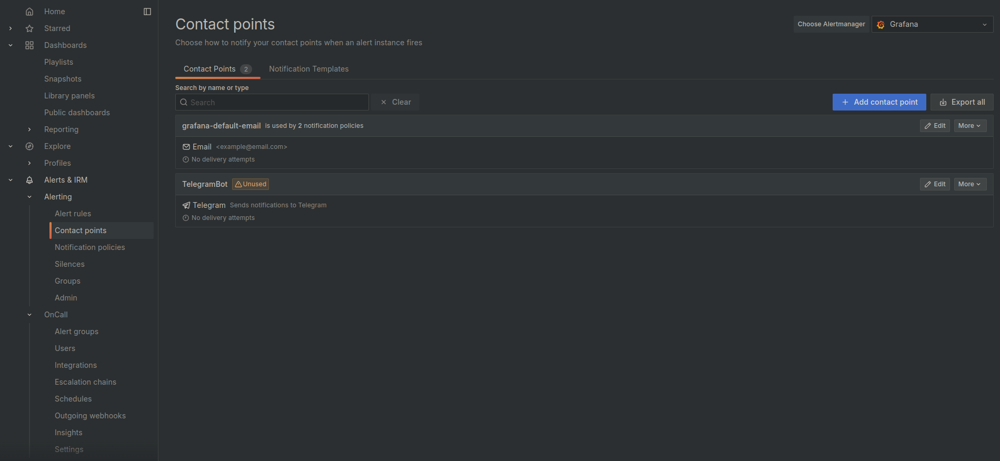
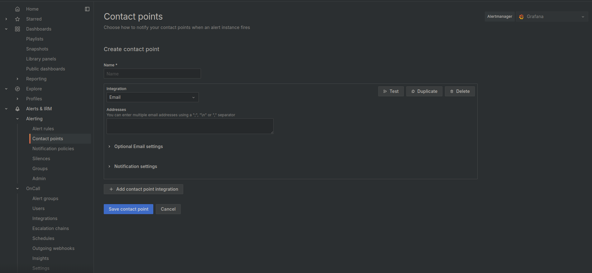
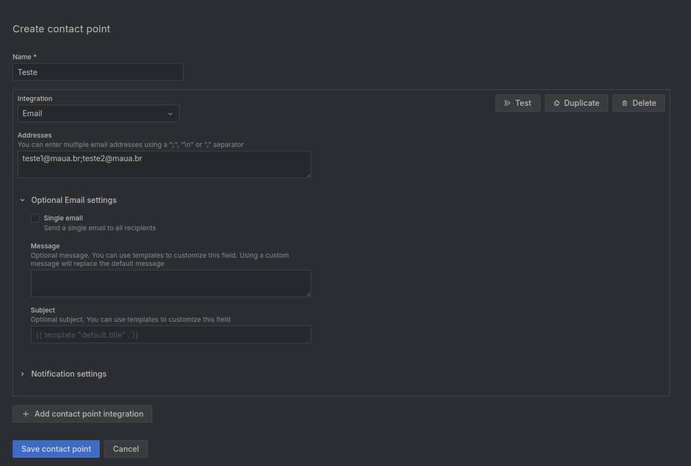
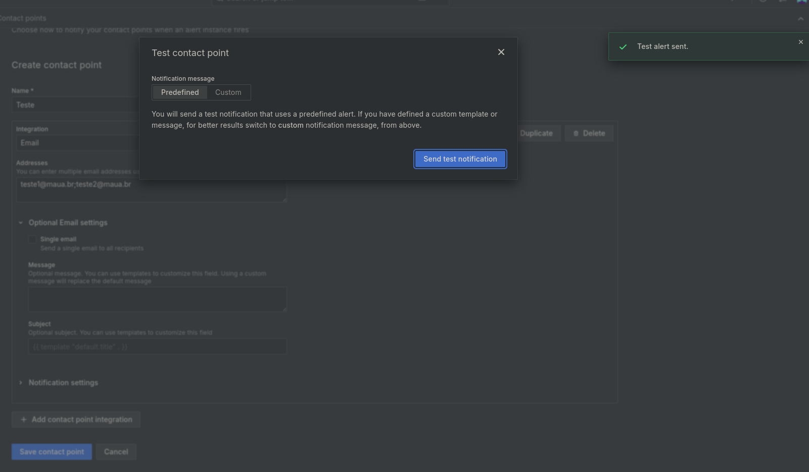
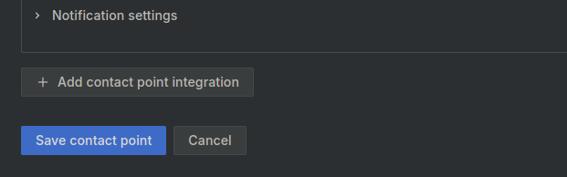
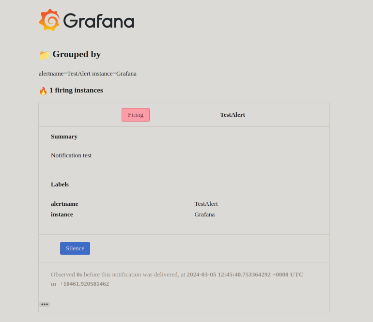

# Grafana Alerts

## Email

In Grafana, go to _Menu_ -> _Alert & IRM_ -> _Alerting_ -> _Contact points_ -> `+ Add contact point`

Then, give a name to the contact point, select `Email` as the type, and fill in the email address. You can add multiple emails by separating them with _";"_, _"\n"_ or _","_.

After that, you can run a test to check if the email is working properly clicking on the `Test` button and then on the `Send test notification` button. If everything is set up correctly, you should receive an email with the test message.

If all runs well, you can save the contact point by clicking on the `Save contact point` button.

And you should receive a email message like this:

## Telegram

For this example, it was used for reference the [Grafana Alerting + Telegram](https://grafana.com/blog/2023/12/28/how-to-integrate-grafana-alerting-and-telegram/).
