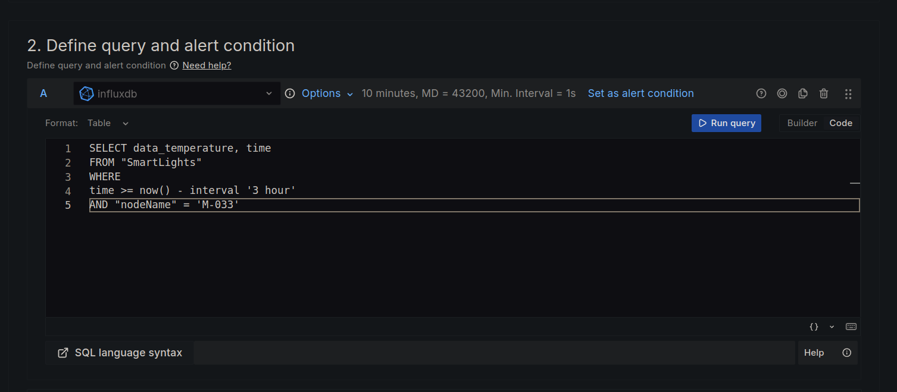
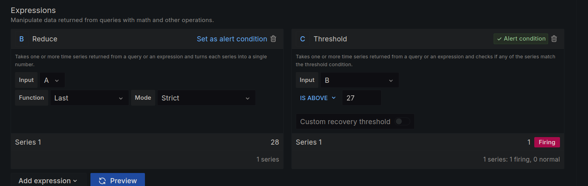
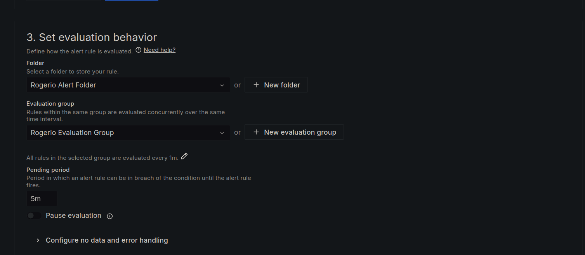
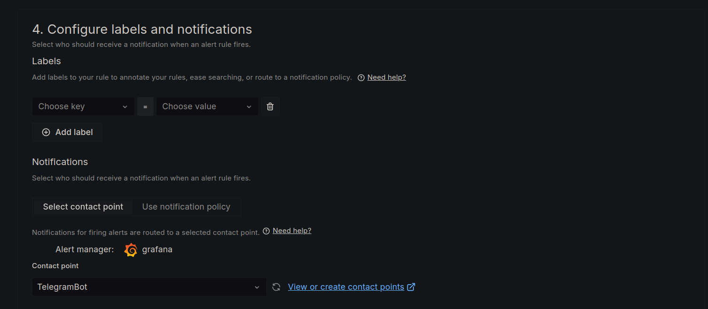
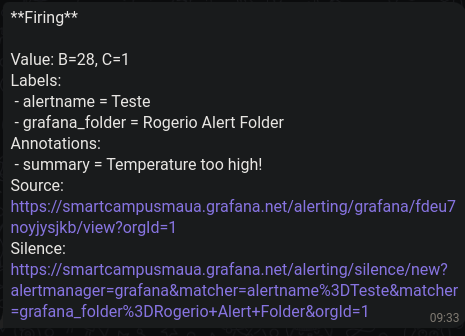

# Grafana Alerts

In this doc will abord how to set up the contact points for the alerts in Grafana. 

## Contact Points

The contact points are the ways that Grafana can use to send the alerts, like email, Telegram, Slack, etc. In this example, it will be shown how to set up the contact points for email and Telegram.

### Email

In Grafana, go to _Menu_ -> _Alert & IRM_ -> _Alerting_ -> _Contact points_ -> `+ Add contact point`


Then, give a name to the contact point, select `Email` as the type, and fill in the email address. You can add multiple emails by separating them with _";"_, _"\n"_ or _","_.


After that, you can run a test to check if the email is working properly clicking on the `Test` button and then on the `Send test notification` button. If everything is set up correctly, you should receive an email with the test message.


If all runs well, you can save the contact point by clicking on the `Save contact point` button.


And you should receive a email message like this:


### Telegram

For this example, it was used for reference the [Grafana Alerting + Telegram](https://grafana.com/blog/2023/12/28/how-to-integrate-grafana-alerting-and-telegram/).

After creating a Bot in Telegram, you will need to get the _chat ID_ and the _HTTP API Token_. You can get the _chat ID_ by sending a message to the bot and then accessing the following URL: `https://api.telegram.org/bot<YourBOTToken>/getUpdates`. The chat ID will be in the `id` field of the `chat` object.

```json
{"ok":true,"result":[{"update_id":305630234,
"message":{"message_id":2,"from":{"id":962448609,"is_bot":false,"first_name":"--------","last_name":"------------"},
"chat":{"id":-4195818419,
"title":"-----------------","type":"group","all_members_are_administrators":true},"date":1709578935,
"text":"/Holanda -------------","entities":[{"offset":0,"length":8,"type":"bot_command"},
{"offset":9,"length":19,"type":"mention"}]}}]}
```

With the _chat ID_ and the _HTTP API Token_, go to Grafana, and in _Menu_ -> _Alert & IRM_ -> _Alerting_ -> _Contact points_ -> `+ Add contact point`


Then, give a name to the contact point, select `Telegram` as the type, and fill the _chat ID_ and the _HTTP API Token_. Don't forget to set the _Message Thread ID_ to `0` in the tab _Optional Telegram Settings_.


As the previously example, you can run a test to check if the Telegram is working properly clicking on the `Test` button and then on the `Send test notification` button. If everything is set up correctly, you should receive a message in the Telegram chat.


If all runs well, you can save the contact point by clicking on the `Save contact point` button.

## Alert Rules

To create a new alert rule, go to _Menu_ -> _Alert & IRM_ -> _Alert rules_ -> `+ New alert rule`


Then, enter a rule name, select the data source, the expression or conditions, and the contact point that you want to use to send the alert.

To get the `data_temperature` it was used the _Query_

```sql
SELECT data_temperature, time
FROM "SmartLights"
WHERE
time >= now() - interval '3 hour'
AND "nodeName" = 'M-033'
```



In the _Expression_ field, you can use _Math_ or _Operations_ to create the condition. In this example, it was used the _Expression_ `Reduce` and `Threshold` to create a condition that will send an alert when temperature is above 27°C.



Then, set a _Folder_, _Evaluation_ and _Pending Group_. This option evaluated your rule in a specific time range and send the alert if the condition is true.



Select a contact point.



You can add a _Annotation_.


And then, save the alert rule.

If all gone right, you should receive a message in the contact point that you set up. It that case, it was used the Telegram.

