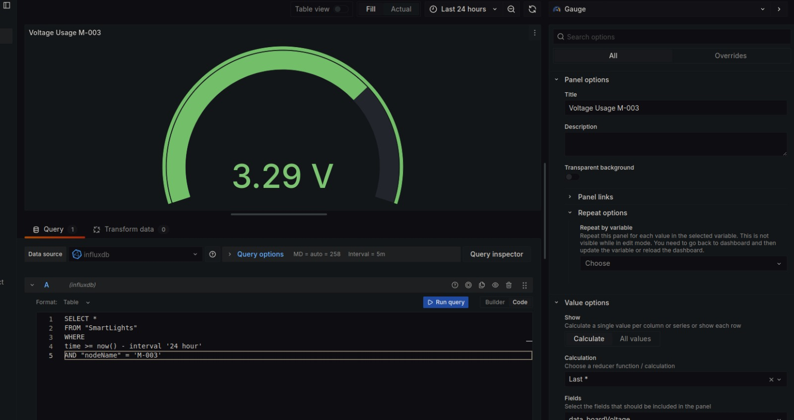

# Grafana Dashboard

Create a new account in Grafana Cloud (_recommended_) or install it in a Linux Operation System.

## Select SmartCaampusMaua InfluxDB Data Source

Go to _Menu_ -> _Connections_ -> _Data sources_ -> `Add new data source`


Then, configure Grafana to connect with SmartCampusMaua InfluxDB bucket
Name: SmartCampusMaua-InfluxDB
HTTP:
  * URL: `https://us-east-1-1.aws.cloud2.influxdata.com`
InfluxDB Details:
  * Database: `smartcampusmaua`
  * Token: `y_c3eMIWZ2W31KF3P5zIn2nqr0xPpnGrN4QVnXq3TRXIM1PJeFO2jSndHDL2b4Egl6V-QH5LDmxZ9KIbDCthnQ==`


Save & Test

## Create a New Dashboard

Go to _Menu_ -> _Dashboards_ -> _New_ -> `New dashboard` -> `Add visualization`

Then, _Select data source_ -> `influxdb`

### SmartLights visualization example
Access the Public Dashboard (https://smartcampusmaua.grafana.net/public-dashboards/d05b11a1301341169f75f79f6215c3cf)


#### Set temperature gauge (M-003)


In _Query_:
```sql
SELECT *
FROM "SmartLights"
WHERE
time ›= now() - interval '24 hour'
AND "nodeName" = M-003
```

In _Right Side Menu_: 
* Gauge
* Panel Options:
  - Title: Temperature M-003
* Value options:
  - Calculation: Last *
  - Fields: data_temperature
* Standard options:
  - Unit: Celsius (oC)
  - Min: -1
  - Max: 100

#### Set humidity gauge (M-003)


In _Query_:
```sql
SELECT *
FROM "SmartLights"
WHERE
time ›= now() - interval '24 hour'
AND "nodeName" = M-003
```

In _Right Side Menu_: 
* Gauge
* Panel Options:
  - Title: Humidity M-003
* Value options:
  - Calculation: Last *
  - Fields: data_humidity
* Standard options:
  - Unit: Humidity (%)
  - Min: -1
  - Max: 100


#### Set voltage gauge (M-003)


In _Query_:
```sql
SELECT *
FROM "SmartLights"
WHERE
time ›= now() - interval '24 hour'
AND "nodeName" = M-003
```

In _Right Side Menu_: 
* Gauge
* Panel Options:
  - Title: Voltage Usage M-003
* Value options:
  - Calculation: Last *
  - Fields: data_boardVoltage
* Standard options:
  - Unit: Volt (V)
  - Min: -1
  - Max: 5

#### Set multiple timeseries graph

Visualization for simultaneous devices can be done crating a Timeseries Visualization with multiple queries.

_Query A_:
```SQL
SELECT time, data_temperature as "M-003"
FROM "SmartLights"
WHERE
time >= now() - interval '24 hour'
AND "nodeName" = 'M-003'
```

_Query B_:
```SQL
SELECT time, data_temperature as "M-015"
FROM "SmartLights"
WHERE
time >= now() - interval '24 hour'
AND "nodeName" = 'M-015'
```

_Query C_:
```SQL
SELECT time, data_temperature as "M-020"
FROM "SmartLights"
WHERE
time >= now() - interval '24 hour'
AND "nodeName" = 'M-020'
```

_Query D_:
```SQL
SELECT time, data_temperature as "M-019"
FROM "SmartLights"
WHERE
time >= now() - interval '24 hour'
AND "nodeName" = 'M-0=19'
```


## Import the template as JSON
When creating the dashboard, the template can be used to import all visualizations. 

Go to _Menu_ -> _Dashboards_ -> _New_ -> `New dashboard` -> `Import a dashboard` -> `Import via dashboard JSON model`. After that, check the data sources and queries.

```json
{
  "annotations": {
    "list": [
      {
        "builtIn": 1,
        "datasource": {
          "type": "grafana",
          "uid": "-- Grafana --"
        },
        "enable": true,
        "hide": true,
        "iconColor": "rgba(0, 211, 255, 1)",
        "name": "Annotations & Alerts",
        "type": "dashboard"
      }
    ]
  },
  "description": "All data collected from SmartLights ",
  "editable": true,
  "fiscalYearStartMonth": 0,
  "graphTooltip": 0,
  "id": 12,
  "links": [],
  "panels": [
    {
      "datasource": {
        "type": "influxdb",
        "uid": "bdenh61vp0etcf"
      },
      "gridPos": {
        "h": 3,
        "w": 12,
        "x": 0,
        "y": 0
      },
      "id": 16,
      "options": {
        "code": {
          "language": "plaintext",
          "showLineNumbers": false,
          "showMiniMap": false
        },
        "content": "# M-003\n\n",
        "mode": "markdown"
      },
      "pluginVersion": "11.0.0-67429",
      "title": "SmartLight",
      "type": "text"
    },
    {
      "datasource": {
        "type": "influxdb",
        "uid": "bdenh61vp0etcf"
      },
      "fieldConfig": {
        "defaults": {
          "color": {
            "mode": "palette-classic"
          },
          "custom": {
            "axisBorderShow": false,
            "axisCenteredZero": false,
            "axisColorMode": "text",
            "axisLabel": "",
            "axisPlacement": "auto",
            "barAlignment": 0,
            "drawStyle": "line",
            "fillOpacity": 0,
            "gradientMode": "none",
            "hideFrom": {
              "legend": false,
              "tooltip": false,
              "viz": false
            },
            "insertNulls": false,
            "lineInterpolation": "linear",
            "lineWidth": 1,
            "pointSize": 5,
            "scaleDistribution": {
              "type": "linear"
            },
            "showPoints": "auto",
            "spanNulls": false,
            "stacking": {
              "group": "A",
              "mode": "none"
            },
            "thresholdsStyle": {
              "mode": "off"
            }
          },
          "mappings": [],
          "thresholds": {
            "mode": "absolute",
            "steps": [
              {
                "color": "green",
                "value": null
              },
              {
                "color": "red",
                "value": 80
              }
            ]
          }
        },
        "overrides": []
      },
      "gridPos": {
        "h": 8,
        "w": 12,
        "x": 12,
        "y": 0
      },
      "id": 3,
      "options": {
        "legend": {
          "calcs": [],
          "displayMode": "list",
          "placement": "bottom",
          "showLegend": true
        },
        "tooltip": {
          "mode": "single",
          "sort": "none"
        }
      },
      "targets": [
        {
          "dataset": "iox",
          "datasource": {
            "type": "influxdb",
            "uid": "bdenh61vp0etcf"
          },
          "editorMode": "code",
          "format": "table",
          "rawQuery": true,
          "rawSql": "SELECT time, data_temperature as \"M-003\"\nFROM \"SmartLights\"\nWHERE\ntime >= now() - interval '24 hour'\nAND \"nodeName\" = 'M-003'\n",
          "refId": "A",
          "sql": {
            "columns": [
              {
                "parameters": [],
                "type": "function"
              }
            ],
            "groupBy": [
              {
                "property": {
                  "type": "string"
                },
                "type": "groupBy"
              }
            ]
          }
        },
        {
          "dataset": "iox",
          "datasource": {
            "type": "influxdb",
            "uid": "bdenh61vp0etcf"
          },
          "editorMode": "code",
          "format": "table",
          "hide": false,
          "rawQuery": true,
          "rawSql": "SELECT time, data_temperature as \"M-015\"\nFROM \"SmartLights\"\nWHERE\ntime >= now() - interval '24 hour'\nAND \"nodeName\" = 'M-015'",
          "refId": "B",
          "sql": {
            "columns": [
              {
                "parameters": [],
                "type": "function"
              }
            ],
            "groupBy": [
              {
                "property": {
                  "type": "string"
                },
                "type": "groupBy"
              }
            ]
          }
        },
        {
          "dataset": "iox",
          "datasource": {
            "type": "influxdb",
            "uid": "bdenh61vp0etcf"
          },
          "editorMode": "code",
          "format": "table",
          "hide": false,
          "rawQuery": true,
          "rawSql": "SELECT time, data_temperature as \"M-020\"\nFROM \"SmartLights\"\nWHERE\ntime >= now() - interval '24 hour'\nAND \"nodeName\" = 'M-020'",
          "refId": "C",
          "sql": {
            "columns": [
              {
                "parameters": [],
                "type": "function"
              }
            ],
            "groupBy": [
              {
                "property": {
                  "type": "string"
                },
                "type": "groupBy"
              }
            ]
          }
        },
        {
          "dataset": "iox",
          "datasource": {
            "type": "influxdb",
            "uid": "bdenh61vp0etcf"
          },
          "editorMode": "code",
          "format": "table",
          "hide": false,
          "rawQuery": true,
          "rawSql": "SELECT time, data_temperature as \"DET-019\"\nFROM \"SmartLights\"\nWHERE\ntime >= now() - interval '24 hour'\nAND \"nodeName\" = 'DET-019'",
          "refId": "D",
          "sql": {
            "columns": [
              {
                "parameters": [],
                "type": "function"
              }
            ],
            "groupBy": [
              {
                "property": {
                  "type": "string"
                },
                "type": "groupBy"
              }
            ]
          }
        }
      ],
      "title": "SmartLights Temperature",
      "type": "timeseries"
    },
    {
      "datasource": {
        "type": "influxdb",
        "uid": "bdenh61vp0etcf"
      },
      "fieldConfig": {
        "defaults": {
          "color": {
            "mode": "thresholds"
          },
          "fieldMinMax": false,
          "mappings": [],
          "max": 5,
          "min": -1,
          "noValue": "0.0",
          "thresholds": {
            "mode": "absolute",
            "steps": [
              {
                "color": "green",
                "value": null
              },
              {
                "color": "red",
                "value": 80
              },
              {
                "color": "#EAB839",
                "value": 90
              },
              {
                "color": "#6ED0E0",
                "value": 100
              }
            ]
          },
          "unit": "volt"
        },
        "overrides": []
      },
      "gridPos": {
        "h": 4,
        "w": 4,
        "x": 0,
        "y": 3
      },
      "id": 4,
      "options": {
        "minVizHeight": 0,
        "minVizWidth": 476,
        "orientation": "horizontal",
        "reduceOptions": {
          "calcs": [
            "lastNotNull"
          ],
          "fields": "/^data_boardVoltage$/",
          "values": false
        },
        "showThresholdLabels": false,
        "showThresholdMarkers": true,
        "sizing": "auto",
        "text": {}
      },
      "pluginVersion": "11.0.0-67429",
      "targets": [
        {
          "dataset": "iox",
          "datasource": {
            "type": "influxdb",
            "uid": "bdenh61vp0etcf"
          },
          "editorMode": "code",
          "format": "table",
          "rawQuery": true,
          "rawSql": "SELECT * \nFROM \"SmartLights\"\nWHERE\ntime >= now() - interval '24 hour'\nAND \"nodeName\" = 'M-003'",
          "refId": "A",
          "sql": {
            "columns": [
              {
                "parameters": [],
                "type": "function"
              }
            ],
            "groupBy": [
              {
                "property": {
                  "type": "string"
                },
                "type": "groupBy"
              }
            ]
          }
        }
      ],
      "title": "Voltage Usage M-003",
      "type": "gauge"
    },
    {
      "datasource": {
        "type": "influxdb",
        "uid": "bdenh61vp0etcf"
      },
      "fieldConfig": {
        "defaults": {
          "color": {
            "mode": "thresholds"
          },
          "fieldMinMax": false,
          "mappings": [],
          "max": 100,
          "min": -1,
          "noValue": "0.0",
          "thresholds": {
            "mode": "absolute",
            "steps": [
              {
                "color": "blue",
                "value": null
              },
              {
                "color": "#6ED0E0",
                "value": 95
              }
            ]
          },
          "unit": "humidity"
        },
        "overrides": []
      },
      "gridPos": {
        "h": 4,
        "w": 4,
        "x": 4,
        "y": 3
      },
      "id": 17,
      "options": {
        "minVizHeight": 0,
        "minVizWidth": 476,
        "orientation": "horizontal",
        "reduceOptions": {
          "calcs": [
            "lastNotNull"
          ],
          "fields": "/^data_humidity$/",
          "values": false
        },
        "showThresholdLabels": false,
        "showThresholdMarkers": true,
        "sizing": "auto",
        "text": {}
      },
      "pluginVersion": "11.0.0-67429",
      "targets": [
        {
          "dataset": "iox",
          "datasource": {
            "type": "influxdb",
            "uid": "bdenh61vp0etcf"
          },
          "editorMode": "code",
          "format": "table",
          "rawQuery": true,
          "rawSql": "SELECT * \nFROM \"SmartLights\"\nWHERE\ntime >= now() - interval '24 hour'\nAND \"nodeName\" = 'M-003'",
          "refId": "A",
          "sql": {
            "columns": [
              {
                "parameters": [],
                "type": "function"
              }
            ],
            "groupBy": [
              {
                "property": {
                  "type": "string"
                },
                "type": "groupBy"
              }
            ]
          }
        }
      ],
      "title": "Humidity M-003",
      "type": "gauge"
    },
    {
      "datasource": {
        "type": "influxdb",
        "uid": "bdenh61vp0etcf"
      },
      "fieldConfig": {
        "defaults": {
          "color": {
            "mode": "thresholds"
          },
          "fieldMinMax": false,
          "mappings": [],
          "max": 100,
          "min": -1,
          "noValue": "0.0",
          "thresholds": {
            "mode": "absolute",
            "steps": [
              {
                "color": "blue",
                "value": null
              },
              {
                "color": "semi-dark-green",
                "value": 20
              },
              {
                "color": "semi-dark-orange",
                "value": 25
              },
              {
                "color": "semi-dark-red",
                "value": 30
              }
            ]
          },
          "unit": "celsius"
        },
        "overrides": []
      },
      "gridPos": {
        "h": 4,
        "w": 4,
        "x": 8,
        "y": 3
      },
      "id": 18,
      "options": {
        "minVizHeight": 0,
        "minVizWidth": 476,
        "orientation": "horizontal",
        "reduceOptions": {
          "calcs": [
            "lastNotNull"
          ],
          "fields": "/^data_temperature$/",
          "values": false
        },
        "showThresholdLabels": false,
        "showThresholdMarkers": true,
        "sizing": "auto",
        "text": {}
      },
      "pluginVersion": "11.0.0-67429",
      "targets": [
        {
          "dataset": "iox",
          "datasource": {
            "type": "influxdb",
            "uid": "bdenh61vp0etcf"
          },
          "editorMode": "code",
          "format": "table",
          "rawQuery": true,
          "rawSql": "SELECT * \nFROM \"SmartLights\"\nWHERE\ntime >= now() - interval '24 hour'\nAND \"nodeName\" = 'M-003'",
          "refId": "A",
          "sql": {
            "columns": [
              {
                "parameters": [],
                "type": "function"
              }
            ],
            "groupBy": [
              {
                "property": {
                  "type": "string"
                },
                "type": "groupBy"
              }
            ]
          }
        }
      ],
      "title": "Temperature M-003",
      "type": "gauge"
    },
    {
      "datasource": {
        "type": "influxdb",
        "uid": "bdenh61vp0etcf"
      },
      "fieldConfig": {
        "defaults": {
          "color": {
            "mode": "palette-classic"
          },
          "custom": {
            "axisBorderShow": false,
            "axisCenteredZero": false,
            "axisColorMode": "text",
            "axisLabel": "",
            "axisPlacement": "auto",
            "barAlignment": 0,
            "drawStyle": "line",
            "fillOpacity": 19,
            "gradientMode": "none",
            "hideFrom": {
              "legend": false,
              "tooltip": false,
              "viz": false
            },
            "insertNulls": false,
            "lineInterpolation": "linear",
            "lineStyle": {
              "fill": "solid"
            },
            "lineWidth": 2,
            "pointSize": 4,
            "scaleDistribution": {
              "type": "linear"
            },
            "showPoints": "always",
            "spanNulls": false,
            "stacking": {
              "group": "A",
              "mode": "none"
            },
            "thresholdsStyle": {
              "mode": "off"
            }
          },
          "mappings": [],
          "thresholds": {
            "mode": "absolute",
            "steps": [
              {
                "color": "green",
                "value": null
              },
              {
                "color": "red",
                "value": 80
              }
            ]
          }
        },
        "overrides": []
      },
      "gridPos": {
        "h": 8,
        "w": 12,
        "x": 0,
        "y": 7
      },
      "id": 19,
      "options": {
        "legend": {
          "calcs": [],
          "displayMode": "list",
          "placement": "bottom",
          "showLegend": true
        },
        "tooltip": {
          "mode": "single",
          "sort": "none"
        }
      },
      "targets": [
        {
          "dataset": "iox",
          "datasource": {
            "type": "influxdb",
            "uid": "bdenh61vp0etcf"
          },
          "editorMode": "code",
          "format": "table",
          "rawQuery": true,
          "rawSql": "SELECT \"data_boardVoltage\", \"time\", \"data_humidity\", \"data_temperature\"\nFROM \"SmartLights\"\nWHERE\ntime >= now() - interval '24 hour'\nAND \"nodeName\" = 'M-003'",
          "refId": "A",
          "sql": {
            "columns": [
              {
                "parameters": [],
                "type": "function"
              }
            ],
            "groupBy": [
              {
                "property": {
                  "type": "string"
                },
                "type": "groupBy"
              }
            ]
          }
        }
      ],
      "title": "M-003",
      "type": "timeseries"
    },
    {
      "datasource": {
        "type": "influxdb",
        "uid": "bdenh61vp0etcf"
      },
      "description": "",
      "fieldConfig": {
        "defaults": {
          "color": {
            "mode": "thresholds"
          },
          "custom": {
            "align": "auto",
            "cellOptions": {
              "type": "auto"
            },
            "inspect": false
          },
          "mappings": [],
          "thresholds": {
            "mode": "absolute",
            "steps": [
              {
                "color": "green",
                "value": null
              },
              {
                "color": "red",
                "value": 80
              }
            ]
          }
        },
        "overrides": []
      },
      "gridPos": {
        "h": 7,
        "w": 12,
        "x": 12,
        "y": 8
      },
      "id": 1,
      "options": {
        "cellHeight": "sm",
        "footer": {
          "countRows": false,
          "fields": "",
          "reducer": [
            "sum"
          ],
          "show": false
        },
        "showHeader": true,
        "sortBy": []
      },
      "pluginVersion": "11.0.0-67429",
      "targets": [
        {
          "dataset": "iox",
          "datasource": {
            "type": "influxdb",
            "uid": "bdenh61vp0etcf"
          },
          "editorMode": "code",
          "format": "table",
          "rawQuery": true,
          "rawSql": "SELECT \"nodeName\" as ID,\"data_boardVoltage\" as voltage, \"data_humidity\" as humidity, \"data_temperature\" as temperature,\"fCnt\" as framecount, \n\"rxInfo_altitude_0\" as altitude, \"rxInfo_latitude_0\" as latitude, \"rxInfo_longitude_0\" as longitude, \"rxInfo_loRaSNR_0\" as loraSNR, \"rxInfo_rssi_0\" as rssi,\n\"time\"\nFROM \"SmartLights\"\nWHERE time >= now() - interval '1 hour'\nAND \"nodeName\" = 'M-003' \nOR \"nodeName\" = 'M-004' \nOR \"nodeName\" = 'M-033' \nOR \"nodeName\" = 'M-015' \nOR \"nodeName\" = 'M-020'\nOR \"nodeName\" = 'M-027'\nOR \"nodeName\" = 'DET-019'\nORDER BY time DESC;",
          "refId": "A",
          "sql": {
            "columns": [
              {
                "parameters": [],
                "type": "function"
              }
            ],
            "groupBy": [
              {
                "property": {
                  "type": "string"
                },
                "type": "groupBy"
              }
            ]
          },
          "table": "SmartLights"
        }
      ],
      "title": "Database filtered",
      "transparent": true,
      "type": "table"
    },
    {
      "datasource": {
        "type": "influxdb",
        "uid": "bdenh61vp0etcf"
      },
      "fieldConfig": {
        "defaults": {
          "color": {
            "mode": "thresholds"
          },
          "custom": {
            "hideFrom": {
              "legend": false,
              "tooltip": false,
              "viz": false
            }
          },
          "mappings": [],
          "thresholds": {
            "mode": "percentage",
            "steps": [
              {
                "color": "green",
                "value": null
              },
              {
                "color": "orange",
                "value": 70
              },
              {
                "color": "red",
                "value": 85
              }
            ]
          }
        },
        "overrides": []
      },
      "gridPos": {
        "h": 14,
        "w": 24,
        "x": 0,
        "y": 15
      },
      "id": 2,
      "options": {
        "basemap": {
          "config": {},
          "name": "Layer 0",
          "type": "osm-standard"
        },
        "controls": {
          "mouseWheelZoom": true,
          "showAttribution": true,
          "showDebug": false,
          "showMeasure": true,
          "showScale": true,
          "showZoom": true
        },
        "layers": [
          {
            "config": {
              "showLegend": true,
              "style": {
                "color": {
                  "fixed": "semi-dark-red"
                },
                "opacity": 0.4,
                "rotation": {
                  "fixed": 0,
                  "max": 360,
                  "min": -360,
                  "mode": "mod"
                },
                "size": {
                  "fixed": 5,
                  "max": 15,
                  "min": 2
                },
                "symbol": {
                  "fixed": "img/icons/marker/circle.svg",
                  "mode": "fixed"
                },
                "symbolAlign": {
                  "horizontal": "center",
                  "vertical": "center"
                },
                "textConfig": {
                  "fontSize": 12,
                  "offsetX": 0,
                  "offsetY": 0,
                  "textAlign": "center",
                  "textBaseline": "middle"
                }
              }
            },
            "filterData": {
              "id": "byRefId",
              "options": "A"
            },
            "location": {
              "mode": "auto"
            },
            "name": "SmartLights",
            "tooltip": true,
            "type": "markers"
          }
        ],
        "tooltip": {
          "mode": "details"
        },
        "view": {
          "allLayers": true,
          "id": "coords",
          "lat": -23.64891,
          "lon": -46.57413,
          "shared": false,
          "zoom": 17
        }
      },
      "pluginVersion": "11.0.0-67429",
      "targets": [
        {
          "dataset": "iox",
          "datasource": {
            "type": "influxdb",
            "uid": "bdenh61vp0etcf"
          },
          "editorMode": "code",
          "format": "table",
          "hide": false,
          "rawQuery": true,
          "rawSql": "SHOW COLUMNS IN \"SmartLights\"\n",
          "refId": "B",
          "sql": {
            "columns": [
              {
                "parameters": [],
                "type": "function"
              }
            ],
            "groupBy": [
              {
                "property": {
                  "type": "string"
                },
                "type": "groupBy"
              }
            ]
          }
        },
        {
          "dataset": "iox",
          "datasource": {
            "type": "influxdb",
            "uid": "bdenh61vp0etcf"
          },
          "editorMode": "code",
          "format": "table",
          "hide": false,
          "rawQuery": true,
          "rawSql": "SELECT \"applicationID\" as ID,\"data_boardVoltage\" as voltage, \"data_humidity\" as humidity, \"data_temperature\" as temperature,\"fCnt\" as framecount, \n\"rxInfo_altitude_0\" as altitude, \"rxInfo_latitude_0\" as latitude, \"rxInfo_longitude_0\" as longitude, \"rxInfo_loRaSNR_0\" as loraSNR, \"rxInfo_rssi_0\" as rssi,\n\"time\"\nFROM \"SmartLights\"\nWHERE time >= now() - interval '1 hour'\nAND\n(\"applicationID\" IS NOT NULL OR \"data_distance\" IS NOT NULL OR \"data_humidity\" IS NOT NULL)\nORDER BY time DESC;",
          "refId": "Filtered",
          "sql": {
            "columns": [
              {
                "parameters": [
                  {
                    "name": "data_ad",
                    "type": "functionParameter"
                  }
                ],
                "type": "function"
              }
            ],
            "groupBy": [
              {
                "property": {
                  "type": "string"
                },
                "type": "groupBy"
              }
            ]
          },
          "table": "SmartLights"
        },
        {
          "dataset": "iox",
          "datasource": {
            "type": "influxdb",
            "uid": "bdenh61vp0etcf"
          },
          "editorMode": "code",
          "format": "table",
          "hide": false,
          "rawQuery": true,
          "rawSql": "SELECT *\n\t\tFROM \"SmartLights\"\n\t\tWHERE\n\t\ttime >= now() - interval '1 hour'\n\t\tAND\n\t\t(\"data_ad\" IS NOT NULL OR \"data_boardVoltage\" IS NOT NULL)\n\t\tORDER BY time DESC;",
          "refId": "C",
          "sql": {
            "columns": [
              {
                "parameters": [],
                "type": "function"
              }
            ],
            "groupBy": [
              {
                "property": {
                  "type": "string"
                },
                "type": "groupBy"
              }
            ]
          }
        },
        {
          "dataset": "iox",
          "datasource": {
            "type": "influxdb",
            "uid": "bdenh61vp0etcf"
          },
          "editorMode": "code",
          "format": "table",
          "hide": false,
          "rawQuery": true,
          "rawSql": "SELECT \"rxInfo_altitude_0\" as altitude, \"rxInfo_latitude_0\" as Latitude, \"rxInfo_longitude_0\" as Longitude, \"rxInfo_loRaSNR_0\" as loraSNR, \"rxInfo_rssi_0\" as rssi,\n\"time\"\nFROM \"SmartLights\"\nWHERE time >= now() - interval '1 hour'\nAND\n(\"applicationID\" IS NOT NULL OR \"data_distance\" IS NOT NULL OR \"data_humidity\" IS NOT NULL)\nORDER BY time DESC;",
          "refId": "A",
          "sql": {
            "columns": [
              {
                "parameters": [],
                "type": "function"
              }
            ],
            "groupBy": [
              {
                "property": {
                  "type": "string"
                },
                "type": "groupBy"
              }
            ]
          }
        }
      ],
      "title": "Map",
      "type": "geomap"
    }
  ],
  "refresh": "",
  "schemaVersion": 39,
  "tags": [],
  "templating": {
    "list": []
  },
  "time": {
    "from": "now-24h",
    "to": "now"
  },
  "timepicker": {},
  "timezone": "browser",
  "title": "SmartLights",
  "uid": "adenj4ii7diwwf",
  "version": 34,
  "weekStart": ""
}
```
