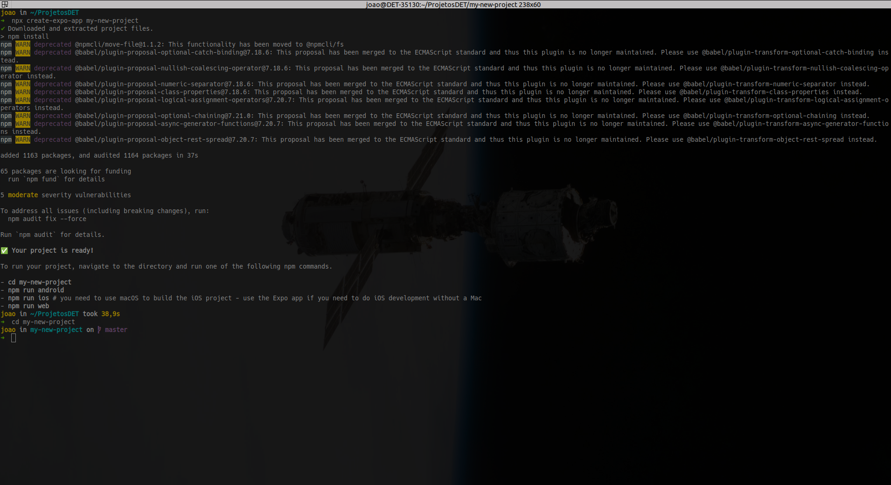
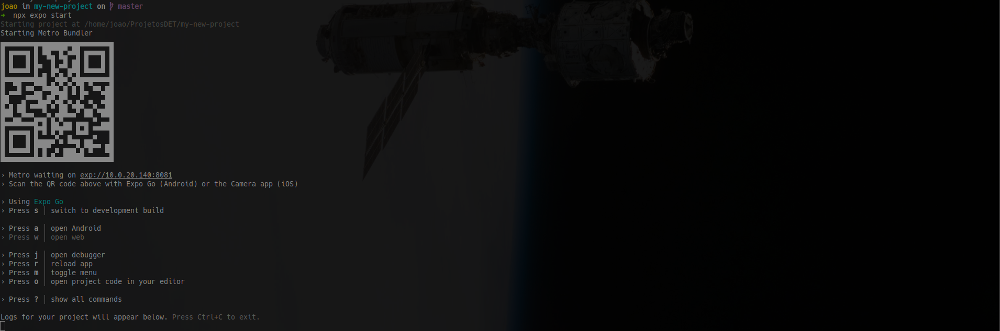
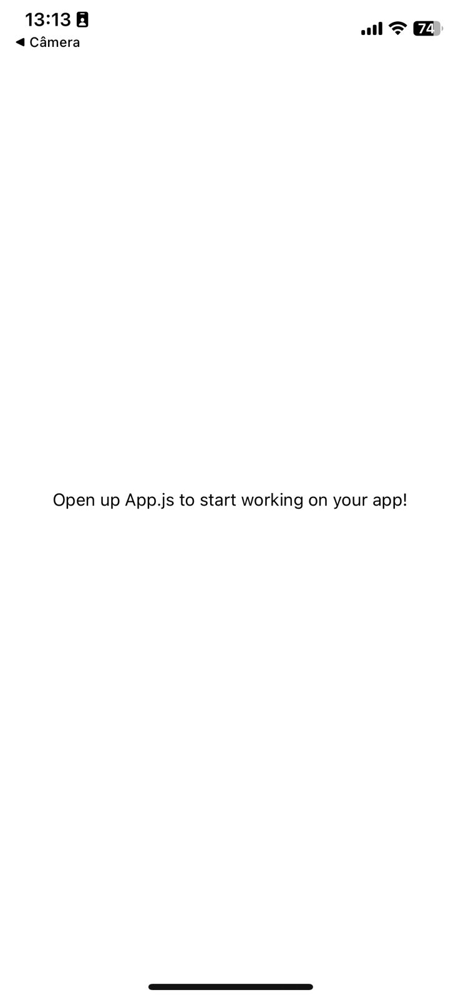

# React Native App

## Create a new project with Expo

### Requirements

- **_Node.js_**
- **_npm_**
- **_npx_**
- **_Expo Go App_** (for testing on a mobile device)

### Installations

Download and install **_Node.js_** from the official website: [https://nodejs.org/en/download/package-manager](https://nodejs.org/en/download/package-manager)


```bash
# installs NVM (Node Version Manager)
curl -o- https://raw.githubusercontent.com/nvm-sh/nvm/v0.39.7/install.sh | bash
# download and install Node.js
nvm install 20
# verifies the right Node.js version is in the environment
node -v # should print `v20.11.1`
# verifies the right NPM version is in the environment
npm -v # should print `10.2.4`
```

Both _**npm**_ and _**npx**_ are installed with **_Node.js_**. To check if they are installed, run the following commands:
  
  ```bash
  npm --version
  npx --version
  ```

### Expo Go app

Download the **_Expo Go_** app from the **App Store** or **Google Play Store** on your phone.

- [iOS App Store](https://apps.apple.com/us/app/expo-go/id982107779)
- [Android Play Store](https://play.google.com/store/apps/details?id=host.exp.exponent&pli=1)

### Create a new project

To create a new project, run the following command in the terminal:

```bash
npx create-expo-app my-new-project
cd my-new-project
```

You should see a screen like this:



### Visualize the application

Now that the project is created, you can use **_Expo Go_** app through your mobile device to visualize the application.
In the terminal, run the following command:

```bash
  npx expo start  
```



You can also use [Android Studio Emulator](https://docs.expo.dev/workflow/android-studio-emulator/) to emulate a android mobile on your computer.

Once you installed **_Expo Go_** and generated the QR code, scan it and you must be directed to **_Expo Go_** app.

> **Note:** You must be connected to the same network as the computer running the project.

If its all good, you should see the following screen:


<!--  -->

Now your project is up and running!
### References

- [Node.js docs](https://nodejs.org/en/download/package-manager)

- [Expo docs](https://docs.expo.dev/get-started/installation/)